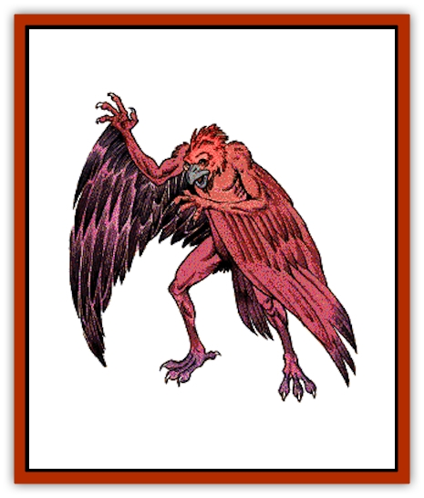

# Aarakocra

| Statistic | **Aarakocra** |
| --- | --- |
| **Activity Cycle:** | Day |
| **Alignment:** | Neutral good |
| **Armor Class:** | 7 |
| **Climate/Terrain:** | Tropical and temperate mountains |
| **Damage/Attack:** | 1-3/1-3 or 2-8 (weapon) |
| **Diet:** | Carnivore |
| **Frequency:** | Very rare |
| **Hit Dice:** | 1+2 |
| **Intelligence:** | Average (8-10) |
| **Magic Resistance:** | Nil |
| **Morale:** | Steady (11) |
| **Movement:** | 6, Fl 36 (C) |
| **No. Appearing:** | 1-10 |
| **No. of Attacks:** | 2 |
| **Organization:** | Tribal |
| **Size:** | M (20' wing span) |
| **Special Attacks:** | Dive +4 |
| **Special Defenses:** | Nil |
| **THAC0:** | 19 |
| **Treasure:** | D |
| **XP Value:** | 65 |

The aarakocra are a race of intelligent bird-men that live on the peaks of the highest mountains, spending their days soaring on the thermal winds in peace and solitude.

Aarakocra are about 5 feet tall and have a wing span of 20 feet. About halfway along the edge of each wing is a hand with three human-sized fingers and an opposable thumb. An elongated fourth finger extends the length of the wing and locks in place for flying. Though the wing-hands cannot grasp during flight, they are nearly as useful as human hands when an aarakocra is on the ground and its wings are folded back. The wing muscles anchor in a bony chest plate that provides the aarakocra with extra protection. The powerful legs end in four sharp talons that can unlock and fold back to reveal another pair of functional hands, also with three human-sized fingers and an opposable thumb. The hand bones, like the rest of an aarakocra's skeleton, are hollow and fragile.

Aarakocra faces resemble crosses between parrots and [[Eagle|eagles]]. They have gray-black beaks, and black eyes set frontally in their heads that provide keen binocular vision. Plumage color varies from tribe to tribe, but generally males are red, orange, and yellow while females are brown and gray.

Aarakocra speak their own language, the language of giant eagles, and, on occasion, the common tongue (10% chance).

**Combat:** In aerial combat, an aarakocra fights with either talons or the heavy fletched javelins that he clutches in his lower hands. An aarakocra typically carries a half dozen javelins strapped to his chest in individual sheaths. The javelins, which can be used for throwing or stabbing, inflict 2d4 points of damage. Owing to the aarakocra's remarkable skill at throwing javelins in the air, it incurs none of the attack penalties for aerial missile fire. An aarakocra will always save its last javelin for stabbing purposes rather than throwing it. Its favorite attack is to dive at a victim while clutching a javelin in each hand, then pull out of the dive just as it reaches its target, and strike with a blood-curdling shriek. This attack gains a +4 bonus to the attack roll and causes double damage, but an aarakocra must dive at least 200 feet to execute it properly.

An aarakocra is reluctant to engage in grappling or ground combat, since its fragile bones are easily broken. Though rarely used except when cornered, an aarakocra's sharp beak can bite for 1-3 points of damage.

**Habitat/Society:** Aarakocra live in small tribes of about 11-30 (1d20+10) members. Each tribe has a hunting territory of about 10,000 square miles with colorful banners and pennants marking the boundaries.

Each tribe lives in a communal nest made of woven vines with a soft lining of dried grass. The eldest male serves as the tribe's leader. In tribes of more than 20 members, the second oldest male serves as the shaman, leading simple religious ceremonies involving the whistling of melodic hymns at sunset on the first day of a new month. Males spend most of their waking hours hunting for food and occasionally for treasure, such as gems and other shiny objects. Females spend eight months of the year incubating their eggs, passing the time by fabricating javelins and other tools from wood and stone. While resting on their backs, aarakocra females can use all four hands at the same time to weave boundary pennants, javelins sheaths, and other useful objects from vines and feathers.

Five aarakocra, including a shaman, can summon an [[Elemental_Air_Earth|air elemental]] by chanting and performing an intricate aerial dance for three melee rounds. The summoned air elemental will comply with the aarakocras' request for a favor, though it will not endanger its life on their behalf.

Aarakocra are extremely claustrophobic and will not willingly enter a cave, building, or other enclosed area.

**Ecology:** Aarakocra have little to do with other species, including neighboring aarakocra tribes, and leave their home territory only in extreme circumstances. They rarely encounter humans except for an occasional foray into a rural community to snatch a stray farm animal; this is not an intentionally malicious act, as aarakocra are unable to distinguish between domestic and wild animals. A human venturing into aarakocra territory may be able to convince one to serve as a guide or a scout in exchange for a shiny jewel or coin.

---
## Discovery & Documentation

**Source Publication:** Monstrous Manual (1995)
**Campaign Setting:** Advanced Dungeons & Dragons 2nd Edition
**Author(s):** Tim Beach

### Other Creatures Found in This Source Book
   * [[Aboleth|Aboleth]]
   * [[Ankheg|Ankheg]]
   * [[Arcane|Arcane]]
   * [[Argos|Argos]]
   * [[Aurumvorax|Aurumvorax]]
   * [[Baatezu_Lesser_Abishai|Baatezu, Lesser, Abishai]]
   * [[Baatezu_General_Information|Baatezu, General Information]]
   * [[Baatezu_Greater_Pit_Fiend|Baatezu, Greater, Pit Fiend]]
   * [[Banshee|Banshee]]
   * [[Basilisk|Basilisk]]
   * [[Bat|Bat]]
   * [[Bear|Bear]]
   * [[Beetle_Giant|Beetle, Giant]]
   * [[Behir|Behir]]
   * [[Beholder_and_Beholder-kin_I|Beholder and Beholder-kin I]]
   * [[Beholder_and_Beholder-kin_II|Beholder and Beholder-kin II]]
   * [[Bird|Bird]]
   * [[Brain_Mole|Brain Mole]]
   * [[Broken_One|Broken One]]
   * [[Brownie|Brownie]]
   * [[Bugbear|Bugbear]]
   * [[Bulette|Bulette]]
   * [[Bullywug|Bullywug]]
   * [[Carrion_Crawler|Carrion Crawler]]
   * [[Cat_Great|Cat, Great]]
   * [[Catoblepas|Catoblepas]]
   * [[Cat_Small|Cat, Small]]
   * [[Cave_Fisher|Cave Fisher]]
   * [[Centaur|Centaur]]
   * [[Centipede|Centipede]]
   * [[Chimera|Chimera]]
   * [[Cloaker|Cloaker]]
   * [[Cockatrice|Cockatrice]]
   * [[Couatl|Couatl]]
   * [[Crabman|Crabman]]
   * [[Crawling_Claw|Crawling Claw]]
   * [[Crocodile|Crocodile]]
   * [[Crustacean_Giant|Crustacean, Giant]]
   * [[Crypt_Thing|Crypt Thing]]
   * [[Death_Knight|Death Knight]]
   * [[Deepspawn|Deepspawn]]
   * [[Dinosaur_I|Dinosaur I]]
   * [[Displacer_Beast|Displacer Beast]]
   * [[Dog|Dog]]
   * [[Dog_Moon|Dog, Moon]]
   * [[Dolphin|Dolphin]]
   * [[Doppelganger|Doppelganger]]
   * [[Dracolich|Dracolich]]
   * [[Dragon_Brown|Dragon, Brown]]
   * [[Dragon_Chromatic_Black|Dragon, Chromatic, Black]]
   * [[Dragon_Chromatic_Blue|Dragon, Chromatic, Blue]]
   * [[Dragon_Chromatic_Green|Dragon, Chromatic, Green]]
   * [[Dragon_Cloud|Dragon, Cloud]]
   * [[Dragon_Chromatic_Red|Dragon, Chromatic, Red]]
   * [[Dragon_Chromatic_White|Dragon, Chromatic, White]]
   * [[Dragon_Deep|Dragon, Deep]]
   * [[Dragon_Gem_Amethyst|Dragon, Gem, Amethyst]]
   * [[Dragon_Gem_Crystal|Dragon, Gem, Crystal]]
   * [[Dragon_Gem_Emerald|Dragon, Gem, Emerald]]
   * [[Dragon_Gem_Sapphire|Dragon, Gem, Sapphire]]
   * [[Dragon_Gem_Topaz|Dragon, Gem, Topaz]]
   * [[Dragon_Metallic_Brass|Dragon, Metallic, Brass]]
   * [[Dragon_Metallic_Bronze|Dragon, Metallic, Bronze]]
   * [[Dragon_Metallic_Copper|Dragon, Metallic, Copper]]
   * [[Dragon_Mercury|Dragon, Mercury]]
   * [[Dragon_Metallic_Gold|Dragon, Metallic, Gold]]
   * [[Dragon_Mist|Dragon, Mist]]
   * [[Dragon_Metallic_Silver|Dragon, Metallic, Silver]]
   * [[Dragon_General_Information|Dragon, General Information]]
   * [[Dragon_Shadow|Dragon, Shadow]]
   * [[Dragon_Steel|Dragon, Steel]]
   * [[Dragon_Yellow|Dragon, Yellow]]
   * [[Dragonne|Dragonne]]
   * [[Dragon_Turtle|Dragon Turtle]]
   * [[Dragonet_Faerie_Dragon|Dragonet, Faerie Dragon]]
   * [[Dragonet_Fire_Drake|Dragonet, Fire Drake]]
   * [[Dragonet_Pseudodragon|Dragonet, Pseudodragon]]
   * [[Dryad|Dryad]]
   * [[Dwarf_Derro|Dwarf, Derro]]
   * [[Dwarf|Dwarf]]
   * [[Elemental_Athas_General_Information|Elemental (Athas), General Information]]
   * [[Elemental_Air_Kin|Elemental, Air Kin]]
   * [[Elemental_Earth_Kin|Elemental, Earth Kin]]
   * [[Elemental_Fire_Kin|Elemental, Fire Kin]]
   * [[Elemental_Water_Kin|Elemental, Water Kin]]
   * [[Elemental_of_Chaos_Air_Earth|Elemental of Chaos, Air/Earth]]
   * [[Elemental_of_Chaos_Fire_Water|Elemental of Chaos, Fire/Water]]
   * [[Elemental_Composite|Elemental, Composite]]
   * [[Elemental_Air_Earth|Elemental, Air/Earth]]
   * [[Elemental_Fire_Water|Elemental, Fire/Water]]
   * [[Elemental_General_Information|Elemental, General Information]]
   * [[Elephant|Elephant]]
   * [[Elf|Elf]]
   * [[Elf_Aquatic|Elf, Aquatic]]
   * [[Elf_Drow|Elf, Drow]]
   * [[Ettercap|Ettercap]]
   * [[Eyewing|Eyewing]]
   * [[Feyr|Feyr]]
   * [[Fish|Fish]]
   * [[Frog|Frog]]
   * [[Fungus|Fungus]]
   * [[Galeb_Duhr|Galeb Duhr]]
   * [[Gargantua|Gargantua]]
   * [[Gargoyle_I|Gargoyle I]]
   * [[Genie|Genie]]
   * [[Ghost|Ghost]]
   * [[Ghoul|Ghoul]]
   * [[Giant_Cloud|Giant, Cloud]]
   * [[Giant_Cyclops|Giant, Cyclops]]
   * [[Giant_Desert|Giant, Desert]]
   * [[Giant_Ettin|Giant, Ettin]]
   * [[Giant_Firbolg|Giant, Firbolg]]
   * [[Giant_Fire|Giant, Fire]]
   * [[Giant_Fog|Giant, Fog]]
   * [[Giant_Fomorian|Giant, Fomorian]]
   * [[Giant_Frost|Giant, Frost]]
   * [[Giant_Hill|Giant, Hill]]
   * [[Giant_Jungle|Giant, Jungle]]
   * [[Giant_Mountain|Giant, Mountain]]
   * [[Giant_Reef|Giant, Reef]]
   * [[Giant_Stone|Giant, Stone]]
   * [[Giant_Storm|Giant, Storm]]
   * [[Giant_Verbeeg|Giant, Verbeeg]]
   * [[Giant_Wood|Giant, Wood]]
   * [[Gibberling|Gibberling]]
   * [[Giff|Giff]]
   * [[Gith|Gith]]
   * [[Gith_Pirate_of|Gith, Pirate of]]
   * [[Githyanki|Githyanki]]
   * [[Githzerai|Githzerai]]
   * [[Gloomwing|Gloomwing]]
   * [[Gnoll|Gnoll]]
   * [[Gnome|Gnome]]
   * [[Gnome_Spriggan|Gnome, Spriggan]]
   * [[Goblin|Goblin]]
   * [[Golem_General_Information|Golem, General Information]]
   * [[Golem_I_Greater_Golem|Golem I (Greater Golem)]]
   * [[Golem_II_Lesser_Golem|Golem II (Lesser Golem)]]
   * [[Golem_III|Golem III]]
   * [[Golem_IV|Golem IV]]
   * [[Golem_V|Golem V]]
   * [[Golem_VI_Stone_Variants|Golem VI (Stone Variants)]]
   * [[Gorgon|Gorgon]]
   * [[Grell_Colonial|Grell, Colonial]]
   * [[Gremlin_Jermlaine|Gremlin, Jermlaine]]
   * [[Gremlin|Gremlin]]
   * [[Griffon|Griffon]]
   * [[Grimlock|Grimlock]]
   * [[Grippli|Grippli]]
   * [[Hag|Hag]]
   * [[Halfling|Halfling]]
   * [[Harpy|Harpy]]
   * [[Hatori|Hatori]]
   * [[Haunt|Haunt]]
   * [[Hell_Hound|Hell Hound]]
   * [[Heucuva|Heucuva]]
   * [[Hippocampus|Hippocampus]]
   * [[Hippogriff|Hippogriff]]
   * [[Hobgoblin|Hobgoblin]]
   * [[Homunculus|Homunculus]]
   * [[Hook_Horror|Hook Horror]]
   * [[Horse|Horse]]
   * [[Human|Human]]
   * [[Hydra|Hydra]]
   * [[Imp|Imp]]
   * [[Insect_Giant|Insect, Giant]]
   * [[Insect_Swarm|Insect Swarm]]
   * [[Intellect_Devourer|Intellect Devourer]]
   * [[Invisible_Stalker|Invisible Stalker]]
   * [[Ixitxachitl|Ixitxachitl]]
   * [[Jackalwere|Jackalwere]]
   * [[Kenku|Kenku]]
   * [[Ki-rin|Ki-rin]]
   * [[Kirre|Kirre]]
   * [[Kobold|Kobold]]
   * [[Kuo-Toa|Kuo-Toa]]
   * [[Lamia|Lamia]]
   * [[Lammasu|Lammasu]]
   * [[Leech|Leech]]
   * [[Leprechaun|Leprechaun]]
   * [[Leucrotta|Leucrotta]]
   * [[Lich|Lich]]
   * [[Living_Wall|Living Wall]]
   * [[Lizard|Lizard]]
   * [[Lizard_Man|Lizard Man]]
   * [[Locathah|Locathah]]
   * [[Lurker|Lurker]]
   * [[Lycanthrope_General_Information|Lycanthrope, General Information]]
   * [[Lycanthrope_Seawolf|Lycanthrope, Seawolf]]
   * [[Lycanthrope_Werebear|Lycanthrope, Werebear]]
   * [[Lycanthrope_Wereboar|Lycanthrope, Wereboar]]
   * [[Lycanthrope_Werebat|Lycanthrope, Werebat]]
   * [[Lycanthrope_Werefox|Lycanthrope, Werefox]]
   * [[Lycanthrope_Wererat|Lycanthrope, Wererat]]
   * [[Lycanthrope_Wereraven|Lycanthrope, Wereraven]]
   * [[Lycanthrope_Weretiger|Lycanthrope, Weretiger]]
   * [[Lycanthrope_Werewolf|Lycanthrope, Werewolf]]
   * [[Mammal|Mammal]]
   * [[Mammal_Giant|Mammal, Giant]]
   * [[Mammal_Herd_I|Mammal, Herd I]]
   * [[Mammal_Small|Mammal, Small]]
   * [[Manscorpion|Manscorpion]]
   * [[Manticore|Manticore]]
   * [[Medusa_Maedar|Medusa, Maedar]]
   * [[Medusa|Medusa]]
   * [[Mephit_General_Information|Mephit, General Information]]
   * [[Merman|Merman]]
   * [[Mimic|Mimic]]
   * [[Mind_Flayer|Mind Flayer]]
   * [[Minotaur|Minotaur]]
   * [[Mist_Crimson_Death|Mist, Crimson Death]]
   * [[Mist_Vampiric|Mist, Vampiric]]
   * [[Mold_I|Mold I]]
   * [[Moldman|Moldman]]
   * [[Mongrelman|Mongrelman]]
   * [[Morkoth|Morkoth]]
   * [[Muckdweller|Muckdweller]]
   * [[Mudman|Mudman]]
   * [[Mummy_Greater|Mummy, Greater]]
   * [[Mummy|Mummy]]
   * [[Myconid|Myconid]]
   * [[Naga|Naga]]
   * [[Naga_Dark|Naga, Dark]]
   * [[Neogi|Neogi]]
   * [[Nightmare|Nightmare]]
   * [[Nymph|Nymph]]
   * [[Octopus_Giant|Octopus, Giant]]
   * [[Ogre|Ogre]]
   * [[Ogre_Half-|Ogre, Half-]]
   * [[Ooze_Slime_Jelly_I|Ooze/Slime/Jelly I]]
   * [[Ooze_Slime_Jelly_II|Ooze/Slime/Jelly II]]
   * [[Ooze_Slime_Jelly_Slithering_Tracker|Ooze/Slime/Jelly, Slithering Tracker]]
   * [[Orc|Orc]]
   * [[Otyugh|Otyugh]]
   * [[Owlbear_I|Owlbear I]]
   * [[Pegasus|Pegasus]]
   * [[Peryton|Peryton]]
   * [[Phantom|Phantom]]
   * [[Phoenix|Phoenix]]
   * [[Piercer|Piercer]]
   * [[Plant_Dangerous_I|Plant, Dangerous I]]
   * [[Plant_Intelligent|Plant, Intelligent]]
   * [[Poltergeist|Poltergeist]]
   * [[Pudding_Deadly|Pudding, Deadly]]
   * [[Quaggoth|Quaggoth]]
   * [[Rakshasa|Rakshasa]]
   * [[Rat|Rat]]
   * [[Rat_Osquip|Rat, Osquip]]
   * [[Remorhaz|Remorhaz]]
   * [[Revenant|Revenant]]
   * [[Roc|Roc]]
   * [[Roper|Roper]]
   * [[Rust_Monster|Rust Monster]]
   * [[Sahuagin|Sahuagin]]
   * [[Satyr|Satyr]]
   * [[Scorpion|Scorpion]]
   * [[Sea_Lion|Sea Lion]]
   * [[Selkie|Selkie]]
   * [[Shadow|Shadow]]
   * [[Shedu|Shedu]]
   * [[Sirine|Sirine]]
   * [[Skeleton|Skeleton]]
   * [[Skeleton_Giant|Skeleton, Giant]]
   * [[Skeleton_Warrior|Skeleton, Warrior]]
   * [[Slaad|Slaad]]
   * [[Slug_Giant|Slug, Giant]]
   * [[Snake|Snake]]
   * [[Snake_Winged|Snake, Winged]]
   * [[Spectre|Spectre]]
   * [[Sphinx|Sphinx]]
   * [[Spider|Spider]]
   * [[Sprite|Sprite]]
   * [[Squid_Giant|Squid, Giant]]
   * [[Stirge|Stirge]]
   * [[Su-Monster|Su-Monster]]
   * [[Swanmay|Swanmay]]
   * [[Tabaxi|Tabaxi]]
   * [[Tako|Tako]]
   * [[Tanar'ri_True_Balor|Tanar'ri, True, Balor]]
   * [[Tanar'ri_True_Marilith|Tanar'ri, True, Marilith]]
   * [[Tarrasque|Tarrasque]]
   * [[Tasloi|Tasloi]]
   * [[Thought_Eater|Thought Eater]]
   * [[Thri-kreen|Thri-kreen]]
   * [[Titan|Titan]]
   * [[Toad_Giant|Toad, Giant]]
   * [[Treant|Treant]]
   * [[Triton|Triton]]
   * [[Troglodyte|Troglodyte]]
   * [[Troll|Troll]]
   * [[Umber_Hulk|Umber Hulk]]
   * [[Unicorn|Unicorn]]
   * [[Urchin|Urchin]]
   * [[Vampire|Vampire]]
   * [[Wemic|Wemic]]
   * [[Whale|Whale]]
   * [[Wight|Wight]]
   * [[Will_O'Wisp|Will O'Wisp]]
   * [[Wolf|Wolf]]
   * [[Wolfwere|Wolfwere]]
   * [[Worm|Worm]]
   * [[Wraith|Wraith]]
   * [[Wyvern|Wyvern]]
   * [[Xorn|Xorn]]
   * [[Yeti|Yeti]]
   * [[Yuan-ti_Histachii|Yuan-ti, Histachii]]
   * [[Yuan-ti|Yuan-ti]]
   * [[Yugoloth_Guardian|Yugoloth, Guardian]]
   * [[Zaratan|Zaratan]]
   * [[Zombie|Zombie]]
