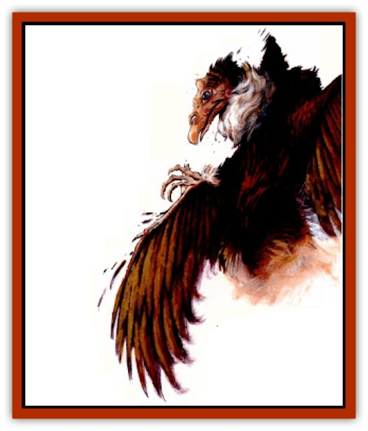

# Aarakocra - Athas

| Statistic | **Aarakocra (Athas)** |
| --- | --- |
| **Activity Cycle:** | Day |
| **Alignment:** | Any |
| **Armor Class:** | 7 |
| **Climate/Terrain:** | Deep desert |
| **Damage/Attack:** | 1d3/1d3 or by weapon |
| **Diet:** | Carnivore |
| **Frequency:** | Rare |
| **Hit Dice:** | 2+2 |
| **Intelligence:** | Average (8-10) |
| **Magic Resistance:** | Nil |
| **Morale:** | Steady (11) |
| **Movement:** | 6, Fl 36 (C) |
| **No. Appearing:** | 1d10 |
| **No. of Attacks:** | 2 |
| **Organization:** | Tribal |
| **Size:** | M (20'+ wingspan) |
| **Special Attacks:** | Nil |
| **Special Defenses:** | Nil |
| **THAC0:** | 17 |
| **Treasure:** | Varies |
| **XP Value:** | 65 |

**Psionics Summary**

| Level | Dis/Sci/Dev | Attack/Defense | Score | PSPs |
| --- | --- | --- | --- | --- |
| 3 | 2/2/7 | EW,MT/IF,TW | 9 | 30 |

**Clairsentience -** *Sciences:* nil; *Devotions:* all-round vision, danger sense, radial navigation.

**Telepathy -** *Sciences:* mind link, probe; *Devotions:* contact, ego whip, send thoughts, mind thrust.

***Note:*** Only leaders of tribes have psionic powers. While the powers listed above are the most common, some aarakocra have different or additional powers.

A race of intelligent, birdlike creatures living in the deepest deserts of Athas, the rare Athasian [[Aarakocra|aarakocra]] spends its time soaring on thermals in search of food.

The aarakocra is 7 to 8 feet tall with a wingspan of 20 feet or more. Because of its large wingspan, an aarakocra can carry as much as 75% of its own body weight and still fly easily. An aarakocra can fly a short distance carrying a burden equaling 125% of its own body weight. The average body weight of a full grown male is 100 pounds and a female is 85 pounds.

Each wing has a "hand" at its midpoint, consisting of three fingers and an opposable thumb. The fourth finger forms the rigid leading edge of the wing. In flight the hands cannot be used, but on the ground the aarakocra can use its hands almost as a human would. The aarakocra's body is protected by a thin bony plate on the chest, much like a solid rib cage. Talons on its legs can be used as claws and can be retracted to reveal a second set of hands, also with three fingers and an opposable thumb. Except for the chest plate, the entire skeleton is hollow and extremely fragile.

From a distance, the Athasian aarakocra resembles a huge [[Bird|vulture]]. Its black eyes, set in the front of the head, provide excellent vision over a long range. The plumage is generally black with a white collar for adult males and black or brown with a smaller white collar for females. Adolescents are a mixture of brown and black. The beak is large and covers most of the head. Plumage begins at the crown of the head and is darker near the head, except for the collar. Athasian aarakocra speak their own language and the languages of vultures and other large birds. Some speak the common tongue (5% to 10% chance depending on how deep in the wastelands a tribe lives).

**Combat:** Aarakocra can fight in the air or on the ground. They prefer aerial combat since their bones are too fragile to withstand a solid blow from a human-sized opponent. In combat against creatures on the ground, they prefer to fly over their victim and drop weighted nets. Some aarakocra use darts to harass ground-based opponents.

If their opponents can fly, the aarakocra generally forgo the use of the net, although large groups sometimes use nets on flying creatures. Normally, aarakocra attack flying creatures with long spears, diving from above and allowing the momentum to carry the spear through the target. Such an attack doubles the damage if the aarakocra have been able to dive at least 50 feet. Only the very largest aarakocra can carry more than one of these spears, they can attack with both at once with no penalty, causing double damage on each strike. All diving attacks are made at +4 and should be treated as a charge attack. All other penalties and restrictions of charge attacks apply.

The effect of the aarakocra's nets depends on if the opponent is flying at the time it becomes entangled. Creatures on the ground that are hit by a net are entangled and unable to participate in any combat until they make a successful Strength check to get free of the net. Flying creatures hit by a net can no longer fly and immediately begin falling. If they cannot escape the net or use some magical means to arrest the fall, normal falling damage applies.

Unless victims are entangled in nets, aarakocra are cautious in ground combat. If the aarakocra outnumber their opponents they advance in a straight line and thrust with their spears. If outnumbered, or the opponents are particularly tough, the aarakocra withdraw. Victims entangled in nets are killed or incapacitated for use as food or ransom.

Athasian aarakocra are mindful of their physical limitations as well as their comparatively low psionic abilities. They do not normally initiate psionic combat. At the first sign of psionic powers from any of their victims, however, all aarakocra that have some ability will use whatever attack and defense modes they can in an attempt to destroy the threat. Large groups of is or more aarakocra may initiate psionic combat if their leaders feel they can win quickly and avoid physical combat.

In desperation, an aarakocra can attempt to bite an opponent in combat. Because of the unwieldiness of its beak, the aarakocra has a THAC0 of 18 if attacking with this appendage. Further, the birdman causes only 1d2 points of damage with the beak.

**Habitat/Society:** Athasian aarakocra live in tribes with 6-20 (2d8+4) members, depending on the prestige of the leader. The largest tribe ever recorded had 50 members. The tribal hunting territory depends on the size of the tribe, usually about 500 square miles for a tribe of 10 members. There are no rigid boundaries between tribes and border disputes are not uncommon.

Alignments of tribe members are similar to the alignment of the leader. A tribe that has a leader who is neutral good may have neutral good, chaotic good, lawful good, and true neutral members. A predominantly evil tribe does not recognize boundaries with other tribes and treats other tribes as inferior beings to be eliminated.

Athasian aarakocra aren't happy in enclosed spaces, but they they take refuge in a cave or building if necessary.

Nonevil tribes live in rocky aeries in the highest peaks they can find. Evil tribes are normally nomadic and use an aerie made by another tribe if they need to remain in an area for a long time, even if they have to evict the tribe that made the nest.

Aarakocra aren't friendly toward intruders in their territory, especially caravans. They try to extract a toll from the caravan for passage through the desert. Good-aligned tribes allow unhindered passage of caravans that pay a tribute. If someone refuses to pay the tribute, the aarakocra try to capture scouts or outriders from the party and hold them until an even larger tribute is paid. The payment may be either livestock or shiny objects. Aarakocra are smart enough not to be taken in by glass baubles instead of gems, although they cannot tell the difference between the more common gems and the rare ones.

Evil tribes ask for tribute and often attack a caravan whether it pays or not. Aarakocra always demand shiny objects such as stones. These tribes find humans and demihumans to be quite tasty and prefer them to other food.

Good-aligned tribes of aarakocra sometimes return a lost traveler to the edge of the desert after first removing any valuables the traveler may be carrying. On very rare occasions a tribe might return a lost group of travelers to the more frequently traveled parts of the desert, again after first taking any valuables as payment.

The oldest male is the leader of the tribal hunting party and has 4+4 Hit Dice. The oldest female is in charge of the tribal aerie and has 3+3 HD. In tribes that have more than 15 members, the next oldest aarakocra serves as shaman and has 3+3 HD; the shaman completes the triumvirate necessary for proper worship and the summoning of elementals. (Interestingly, no magic-using aarakocra has ever been recorded.) Tribes without a shaman cannot summon [[Elemental_Air_Earth|air elementals]], which is an important part of aarakocra culture.

The shaman is the leader of the daily sun worship. Aarakocra worship the sun because it provides them with the thermals they need to soar in search of food. The shaman also leads the mystic rituals used to summon an air elemental. Summoning an air elemental is usually done only in preparation for the tribe's most sacred ceremony, the hunt. Small tribes must band together for this ceremony to allow the triumvirate to be formed.

The ceremony to summon an air elemental must be conducted at dawn and requires the oldest male and female to emit a highpitched keening whistle. The shaman conducts an intricate dance around them, simultaneously chanting an ancient summoning mantra.

The hunt is the final part of the initiation of adolescent aarakocra to adulthood and often takes the tribe far from their normal teritory. The target is always a [[Drake_Lesser_Athas_Silt|silt drake]]. The hunt is the only time the females leave the relative safety of the nest. Even an evil tribe will not interfere with a tribe on a hunt. An air elemental is often summoned to help find the drake, but never takes part in the actual combat. Although the adult members of the tribe take part in the initial phases of the combat, it is the initiates who deliver the final, killing blows to me drake. Scars from the hunt are considered a mark of pride among all aarakocra.

The females spend about eight months of the year incubating their eggs. Athasian aarakocra mate for life and a pair normally produces as many as 10 offspring. A female lays one egg a year. Constant incubation is not required because of the high daytime temperatures, so the females can maintain the nest and keep the tribe's treasure in order.

**Ecology:** Athasian aarakocra are high on the food chain and have no natural enemies other than [[Drake_Athas_General_Information|drakes]]. Unless evil, aarakocra leave their own territory only to hunt the silt drake and return as soon as possible when the hunt is over. (Evil aarakocra attack others, as noted above.) Aarakocra eggs and hatchlings are sought after by wealthy land owners who wish to use the creatures as scouts and sentries. An egg can bring as much as 10 cp in Tyr's marketplace. Tribes that have had eggs or hatchlings stolen have long memories and sometimes take revenge against the thief at a later date. Captive aarakocra join any tribe they come in contact with.

Athasian aarakocra have a natural life span of 21-30 years.

---
## Discovery & Documentation

**Source Publication:** Dark Sun Appendix II - Terrors Beyond Tyr (1991)
**Campaign Setting:** Dark Sun
**Author(s):** Jim Atkiss, Steve Brown, Timothy B. Brown, Andrew P. Morris, Bruce Nesmith, Wes Nicholson, Bill Slavicsek

### Other Creatures Found in This Source Book
   * [[Animal_Domestic_Athas_II|Animal, Domestic (Athas) II]]
   * [[Aviarag|Aviarag]]
   * [[Baazrag|Baazrag]]
   * [[Baazrag_Boneclaw|Baazrag, Boneclaw]]
   * [[Bloodgrass|Bloodgrass]]
   * [[Cactus_Hunting|Cactus, Hunting]]
   * [[Cactus_Rock|Cactus, Rock]]
   * [[Cilops|Cilops]]
   * [[Crodlu|Crodlu]]
   * [[Dagorran|Dagorran]]
   * [[Dhaot|Dhaot]]
   * [[Drake_Lesser_Athas_General_Information|Drake, Lesser (Athas), General Information]]
   * [[Drake_Lesser_Athas_Magma|Drake, Lesser (Athas), Magma]]
   * [[Drake_Lesser_Athas_Rain|Drake, Lesser (Athas), Rain]]
   * [[Drake_Lesser_Athas_Silt|Drake, Lesser (Athas), Silt]]
   * [[Drake_Lesser_Athas_Sun|Drake, Lesser (Athas), Sun]]
   * [[Dray|Dray]]
   * [[Drik|Drik]]
   * [[Dune_Reaper|Dune Reaper]]
   * [[Dwarf_Athas|Dwarf (Athas)]]
   * [[Elemental_Beast_Athas_Air|Elemental Beast (Athas), Air]]
   * [[Elemental_Beast_Athas_Earth|Elemental Beast (Athas), Earth]]
   * [[Elemental_Beast_Athas_Fire|Elemental Beast (Athas), Fire]]
   * [[Elemental_Beast_Athas_Water|Elemental Beast (Athas), Water]]
   * [[Elf_Athas|Elf (Athas)]]
   * [[Fael|Fael]]
   * [[Feylaar|Feylaar]]
   * [[Fordorran|Fordorran]]
   * [[Giant_Half-giant|Giant, Half-giant]]
   * [[Giant_Shadow|Giant, Shadow]]
   * [[Golem_Athas_Magma|Golem (Athas), Magma]]
   * [[Golem_Athas_Salt|Golem (Athas), Salt]]
   * [[Golem_Athas_General_Information|Golem (Athas), General Information]]
   * [[Gorak|Gorak]]
   * [[Halfling_Athas|Halfling (Athas)]]
   * [[Human_Athas|Human (Athas)]]
   * [[Jhakar|Jhakar]]
   * [[Kaisharga|Kaisharga]]
   * [[Kes'trekel|Kes'trekel]]
   * [[Klar|Klar]]
   * [[Krag|Krag]]
   * [[Kragling|Kragling]]
   * [[Lirr|Lirr]]
   * [[Mastyrial|Mastyrial]]
   * [[Meorty|Meorty]]
   * [[Mul|Mul]]
   * [[Nikaal|Nikaal]]
   * [[Paraelemental_Beast_General_Information|Paraelemental Beast, General Information]]
   * [[Paraelemental_Beast_Magma|Paraelemental Beast, Magma]]
   * [[Paraelemental_Beast_Rain|Paraelemental Beast, Rain]]
   * [[Paraelemental_Beast_Silt|Paraelemental Beast, Silt]]
   * [[Paraelemental_Beast_Sun|Paraelemental Beast, Sun]]
   * [[Pakubrazi|Pakubrazi]]
   * [[Psionocus|Psionocus]]
   * [[Psurlon|Psurlon]]
   * [[Raaig|Raaig]]
   * [[Retriever_Obsidian|Retriever, Obsidian]]
   * [[Ruktoi|Ruktoi]]
   * [[Ruvoka_Athas|Ruvoka (Athas)]]
   * [[Sand_Howler|Sand Howler]]
   * [[Scorpion_Athas|Scorpion (Athas)]]
   * [[Seed_Brain|Seed, Brain]]
   * [[Silt_Horror_Black|Silt Horror, Black]]
   * [[Silt_Horror_Magma|Silt Horror, Magma]]
   * [[Silt_Horror_Red|Silt Horror, Red]]
   * [[Silt_Spawn|Silt Spawn]]
   * [[Slig|Slig]]
   * [[Spider_Athas|Spider (Athas)]]
   * [[Spinewyrm|Spinewyrm]]
   * [[Ssurran|Ssurran]]
   * [[Stalking_Horror|Stalking Horror]]
   * [[Tarek|Tarek]]
   * [[Tari|Tari]]
   * [[Thri-kreen|Thri-kreen]]
   * [[T'liz|T'liz]]
   * [[Tohr-kreen_II|Tohr-kreen II]]
   * [[Tohr-kreen_III|Tohr-kreen III]]
   * [[Trin|Trin]]
   * [[Tul'k|Tul'k]]
   * [[Undead_Athas_General_Information|Undead (Athas), General Information]]
   * [[Wraith_Athas|Wraith (Athas)]]
   * [[Xerichou|Xerichou]]
   * [[Zombie_Thinking|Zombie, Thinking]]
