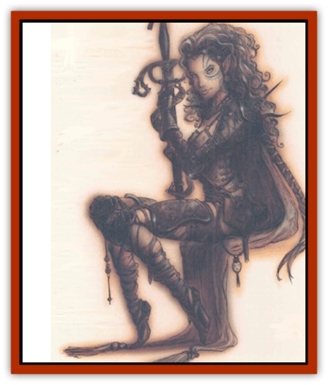

# Aasimar

| Statistic | **Aasimar** |
| --- | --- |
| **Activity Cycle:** | Any |
| **Alignment:** | Any nonevil |
| **Armor Class:** | 3 (10) |
| **Climate/Terrain:** | Any |
| **Damage/Attack:** | 1d3 or by weapon |
| **Diet:** | Omnivore |
| **Frequency:** | Rare |
| **Hit Dice:** | 3+3 |
| **Intelligence:** | Very (11-12) |
| **Magic Resistance:** | 10% |
| **Morale:** | Elite (13-14) |
| **Movement:** | 12 |
| **No. Appearing:** | 1 (1-2) |
| **No. of Attacks:** | 1 or by weapon |
| **Organization:** | Solitary |
| **Size:** | M (5½-6½' tall) |
| **Special Attacks:** | Spell use |
| **Special Defenses:** | ½ damage from fire and cold; +2 to saves vs. <i>charm</i>, <i>emotion</i>, <i>fear</i>, or <i>domination</i> |
| **THAC0:** | 17 |
| **Treasure:** | R,U |
| **XP Value:** | 420 |

Just like [[Tiefling|tieflings]], aasimar are plane-touched creatures that can't quite be called human. In their veins flows the blood of both humankind and one of the races of the Upper Planes - the [[Rilmani_General_Information|rilmani]], the [[Eladrin_General_Information|eladrins]], or the [[Guardinal_General_Information|guardinals]]. Aasimar are beautiful creatures, with calm, serene features and an inner radiance that shines from their faces. They've got long manes of white-gold hair, and bright, piercing eyes that seem to look right though a basher. It's easy to mistake an aasimar for a human of unnatural purity, a [[Elf_Half-|half-elf]], or even an [[Aasimon_Agathinon|agathinon]]. Aasimar tend to be noble, honest, and courageous cutters, but a body shouldn't always assume an aasimar means him well; they are a few cross-traders and knights of the post among the aasimar, despite their noble birth.

Aasimar are scattered throughout the Outlands and Upper and Neutral Planes, but naturally avoid prolonged stays on any of the Lower Planes. (They're too likely to be mistaken for an [[Aasimon_General_Information|aasimon]] of some kind, and a [[Tanar'ri_General_Information|tanar'ri]] or [[Baatezu_General_Information|baatezu]] can't stand the sight of an aasimon.) They usually dress to fit in with the population around them, so an aasimar living among the elven folk of Arborea dresses like an elf and assumes many of his hosts' mannerisms. When an aasimar's moved to great emotion, his heritage shines through his face like sunlight through clouds. There aren't many evil bashers who can look an angry aasimar in the eye.

**Combat:** Aasimar are upright and fair warriors with deep respect of strength and faith. Unfortunately, their mixed blood makes them somewhat frail. All aasimar gain bonusses of +1 to Strength and Wisdom, and suffer a -2 penalty to Constitution. It's real hard to sneak up on basilar; they've got senses like a cat's, it seems. All aasimar have infravision to a range of 60' and gain a +1 bonus to surprise checks due to their unnatural hearing and alertness. Aasimar suffer only half damage from fire and cold, and gain a +2 to saving throws versus any kind of *charm*, *fear*, *emotion*, or *domination* effect.

The typical NPC aasimar described above is a warrior. Most aasimar favor well-made heavy armor such as plate mail, field plate, or banded mail. They're likely to wear beautifully decorated suits, emblazoned with their coats-of-arms or other such frippery; an aasimar likes to stand tall and proud, and doesn't care who knows it. Because aasimar seem to pick a lot of scraps with powerful evil creatures, they are fond of large weapons that take advantage of their natural strength. An aasimar'll rarely be seen with an assassin's weapon like a hand crossbow or poisoned dagger: they like big two-handed swords, halberds, and maces, and mighty long bows.

About 25% of all aasimar are priests or fighter-priests, with the spell abilities of a 3rd-level cleric. About 10% more are mages of 3rd to 7th level, with four-sided Hit Dice. Aasimar mages do not gain the 10% magic resistance of the race.

**Habitat/Society:** As noted above, aasimar prefer to blend in with their neighbors and form no independent societies. They tend to be great travelers and wanderers, since they are welcomed anywhere on the Upper Planes and can pass without notice in most other places. Some aaslmar set themselves up as traders and merchants; these cutters do a good business, since everyone *knows* they're trustworthy. In fact, when an aasimar bobs some sod, he's likely to get away with it since most people'll take his word over his victim's.

Aasimar commonly intermarry with the people around them: in fact, it's rare to find an aasimar bloodline more than four or five generations old. Unlike tieflings, aasimar are rarely outcasts or orphans. Instead, they usually have the benefit of a respectable upbringing on the side of their moral parent. On rare occasions, aasimar are born into primc-material worlds where no one knows their true heritage. In these settings, the young aasimar often becomes a great leader or hero.

**Ecology:** Aasimar's expertise at fitting in with their settings makes them model citizens. They are upright and honest in their dealings, live clean and moral lives, and aren't afraid to stand up for what's right. This is all fine on the Upper Planes, but in neutral places like the Outlands it means that aasimar are born troublemakers. They've got an uncanny ability to ferret out underhanded schemes and put a stop to them. Aasimar're as safe as the next body on their native planes, but in Sigil they've got to watch their step and curb their impulses.

Aasimar can eat about anything a civilized human can. They have little liking for raw meat, fiery brews, or other such falre. Most aasimar have very discriminating palates and enjoy only the finest viands and wines of mortals.

There's a natural rivalry between tieflings and aasimar. Tieflings heartily resent them because their mixed heritage isn't perceived as a fault like the tieflings' own commonly is. To the tiefling mind, an aasimar is a coddled half-breed who's had everything handed lo him on a silver plate. Assimar find it difficult not to be suspicious of tieflings in return.

---
## Discovery & Documentation

**Source Publication:** Planescape II (1996)
**Campaign Setting:** Planescape
**Author(s):** Rich Baker, Karen S. Boomgarden

### Other Creatures Found in This Source Book
   * [[Abrian|Abrian]]
   * [[Arcane|Arcane]]
   * [[Balaena|Balaena]]
   * [[Beholder-kin_Observer|Beholder-kin, Observer]]
   * [[Bloodthorn|Bloodthorn]]
   * [[Bonespear|Bonespear]]
   * [[Darkweaver|Darkweaver]]
   * [[Demarax|Demarax]]
   * [[Dhour|Dhour]]
   * [[Eater_of_Knowledge|Eater of Knowledge]]
   * [[Eladrin_Greater_Firre|Eladrin, Greater, Firre]]
   * [[Eladrin_Greater_Ghaele|Eladrin, Greater, Ghaele]]
   * [[Eladrin_Greater_Tulani|Eladrin, Greater, Tulani]]
   * [[Eladrin_Lesser_Bralani|Eladrin, Lesser, Bralani]]
   * [[Eladrin_Lesser_Coure|Eladrin, Lesser, Coure]]
   * [[Eladrin_Lesser_Noviere|Eladrin, Lesser, Noviere]]
   * [[Eladrin_Lesser_Shiere|Eladrin, Lesser, Shiere]]
   * [[Fhorge|Fhorge]]
   * [[Ghostlight|Ghostlight]]
   * [[Guardinal_Avoral|Guardinal, Avoral]]
   * [[Guardinal_Cervidal|Guardinal, Cervidal]]
   * [[Guardinal_General_Information|Guardinal, General Information]]
   * [[Guardinal_Equinal|Guardinal, Equinal]]
   * [[Guardinal_Leonal|Guardinal, Leonal]]
   * [[Guardinal_Lupinal|Guardinal, Lupinal]]
   * [[Guardinal_Ursinal|Guardinal, Ursinal]]
   * [[Hollyphant|Hollyphant]]
   * [[Incantifer|Incantifer]]
   * [[Ironmaw|Ironmaw]]
   * [[Keeper|Keeper]]
   * [[Khaasta|Khaasta]]
   * [[Leomarh|Leomarh]]
   * [[Monster_of_Legend|Monster of Legend]]
   * [[Mortai|Mortai]]
   * [[Noctral|Noctral]]
   * [[Quill|Quill]]
   * [[Razorvine|Razorvine]]
   * [[Reave|Reave]]
   * [[Retriever|Retriever]]
   * [[Rilmani_Abiorach|Rilmani, Abiorach]]
   * [[Rilmani_General_Information|Rilmani, General Information]]
   * [[Rilmani_Argenach|Rilmani, Argenach]]
   * [[Rilmani_Aurumach|Rilmani, Aurumach]]
   * [[Rilmani_Cuprilach|Rilmani, Cuprilach]]
   * [[Rilmani_Ferrumach|Rilmani, Ferrumach]]
   * [[Rilmani_Plumach|Rilmani, Plumach]]
   * [[Shadowdrake|Shadowdrake]]
   * [[Spellhaunt|Spellhaunt]]
   * [[Spider_Hook|Spider, Hook]]
   * [[Sunfly|Sunfly]]
   * [[Sword_Spirit|Sword Spirit]]
   * [[Tanar'ri_Lesser_Bulezau|Tanar'ri, Lesser, Bulezau]]
   * [[Tanar'ri_Lesser_Maurezhi|Tanar'ri, Lesser, Maurezhi]]
   * [[Tanar'ri_Lesser_Yochlol|Tanar'ri, Lesser, Yochlol]]
   * [[Tanar'ri_General_Information|Tanar'ri, General Information]]
   * [[Tanar'ri_True_Alkilith|Tanar'ri, True, Alkilith]]
   * [[Terlen|Terlen]]
   * [[Tso|Tso]]
   * [[T'uen-rin|T'uen-rin]]
   * [[Vaporighu|Vaporighu]]
   * [[Vorr|Vorr]]
   * [[Wastrel|Wastrel]]
   * [[Wraithworm|Wraithworm]]
   * [[Yugoloth_Lesser_Canoloth|Yugoloth, Lesser, Canoloth]]
   * [[Zoveri|Zoveri]]
