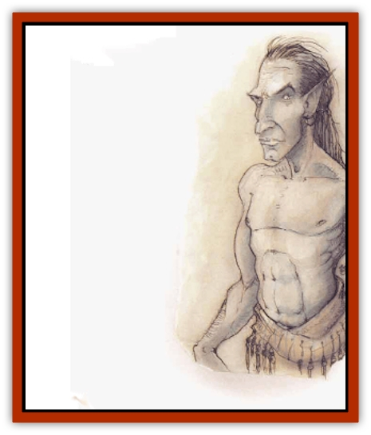

# Aasimon - Agathinon

| Statistic | **Aasimon, Agathinon** |
| --- | --- |
| **Activity Cycle:** | Any |
| **Alignment:** | Neutral good |
| **Armor Class:** | 0 |
| **Climate/Terrain:** | Upper Planes |
| **Damage/Attack:** | By weapon or special |
| **Diet:** | Omnivore |
| **Frequency:** | Uncommon (Upper) or very rare |
| **Hit Dice:** | 8 |
| **Intelligence:** | Exceptional (15-16) |
| **Magic Resistance:** | 20% |
| **Morale:** | Elite (13-14) |
| **Movement:** | 15 |
| **No. Appearing:** | 50-100 (Upper) or 1 |
| **No. of Attacks:** | 1 (weapon) or special |
| **Organization:** | Army (Upper) or solitary |
| **Size:** | See below |
| **Special Attacks:** | See below |
| **Special Defenses:** | See below |
| **THAC0:** | 13 |
| **Treasure:** | Incidental |
| **XP Value:** | 8,000 |

Agathinon, the [[Aasimon_General_Information|aasimon]] warriors, only appear in their natural form on the Upper Planes. There they look like elves with opalescent, luminous skin and shining eyes. Elsewhere an agathinon assumes another form at will. Male and female agathinon are of equal size and power. They speak any language, using their powerful telepathic ability to do so.

**Combat:** In human form an agathinon uses nonedged weapons (for example, a sling or mace) and has the spell ability of a 7th-level cleric with 18 Wisdom.

Agathinon never attack in their natural form. At any sign of danger, they assume another form. They have all attack forms and spell-like powers of the form they assume, though they retain their original hit points, THACO, Intelligence, and other statistics. For example, an agathinon who assumes the form of an old bronze dragon has two claw attacks (1d8 each), a bite (for 2d6+2), snatch, kick, wing buffet, and tail slap. He also has the powerful breath weapon and spell-like powers of the dragon. He does not, however, have 18 Hit Dice, but rather his own 8 Hit Dice.

Rarely, an agathinon assumes the form of a magical inanimate object, usually carried by some other being: a magical lamp, sword, necklace, vase, or glass vial. In this form the agathinon confers all powers of the object on its possessor, plus several other benefits: the ability to cast 1st-level priest spells from any sphere at will, and to turn undead as a 7th-level priest. Agathinon never confer abilities on evil individuals. In fact, any evil person touching the item takes 1d12 points of damage (no save allowed). Neutrals may receive benefits from the item only if their current mission or actions serve the needs of the agathinon.

All agathinon can become ethereal at will. They are struck only by +1 or better magical weapons and save as 14th-level priests regardless of the form they assume. All agathinon are immune to the following: life-level draining spells and powers, *death* spells, *disintegration*, and energy from the Positive Energy Plane.

In addition to the spell-like abilities available to all aasimon, agathinon may use the spell-like abilities *clairaudience*, *clairvoyance*, *ESP*, and *hold person*. The level of these powers is equal to the agathinon's Hit Dice.

**Habitat/Society:** Agathinon form the elite vanguard of the celestial armies (see [[Einheriar|Einheriar]]). In groups up to 100 strong, agathinon most often fight in human form. In special circumstances, they transform into powerful creatures such as [[Pegasus|pegasi]] or [[Dragon_General_Information|dragons]] to do battle. Agathinon are fearless warriors who often defend their cause to the death.

Agathinon carry out solo missions to the Prime Material Plane to aid mortals in their confrontations with evil. These instructions come down from the celestial stewards or, in the case of mortals of extreme courage and importance, from one of the powers themselves. Outside the Upper Planes agathinon are 60% likely to assume human form, 30% likely to assume the form of some other creature, and only 10% of the time, agathinon take the form of an inanimate object (magical sword, amulet, or some such).

**Ecology:** Agathinon are stem, serious, and unyielding. They are devoted beings, unswerving in their constant pursuit of right.

---
## Discovery & Documentation

**Source Publication:** MC8 Outer Planes Appendix (1990)
**Campaign Setting:** Planescape
**Author(s):** Timothy B. Brown, Jamie LaFountain

### Other Creatures Found in This Source Book
   * [[Aasimon_Deva|Aasimon, Deva]]
   * [[Aasimon_Light|Aasimon, Light]]
   * [[Aasimon_General_Information|Aasimon, General Information]]
   * [[Aasimon_Planetar|Aasimon, Planetar]]
   * [[Aasimon_Solar|Aasimon, Solar]]
   * [[Air_Sentinel|Air Sentinel]]
   * [[Animal_Lord|Animal Lord]]
   * [[Archon|Archon]]
   * [[Baatezu_Lesser_Abishai|Baatezu, Lesser, Abishai]]
   * [[Baatezu_Greater_Amnizu|Baatezu, Greater, Amnizu]]
   * [[Baatezu_Lesser_Barbazu|Baatezu, Lesser, Barbazu]]
   * [[Baatezu_Greater_Cornugon|Baatezu, Greater, Cornugon]]
   * [[Baatezu_Lesser_Erinyes|Baatezu, Lesser, Erinyes]]
   * [[Baatezu_General_Information|Baatezu, General Information]]
   * [[Baatezu_Greater_Gelugon|Baatezu, Greater, Gelugon]]
   * [[Baatezu_Lesser_Hamatula|Baatezu, Lesser, Hamatula]]
   * [[Baatezu_Lemure|Baatezu, Lemure]]
   * [[Baatezu_Least_Nupperibo|Baatezu, Least, Nupperibo]]
   * [[Baatezu_Lesser_Osyluth|Baatezu, Lesser, Osyluth]]
   * [[Baatezu_Greater_Pit_Fiend|Baatezu, Greater, Pit Fiend]]
   * [[Baatezu_Least_Spinagon|Baatezu, Least, Spinagon]]
   * [[Balaena|Balaena]]
   * [[Bariaur|Bariaur]]
   * [[Bebilith|Bebilith]]
   * [[Bodak|Bodak]]
   * [[Dog_Moon|Dog, Moon]]
   * [[Dragon_Adamantite|Dragon, Adamantite]]
   * [[Einheriar|Einheriar]]
   * [[Gehreleth|Gehreleth]]
   * [[Githyanki|Githyanki]]
   * [[Githzerai|Githzerai]]
   * [[Hordling|Hordling]]
   * [[Lammasu_Celestial|Lammasu, Celestial]]
   * [[Larva|Larva]]
   * [[Maelephant|Maelephant]]
   * [[Marut|Marut]]
   * [[Mediator|Mediator]]
   * [[Mortai|Mortai]]
   * [[Night_Hag|Night Hag]]
   * [[Nightmare|Nightmare]]
   * [[Noctral|Noctral]]
   * [[Per|Per]]
   * [[Phoenix|Phoenix]]
   * [[Slaad|Slaad]]
   * [[Tanar'ri_Greater_Babau|Tanar'ri, Greater, Babau]]
   * [[Tanar'ri_Greater_Chasme|Tanar'ri, Greater, Chasme]]
   * [[Tanar'ri_Greater_Nabassu|Tanar'ri, Greater, Nabassu]]
   * [[Tanar'ri_Least_Dretch|Tanar'ri, Least, Dretch]]
   * [[Tanar'ri_Least_Manes|Tanar'ri, Least, Manes]]
   * [[Tanar'ri_Least_Rutterkin|Tanar'ri, Least, Rutterkin]]
   * [[Tanar'ri_Lesser_Alu-Fiend|Tanar'ri, Lesser, Alu-Fiend]]
   * [[Tanar'ri_Lesser_Bar-Lgura|Tanar'ri, Lesser, Bar-Lgura]]
   * [[Tanar'ri_Lesser_Cambion|Tanar'ri, Lesser, Cambion]]
   * [[Tanar'ri_Lesser_Succubus|Tanar'ri, Lesser, Succubus]]
   * [[Tanar'ri_Guardian_Molydeus|Tanar'ri, Guardian, Molydeus]]
   * [[Tanar'ri_General_Information|Tanar'ri, General Information]]
   * [[Tanar'ri_True_Balor|Tanar'ri, True, Balor]]
   * [[Tanar'ri_True_Glabrezu|Tanar'ri, True, Glabrezu]]
   * [[Tanar'ri_True_Hezrou|Tanar'ri, True, Hezrou]]
   * [[Tanar'ri_True_Marilith|Tanar'ri, True, Marilith]]
   * [[Tanar'ri_True_Nalfeshnee|Tanar'ri, True, Nalfeshnee]]
   * [[Tanar'ri_True_Vrock|Tanar'ri, True, Vrock]]
   * [[Titan|Titan]]
   * [[Translator|Translator]]
   * [[T'uen-rin|T'uen-rin]]
   * [[Vaporighu|Vaporighu]]
   * [[Warden_Beast|Warden Beast]]
   * [[Yugoloth_Greater_Arcanaloth|Yugoloth, Greater, Arcanaloth]]
   * [[Yugoloth_Lesser_Dergoloth|Yugoloth, Lesser, Dergoloth]]
   * [[Yugoloth_Lesser_Hydroloth|Yugoloth, Lesser, Hydroloth]]
   * [[Yugoloth_General_Information|Yugoloth, General Information]]
   * [[Yugoloth_Lesser_Mezzoloth|Yugoloth, Lesser, Mezzoloth]]
   * [[Yugoloth_Greater_Nycaloth|Yugoloth, Greater, Nycaloth]]
   * [[Yugoloth_Lesser_Piscoloth|Yugoloth, Lesser, Piscoloth]]
   * [[Yugoloth_Greater_Ultroloth|Yugoloth, Greater, Ultroloth]]
   * [[Yugoloth_Lesser_Yagnoloth|Yugoloth, Lesser, Yagnoloth]]
   * [[Zoveri|Zoveri]]
