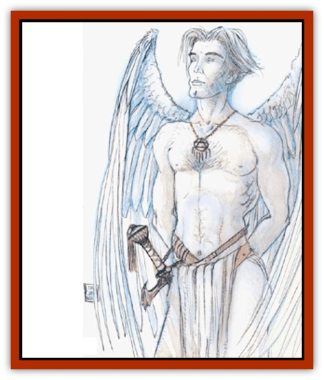

# Aasimon - Deva

| Statistic | **Astral** | **Monadic** | **Movanic** |
| --- | --- | --- | --- |
| **Activity Cycle:** | Any | Any | Any |
| **Alignment:** | Any good | Any good | Any good |
| **Armor Class:** | -5 | -3 | -1 |
| **Climate/Terrain:** | Upper Planes | Upper Planes | Upper Planes |
| **Damage/Attack:** | 3d6/3d6 | 3d4/3d4+8 | By weapon |
| **Diet:** | Omnivore | Omnivore | Omnivore |
| **Frequency:** | Very rare | Very rare | Very rare |
| **Hit Dice:** | 12 | 10 | 8 |
| **Intelligence:** | Genius (17-18) | Genius (17-18) | Genius (17-18) |
| **Magic Resistance:** | 70% | 60% | 40% |
| **Morale:** | Fearless (19-20) | Fearless (19-20) | Fearless (19-20) |
| **Movement:** | 24, Fl 48 (B) | 15, Fl 36 (B) | 12, Fl 30 (B) |
| **No. Appearing:** | 1 or 1-3 | 1 or 1-3 | 1 or 1-3 |
| **No. of Attacks:** | 2 | 2 | 2 |
| **Organization:** | Solitary | Solitary | Solitary |
| **Size:** | M (7' tall) | M (6' tall) | M (6' tall) |
| **Special Attacks:** | Disruption | Smiting | See below |
| **Special Defenses:** | Spell immunity, protection, never surprised, +2 or better weapons to hit | Spell immunity, protection, +1 or better weapons to hit | Parry, protection, never surprised, regeneration, +1 or better weapons to hit |
| **THAC0:** | 9 | 11 | 13 |
| **Treasure:** | Nil | Nil | Nil |
| **XP Value:** | 15,000 | 13,000 | 14,000 |

Devas inhabit the good-aligned Outer Planes: Arborea, Arcadia, the Beastlands, Bytopia, Elysium, Mount Celestia, and Ysgard. These proxies of the powers appear as stunningly handsome male humans with large, feathery wings fanning gracefully from their shoulders.

**Combat:** Although they serve the cause of goodness, devas must often deliver their messages by the point of the swords. Devastatingly powerful warriors, they have the wherewithal to take the battle to the evil they oppose.

In addition to those available to all [[Aasimon_General_Information|aasimon]], devas have the spell-like powers *cure disease* (3 times per day), *cure light wounds* (7 times per day), *detect lie*, *detect snares &amp; pits* (7 times per day), *dispel magic* (7 times per day), *heal* (once per day), *infravision* (always active), *invisibility 10-foot radius*, *light*, *polymorph self*, *protection from evil*, *remove curse*, *remove fear*, and *tongues*.

Devas are immune to cold-based, electrical, *magic missile*, petrification, poison, normal fire-based, and gas attack spells. Except for monadic devas, who are not affected by fire of any type, devas take half damage from dragon and magical fire attacks. They take full damage from acid attacks. All devas are immune to attacks from nonmagical weapons.

**Habitat/Society:** Devas are the cornerstone of the forces of  good. With the <a href="{/appendix/aasiagat">agathinon</a>, they are the powerful and trusted vanguard of the Upper Planes. Each of the three varieties of devas has a different task to perform in the scheme of the Upper Planes. The most common missions for each type appear below. The varieties are equal in status with no rivalry between types.

**Ecology:** Devas live in perfect harmony with other beings of the Upper Planes. Because the remnants of their material forms disappear at death, none has ever been examined. Devas have a close relationship with the other aasimon, particularly the [[Aasimon_Planetar|planetars]]. In times of great need, a planetar leads a group of devas to perform some mission for a good power.

## Astral Deva

Astral devas have golden skin, amber eyes, and fair hair. They also have a Charisma of 20.

**Combat:** Astral devas are extremely supple and move with inhuman quickness. They carry a macelike weapon with a +3 magical attack bonus (3d6 points of damage). Any creature struck twice in the same round by the weapon must save vs. spells or fall senseless for 1 to 12 melee rounds. The weapon has the special abilities of a mace of disruption.

In addition to those available to all aasimon and devas, astral devas have two spell-like powers: *blade barrier* (once per day) and *detect invisibility*.

Astral devas are never surprised. They are immune to vacuum, level loss (whether undead or magical), and *death* spells. Their souls cannot be entrapped or imprisoned

**Habitat/Society:** Astral devas attend to matters in the Lower Planes for the powers of good. These powerful, pure warriors can pass into the Lower Planes at will, bringing their justice to the heart of evil. If directly commanded by the power they serve, they can enter any layer of any lower plane without passing through intermediate layers. Astral devas also commonly travel to the Astral Plane to rescue good-aligned mortals who have become lost or stranded.

## Monadic Deva

Monadic devas have dark brown skin, jet hair, and piercing green eyes. Their Charisma is 19.

**Combat:** Unlike the astral devas, monadics are of strong, bulky build and rely more upon strength than on speed and agility. Monadic devas have Strength 20 (+8 damage adjustment). These strong stewards of the gods carry a great metal rod enchanted to give +3 on all attack and damage rolls. This weapon has all properties of a *rod of smiting*. Only the owner can use these powers, and the weapon never runs out of charges. Solid creatures (for example, those made of stone) and metal-armored opponents suffer an additional 1d8 points of damage per hit.

Monadic devas can use all common powers shared by devas. The light they shed can extend from 3 to 30 feet as desired. The *protection from evil* sphere is half power (+1) but has a 15-foot radius. Monadic devas have two additional abilities, usable one at a time, once per round: *hold monster* and *mirror image*.

Monadic devas are immune to *death* magic and to life level loss from magic or undead. They also have a power similar to *charm person* that works on [[Elemental_Air_Earth|elementals]]. The spell-like power works like the wizard spell, but only on elementals.

**Habitat/Society:** On rare occasions, a power from the Upper Planes needs a servant to go to one of the Elemental or Paraelemental Planes. When this need arises, monadic devas are used. Monadics can pass into any Elemental Plane at will and survive there without ill effect.

## Movanic Deva

  Movanic devas have milky white skin and silvery hair and eyes. Their Charisma is 18.

**Combat:** Much like their astral counterparts, the movanic devas are slender and exceedingly agile. These powerful warriors of good can never be surprised. Although they canying a variety of weapons, they most often employ a two-handed sword, with which they can attack twice per melee round. The enchanted blade is in all respects equal to a sword +1 ,*flame tongue*. It does damage equal to a two-handed sword (1d10 to S or M, 3d6 to L). A movanic deva can forfeit one or both its attacks to parry one strike per attack forfeited. The parry automatically succeeds and works against magical attacks, even spells that would normally always hit (for example, *magic missile*).

Movanics, in addition to the powers and abilities common to all aasimon and devas, may use any wizard spell of the Invocation/Evocation school, at will, once per day. They may also use the spell-like powers *anti-magic shell*, *protection from normal missiles*, and *spell turning*.

The movanic deva is surrounded by a powerful protection that acts as a double-strength *protection from evil* and renders the deva immune to attacks from all but +2 or better magical weapons. The deva regenerates 2 hit points per melee round.

**Habitat/Society:** Movanic devas are the most privileged of all the devas, for they are sent to many other planes to aid prominent mortal followers of good deities in moments of dire need. They are able to pass into the Prime Material at will.

Movanic devas rarely appear in their natural form, instead polymorphing themselves into people or animals. Sometimes, however, the shock value of their natural form better serves their needs.

---
## Discovery & Documentation

**Source Publication:** MC8 Outer Planes Appendix (1990)
**Campaign Setting:** Planescape
**Author(s):** Timothy B. Brown, Jamie LaFountain

### Other Creatures Found in This Source Book
   * [[Aasimon_Agathinon|Aasimon, Agathinon]]
   * [[Aasimon_Light|Aasimon, Light]]
   * [[Aasimon_General_Information|Aasimon, General Information]]
   * [[Aasimon_Planetar|Aasimon, Planetar]]
   * [[Aasimon_Solar|Aasimon, Solar]]
   * [[Air_Sentinel|Air Sentinel]]
   * [[Animal_Lord|Animal Lord]]
   * [[Archon|Archon]]
   * [[Baatezu_Lesser_Abishai|Baatezu, Lesser, Abishai]]
   * [[Baatezu_Greater_Amnizu|Baatezu, Greater, Amnizu]]
   * [[Baatezu_Lesser_Barbazu|Baatezu, Lesser, Barbazu]]
   * [[Baatezu_Greater_Cornugon|Baatezu, Greater, Cornugon]]
   * [[Baatezu_Lesser_Erinyes|Baatezu, Lesser, Erinyes]]
   * [[Baatezu_General_Information|Baatezu, General Information]]
   * [[Baatezu_Greater_Gelugon|Baatezu, Greater, Gelugon]]
   * [[Baatezu_Lesser_Hamatula|Baatezu, Lesser, Hamatula]]
   * [[Baatezu_Lemure|Baatezu, Lemure]]
   * [[Baatezu_Least_Nupperibo|Baatezu, Least, Nupperibo]]
   * [[Baatezu_Lesser_Osyluth|Baatezu, Lesser, Osyluth]]
   * [[Baatezu_Greater_Pit_Fiend|Baatezu, Greater, Pit Fiend]]
   * [[Baatezu_Least_Spinagon|Baatezu, Least, Spinagon]]
   * [[Balaena|Balaena]]
   * [[Bariaur|Bariaur]]
   * [[Bebilith|Bebilith]]
   * [[Bodak|Bodak]]
   * [[Dog_Moon|Dog, Moon]]
   * [[Dragon_Adamantite|Dragon, Adamantite]]
   * [[Einheriar|Einheriar]]
   * [[Gehreleth|Gehreleth]]
   * [[Githyanki|Githyanki]]
   * [[Githzerai|Githzerai]]
   * [[Hordling|Hordling]]
   * [[Lammasu_Celestial|Lammasu, Celestial]]
   * [[Larva|Larva]]
   * [[Maelephant|Maelephant]]
   * [[Marut|Marut]]
   * [[Mediator|Mediator]]
   * [[Mortai|Mortai]]
   * [[Night_Hag|Night Hag]]
   * [[Nightmare|Nightmare]]
   * [[Noctral|Noctral]]
   * [[Per|Per]]
   * [[Phoenix|Phoenix]]
   * [[Slaad|Slaad]]
   * [[Tanar'ri_Greater_Babau|Tanar'ri, Greater, Babau]]
   * [[Tanar'ri_Greater_Chasme|Tanar'ri, Greater, Chasme]]
   * [[Tanar'ri_Greater_Nabassu|Tanar'ri, Greater, Nabassu]]
   * [[Tanar'ri_Least_Dretch|Tanar'ri, Least, Dretch]]
   * [[Tanar'ri_Least_Manes|Tanar'ri, Least, Manes]]
   * [[Tanar'ri_Least_Rutterkin|Tanar'ri, Least, Rutterkin]]
   * [[Tanar'ri_Lesser_Alu-Fiend|Tanar'ri, Lesser, Alu-Fiend]]
   * [[Tanar'ri_Lesser_Bar-Lgura|Tanar'ri, Lesser, Bar-Lgura]]
   * [[Tanar'ri_Lesser_Cambion|Tanar'ri, Lesser, Cambion]]
   * [[Tanar'ri_Lesser_Succubus|Tanar'ri, Lesser, Succubus]]
   * [[Tanar'ri_Guardian_Molydeus|Tanar'ri, Guardian, Molydeus]]
   * [[Tanar'ri_General_Information|Tanar'ri, General Information]]
   * [[Tanar'ri_True_Balor|Tanar'ri, True, Balor]]
   * [[Tanar'ri_True_Glabrezu|Tanar'ri, True, Glabrezu]]
   * [[Tanar'ri_True_Hezrou|Tanar'ri, True, Hezrou]]
   * [[Tanar'ri_True_Marilith|Tanar'ri, True, Marilith]]
   * [[Tanar'ri_True_Nalfeshnee|Tanar'ri, True, Nalfeshnee]]
   * [[Tanar'ri_True_Vrock|Tanar'ri, True, Vrock]]
   * [[Titan|Titan]]
   * [[Translator|Translator]]
   * [[T'uen-rin|T'uen-rin]]
   * [[Vaporighu|Vaporighu]]
   * [[Warden_Beast|Warden Beast]]
   * [[Yugoloth_Greater_Arcanaloth|Yugoloth, Greater, Arcanaloth]]
   * [[Yugoloth_Lesser_Dergoloth|Yugoloth, Lesser, Dergoloth]]
   * [[Yugoloth_Lesser_Hydroloth|Yugoloth, Lesser, Hydroloth]]
   * [[Yugoloth_General_Information|Yugoloth, General Information]]
   * [[Yugoloth_Lesser_Mezzoloth|Yugoloth, Lesser, Mezzoloth]]
   * [[Yugoloth_Greater_Nycaloth|Yugoloth, Greater, Nycaloth]]
   * [[Yugoloth_Lesser_Piscoloth|Yugoloth, Lesser, Piscoloth]]
   * [[Yugoloth_Greater_Ultroloth|Yugoloth, Greater, Ultroloth]]
   * [[Yugoloth_Lesser_Yagnoloth|Yugoloth, Lesser, Yagnoloth]]
   * [[Zoveri|Zoveri]]
