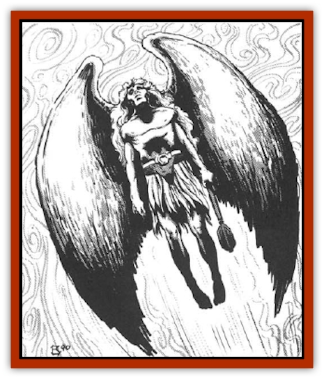

# Aasimon - General Information

* Unless immune to nonmagical weapons, in which case no damage is sustained.

All aasimon have the spell-like powers *aid*, *augury*, *change self*, *comprehend languages*, *cure serious wounds* (3 times per day), *detect evil*, *detect magic*, *know alignment*, *read magic*, *and teleport without error*. They can travel freely throughout the Upper Planes and may enter the Astral and Prime Material Planes at the request of a greater power. Specific missions may briefly take an aasimon to the Lower Planes.

The aasimon's *detect evil* ability goes beyond the spell of the same name. Within 100 feet of a source of evil (strongly aligned individual, powerful evil magical item, and so on) the aasimon automatically detects its direction, strength, and general nature. An aasimon who gazes directly into the eyes of an evil creature learns its name, nature, and background. This power always functions automatically.

Aasimon have a special power over mortals called *celestial reverence*. This power works only in the aasimon's normal, unaltered form. When the aasimon invokes *celestial reverence*, a blinding flash of light draws the attention of all mortals in sight of it. Anyone viewing this spectacle must immediately save vs. paralyzation. Any person of good alignment who fails the save is struck by a strong protective love for the aasimon. Those of evil or neutral alignment who fail to save suddenly fear the aasimon's power and do not attack. Evil creatures of fewer than 8 Hit Dice who fail their save flee the area immediately. The aasimon rarely use this ability, for goodness dictates that they avoid using their powers to manipulate others.

Although aasimon cannot *gate* in others of their kind, they can send out a distress call that other good powers sense. If an aasimon does this, the closest enchanted good beings (for example, [[Ki-rin|ki-rin]], [[Unicorn|unicorns]], and [[Dragon_General_Information|metallic dragons]]) immediately come to the rescue. This ability does not create or conjure good beings; it only alerts them.

When on the Upper Planes and in dire need, goodaligned worshipers of the utmost faith and power are 20% likely to attract an aasimon's help. Modify the chance if the worshiper is performing a mission for his or her church.

**Habitat/Society: **Aasimon neither lie, cheat, attack needlessly, nor steal, and they are impeccably honorable in their dealings. In this, unfortunately, they are sometimes predictable and even vulnerable to manipulation.

There are seven varieties of aasimon. The [[Aasimon_Agathinon|agathinon]] are warriors; the other six types (astral, monadic, and movanic [[Aasimon_Deva|devas]], [[Aasimon_Light|light]], [[Aasimon_Planetar|planetar]], and [[Aasimon_Solar|solar]]) are collectively called celestial stewards.

*Warriors:* The agathinon, the fighting forces of the Upper Planes, defend the borders of their planes against intruders. Warriors also face each other in endless cycles of <q>holy</q> wars. Gathering a vast host of agathinon warriors and whipping them into ideological fervor, one pantheon wages devastating campaigns against another, slaughtering thousands, even millions in the name of its particular brand of goodness. Despite their goodness, aasimon can hold a grudge; hard feelings still exist between pantheons over holy wars fought thousands of years ago.

*Celestial stewards:* The mightiest and most just of the aasimon, the celestial stewards directly serve the powers of the Upper Planes. Although similar to one another, each steward has a particular role in the affairs of the Upper Planes. Some are messengers, some render aid to mortal followers, and still others act as scouts.

---
## Discovery & Documentation

**Source Publication:** MC8 Outer Planes Appendix (1990)
**Campaign Setting:** Planescape
**Author(s):** Timothy B. Brown, Jamie LaFountain

### Other Creatures Found in This Source Book
   * [[Aasimon_Agathinon|Aasimon, Agathinon]]
   * [[Aasimon_Deva|Aasimon, Deva]]
   * [[Aasimon_Light|Aasimon, Light]]
   * [[Aasimon_Planetar|Aasimon, Planetar]]
   * [[Aasimon_Solar|Aasimon, Solar]]
   * [[Air_Sentinel|Air Sentinel]]
   * [[Animal_Lord|Animal Lord]]
   * [[Archon|Archon]]
   * [[Baatezu_Lesser_Abishai|Baatezu, Lesser, Abishai]]
   * [[Baatezu_Greater_Amnizu|Baatezu, Greater, Amnizu]]
   * [[Baatezu_Lesser_Barbazu|Baatezu, Lesser, Barbazu]]
   * [[Baatezu_Greater_Cornugon|Baatezu, Greater, Cornugon]]
   * [[Baatezu_Lesser_Erinyes|Baatezu, Lesser, Erinyes]]
   * [[Baatezu_General_Information|Baatezu, General Information]]
   * [[Baatezu_Greater_Gelugon|Baatezu, Greater, Gelugon]]
   * [[Baatezu_Lesser_Hamatula|Baatezu, Lesser, Hamatula]]
   * [[Baatezu_Lemure|Baatezu, Lemure]]
   * [[Baatezu_Least_Nupperibo|Baatezu, Least, Nupperibo]]
   * [[Baatezu_Lesser_Osyluth|Baatezu, Lesser, Osyluth]]
   * [[Baatezu_Greater_Pit_Fiend|Baatezu, Greater, Pit Fiend]]
   * [[Baatezu_Least_Spinagon|Baatezu, Least, Spinagon]]
   * [[Balaena|Balaena]]
   * [[Bariaur|Bariaur]]
   * [[Bebilith|Bebilith]]
   * [[Bodak|Bodak]]
   * [[Dog_Moon|Dog, Moon]]
   * [[Dragon_Adamantite|Dragon, Adamantite]]
   * [[Einheriar|Einheriar]]
   * [[Gehreleth|Gehreleth]]
   * [[Githyanki|Githyanki]]
   * [[Githzerai|Githzerai]]
   * [[Hordling|Hordling]]
   * [[Lammasu_Celestial|Lammasu, Celestial]]
   * [[Larva|Larva]]
   * [[Maelephant|Maelephant]]
   * [[Marut|Marut]]
   * [[Mediator|Mediator]]
   * [[Mortai|Mortai]]
   * [[Night_Hag|Night Hag]]
   * [[Nightmare|Nightmare]]
   * [[Noctral|Noctral]]
   * [[Per|Per]]
   * [[Phoenix|Phoenix]]
   * [[Slaad|Slaad]]
   * [[Tanar'ri_Greater_Babau|Tanar'ri, Greater, Babau]]
   * [[Tanar'ri_Greater_Chasme|Tanar'ri, Greater, Chasme]]
   * [[Tanar'ri_Greater_Nabassu|Tanar'ri, Greater, Nabassu]]
   * [[Tanar'ri_Least_Dretch|Tanar'ri, Least, Dretch]]
   * [[Tanar'ri_Least_Manes|Tanar'ri, Least, Manes]]
   * [[Tanar'ri_Least_Rutterkin|Tanar'ri, Least, Rutterkin]]
   * [[Tanar'ri_Lesser_Alu-Fiend|Tanar'ri, Lesser, Alu-Fiend]]
   * [[Tanar'ri_Lesser_Bar-Lgura|Tanar'ri, Lesser, Bar-Lgura]]
   * [[Tanar'ri_Lesser_Cambion|Tanar'ri, Lesser, Cambion]]
   * [[Tanar'ri_Lesser_Succubus|Tanar'ri, Lesser, Succubus]]
   * [[Tanar'ri_Guardian_Molydeus|Tanar'ri, Guardian, Molydeus]]
   * [[Tanar'ri_General_Information|Tanar'ri, General Information]]
   * [[Tanar'ri_True_Balor|Tanar'ri, True, Balor]]
   * [[Tanar'ri_True_Glabrezu|Tanar'ri, True, Glabrezu]]
   * [[Tanar'ri_True_Hezrou|Tanar'ri, True, Hezrou]]
   * [[Tanar'ri_True_Marilith|Tanar'ri, True, Marilith]]
   * [[Tanar'ri_True_Nalfeshnee|Tanar'ri, True, Nalfeshnee]]
   * [[Tanar'ri_True_Vrock|Tanar'ri, True, Vrock]]
   * [[Titan|Titan]]
   * [[Translator|Translator]]
   * [[T'uen-rin|T'uen-rin]]
   * [[Vaporighu|Vaporighu]]
   * [[Warden_Beast|Warden Beast]]
   * [[Yugoloth_Greater_Arcanaloth|Yugoloth, Greater, Arcanaloth]]
   * [[Yugoloth_Lesser_Dergoloth|Yugoloth, Lesser, Dergoloth]]
   * [[Yugoloth_Lesser_Hydroloth|Yugoloth, Lesser, Hydroloth]]
   * [[Yugoloth_General_Information|Yugoloth, General Information]]
   * [[Yugoloth_Lesser_Mezzoloth|Yugoloth, Lesser, Mezzoloth]]
   * [[Yugoloth_Greater_Nycaloth|Yugoloth, Greater, Nycaloth]]
   * [[Yugoloth_Lesser_Piscoloth|Yugoloth, Lesser, Piscoloth]]
   * [[Yugoloth_Greater_Ultroloth|Yugoloth, Greater, Ultroloth]]
   * [[Yugoloth_Lesser_Yagnoloth|Yugoloth, Lesser, Yagnoloth]]
   * [[Zoveri|Zoveri]]
