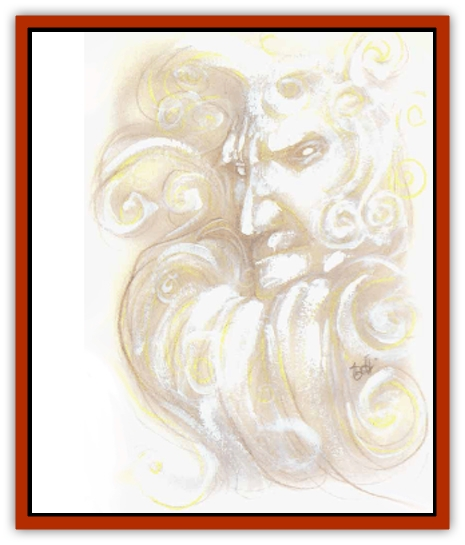

# Aasimon - Light

| Statistic | **Aasimon, Light** |
| --- | --- |
| **Activity Cycle:** | Any |
| **Alignment:** | Any good |
| **Armor Class:** | -10 |
| **Climate/Terrain:** | Upper Planes |
| **Damage/Attack:** | 1d12 |
| **Diet:** | None |
| **Frequency:** | Very rare |
| **Hit Dice:** | 10 |
| **Intelligence:** | Very (11-12) |
| **Magic Resistance:** | 50% |
| **Morale:** | Fearless (19-20) |
| **Movement:** | Fl 48 (A) |
| **No. Appearing:** | 1 |
| **No. of Attacks:** | 1 |
| **Organization:** | Solitary |
| **Size:** | S (variable composition) |
| **Special Attacks:** | See below |
| **Special Defenses:** | Spell immunity, +2 weapons to hit |
| **THAC0:** | 11 |
| **Treasure:** | Nil |
| **XP Value:** | 10,000 |

These energy creatures, swirling mists of light that shift shape constantly, are champions of good. Deep inside a light, rainbow colors change rapidly and randomly. Some reports imply that each good-aligned viewer sees in a light a memory of his finest moment in life, whereas evil viewers see the better life they might have led, had they made better choices long ago. These reports remain unconfirmed.

**Combat:** Lights are never surprised in combat and are damaged only by +2 or better magical weapons. Good- or neutral-aligned characters must save vs. paralyzation every round they attack a light; a failed save means they miss. In contact with an evil creature, a light's energy attack inflicts 1d12 points of damage per hit. This attack does not affect creatures of good alignment. Because the attack is energy, nonmagical protection is not considered when determining the Armor Class of a light's opponent; only the <q>pluses</q> of magical armor or other defenses offer protection, regardless of the opponent's alignment. For example, if a light attacks a man in *plate mail +3*, his effective Armor Class is 7 (for the +3) rather than the standard 10. *Bracers of defense, AC 4* would remain AC 4.

In addition to those common to all [[Aasimon_General_Information|aasimon]], lights also have the spell-like abilities *protection from evil* (always active), *dispel evil* (3 times per day), *continual light* (7 times per day), light, bless, and *hold person* (7 times per day). Lights are immune to all *charm*, *beguiling*, *geas*, *quest*, *sleep*, and other mind-affecting spells, trapping spells, and *death* magic.

Lights may only he destroyed on their home plane. If reduced to zero hit points elsewhere, they dissipate and reform on their home plane in one month.

**Habitat/Society:** Lights are created by the powers of the Upper Planes as familiars for good-aligned, high-level worshipers. On rare occasions they serve as companions on quests of limited duration.

To request the help of a light aasimon, an adventurer must fast for three days and nights, meditating in total solitude. When the fast ends, the adventurer then bathes in a tub of holy water. The bathing ritual over, the adventurer then casts the spell *find familiar* (or, in the case of nonwizards, has someone else cast it). If everything is done properly and the subject is worthy, there is a 10% chance (+1% per level above 12th) that the assistance is granted. Paladins about to place themselves at peril in the name of goodness sometimes call for the assistance of a light and, if successful, become a tremendous force against evil.

Less than 1,000 lights exist, and therefore one never stays with a master longer than a single mission. If the subject already has a familiar, the light never interferes with that relationship.

**Ecology:** Lights are pure energy and feed on energy from their plane of origin. Some even believe them to be the idea of good embodied in physical form.

---
## Discovery & Documentation

**Source Publication:** MC8 Outer Planes Appendix (1990)
**Campaign Setting:** Planescape
**Author(s):** Timothy B. Brown, Jamie LaFountain

### Other Creatures Found in This Source Book
   * [[Aasimon_Agathinon|Aasimon, Agathinon]]
   * [[Aasimon_Deva|Aasimon, Deva]]
   * [[Aasimon_General_Information|Aasimon, General Information]]
   * [[Aasimon_Planetar|Aasimon, Planetar]]
   * [[Aasimon_Solar|Aasimon, Solar]]
   * [[Air_Sentinel|Air Sentinel]]
   * [[Animal_Lord|Animal Lord]]
   * [[Archon|Archon]]
   * [[Baatezu_Lesser_Abishai|Baatezu, Lesser, Abishai]]
   * [[Baatezu_Greater_Amnizu|Baatezu, Greater, Amnizu]]
   * [[Baatezu_Lesser_Barbazu|Baatezu, Lesser, Barbazu]]
   * [[Baatezu_Greater_Cornugon|Baatezu, Greater, Cornugon]]
   * [[Baatezu_Lesser_Erinyes|Baatezu, Lesser, Erinyes]]
   * [[Baatezu_General_Information|Baatezu, General Information]]
   * [[Baatezu_Greater_Gelugon|Baatezu, Greater, Gelugon]]
   * [[Baatezu_Lesser_Hamatula|Baatezu, Lesser, Hamatula]]
   * [[Baatezu_Lemure|Baatezu, Lemure]]
   * [[Baatezu_Least_Nupperibo|Baatezu, Least, Nupperibo]]
   * [[Baatezu_Lesser_Osyluth|Baatezu, Lesser, Osyluth]]
   * [[Baatezu_Greater_Pit_Fiend|Baatezu, Greater, Pit Fiend]]
   * [[Baatezu_Least_Spinagon|Baatezu, Least, Spinagon]]
   * [[Balaena|Balaena]]
   * [[Bariaur|Bariaur]]
   * [[Bebilith|Bebilith]]
   * [[Bodak|Bodak]]
   * [[Dog_Moon|Dog, Moon]]
   * [[Dragon_Adamantite|Dragon, Adamantite]]
   * [[Einheriar|Einheriar]]
   * [[Gehreleth|Gehreleth]]
   * [[Githyanki|Githyanki]]
   * [[Githzerai|Githzerai]]
   * [[Hordling|Hordling]]
   * [[Lammasu_Celestial|Lammasu, Celestial]]
   * [[Larva|Larva]]
   * [[Maelephant|Maelephant]]
   * [[Marut|Marut]]
   * [[Mediator|Mediator]]
   * [[Mortai|Mortai]]
   * [[Night_Hag|Night Hag]]
   * [[Nightmare|Nightmare]]
   * [[Noctral|Noctral]]
   * [[Per|Per]]
   * [[Phoenix|Phoenix]]
   * [[Slaad|Slaad]]
   * [[Tanar'ri_Greater_Babau|Tanar'ri, Greater, Babau]]
   * [[Tanar'ri_Greater_Chasme|Tanar'ri, Greater, Chasme]]
   * [[Tanar'ri_Greater_Nabassu|Tanar'ri, Greater, Nabassu]]
   * [[Tanar'ri_Least_Dretch|Tanar'ri, Least, Dretch]]
   * [[Tanar'ri_Least_Manes|Tanar'ri, Least, Manes]]
   * [[Tanar'ri_Least_Rutterkin|Tanar'ri, Least, Rutterkin]]
   * [[Tanar'ri_Lesser_Alu-Fiend|Tanar'ri, Lesser, Alu-Fiend]]
   * [[Tanar'ri_Lesser_Bar-Lgura|Tanar'ri, Lesser, Bar-Lgura]]
   * [[Tanar'ri_Lesser_Cambion|Tanar'ri, Lesser, Cambion]]
   * [[Tanar'ri_Lesser_Succubus|Tanar'ri, Lesser, Succubus]]
   * [[Tanar'ri_Guardian_Molydeus|Tanar'ri, Guardian, Molydeus]]
   * [[Tanar'ri_General_Information|Tanar'ri, General Information]]
   * [[Tanar'ri_True_Balor|Tanar'ri, True, Balor]]
   * [[Tanar'ri_True_Glabrezu|Tanar'ri, True, Glabrezu]]
   * [[Tanar'ri_True_Hezrou|Tanar'ri, True, Hezrou]]
   * [[Tanar'ri_True_Marilith|Tanar'ri, True, Marilith]]
   * [[Tanar'ri_True_Nalfeshnee|Tanar'ri, True, Nalfeshnee]]
   * [[Tanar'ri_True_Vrock|Tanar'ri, True, Vrock]]
   * [[Titan|Titan]]
   * [[Translator|Translator]]
   * [[T'uen-rin|T'uen-rin]]
   * [[Vaporighu|Vaporighu]]
   * [[Warden_Beast|Warden Beast]]
   * [[Yugoloth_Greater_Arcanaloth|Yugoloth, Greater, Arcanaloth]]
   * [[Yugoloth_Lesser_Dergoloth|Yugoloth, Lesser, Dergoloth]]
   * [[Yugoloth_Lesser_Hydroloth|Yugoloth, Lesser, Hydroloth]]
   * [[Yugoloth_General_Information|Yugoloth, General Information]]
   * [[Yugoloth_Lesser_Mezzoloth|Yugoloth, Lesser, Mezzoloth]]
   * [[Yugoloth_Greater_Nycaloth|Yugoloth, Greater, Nycaloth]]
   * [[Yugoloth_Lesser_Piscoloth|Yugoloth, Lesser, Piscoloth]]
   * [[Yugoloth_Greater_Ultroloth|Yugoloth, Greater, Ultroloth]]
   * [[Yugoloth_Lesser_Yagnoloth|Yugoloth, Lesser, Yagnoloth]]
   * [[Zoveri|Zoveri]]
