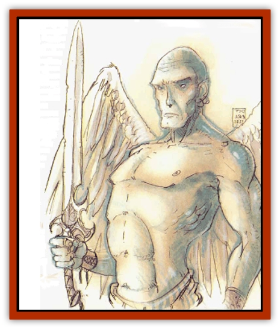

# Aasimon - Planetar

| Statistic | **Aasimon, Planetar** |
| --- | --- |
| **Activity Cycle:** | Any |
| **Alignment:** | Any good |
| **Armor Class:** | -7 |
| **Climate/Terrain:** | Upper Planes |
| **Damage/Attack:** | 1d10+10 (strength and magical bonus) |
| **Diet:** | Omnivore |
| **Frequency:** | Very rare |
| **Hit Dice:** | 14 |
| **Intelligence:** | Genius (17-18) |
| **Magic Resistance:** | 75% |
| **Morale:** | Fearless (19-20) |
| **Movement:** | 15, Fl 48 (B) |
| **No. Appearing:** | 1 |
| **No. of Attacks:** | 3 |
| **Organization:** | Solitary |
| **Size:** | L (8' tall) |
| **Special Attacks:** | Vorpal weapon + special |
| **Special Defenses:** | Never surprised, regeneration |
| **THAC0:** | 7 (+6 Strength and weapon bonus) |
| **Treasure:** | Nil |
| **XP Value:** | 20,000 |

Planetars are powerful spirits that directly serve the powers of the Upper Planes. They are tall, commanding humanoids who have smooth emerald skin, white feathered wings, hairless heads, and eyes of a penetrating blue. Their overall manner projects strength and confidence. They can communicate telepathically with any creature within a 100-foot range.

**Combat:** Planetars are never surprised. They automatically *detect illusions*.

Planetars carry a large two-handed sword that only their kind can wield. This huge weapon has all the power and severing abilities of a *vorpal sword*. Planetars attack with this sword three times per round. In addition to the sword's magical attack adjustment of +3, a planetar has a damage bonus of +7 due to Strength (19), giving a total of +6 attack adjustment and +10 damage.

Planetars have the spell ability of 7th-level priests (Wisdom equal to 21) with major access to all spheres. In addition to those common to [[Aasimon_General_Information|aasimon]], planetars may use the following spell-like abilities: *animate object*, *blade barrier* (3 times per day), *commune*, *control weather* (once per day), *cure blindness or deafness*, *cure disease*, *detect invisibility* (always active), *detect lie* (always active), detect snares &amp; pits (always active), *dispel magic*, *earthquake* (once per day), *feeblemind* (once per day), *fire storm* (once per day), *flame strike* (3 times per day), *heal*, *holy word* (once per day), *improved invisibility up to 10-foot radius*, *insect plague* (once per day), *limited wish* (once per day), *polymorph any object*, *protection from evil up to 10-foot radius* (always active), *raise dead* (3 times per day), *remove curse*, *remove fear*, *resist cold*, *restoration* (once per day), *shape change* (once per day), *speak with dead*, *symbol* (any, once per day), *true seeing* (always active), *weather summoning* (once per day), and *wind walk* (7 times per day).

Planetars take half damage from magical fire. They take full damage from acid attacks. All planetars are immune to attacks from nonmagical weapons and magical weapons of +3 or lesser enchantment. Planetars are not affected by cold, electrical, *magic missile*, petrification, poison, normal fire-based, or any gas attack spells. They are immune to life level loss and to *charm*, *confusion*, *death spell*, *domination*, and *feeblemind* spells. Their souls cannot be entrapped or imprisoned.

Planetars regenerate 4 hit points per round. Unless encountered on the upper Outer Planes, only the material form of a planetar can he harmed. Upon destruction, its life force returns to its home plane to become corporeal again; this process requires four decades.

**Habitat/Society:** Planetars aid only the most powerful mortal servants of good. As a rule, characters of at least 12th level on a mission directly related to a good power have a base 5% chance to gain the attention of a planetar, plus 1% per level above 12th. Modify this chance according to circumstances.

**Ecology:** Like all aasimon, planetars are corporeal good entities that exist outside any ecosystem.

---
## Discovery & Documentation

**Source Publication:** MC8 Outer Planes Appendix (1990)
**Campaign Setting:** Planescape
**Author(s):** Timothy B. Brown, Jamie LaFountain

### Other Creatures Found in This Source Book
   * [[Aasimon_Agathinon|Aasimon, Agathinon]]
   * [[Aasimon_Deva|Aasimon, Deva]]
   * [[Aasimon_Light|Aasimon, Light]]
   * [[Aasimon_General_Information|Aasimon, General Information]]
   * [[Aasimon_Solar|Aasimon, Solar]]
   * [[Air_Sentinel|Air Sentinel]]
   * [[Animal_Lord|Animal Lord]]
   * [[Archon|Archon]]
   * [[Baatezu_Lesser_Abishai|Baatezu, Lesser, Abishai]]
   * [[Baatezu_Greater_Amnizu|Baatezu, Greater, Amnizu]]
   * [[Baatezu_Lesser_Barbazu|Baatezu, Lesser, Barbazu]]
   * [[Baatezu_Greater_Cornugon|Baatezu, Greater, Cornugon]]
   * [[Baatezu_Lesser_Erinyes|Baatezu, Lesser, Erinyes]]
   * [[Baatezu_General_Information|Baatezu, General Information]]
   * [[Baatezu_Greater_Gelugon|Baatezu, Greater, Gelugon]]
   * [[Baatezu_Lesser_Hamatula|Baatezu, Lesser, Hamatula]]
   * [[Baatezu_Lemure|Baatezu, Lemure]]
   * [[Baatezu_Least_Nupperibo|Baatezu, Least, Nupperibo]]
   * [[Baatezu_Lesser_Osyluth|Baatezu, Lesser, Osyluth]]
   * [[Baatezu_Greater_Pit_Fiend|Baatezu, Greater, Pit Fiend]]
   * [[Baatezu_Least_Spinagon|Baatezu, Least, Spinagon]]
   * [[Balaena|Balaena]]
   * [[Bariaur|Bariaur]]
   * [[Bebilith|Bebilith]]
   * [[Bodak|Bodak]]
   * [[Dog_Moon|Dog, Moon]]
   * [[Dragon_Adamantite|Dragon, Adamantite]]
   * [[Einheriar|Einheriar]]
   * [[Gehreleth|Gehreleth]]
   * [[Githyanki|Githyanki]]
   * [[Githzerai|Githzerai]]
   * [[Hordling|Hordling]]
   * [[Lammasu_Celestial|Lammasu, Celestial]]
   * [[Larva|Larva]]
   * [[Maelephant|Maelephant]]
   * [[Marut|Marut]]
   * [[Mediator|Mediator]]
   * [[Mortai|Mortai]]
   * [[Night_Hag|Night Hag]]
   * [[Nightmare|Nightmare]]
   * [[Noctral|Noctral]]
   * [[Per|Per]]
   * [[Phoenix|Phoenix]]
   * [[Slaad|Slaad]]
   * [[Tanar'ri_Greater_Babau|Tanar'ri, Greater, Babau]]
   * [[Tanar'ri_Greater_Chasme|Tanar'ri, Greater, Chasme]]
   * [[Tanar'ri_Greater_Nabassu|Tanar'ri, Greater, Nabassu]]
   * [[Tanar'ri_Least_Dretch|Tanar'ri, Least, Dretch]]
   * [[Tanar'ri_Least_Manes|Tanar'ri, Least, Manes]]
   * [[Tanar'ri_Least_Rutterkin|Tanar'ri, Least, Rutterkin]]
   * [[Tanar'ri_Lesser_Alu-Fiend|Tanar'ri, Lesser, Alu-Fiend]]
   * [[Tanar'ri_Lesser_Bar-Lgura|Tanar'ri, Lesser, Bar-Lgura]]
   * [[Tanar'ri_Lesser_Cambion|Tanar'ri, Lesser, Cambion]]
   * [[Tanar'ri_Lesser_Succubus|Tanar'ri, Lesser, Succubus]]
   * [[Tanar'ri_Guardian_Molydeus|Tanar'ri, Guardian, Molydeus]]
   * [[Tanar'ri_General_Information|Tanar'ri, General Information]]
   * [[Tanar'ri_True_Balor|Tanar'ri, True, Balor]]
   * [[Tanar'ri_True_Glabrezu|Tanar'ri, True, Glabrezu]]
   * [[Tanar'ri_True_Hezrou|Tanar'ri, True, Hezrou]]
   * [[Tanar'ri_True_Marilith|Tanar'ri, True, Marilith]]
   * [[Tanar'ri_True_Nalfeshnee|Tanar'ri, True, Nalfeshnee]]
   * [[Tanar'ri_True_Vrock|Tanar'ri, True, Vrock]]
   * [[Titan|Titan]]
   * [[Translator|Translator]]
   * [[T'uen-rin|T'uen-rin]]
   * [[Vaporighu|Vaporighu]]
   * [[Warden_Beast|Warden Beast]]
   * [[Yugoloth_Greater_Arcanaloth|Yugoloth, Greater, Arcanaloth]]
   * [[Yugoloth_Lesser_Dergoloth|Yugoloth, Lesser, Dergoloth]]
   * [[Yugoloth_Lesser_Hydroloth|Yugoloth, Lesser, Hydroloth]]
   * [[Yugoloth_General_Information|Yugoloth, General Information]]
   * [[Yugoloth_Lesser_Mezzoloth|Yugoloth, Lesser, Mezzoloth]]
   * [[Yugoloth_Greater_Nycaloth|Yugoloth, Greater, Nycaloth]]
   * [[Yugoloth_Lesser_Piscoloth|Yugoloth, Lesser, Piscoloth]]
   * [[Yugoloth_Greater_Ultroloth|Yugoloth, Greater, Ultroloth]]
   * [[Yugoloth_Lesser_Yagnoloth|Yugoloth, Lesser, Yagnoloth]]
   * [[Zoveri|Zoveri]]
