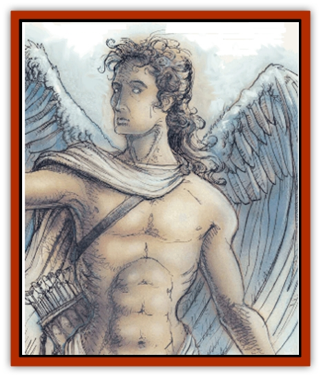

# Aasimon - Solar

| Statistic | **Aasimon, Solar** |
| --- | --- |
| **Activity Cycle:** | Any |
| **Alignment:** | Any good |
| **Armor Class:** | -10 |
| **Climate/Terrain:** | Upper Planes |
| **Damage/Attack:** | 2d20+16 |
| **Diet:** | Omnivore |
| **Frequency:** | Very rare |
| **Hit Dice:** | 22 (177 hp) |
| **Intelligence:** | Supra-genius (19-20) |
| **Magic Resistance:** | 85% |
| **Morale:** | Fearless (19-20) |
| **Movement:** | 18, Fl 48 (B) |
| **No. Appearing:** | 1 |
| **No. of Attacks:** | 4 |
| **Organization:** | Solitary |
| **Size:** | L (9' tall) |
| **Special Attacks:** | Vorpal severing, arrows of slaying |
| **Special Defenses:** | See below |
| **THAC0:** | 5 (+5 weapon bonus) |
| **Treasure:** | Nil |
| **XP Value:** | 32,000 |

Solars are the most powerful [[Aasimon_General_Information|aasimon]] and the greatest celestial stewards. They appear as large humans who have beautiful muscular bodies, white wings, and brilliant topaz eyes. Their skin and hair take on metallic coloration. A solar's voice is deep and commanding, impossible to ignore, and their Charisma is 24.

**Combat:** Solars are never surprised and are immune to attacks from nonmagical weapons and magical weapons of +4 or lesser enchantment, to energy-level loss from undead or magic, and to *charm*, *confusion*, *death spell*, *domination*, *feeblemind*, *hold*, *imprisonment*, and *trap the soul* spells.

Each solar can cast a *protection from evil* spell wirh a 70-foot radius at will. This sphere also serves as *protection from normal missiles* and a *minor globe of invulnerability* if the solar desires. Solars can use any *detect* spell at will. When laying hands on a creature, a solar can bestow the ability to survive in any environment for up to 100 years.

Lawful-good solars can summon 1 to 2 [[Ki-rin|ki-rins]]; neutral good solars can summon 1 to 2 [[Phoenix|phoenix]]; and chaotic good solars can summon 1 to 2 greater [[Titan|titans]]. Solars can perform the summoning three times per day with a 75% chance of success per summons.

Solars are not affected by cold, electrical, magic missile, petrification, poison, or any gas attack. They take no damage from acid attacks. They regenerate 7 hit points per melee round. Unless it is on its home plane, only the material form of a solar can be destroyed. Its spirit requires seven decades to reform.

Each solar attacks four times per ropund wirh a sword that only it can wield. The weapon acts as a *sword +5* (2d20 points of damage) and has all the properties of a *sword of dancing* and a *vorpal sword*.

Solars also use an enormous composite bow with a magical quiver that produces any *arrow of slaying* the solar desires. Each bow attack has a +2 attack adjustment and slays any target it hits.

A solar has spells as a 15th-level priest with major access to all spheres. In addition to the powers common to aasimon, solars have the following spell-like powers: *animate object* (3 times per day), *antipathy/sympathy* (3 times per day), *astral spell* (once per day), *commune*, *confusion* (3 times per day), *control weather*, *creeping doom* (once per day), *dispel evil*, *dispel magic*, *Drawmij's instant summons*, *earthquake* (3 times per day), *finger of death* (once per day), *fire storm* (once per day), *heal*, *holy word* (3 times per day), *imprisonment* (once per day), *improved invisibility*, *infravision* (240 feet, always active), *mass charm* (3 times per day), *permanency* (3 times per day), *polymorph any object or self* (once per day), *power word* (any variety, once per day), *prismatic spray* (once per day), *restoration* (once per day), *resurrection* (3 times per day), *shape change* (3 times per day), *symbol* (any variety, 3 times per day), *vanish* (3 times per day), *vision* (once per day), *wind walk* (7 times per day), and *wish* (once per day).

**Habitat/Society:** Solars are absolutely the most powerful servants of the good deities of the Upper Planes.

**Ecology:** Solars are mighty enough to be deities themselves, but they choose to serve rather than have worshipers.

---
## Discovery & Documentation

**Source Publication:** MC8 Outer Planes Appendix (1990)
**Campaign Setting:** Planescape
**Author(s):** Timothy B. Brown, Jamie LaFountain

### Other Creatures Found in This Source Book
   * [[Aasimon_Agathinon|Aasimon, Agathinon]]
   * [[Aasimon_Deva|Aasimon, Deva]]
   * [[Aasimon_Light|Aasimon, Light]]
   * [[Aasimon_General_Information|Aasimon, General Information]]
   * [[Aasimon_Planetar|Aasimon, Planetar]]
   * [[Air_Sentinel|Air Sentinel]]
   * [[Animal_Lord|Animal Lord]]
   * [[Archon|Archon]]
   * [[Baatezu_Lesser_Abishai|Baatezu, Lesser, Abishai]]
   * [[Baatezu_Greater_Amnizu|Baatezu, Greater, Amnizu]]
   * [[Baatezu_Lesser_Barbazu|Baatezu, Lesser, Barbazu]]
   * [[Baatezu_Greater_Cornugon|Baatezu, Greater, Cornugon]]
   * [[Baatezu_Lesser_Erinyes|Baatezu, Lesser, Erinyes]]
   * [[Baatezu_General_Information|Baatezu, General Information]]
   * [[Baatezu_Greater_Gelugon|Baatezu, Greater, Gelugon]]
   * [[Baatezu_Lesser_Hamatula|Baatezu, Lesser, Hamatula]]
   * [[Baatezu_Lemure|Baatezu, Lemure]]
   * [[Baatezu_Least_Nupperibo|Baatezu, Least, Nupperibo]]
   * [[Baatezu_Lesser_Osyluth|Baatezu, Lesser, Osyluth]]
   * [[Baatezu_Greater_Pit_Fiend|Baatezu, Greater, Pit Fiend]]
   * [[Baatezu_Least_Spinagon|Baatezu, Least, Spinagon]]
   * [[Balaena|Balaena]]
   * [[Bariaur|Bariaur]]
   * [[Bebilith|Bebilith]]
   * [[Bodak|Bodak]]
   * [[Dog_Moon|Dog, Moon]]
   * [[Dragon_Adamantite|Dragon, Adamantite]]
   * [[Einheriar|Einheriar]]
   * [[Gehreleth|Gehreleth]]
   * [[Githyanki|Githyanki]]
   * [[Githzerai|Githzerai]]
   * [[Hordling|Hordling]]
   * [[Lammasu_Celestial|Lammasu, Celestial]]
   * [[Larva|Larva]]
   * [[Maelephant|Maelephant]]
   * [[Marut|Marut]]
   * [[Mediator|Mediator]]
   * [[Mortai|Mortai]]
   * [[Night_Hag|Night Hag]]
   * [[Nightmare|Nightmare]]
   * [[Noctral|Noctral]]
   * [[Per|Per]]
   * [[Phoenix|Phoenix]]
   * [[Slaad|Slaad]]
   * [[Tanar'ri_Greater_Babau|Tanar'ri, Greater, Babau]]
   * [[Tanar'ri_Greater_Chasme|Tanar'ri, Greater, Chasme]]
   * [[Tanar'ri_Greater_Nabassu|Tanar'ri, Greater, Nabassu]]
   * [[Tanar'ri_Least_Dretch|Tanar'ri, Least, Dretch]]
   * [[Tanar'ri_Least_Manes|Tanar'ri, Least, Manes]]
   * [[Tanar'ri_Least_Rutterkin|Tanar'ri, Least, Rutterkin]]
   * [[Tanar'ri_Lesser_Alu-Fiend|Tanar'ri, Lesser, Alu-Fiend]]
   * [[Tanar'ri_Lesser_Bar-Lgura|Tanar'ri, Lesser, Bar-Lgura]]
   * [[Tanar'ri_Lesser_Cambion|Tanar'ri, Lesser, Cambion]]
   * [[Tanar'ri_Lesser_Succubus|Tanar'ri, Lesser, Succubus]]
   * [[Tanar'ri_Guardian_Molydeus|Tanar'ri, Guardian, Molydeus]]
   * [[Tanar'ri_General_Information|Tanar'ri, General Information]]
   * [[Tanar'ri_True_Balor|Tanar'ri, True, Balor]]
   * [[Tanar'ri_True_Glabrezu|Tanar'ri, True, Glabrezu]]
   * [[Tanar'ri_True_Hezrou|Tanar'ri, True, Hezrou]]
   * [[Tanar'ri_True_Marilith|Tanar'ri, True, Marilith]]
   * [[Tanar'ri_True_Nalfeshnee|Tanar'ri, True, Nalfeshnee]]
   * [[Tanar'ri_True_Vrock|Tanar'ri, True, Vrock]]
   * [[Titan|Titan]]
   * [[Translator|Translator]]
   * [[T'uen-rin|T'uen-rin]]
   * [[Vaporighu|Vaporighu]]
   * [[Warden_Beast|Warden Beast]]
   * [[Yugoloth_Greater_Arcanaloth|Yugoloth, Greater, Arcanaloth]]
   * [[Yugoloth_Lesser_Dergoloth|Yugoloth, Lesser, Dergoloth]]
   * [[Yugoloth_Lesser_Hydroloth|Yugoloth, Lesser, Hydroloth]]
   * [[Yugoloth_General_Information|Yugoloth, General Information]]
   * [[Yugoloth_Lesser_Mezzoloth|Yugoloth, Lesser, Mezzoloth]]
   * [[Yugoloth_Greater_Nycaloth|Yugoloth, Greater, Nycaloth]]
   * [[Yugoloth_Lesser_Piscoloth|Yugoloth, Lesser, Piscoloth]]
   * [[Yugoloth_Greater_Ultroloth|Yugoloth, Greater, Ultroloth]]
   * [[Yugoloth_Lesser_Yagnoloth|Yugoloth, Lesser, Yagnoloth]]
   * [[Zoveri|Zoveri]]
