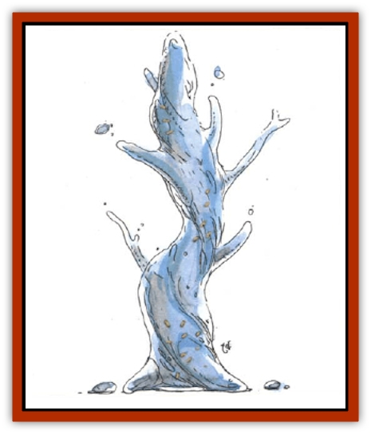

# Aballin

| Statistic | **Aballin** |
| --- | --- |
| **Activity Cycle:** | Any |
| **Alignment:** | Neutral |
| **Armor Class:** | 4 |
| **Climate/Terrain:** | Temperate or tropical/wilderness or subterranean |
| **Damage/Attack:** | See below |
| **Diet:** | Omnivore |
| **Frequency:** | Uncommon |
| **Hit Dice:** | 3 |
| **Intelligence:** | Average (8-10) |
| **Magic Resistance:** | Nil |
| **Morale:** | Elite (13-14) |
| **Movement:** | 6, Sw 15 |
| **No. Appearing:** | 1d4 |
| **No. of Attacks:** | 1 |
| **Organization:** | Solitary |
| **Size:** | L (10' tall) |
| **Special Attacks:** | Drowning |
| **Special Defenses:** | See below |
| **THAC0:** | 17 |
| **Treasure:** | 1 |
| **XP Value:** | 270 |

Also known as *living water*, aballins are fluid monsters that entrap and drown creatures who venture within their reach.

In their passive state, aballins give the appearance of large puddles of seemingly normal water, devoid of fish or other living creatures. Those looking down at the aballin often notice coins, jewelry, or other metal effects of the monster's past victims resting beneath the surface of the water, apparently awaiting recovery. Though they resemble an [[Elemental_Fire_Water|elemental creature of Water]], aballins are actually comprised of a weak acid which, over the course of three weeks, digests organic matter, leaving behind items made of metal. (Because of this, spells such as *water breathing* offer no help in surviving the effect of drowning in their fluids.)

Aballins have no language abilities.

**Combat:** In its passive state, the aballin is indistinguishable from fresh water, and it cannot be harmed by attacks that would otherwise prove harmless to that element. So unthreatening an appearance often results in prey attempting to take a refreshing drink from one, trying to move through the monster or reaching in to recover tempting valuables. Any of these actions rouse the aballin, and the creature instantly alters its molecular structure into a gelatinous pseudopod, which lashes out and tries to envelop its victim. If its attack roll succeeds, a man-sized or smaller creature is drawn in and begins to drown (see <q>Holding Your Breath</q> in the *Player's Handbook* for the effects of drowning).

While in this gelatinous state, the aballin is susceptible to attack by blunt weapons of +1 or greater enchantment. Edged weapons have no effect whatsoever, and pose a 25% risk of striking any person trapped within the aballin's amoeboid form. Those within the form may attack, but cannot escape the suffocation attack or use items requiring normal speech (such as spells). An aballin attacks only one individual at a time. The aballin is immune to fire, cold, electricity, poison, and paralysis. A *transmute water to dust* spell forces an aballin to make a saving throw vs. death magic; if it fails, the creature perishes. A *lower water* spell requires the creature to make a successful save vs. spell or release its victim immediately.

Aballins have no eyes, but keep track of their victims through scent and vibration. Hence, they are immune to all spells or attacks that alter vision or affect the subject through vision, including *blindness*, *blur*, *color spray*, *fire charm*, *hypnotic patterns*, *invisibility*, *most illusions*, and many other spells.

**Habitat/Society:** While sometimes seen masquerading as a puddle, small pond, fountain, or even a drainage ditch, an aballin is most often encountered in damps cavernous areas with an abundance of water, which permit it to blend with its surroundings. While in the element of water, the monster is naturally invisible, so it prefers to rest within the shelter of pools or oher small bodies of water.

The aballin traverses lakes, rivers, or streams in search of food. It may also move slowly upon land by oozing or by laboriously extending its gelatinous pseudopods and aching forward, much like a slug. (In fact, like the slug, the aballin leaves a faintly discernible slimy trail when traveling upon land.) Due to its semiliquid composition, the creature is incapable of ascending surfaces with a slope greater than 30 degrees.

Aballins are encountered singly or in families of up to four. Mated pairs may function as a single entity, with doubled size and Hit Dice, particullarly if there are young present.

**Ecology:** These monsters can prove useful in keeping down the population: of other harmful creatures or plants that might be found in or near water. They also function as scavenders, digesting remains that they happen upon in their travels.

---
## Discovery & Documentation

**Source Publication:** MC14 Fiend Folio Appendix (1992)
**Campaign Setting:** Fiends Folio
**Author(s):** Don Bingle, John Terra, Wes Nicholson, Tim Beach, Steve Hardinger, Kris Hardinger, Rob Nicholls, Greg Swedberg, Al Boyce, Vince Garcia, Norm Ritchie

### Other Creatures Found in This Source Book
   * [[Achaierai|Achaierai]]
   * [[Adherer|Adherer]]
   * [[Algoid|Algoid]]
   * [[Al-Mi'raj|Al-Mi'raj]]
   * [[Apparition|Apparition]]
   * [[Caterwaul|Caterwaul]]
   * [[Coffer_Corpse|Coffer Corpse]]
   * [[Crabman|Crabman]]
   * [[Dark_Creeper|Dark Creeper]]
   * [[Dark_Stalker|Dark Stalker]]
   * [[Darter|Darter]]
   * [[Denzelian|Denzelian]]
   * [[Dune_Stalker|Dune Stalker]]
   * [[Dwarf_Urdunnir|Dwarf, Urdunnir]]
   * [[Falcon_Fire|Falcon, Fire]]
   * [[Faux_Faerie|Faux Faerie]]
   * [[Flawder|Flawder]]
   * [[Fyrefly|Fyrefly]]
   * [[Gambado|Gambado]]
   * [[Garbug|Garbug]]
   * [[Giant_Fhoimorien|Giant, Fhoimorien]]
   * [[Gibberling|Gibberling]]
   * [[Gorbel|Gorbel]]
   * [[Grimlock|Grimlock]]
   * [[Hellcat|Hellcat]]
   * [[Ice_Lizard|Ice Lizard]]
   * [[Iron_Cobra|Iron Cobra]]
   * [[Khargra|Khargra]]
   * [[Mantari|Mantari]]
   * [[Penanggalan|Penanggalan]]
   * [[Pernicon|Pernicon]]
   * [[Phantom_Stalker|Phantom Stalker]]
   * [[Retriever|Retriever]]
   * [[Ruve|Ruve]]
   * [[Scathe|Scathe]]
   * [[Sheet_Ghoul_Sheet_Phantom|Sheet Ghoul/Sheet Phantom]]
   * [[Shocker|Shocker]]
   * [[Spanner|Spanner]]
   * [[Stwinger|Stwinger]]
   * [[Sussurus|Sussurus]]
   * [[Symbiotic_Jelly|Symbiotic Jelly]]
   * [[Terithran|Terithran]]
   * [[Thunder_Children|Thunder Children]]
   * [[Troll_Ice|Troll, Ice]]
   * [[Tween|Tween]]
   * [[Umpleby|Umpleby]]
   * [[Volt|Volt]]
   * [[Xill|Xill]]
   * [[Xvart|Xvart]]
   * [[Zygraat|Zygraat]]
