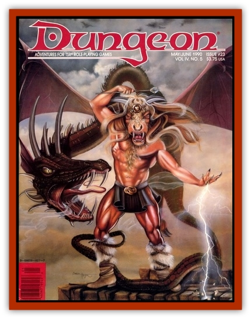

# Abhir

| Statistic | **Abhir** |
| --- | --- |
| **Activity Cycle:** | Any |
| **Alignment:** | Chaotic evil |
| **Armor Class:** | -7/-5 |
| **Climate/Terrain:** | Any/Land |
| **Damage/Attack:** | 2-8 (constriction) and by weapon type (&times;6) |
| **Diet:** | Carnivore |
| **Frequency:** | Rare |
| **Hit Dice:** | 7+7 |
| **Intelligence:** | High (13-14) |
| **Magic Resistance:** | 50% |
| **Morale:** | Champion (15) |
| **Movement:** | 12 |
| **No. Appearing:** | 13 or 14 |
| **No. of Attacks:** | 7 |
| **Organization:** | Small group or solitary |
| **Size:** | L (7' tall, 30' long) |
| **Special Attacks:** | See below |
| **Special Defenses:** | +1 or better weapon to hit |
| **THAC0:** | 13 |
| **Treasure:** | G |
| **XP Value:** | 10.000 (includes use of magical weapons) |

This wicked denizen of the outer planes has a multiarmed female torso atop the body of a great [[Snake|snake]]. When uncoiled, she can stand taller than a large man. Each of the abhir's six arms can wield a weapon (favored weapons are magical swords and battle axes). This monster can constrict her victim with her snakey tail, and can cause magical darkness in a 5' radius. She has infravision and other extraordinary abilities, any one of which can be used once per round: *charm person*, *teleport*, *levitate* (as an 11th-level wizard), *read languages*, *detect invisibility*, *pyrotechnics*, *polymorph self*, *project image*. The abhir can *gate* in another abhir with a 50% chance of success.

Abhirs desire the sacrifice of strong warriors, and they are constantly looking for ways to do evil deeds in service of their lords. Lower-level denizens of the outer planes greatly fear the domineering and cruel abhirs.

---
## Discovery & Documentation

**Source Publication:** Dungeon #23 (1990)
**Campaign Setting:** Dungeon Magazine
**Author(s):**
