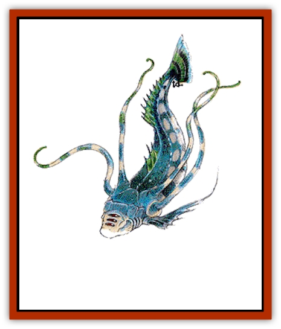

# Aboleth

| Statistic | **Aboleth** |
| --- | --- |
| **Activity Cycle:** | Night |
| **Alignment:** | Lawful evil |
| **Armor Class:** | 4 |
| **Climate/Terrain:** | Tropical and temperate/Subterranean |
| **Damage/Attack:** | 1-6 (&times;4) |
| **Diet:** | Omnivore |
| **Frequency:** | Very rare |
| **Hit Dice:** | 8 |
| **Intelligence:** | High (13-14) |
| **Magic Resistance:** | Nil |
| **Morale:** | Elite (13) |
| **Movement:** | 3, Sw 18 |
| **No. Appearing:** | 1d4 |
| **No. of Attacks:** | 4 |
| **Organization:** | Brood |
| **Size:** | H (20' long) |
| **Special Attacks:** | See below |
| **Special Defenses:** | Slime |
| **THAC0:** | 13 |
| **Treasure:** | F |
| **XP Value:** | 5,000 |

**Psionics Summary**

| Level | Dis/Sci/Dev | Attack/Defense | Score | PSPs |
| --- | --- | --- | --- | --- |
| 8 | 3/5/16 | EW,II,PsC,+1/TS,IF,TW | = Int | 250 |

**Telepathy -** *Sciences:* mind link, mass domination; *Devotion:* false sensory input.

The aboleth is a loathsome amphibious creature that lives in subterranean caves and lakes. It despises most land-dwelling creatures and seeks to enslave intelligent surface beings. It is as cruel as it is intelligent.

An aboleth resembles a plump [[Fish|fish]], 20 feet in length from its bulbous head to its fluke-like tail. Its body is blue-green with gray splotches, and its pink-tan underbelly conceals a toothless, rubbery mouth. Three slit-like eyes, purple-red in color and protected by bony ridges, are set one atop the other in the front of its head. Four pulsating blue-black orifices line the bottom of its body and secrete gray slime that smells like rancid grease. Four leathery tentacles, each 10 feet in length, grow from its head. An aboleth uses its tail to propel itself through the water and its tentacles to drag itself along dry land.

**Combat:** The aboleth attacks with its tentacles for 1d6 points of damage each. If a victim struck by a tentacle fails a saving throw vs. spell, the victim's skin transforms into a clear, slimy membrane in 1d4+1 rounds. If this occurs, the victim must keep the membrane damp with cool water or suffer 1d12 points of damage each turn. *Cure disease* cast upon the victim before the membrane completely forms stops the transformation. Otherwise, *cure serious wounds* will cause the membrane to revert to normal skin. 

Because its sluggish movement makes attacks difficult, the aboleth attempts to lure victims close by creating realistic illusions at will, complete with audible, olfactory, and other sensory components. The aboleth can attempt to enslave creatures within 30 feet; it can make three attempts per day, one creature per attempt. If the victim fails a saving throw vs. spell, he follows all of the aboleth's telepathic commands, although the victim will not fight on the aboleth's behalf. The enslavement can be negated by *remove curse*, *dispel magic,* the death of the enslaving aboleth, or, if the victim is separated from the aboleth by more than a mile, a new saving throw (one attempt per day.)

When underwater, an aboleth surrounds itself with a mucous cloud 1 foot thick. A victim in contact with the cloud and inhaling the mucus must roll a successful saving throw vs. poison or lose the ability to breathe air. The victim is then able to breathe water, as if having consumed a *potion of water breathing*, for 1-3 hours. This ability may be renewed by additional contact with the mucous cloud. An affected victim attempting to breathe air will suffocate in 2d6 rounds. Wine or soap dissolves the mucus.

**Habitat/Society:** An aboleth brood consists of a parent and one to three offspring. Though the offspring are as large and as strong as the parent, they defer to the parent in all matters and obey it implicitly. 

Aboleth have both male and female sexual organs. A mature aboleth reproduces once every five years by concealing itself in a cavern or other remote area, then laying a single egg and covering it in slime. The parent aboleth guards the egg while the embryo grows and develops, a process that takes about five years. A newborn aboleth takes about 10 years to mature.

The aboleth spends most of its time searching for slaves, preferably human ones. It is rumored that the aboleth use their slaves to construct huge underwater cities, though none have ever been found. The aboleth are rumored to know ancient, horrible secrets that predate the existence of man, but these rumors are also unsubstantiated. There is no doubt that aboleth retain a staggering amount of knowledge. An offspring acquires all of its parent's knowledge at birth, and a mature aboleth acquires the knowledge of any intelligent being it consumes.

An aboleth's treasure consists of items taken from its slaves. The items are buried in caverns under a layer of slime resembling gray mud, recognizable by the distinctive rancid grease odor.

**Ecology:** The omnivorous aboleth will eat any organic matter, usually algae and micro-organisms, but they are also fond of intelligent prey so they can absorb nutrients and information at the same time. Aboleth have no natural enemies, as even the mightiest marine creatures give them a wide berth. Aboleth slime is sometimes used as a component for *potions of water breathing*.

---
## Discovery & Documentation

**Source Publication:** Monstrous Manual (1995)
**Campaign Setting:** Advanced Dungeons & Dragons 2nd Edition
**Author(s):** Tim Beach

### Other Creatures Found in This Source Book
   * [[Aarakocra|Aarakocra]]
   * [[Ankheg|Ankheg]]
   * [[Arcane|Arcane]]
   * [[Argos|Argos]]
   * [[Aurumvorax|Aurumvorax]]
   * [[Baatezu_Lesser_Abishai|Baatezu, Lesser, Abishai]]
   * [[Baatezu_General_Information|Baatezu, General Information]]
   * [[Baatezu_Greater_Pit_Fiend|Baatezu, Greater, Pit Fiend]]
   * [[Banshee|Banshee]]
   * [[Basilisk|Basilisk]]
   * [[Bat|Bat]]
   * [[Bear|Bear]]
   * [[Beetle_Giant|Beetle, Giant]]
   * [[Behir|Behir]]
   * [[Beholder_and_Beholder-kin_I|Beholder and Beholder-kin I]]
   * [[Beholder_and_Beholder-kin_II|Beholder and Beholder-kin II]]
   * [[Bird|Bird]]
   * [[Brain_Mole|Brain Mole]]
   * [[Broken_One|Broken One]]
   * [[Brownie|Brownie]]
   * [[Bugbear|Bugbear]]
   * [[Bulette|Bulette]]
   * [[Bullywug|Bullywug]]
   * [[Carrion_Crawler|Carrion Crawler]]
   * [[Cat_Great|Cat, Great]]
   * [[Catoblepas|Catoblepas]]
   * [[Cat_Small|Cat, Small]]
   * [[Cave_Fisher|Cave Fisher]]
   * [[Centaur|Centaur]]
   * [[Centipede|Centipede]]
   * [[Chimera|Chimera]]
   * [[Cloaker|Cloaker]]
   * [[Cockatrice|Cockatrice]]
   * [[Couatl|Couatl]]
   * [[Crabman|Crabman]]
   * [[Crawling_Claw|Crawling Claw]]
   * [[Crocodile|Crocodile]]
   * [[Crustacean_Giant|Crustacean, Giant]]
   * [[Crypt_Thing|Crypt Thing]]
   * [[Death_Knight|Death Knight]]
   * [[Deepspawn|Deepspawn]]
   * [[Dinosaur_I|Dinosaur I]]
   * [[Displacer_Beast|Displacer Beast]]
   * [[Dog|Dog]]
   * [[Dog_Moon|Dog, Moon]]
   * [[Dolphin|Dolphin]]
   * [[Doppelganger|Doppelganger]]
   * [[Dracolich|Dracolich]]
   * [[Dragon_Brown|Dragon, Brown]]
   * [[Dragon_Chromatic_Black|Dragon, Chromatic, Black]]
   * [[Dragon_Chromatic_Blue|Dragon, Chromatic, Blue]]
   * [[Dragon_Chromatic_Green|Dragon, Chromatic, Green]]
   * [[Dragon_Cloud|Dragon, Cloud]]
   * [[Dragon_Chromatic_Red|Dragon, Chromatic, Red]]
   * [[Dragon_Chromatic_White|Dragon, Chromatic, White]]
   * [[Dragon_Deep|Dragon, Deep]]
   * [[Dragon_Gem_Amethyst|Dragon, Gem, Amethyst]]
   * [[Dragon_Gem_Crystal|Dragon, Gem, Crystal]]
   * [[Dragon_Gem_Emerald|Dragon, Gem, Emerald]]
   * [[Dragon_Gem_Sapphire|Dragon, Gem, Sapphire]]
   * [[Dragon_Gem_Topaz|Dragon, Gem, Topaz]]
   * [[Dragon_Metallic_Brass|Dragon, Metallic, Brass]]
   * [[Dragon_Metallic_Bronze|Dragon, Metallic, Bronze]]
   * [[Dragon_Metallic_Copper|Dragon, Metallic, Copper]]
   * [[Dragon_Mercury|Dragon, Mercury]]
   * [[Dragon_Metallic_Gold|Dragon, Metallic, Gold]]
   * [[Dragon_Mist|Dragon, Mist]]
   * [[Dragon_Metallic_Silver|Dragon, Metallic, Silver]]
   * [[Dragon_General_Information|Dragon, General Information]]
   * [[Dragon_Shadow|Dragon, Shadow]]
   * [[Dragon_Steel|Dragon, Steel]]
   * [[Dragon_Yellow|Dragon, Yellow]]
   * [[Dragonne|Dragonne]]
   * [[Dragon_Turtle|Dragon Turtle]]
   * [[Dragonet_Faerie_Dragon|Dragonet, Faerie Dragon]]
   * [[Dragonet_Fire_Drake|Dragonet, Fire Drake]]
   * [[Dragonet_Pseudodragon|Dragonet, Pseudodragon]]
   * [[Dryad|Dryad]]
   * [[Dwarf_Derro|Dwarf, Derro]]
   * [[Dwarf|Dwarf]]
   * [[Elemental_Athas_General_Information|Elemental (Athas), General Information]]
   * [[Elemental_Air_Kin|Elemental, Air Kin]]
   * [[Elemental_Earth_Kin|Elemental, Earth Kin]]
   * [[Elemental_Fire_Kin|Elemental, Fire Kin]]
   * [[Elemental_Water_Kin|Elemental, Water Kin]]
   * [[Elemental_of_Chaos_Air_Earth|Elemental of Chaos, Air/Earth]]
   * [[Elemental_of_Chaos_Fire_Water|Elemental of Chaos, Fire/Water]]
   * [[Elemental_Composite|Elemental, Composite]]
   * [[Elemental_Air_Earth|Elemental, Air/Earth]]
   * [[Elemental_Fire_Water|Elemental, Fire/Water]]
   * [[Elemental_General_Information|Elemental, General Information]]
   * [[Elephant|Elephant]]
   * [[Elf|Elf]]
   * [[Elf_Aquatic|Elf, Aquatic]]
   * [[Elf_Drow|Elf, Drow]]
   * [[Ettercap|Ettercap]]
   * [[Eyewing|Eyewing]]
   * [[Feyr|Feyr]]
   * [[Fish|Fish]]
   * [[Frog|Frog]]
   * [[Fungus|Fungus]]
   * [[Galeb_Duhr|Galeb Duhr]]
   * [[Gargantua|Gargantua]]
   * [[Gargoyle_I|Gargoyle I]]
   * [[Genie|Genie]]
   * [[Ghost|Ghost]]
   * [[Ghoul|Ghoul]]
   * [[Giant_Cloud|Giant, Cloud]]
   * [[Giant_Cyclops|Giant, Cyclops]]
   * [[Giant_Desert|Giant, Desert]]
   * [[Giant_Ettin|Giant, Ettin]]
   * [[Giant_Firbolg|Giant, Firbolg]]
   * [[Giant_Fire|Giant, Fire]]
   * [[Giant_Fog|Giant, Fog]]
   * [[Giant_Fomorian|Giant, Fomorian]]
   * [[Giant_Frost|Giant, Frost]]
   * [[Giant_Hill|Giant, Hill]]
   * [[Giant_Jungle|Giant, Jungle]]
   * [[Giant_Mountain|Giant, Mountain]]
   * [[Giant_Reef|Giant, Reef]]
   * [[Giant_Stone|Giant, Stone]]
   * [[Giant_Storm|Giant, Storm]]
   * [[Giant_Verbeeg|Giant, Verbeeg]]
   * [[Giant_Wood|Giant, Wood]]
   * [[Gibberling|Gibberling]]
   * [[Giff|Giff]]
   * [[Gith|Gith]]
   * [[Gith_Pirate_of|Gith, Pirate of]]
   * [[Githyanki|Githyanki]]
   * [[Githzerai|Githzerai]]
   * [[Gloomwing|Gloomwing]]
   * [[Gnoll|Gnoll]]
   * [[Gnome|Gnome]]
   * [[Gnome_Spriggan|Gnome, Spriggan]]
   * [[Goblin|Goblin]]
   * [[Golem_General_Information|Golem, General Information]]
   * [[Golem_I_Greater_Golem|Golem I (Greater Golem)]]
   * [[Golem_II_Lesser_Golem|Golem II (Lesser Golem)]]
   * [[Golem_III|Golem III]]
   * [[Golem_IV|Golem IV]]
   * [[Golem_V|Golem V]]
   * [[Golem_VI_Stone_Variants|Golem VI (Stone Variants)]]
   * [[Gorgon|Gorgon]]
   * [[Grell_Colonial|Grell, Colonial]]
   * [[Gremlin_Jermlaine|Gremlin, Jermlaine]]
   * [[Gremlin|Gremlin]]
   * [[Griffon|Griffon]]
   * [[Grimlock|Grimlock]]
   * [[Grippli|Grippli]]
   * [[Hag|Hag]]
   * [[Halfling|Halfling]]
   * [[Harpy|Harpy]]
   * [[Hatori|Hatori]]
   * [[Haunt|Haunt]]
   * [[Hell_Hound|Hell Hound]]
   * [[Heucuva|Heucuva]]
   * [[Hippocampus|Hippocampus]]
   * [[Hippogriff|Hippogriff]]
   * [[Hobgoblin|Hobgoblin]]
   * [[Homunculus|Homunculus]]
   * [[Hook_Horror|Hook Horror]]
   * [[Horse|Horse]]
   * [[Human|Human]]
   * [[Hydra|Hydra]]
   * [[Imp|Imp]]
   * [[Insect_Giant|Insect, Giant]]
   * [[Insect_Swarm|Insect Swarm]]
   * [[Intellect_Devourer|Intellect Devourer]]
   * [[Invisible_Stalker|Invisible Stalker]]
   * [[Ixitxachitl|Ixitxachitl]]
   * [[Jackalwere|Jackalwere]]
   * [[Kenku|Kenku]]
   * [[Ki-rin|Ki-rin]]
   * [[Kirre|Kirre]]
   * [[Kobold|Kobold]]
   * [[Kuo-Toa|Kuo-Toa]]
   * [[Lamia|Lamia]]
   * [[Lammasu|Lammasu]]
   * [[Leech|Leech]]
   * [[Leprechaun|Leprechaun]]
   * [[Leucrotta|Leucrotta]]
   * [[Lich|Lich]]
   * [[Living_Wall|Living Wall]]
   * [[Lizard|Lizard]]
   * [[Lizard_Man|Lizard Man]]
   * [[Locathah|Locathah]]
   * [[Lurker|Lurker]]
   * [[Lycanthrope_General_Information|Lycanthrope, General Information]]
   * [[Lycanthrope_Seawolf|Lycanthrope, Seawolf]]
   * [[Lycanthrope_Werebear|Lycanthrope, Werebear]]
   * [[Lycanthrope_Wereboar|Lycanthrope, Wereboar]]
   * [[Lycanthrope_Werebat|Lycanthrope, Werebat]]
   * [[Lycanthrope_Werefox|Lycanthrope, Werefox]]
   * [[Lycanthrope_Wererat|Lycanthrope, Wererat]]
   * [[Lycanthrope_Wereraven|Lycanthrope, Wereraven]]
   * [[Lycanthrope_Weretiger|Lycanthrope, Weretiger]]
   * [[Lycanthrope_Werewolf|Lycanthrope, Werewolf]]
   * [[Mammal|Mammal]]
   * [[Mammal_Giant|Mammal, Giant]]
   * [[Mammal_Herd_I|Mammal, Herd I]]
   * [[Mammal_Small|Mammal, Small]]
   * [[Manscorpion|Manscorpion]]
   * [[Manticore|Manticore]]
   * [[Medusa_Maedar|Medusa, Maedar]]
   * [[Medusa|Medusa]]
   * [[Mephit_General_Information|Mephit, General Information]]
   * [[Merman|Merman]]
   * [[Mimic|Mimic]]
   * [[Mind_Flayer|Mind Flayer]]
   * [[Minotaur|Minotaur]]
   * [[Mist_Crimson_Death|Mist, Crimson Death]]
   * [[Mist_Vampiric|Mist, Vampiric]]
   * [[Mold_I|Mold I]]
   * [[Moldman|Moldman]]
   * [[Mongrelman|Mongrelman]]
   * [[Morkoth|Morkoth]]
   * [[Muckdweller|Muckdweller]]
   * [[Mudman|Mudman]]
   * [[Mummy_Greater|Mummy, Greater]]
   * [[Mummy|Mummy]]
   * [[Myconid|Myconid]]
   * [[Naga|Naga]]
   * [[Naga_Dark|Naga, Dark]]
   * [[Neogi|Neogi]]
   * [[Nightmare|Nightmare]]
   * [[Nymph|Nymph]]
   * [[Octopus_Giant|Octopus, Giant]]
   * [[Ogre|Ogre]]
   * [[Ogre_Half-|Ogre, Half-]]
   * [[Ooze_Slime_Jelly_I|Ooze/Slime/Jelly I]]
   * [[Ooze_Slime_Jelly_II|Ooze/Slime/Jelly II]]
   * [[Ooze_Slime_Jelly_Slithering_Tracker|Ooze/Slime/Jelly, Slithering Tracker]]
   * [[Orc|Orc]]
   * [[Otyugh|Otyugh]]
   * [[Owlbear_I|Owlbear I]]
   * [[Pegasus|Pegasus]]
   * [[Peryton|Peryton]]
   * [[Phantom|Phantom]]
   * [[Phoenix|Phoenix]]
   * [[Piercer|Piercer]]
   * [[Plant_Dangerous_I|Plant, Dangerous I]]
   * [[Plant_Intelligent|Plant, Intelligent]]
   * [[Poltergeist|Poltergeist]]
   * [[Pudding_Deadly|Pudding, Deadly]]
   * [[Quaggoth|Quaggoth]]
   * [[Rakshasa|Rakshasa]]
   * [[Rat|Rat]]
   * [[Rat_Osquip|Rat, Osquip]]
   * [[Remorhaz|Remorhaz]]
   * [[Revenant|Revenant]]
   * [[Roc|Roc]]
   * [[Roper|Roper]]
   * [[Rust_Monster|Rust Monster]]
   * [[Sahuagin|Sahuagin]]
   * [[Satyr|Satyr]]
   * [[Scorpion|Scorpion]]
   * [[Sea_Lion|Sea Lion]]
   * [[Selkie|Selkie]]
   * [[Shadow|Shadow]]
   * [[Shedu|Shedu]]
   * [[Sirine|Sirine]]
   * [[Skeleton|Skeleton]]
   * [[Skeleton_Giant|Skeleton, Giant]]
   * [[Skeleton_Warrior|Skeleton, Warrior]]
   * [[Slaad|Slaad]]
   * [[Slug_Giant|Slug, Giant]]
   * [[Snake|Snake]]
   * [[Snake_Winged|Snake, Winged]]
   * [[Spectre|Spectre]]
   * [[Sphinx|Sphinx]]
   * [[Spider|Spider]]
   * [[Sprite|Sprite]]
   * [[Squid_Giant|Squid, Giant]]
   * [[Stirge|Stirge]]
   * [[Su-Monster|Su-Monster]]
   * [[Swanmay|Swanmay]]
   * [[Tabaxi|Tabaxi]]
   * [[Tako|Tako]]
   * [[Tanar'ri_True_Balor|Tanar'ri, True, Balor]]
   * [[Tanar'ri_True_Marilith|Tanar'ri, True, Marilith]]
   * [[Tarrasque|Tarrasque]]
   * [[Tasloi|Tasloi]]
   * [[Thought_Eater|Thought Eater]]
   * [[Thri-kreen|Thri-kreen]]
   * [[Titan|Titan]]
   * [[Toad_Giant|Toad, Giant]]
   * [[Treant|Treant]]
   * [[Triton|Triton]]
   * [[Troglodyte|Troglodyte]]
   * [[Troll|Troll]]
   * [[Umber_Hulk|Umber Hulk]]
   * [[Unicorn|Unicorn]]
   * [[Urchin|Urchin]]
   * [[Vampire|Vampire]]
   * [[Wemic|Wemic]]
   * [[Whale|Whale]]
   * [[Wight|Wight]]
   * [[Will_O'Wisp|Will O'Wisp]]
   * [[Wolf|Wolf]]
   * [[Wolfwere|Wolfwere]]
   * [[Worm|Worm]]
   * [[Wraith|Wraith]]
   * [[Wyvern|Wyvern]]
   * [[Xorn|Xorn]]
   * [[Yeti|Yeti]]
   * [[Yuan-ti_Histachii|Yuan-ti, Histachii]]
   * [[Yuan-ti|Yuan-ti]]
   * [[Yugoloth_Guardian|Yugoloth, Guardian]]
   * [[Zaratan|Zaratan]]
   * [[Zombie|Zombie]]
