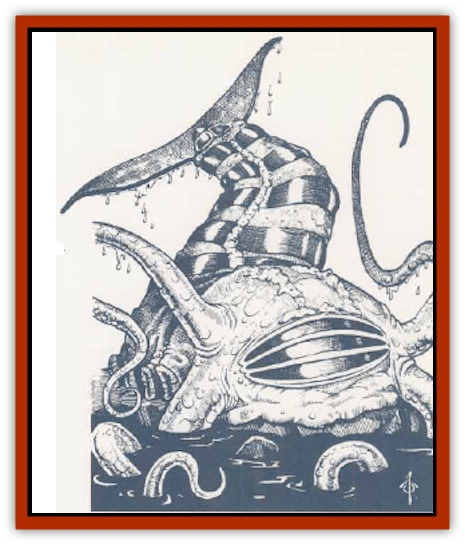

# Aboleth - Savant

| Statistic | **Aboleth, Savant** |
| --- | --- |
| **Activity Cycle:** | Any (night) |
| **Alignment:** | Lawful evil |
| **Armor Class:** | 2 |
| **Climate/Terrain:** | Subterranean |
| **Damage/Attack:** | 1d6 + special (x4) |
| **Diet:** | Omnivore |
| **Frequency:** | Very rare |
| **Hit Dice:** | 12+12 |
| **Intelligence:** | Exceptional to Supra-genius (15-19) |
| **Magic Resistance:** | Nil |
| **Morale:** | Champion (16) |
| **Movement:** | 3, Sw 18 |
| **No. Appearing:** | 1 |
| **No. of Attacks:** | 4 |
| **Organization:** | Brood/Community |
| **Size:** | H (20' long) |
| **Special Attacks:** | Spells, aboleth glyphs, frenzy, domination, tentacle toxin |
| **Special Defenses:** | Spells, aboleth glyphs, slime, mucus cloud, detect invisible (75% chance within 60') |
| **THAC0:** | 7 |
| **Treasure:** | Nil (F, U) |
| **XP Value:** | 13,000 / Spellcaster 9+ level 14,000 / <i>Comp. Master Glyph</i> creator 15,000 |

Savant aboleth are the great spellcasters of the [[Aboleth|aboleth]] species. Physically they resemble ordinary aboleth. However, the bony ridges of a savant aboleth head are unusually prominent and constitute a virtual armoring of the creature's slightly oversized cranium. Its tentacles are very tough and leathery, with calcified nodules along their surfaces. Together, these help to give the savant aboleth its superior Armor Class rating. Like all aboleth, savant aboleth are amphibious.

Savant aboleth can cast spells as both priests and wizards. They can attain 12th level as priests and 14th level as wizards. While ordinary aboleth may become priests of Juiblex the Slime Lord or of the aboleth Power known as the Blood Queen, savant aboleth primarily revere the Blood Queen. As priests, savant aboleth can use spells from any of the following spheres: all, charm, divination, elemental (air, earth, water), guardian, law, protection, summoning, sun (reversed, minor access only), and weather. As wizards, they very rarely specialize, though a small number take advantage of their race's natural affinity with enchantment/charm spells and effects to become specialist Enchanters. Nonspecialist savant aboleth have certain restrictions on spell use. They cannot use any form of fire-based or fire-affecting spell. Furthermore, they can only employ necromancy spells with difficulty (+2 bonus to the victim's saving throws) and are limited to spells from this school of 4th level or below.

| 1d100 | Priest Level | Wizard Level |
| --- | --- | --- |
| 01-03 | 1d4 | 1d4 |
| 04-10 | 1d4+1 | 1d4+1 |
| 11-25 | 1d6+1 | 1d6+1 |
| 26-40 | 1d6+2 | 1d6+2 |
| 41-60 | 1d4+5 | 1d4+6 |
| 61-80 | 1d4+6 | 1d6+6 |
| 81-90 | 1d4+8 | 1d6+8 |
| 91-99 | 1d3+9 | 1d4+10 |
| 00 | 1d2+10 | 1d3+11 |

The Intelligence score of a savant aboleth is determined by rolling 1d5+14. The Wisdom score of the creature is determined by rolling 1d4+14. To randomly determine the spellcasting power of a savant aboleth, roll 1d100 twice and consult the table. However, the lower rating should always be adjusted upwards (if necessary) so that it is no more than three levels lower than the higher rating. For example, if the random rolls create a savant aboleth as a 10th-level priest and 5th-level wizard, increase the wizard rating to 7th level.

Savant aboleth are rare. Aboleth are few to begin with, and no more than 2% or so of these creatures possess the exceptional mental gifts required to become a savant. It may be that the savant aboleth are correct in their view that the Blood Queen deliberately chooses few of her creatures to bless with the skills of the savant.

**Combat:** Savant aboleth are 75% likely to detect invisible creatures or objects within 60 feet. The savant aboleth always attempts to use spells and its domination power rather than melee. If forced into melee, it fights in the same way as any ordinary aboleth: a single touch from a tentacle and a failed saving throw vs. spell turns the victim's skin to a clear membrane in only 1d4+1 rounds; thereafter he or she must remain immersed in cool water or suffer 1d12 points of damage per turn. *Cure disease* can stop the process; once completed it can be reversed by *cure serious wounds*.

The savant aboleth is a more formidable enslaver than it ordinary kindred. Like them it can make three attempts per day to enslave creatures by *domination*, one creature per attempt, but the range of this attack is 30 yards and the target suffers a -2 penalty to the saving throw vs. spell to resist the effect. Moreover, the enslavement is complete, and the dominated creature will fight for the savant aboleth if so commanded. Any telepathic instruction from the savant aboleth to engage in a course of action which is clearly suicidal (and the Intelligence of the victim has to be taken into account here) allows the victim a  fresh saving throw vs. spell, without penalty, to free himself or herself from the *domination*. The enslavement can be undone by a sucsessful *dispel magic* (cast against a level of spell use equal to the highest level rating for the aboleth in priest or wizard class), *remove curse*, or by separating the victim from the savant by a distance of one mile or more, which permits a fresh saving throw without penalty each full day the separation is maintained. Note that, because the *domination* effect of the savant is so complete, these creatures are likely to have powerful creatures accompanying them as bodyguards - savant aboleth are fully cognizant of their unpopularity among <q>lesser races</q> and take suitable precautions. Any aboleth fighting to protect the life of a savant has a morale of 19 as long as the savant survives.

Underwater, the savant aboleth has the same mucus cloud protection, with the same effects, as ordinary aboleth (anyone within a foot of the aboleth who fails a saving throw vs. poison loses the ability to breathe air, suffocating in 2d6 rounds if he or she tries; the cloud also bestows the ability to breathe water for 1 to 3 hours).

Finally, the savant aboleth will go into a frenzy if close to death (12 hit points or below). In this state, which automatically supervenes at this time, the savant cannot cast spells or use any spell-like power. However, its tentacle attacks cause double damage (2d6) and the enraged, despairing creature will even attempt a head-smash attack each round, ramming with the bony protrusions on its forehead. This attack is clumsy (-4 penalty to the attack roll) but can affect up to two M size (or three S size) opponents. Damage from this head smash is 4d6 hit points, and a smashed opponent must make a Dexterity check or be kicked off his or her feet and stunned for 1d3 rounds. Once in a frenzy, the savant will not recover its normal demeanor until it has killed all opponents visible to it.

**Habitat/Society:** Savant aboleth are highly arrogant creatures. Cabals of savant aboleth organize and run aboleth society, playing the role of rulers and dominators from within their great cities. They rarely leave the city of their dwelling, sending ordinary aboleth out to do the dirty work of capturing slaves and the task of collecting food for the savants, while they brood long and deeply in their domains. Young savants born elsewhere leave their broods virtually as soon as they are capable of independence, believing themselves to be guided by the Blood Queen to the great cities of the aboleth deep in the Underdark. Sometimes, older savants will travel to a brood to take acquisition of a young aboleth which has latent savant gifts. This is one of the few occasions when savants leave their cities, but leave they sometimes must, for savant aboleth are infertile and do not produce young of their own.

Savant aboleth are always hungry for magical items and lore. They do not require spellbooks for their wizard spells; memorized spells are recalled automatically during periods of rest and sleep and do not need to be relearned from any independent source. Young savants may spend days or weeks in telepathic communion with their elders and betters, the older savants passing on their mastery of magical skills and their knowledge of dark, arcane secrets. Savant aboleth are always eager to devour spellcasters and magic-using creatures, the better to improve their own understanding of magic.

Savant aboleth have a complex symbolic glyph system they use for all written communication. Those who are of 7th or higher level in either the priest or wizard class can create magical glyph by psychokinetic force, one glyph per day. Casting time is two turns plus one turn per additional glyph element (see below), so this is not a likely potential combat action. The total number of glyph-elements a savant aboleth can maintain at any one time equals its Intelligence score.

Savant aboleth glyphs come in four categories: *simple glyphs*, *complex glyphs*, *master glyphs*, and *complex master glyphs*. *Simple glyphs* are identical to *glyphs of warding*. *Complex glyphs *combine the effects of two *glyphs of warding *- for example, an aboleth *complex glyph* might inflict cold damage and also cause paralysis. *Master glyphs* (each of which counts as a three-element glyph for the purposes of the savant aboleth's glyph limit) have unique effects. The following are a few examples of *master glyphs*:

<ul><li>*The Glyph of Law.* Within 30 feet of this glyph, all creatures of nonlawful alignment are subject to an adverse *prayer* effect (-1 to all attack, damage, and saving throw rolls).</li><li>*The Glyph of Enfeeblement.* Within 20 feet of this glyph, all non-aboleth feel themselves weakened and debilitated, suffering -3 penalties to Strength, Dexterity, and Constitution until leaving the area of effect and for 1d4 rounds thereafter.</li><li>*The Glyph of Extension.* Any aboleth within 20 feet of this glyph has double the normal range for its *domination* power.</li><li>*The Glyph of the Slime Curse.* Within 30 feet of this glyph, saving throws against the transformational effect of an aboleth's tentacle are made at a -4 penalty and transformation occurs in but a single round.</li></ul>Finally, great savant-aboleth of exceptional mastery (18 or higher Wisdom and Intelligence, 10th level or above as both priests and wizards) can create *complex master glyphs* which add an extra element onto a master glyph (for example, a *glyph of enfeeblement* which also does cold damage); these *complex master glyphs* can even include effects from different schools. *Complex master glyphs* still only count as three glyphs for the purpose of determining the limit on the number of glyphs the savant can maintain at any one time, but they require six turns to create.

Aboleth glyphs of all kinds can be removed by a successful *dispel magic* cast against the highest level rating for the savant aboleth which created them. Saving throws are permitted against the effects of all these glyphs, but saving throws against the effects of a *master glyph* are made with a -1 penalty; against *complex master glyphs* the penalty is -2. Only one saving throw is permitted against the whole battery of magical effects radiated by a *master glyph* or a *complex master glyph*.

This glyphic skill is central to the savant's position within aboleth society. Being very lawful, ordinary aboleth acquiesce to the greater power of the savants as a matter of course, but this ability to defend and protect the aboleth city with a battery of *complex glyphs* earns the savant aboleth the loyalty and respect of ordinary aboleth.

**Ecology:** Savant aboleth are either supreme beings at the top of their food chain or bloated parasites consuming food and resources gathered by slaves and lackeys, depending on one's point of view. Their diet is the same as that of ordinary aboleth - algae, fish, diverse water plants, and the like - but they have an especial liking for the flesh of spellcasters and magic-using creatures, as noted above. Savant aboleth have no natural enemies. Virtually all intelligent marine life knows well enough to give them an extremely wide berth.

---
## Discovery & Documentation

**Source Publication:** Monstrous Compendium, 1995 Annual, Volume 2 (1995)
**Campaign Setting:** Advanced Dungeons & Dragons 2nd Edition
**Author(s):** Jon Pickens

### Other Creatures Found in This Source Book
   * [[Addazahr|Addazahr]]
   * [[Amiq_Rasol|Amiq Rasol]]
   * [[Arch-Shadow|Arch-Shadow]]
   * [[Automaton_Scaladar|Automaton, Scaladar]]
   * [[Automaton_Trobriand's|Automaton, Trobriand's]]
   * [[Bat_Sporebat|Bat, Sporebat]]
   * [[Beetle_Dragon|Beetle, Dragon]]
   * [[Bi-nou|Bi-nou]]
   * [[Boggle|Boggle]]
   * [[Brownie_Dobie|Brownie, Dobie]]
   * [[Brownie_Quickling|Brownie, Quickling]]
   * [[Cat_Crypt|Cat, Crypt]]
   * [[Cat_Great_Cath_Shee|Cat, Great, Cath Shee]]
   * [[Centaur-kin_Dorvesh|Centaur-kin, Dorvesh]]
   * [[Centaur-kin_Gnoat|Centaur-kin, Gnoat]]
   * [[Centaur-kin_Ha'pony|Centaur-kin, Ha'pony]]
   * [[Centaur-kin_Zebranaur|Centaur-kin, Zebranaur]]
   * [[Chronolily|Chronolily]]
   * [[Curst|Curst]]
   * [[Darktentacles|Darktentacles]]
   * [[Dinosaur_Aquatic|Dinosaur, Aquatic]]
   * [[Dinosaur_II|Dinosaur II]]
   * [[Dinosaur_III|Dinosaur III]]
   * [[Doppelganger_Greater|Doppelganger, Greater]]
   * [[Dragon_Brine|Dragon, Brine]]
   * [[Dragon_Half-|Dragon, Half-]]
   * [[Dragon-kin_Sea_Wyrm|Dragon-kin, Sea Wyrm]]
   * [[Dwarf_Wild|Dwarf, Wild]]
   * [[Ekimmu|Ekimmu]]
   * [[Elemental_Nature|Elemental, Nature]]
   * [[Elf_Winged|Elf, Winged]]
   * [[Fish_Great_Glacier|Fish (Great Glacier)]]
   * [[Fish_Subterranean|Fish, Subterranean]]
   * [[Fish_Toril|Fish (Toril)]]
   * [[Flareater|Flareater]]
   * [[Flumph|Flumph]]
   * [[Froghemoth|Froghemoth]]
   * [[Ghost_Casurua|Ghost, Casurua]]
   * [[Ghost_Ker|Ghost, Ker]]
   * [[Ghul|Ghul]]
   * [[Ghul-Kin|Ghul-Kin]]
   * [[Giant_Half-giant|Giant, Half-giant]]
   * [[Golem_Burning_Man|Golem, Burning Man]]
   * [[Golem_Phantom_Flyer|Golem, Phantom Flyer]]
   * [[Gulguthhydra|Gulguthhydra]]
   * [[Hakeashar|Hakeashar]]
   * [[Horse_Moon-|Horse, Moon-]]
   * [[Human_Dragonslayer|Human, Dragonslayer]]
   * [[Human_Vistana|Human, Vistana]]
   * [[Jellyfish_Giant|Jellyfish, Giant]]
   * [[Kalin|Kalin]]
   * [[Kholiathra|Kholiathra]]
   * [[Laerti|Laerti]]
   * [[Leucrotta_Greater|Leucrotta, Greater]]
   * [[Lich_Suel|Lich, Suel]]
   * [[Lurker_Shadow|Lurker, Shadow]]
   * [[Lycanthrope_Werepanther|Lycanthrope, Werepanther]]
   * [[Lycanthrope_Wereshark|Lycanthrope, Wereshark]]
   * [[Mammal_Herd_II|Mammal, Herd II]]
   * [[Marl|Marl]]
   * [[Meenlock|Meenlock]]
   * [[Mimic_Greater|Mimic, Greater]]
   * [[Mold_II|Mold II]]
   * [[Mummy_Creature|Mummy, Creature]]
   * [[Nyth|Nyth]]
   * [[Ooze_Slime_Jelly_Ghaunadan|Ooze/Slime/Jelly, Ghaunadan]]
   * [[Palimpsest|Palimpsest]]
   * [[Peltast|Peltast]]
   * [[Plant_Dangerous_II|Plant, Dangerous II]]
   * [[Pleistocene_Animal|Pleistocene Animal]]
   * [[Pudding_Subterranean|Pudding, Subterranean]]
   * [[Raggamoffyn|Raggamoffyn]]
   * [[Snake_Serpent|Snake, Serpent]]
   * [[Snake_Serpent_Vine|Snake, Serpent Vine]]
   * [[Sphinx_Draco-|Sphinx, Draco-]]
   * [[Sprite_Seelie_Faerie|Sprite, Seelie Faerie]]
   * [[Sprite_Unseelie_Faerie|Sprite, Unseelie Faerie]]
   * [[Squealer|Squealer]]
   * [[Turtle_Giant|Turtle, Giant]]
   * [[Umpleby|Umpleby]]
   * [[Vizier's_Turban|Vizier's Turban]]
   * [[Wall_Walker|Wall Walker]]
   * [[Webbird|Webbird]]
   * [[Yak-Man|Yak-Man]]
   * [[Zorbo|Zorbo]]
