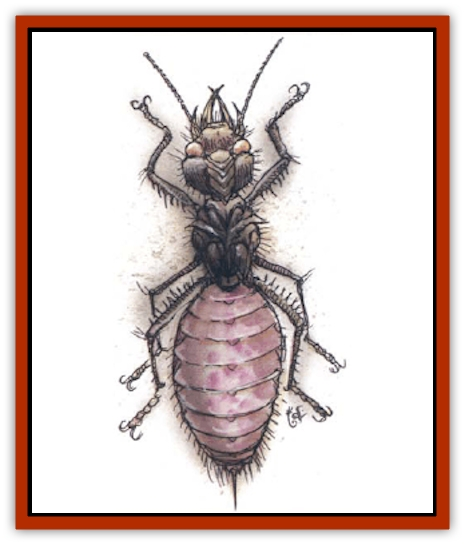

# Abyss Ant

| Statistic | **Abyss Ant** |
| --- | --- |
| **Activity Cycle:** | Any |
| **Alignment:** | Neutral evil |
| **Armor Class:** | 3 |
| **Climate/Terrain:** | The Abyss, or temperate forests, hills, and plains of the Prime Material Plane |
| **Damage/Attack:** | 1d6 (bite)/1d6+2 (sting) |
| **Diet:** | Carnivore |
| **Frequency:** | Uncommon (Abyss) or very rare (Prime) |
| **Hit Dice:** | 3 |
| **Intelligence:** | Low (5-7) |
| **Magic Resistance:** | Nil |
| **Morale:** | Fearless (19-20) |
| **Movement:** | 18 |
| **No. Appearing:** | 5d6 (½10) |
| **No. of Attacks:** | 2 |
| **Organization:** | Colony |
| **Size:** | S (2' long) |
| **Special Attacks:** | Spit acid |
| **Special Defenses:** | See below |
| **THAC0:** | 17 |
| **Treasure:** | Nil |
| **XP Value:** | 175 |

This vicious form of vermin hails from the Abyss, on the Outer Planes. Abyss ants are about the same size and shape as [[Ant|giant ants]], but their piebald coloration of putrid pink and fish-belly white immediately alerts the observer to the difference.

These creatures enjoy a limited form of telepathy among themselves within 600 feet, but they speak no languages.

**Combat:** Abyss ants bile and sting in battle, the latter delivering an acidic poison that delivers the additional 2 points of damage listed above (no save). They are also able to spit an acidic goo up to 10 feet away, three times per day, inflicting 2d4 points of damage upon a successful hit (targets are allowed a save vs. wand to avoid damage). Thanks to their telepathy, the entire colony is alerted when any one of its members is attacked, and will rush to aid the beleaguered ant. The ants also have the ability to organize reinforcements before initiating an attack. In actual melee, instead of attacking a group of adversaries as a whole, they direct their offense at a single target, allowing them to bring down even the largest of creatures - if an adventuring party encounters a nest of Abyss ants, they swarm a single, randomly chosen person until he or she is incapacitated or dead, then move on to the next.

**Habitat/Society:** Abyss ants are found on many layers of the Abyss, but they appear on the Prime Material Plane when deliberately summoned by evil spellcasters. [[Tanar'ri_General_Information|Tanar'ri]] occasionally rid themselves of a troublesome colony by gating it to the Prime Material.

A colony appears much the same as a giant ant nest: The creatures lair underground, in a series of chambers and passages with mounds of dirt and pebbels marking the entrances. Abyss ants dig deep, wide nests as far as 50 feet below the surfare, and the entire nest may spread over an area exceeding thousands of square yards. A typical nest may contain as many as 300 worker/warriors and a single queen. The queen (MV 1, HD 6) appears as a huge, bloated version of a normal Abyss ant. She has no stinger, but is able to bite and spit acid. She is responsible only for deciding where to establish the nest, then laying eggs to perpetuate it. The worker/warriors defend the queen and colony, gther food, attend the eggs and larvae, and establish the ecosystcm (see "Ecology") around the nest. At any one time 60% of the colony is above ground, while 40% remains below. The queen always has an entourage of 2d10 guards and servants in her chamber.

**Ecology:** Abyss ants are ferociously territorial and actually establish their own ecosystem about the colony. Their diameter of the territory is usually 1,000 yards for every 50 ants in the nest; the size may vary according to local terrain and abundance of food supplies. The ants patrol the perimeter and allow nothing to live within their circle that does not serve their needs. Small groups of 1d6+4 ants often scout as far as 1d4+6 miles beyond the perimeter to maintain security.

The ants are of low Intelligence, but they understand the advantages of domesticating and maintaining a steady source of food. Hence, they establish and tend herds of cattle, deer, horses, humans, demihumans, humanoids, or whatever else is handy. All predators, wandering animals, insects, weeds, and even trees and bushes are carefully eradicated. Sentries watch the herd continuously. They kill and devour the herd as needed, dissolving the victims completely with their acidic goo. The resulting <q<flesh pudding</q> is shared by the entire colony; any character devoured by the ants is gone forever and can't be reincarnated or resurrected.

The gooey acid produced by these creatures is a primary ingredient in *universal solvent*.

---
## Discovery & Documentation

**Source Publication:** Monstrous Compendium, 1994 Annual, Volume 1 (1995)
**Campaign Setting:** Advanced Dungeons & Dragons 2nd Edition
**Author(s):** David Wise

### Other Creatures Found in This Source Book
   * [[Achaierai|Achaierai]]
   * [[Afanc|Afanc]]
   * [[Al-Jahar|Al-Jahar]]
   * [[Baelnorn|Baelnorn]]
   * [[Baneguard|Baneguard]]
   * [[Banelar|Banelar]]
   * [[Bird_Talking|Bird, Talking]]
   * [[Blazing_Bones|Blazing Bones]]
   * [[Campestri|Campestri]]
   * [[Caniquine|Caniquine]]
   * [[Cat_Winged|Cat, Winged]]
   * [[Crypt_Servant|Crypt Servant]]
   * [[Death's_Head_Tree|Death's Head Tree]]
   * [[Dog_Saluqi|Dog, Saluqi]]
   * [[Dragon_Electrum|Dragon, Electrum]]
   * [[Dragon_Fang|Dragon, Fang]]
   * [[Dragon_Linnorm_Corpse_Tearer|Dragon, Linnorm, Corpse Tearer]]
   * [[Dragon_Linnorm_Dread|Dragon, Linnorm, Dread]]
   * [[Dragon_Linnorm_Flame|Dragon, Linnorm, Flame]]
   * [[Dragon_Linnorm_Forest|Dragon, Linnorm, Forest]]
   * [[Dragon_Linnorm_Frost|Dragon, Linnorm, Frost]]
   * [[Dragon_Linnorm_Gray|Dragon, Linnorm, Gray]]
   * [[Dragon_Linnorm_Land|Dragon, Linnorm, Land]]
   * [[Dragon_Linnorm_Midgard|Dragon, Linnorm, Midgard]]
   * [[Dragon_Linnorm_Rain|Dragon, Linnorm, Rain]]
   * [[Dragon_Linnorm_Sea|Dragon, Linnorm, Sea]]
   * [[Dragon_Neutral_Jacinth|Dragon, Neutral, Jacinth]]
   * [[Dragon_Neutral_Jade|Dragon, Neutral, Jade]]
   * [[Dragon_Neutral_Pearl|Dragon, Neutral, Pearl]]
   * [[Dread|Dread]]
   * [[Dragon-kin|Dragon-kin]]
   * [[Elemental_Earth_Kin_Chrysmal|Elemental, Earth Kin, Chrysmal]]
   * [[Elemental_Earth_Kin_Earth_Weird|Elemental, Earth Kin, Earth Weird]]
   * [[Elemental_Fire_Kin_Azer|Elemental, Fire Kin, Azer]]
   * [[Elemental_Sandman|Elemental, Sandman]]
   * [[Elemental_Wind_Walker|Elemental, Wind Walker]]
   * [[Elemental_Vermin|Elemental Vermin]]
   * [[Feystag|Feystag]]
   * [[Flame_Skull|Flame Skull]]
   * [[Foulwing|Foulwing]]
   * [[Gambado|Gambado]]
   * [[Garbug|Garbug]]
   * [[Genie_Tasked_Administrator|Genie, Tasked, Administrator]]
   * [[Genie_Tasked_Deceiver|Genie, Tasked, Deceiver]]
   * [[Genie_Tasked_Harim_Servant|Genie, Tasked, Harim Servant]]
   * [[Genie_Tasked_Messenger|Genie, Tasked, Messenger]]
   * [[Genie_Tasked_Miner|Genie, Tasked, Miner]]
   * [[Genie_Tasked_Oathbinder|Genie, Tasked, Oathbinder]]
   * [[Gibbering_Mouther|Gibbering Mouther]]
   * [[Gnasher|Gnasher]]
   * [[Gnasher_Winged|Gnasher, Winged]]
   * [[Golem_Brain|Golem, Brain]]
   * [[Golem_Hammer|Golem, Hammer]]
   * [[Golem_Metagolem|Golem, Metagolem]]
   * [[Golem_Spiderstone|Golem, Spiderstone]]
   * [[Gorynych|Gorynych]]
   * [[Greelox|Greelox]]
   * [[Helmed_Horror|Helmed Horror]]
   * [[Jarbo|Jarbo]]
   * [[Laraken|Laraken]]
   * [[Lich_Psionic|Lich, Psionic]]
   * [[Living_Steel|Living Steel]]
   * [[Lock_Lurker|Lock Lurker]]
   * [[Loxo|Loxo]]
   * [[Lycanthrope_Loup_de_Noir|Lycanthrope, Loup de Noir]]
   * [[Lycanthrope_Werebadger|Lycanthrope, Werebadger]]
   * [[Lycanthrope_Werejaguar|Lycanthrope, Werejaguar]]
   * [[Lythlyx|Lythlyx]]
   * [[Magebane|Magebane]]
   * [[Marrashi|Marrashi]]
   * [[Metalmaster|Metalmaster]]
   * [[Mimic_House_Hunter|Mimic, House Hunter]]
   * [[Naga_Bone|Naga, Bone]]
   * [[Nautilus_Giant|Nautilus, Giant]]
   * [[Nightshade_Toril|Nightshade (Toril)]]
   * [[Nishruu|Nishruu]]
   * [[Noran|Noran]]
   * [[Opinicus|Opinicus]]
   * [[Ormyrr|Ormyrr]]
   * [[Parasite|Parasite]]
   * [[Pasari-Niml|Pasari-Niml]]
   * [[Plant_Vampire_Moss|Plant, Vampire Moss]]
   * [[Pteraman|Pteraman]]
   * [[Rautym|Rautym]]
   * [[Shadeling|Shadeling]]
   * [[Skum|Skum]]
   * [[Snake_Giant_Cobra|Snake, Giant Cobra]]
   * [[Snake_Stone|Snake, Stone]]
   * [[Spectral_Wizard|Spectral Wizard]]
   * [[Spell_Weaver|Spell Weaver]]
   * [[Spider_Brain|Spider, Brain]]
   * [[Suwyze|Suwyze]]
   * [[Tatalla|Tatalla]]
   * [[Tick_Heart|Tick, Heart]]
   * [[Tree_Dark|Tree, Dark]]
   * [[Tree_Singing|Tree, Singing]]
   * [[Tressym|Tressym]]
   * [[Troll_Snow|Troll, Snow]]
   * [[Tuyewera|Tuyewera]]
   * [[Ulitharid|Ulitharid]]
   * [[Undead_Dwarf|Undead Dwarf]]
   * [[Undead_Lake_Monster|Undead Lake Monster]]
   * [[Whipsting|Whipsting]]
   * [[Windghost|Windghost]]
   * [[Wolf_Dread|Wolf, Dread]]
   * [[Wolf_Stone|Wolf, Stone]]
   * [[Wolf_Vampiric|Wolf, Vampiric]]
   * [[Wraith_Shimmering|Wraith, Shimmering]]
   * [[Xantravar|Xantravar]]
   * [[Xaver|Xaver]]
