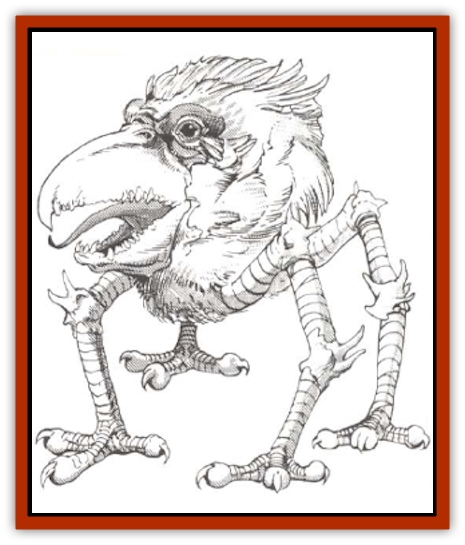

# Achaierai

| Statistic | **Achaierai** |
| --- | --- |
| **Activity Cycle:** | Any |
| **Alignment:** | Chaotic evil |
| **Armor Class:** | 8 (Legs AC -1) |
| **Climate/Terrain:** | Subterranean |
| **Damage/Attack:** | 1-8/1-8/1-10 |
| **Diet:** | Carnivore |
| **Frequency:** | Very rare |
| **Hit Dice:** | Body 40 hp; Legs 15 hp each |
| **Intelligence:** | Average (8-10) |
| **Magic Resistance:** | 35% |
| **Morale:** | Special |
| **Movement:** | 18 |
| **No. Appearing:** | 14 |
| **No. of Attacks:** | 3 |
| **Organization:** | Small Flocks |
| **Size:** | H (15' tall) |
| **Special Attacks:** | Nil |
| **Special Defenses:** | Toxic Smoke |
| **THAC0:** | 17 (claws)/1 (beak) |
| **Treasure:** | F |
| **XP Value:** | 2,000 |

The body of an Achaierai looks like a huge spherical head, with a powerful beak, feathered crest and stunted wings. Four metallic legs, each 8-9' long, extend from the underside and end in strong taloned feet. The legs are a metallic blue-gray, the head-body a dull scarlet mottled with deep red. The crest can be of almost any color, but the most common is a bright flame red.

**Combat:** The [[Bird|birdlike]] Achaierai attack fearlessly, never needing to check morale if in a flock. However. individuals will attempt to flee if they lose a leg. Though flightless, Achaierai can often elude pursuers because of their speed.

Only damage to the soft and vulnerable body of an Achaierai will slay it. A single attack on a leg with an edged weapon. which causes at least 15 hp of damage, will sever a leg. Multiple attacks of any type causing 15 hp or more damage to a single leg will render the leg useless, but will not sever it. Area effect attacks will damage all legs within the area affected only if the creature fails its save against the attack. The loss of one leg does not affect its movement rate, but the loss of two will reduce its movement by half.

If an Achaierai loses three legs or is otherwise seriously wounded, it will release a cloud of poisonous black smoke in approximately a 10' radius sphere. All creatures within the cloud (except Achaierai) take 2-12 points of damage and must save vs. poison or suffer insanity for three hours (treat as a *feeblemind* spell). The injured bird will attempt to flee in the confusion, crawling at a movement rate of 2 if three legs have been lost. An injures leg will heal fully in one or two days, but these birds do not possess other regenerative powers and a severed leg will not be regrown.

A flock of Achaierai will attack in an organized manner, often attacking first those opponents they deem to be the most dangerous. No more than two can attack a man-sized creature at one time. Opponents who are man-sized or smaller are usually not able to reach the body of the Achaierai to attack it. Likewise, the bird cannot normally attack these opponents with its beak and will instead fight with two claws.

**Habitat/Society:** These foul birds originate from some ages-old infernal lower plane. The entire race was summoned to this plane long ago for some long-forgotten evil purpose. and none now exist on any other known plane. Though unable to breed on this plane. they are extremely long-lived, and remnants of the original flocks still exist. These creatures roam in dark, unexplored areas underground, attacking all they meet, perhaps still seeking to carry out the commands of their long-dead summoners.

Achaierai are almost always bound underground, except for rare sightings at night, when they may venture out into the shadowy entrance area of their large cavern complexes. They will often use an area with several small chambers as a "nesting area". Though no longer fertile, these birds pair for life and will attack with great ferocity (+2 to hit) if their mates or nesting sites are threatened.

Though they organize into small flocks and mating pairs, Achaierai have no true society and will turn on each other in hard times, attacking weaker members of the flock and devouring them. Therefore, when single Achaierai are sighted they will often (40% chance) be birds who have lost one or more legs and are afraid to travel with others of their own kind.

Rarely, (10% of the time) a flock will have a <q>leader</q> of exceptional size and abilities. These individuals have 60 hp for their bodies and 25 hp for each leg. They are +2 both to hit and on damage and are able to use their toxic smoke breath weapon up to four times per day.

**Ecology:** Achaierai are true carnivores, devouring only meat, although they are not at all fussy about the freshness of their meals. Because of their size, they must devour an astounding amount of meat every day, and will resort to scavenging or cannibalism as the need arises. They are feared and hunted by the underground races such as [[Elf_Drow|drow]] and [[Gnome|deep gnomes]], whose villages and livestock are decimated by the appearance of a flock of ravenous Achaierai. Areas in close proximity to these voracious creatures have generally been picked clean of other living beings.

---
## Discovery & Documentation

**Source Publication:** Monstrous Compendium, 1994 Annual, Volume 1 (1995)
**Campaign Setting:** Advanced Dungeons & Dragons 2nd Edition
**Author(s):** David Wise

### Other Creatures Found in This Source Book
   * [[Abyss_Ant|Abyss Ant]]
   * [[Afanc|Afanc]]
   * [[Al-Jahar|Al-Jahar]]
   * [[Baelnorn|Baelnorn]]
   * [[Baneguard|Baneguard]]
   * [[Banelar|Banelar]]
   * [[Bird_Talking|Bird, Talking]]
   * [[Blazing_Bones|Blazing Bones]]
   * [[Campestri|Campestri]]
   * [[Caniquine|Caniquine]]
   * [[Cat_Winged|Cat, Winged]]
   * [[Crypt_Servant|Crypt Servant]]
   * [[Death's_Head_Tree|Death's Head Tree]]
   * [[Dog_Saluqi|Dog, Saluqi]]
   * [[Dragon_Electrum|Dragon, Electrum]]
   * [[Dragon_Fang|Dragon, Fang]]
   * [[Dragon_Linnorm_Corpse_Tearer|Dragon, Linnorm, Corpse Tearer]]
   * [[Dragon_Linnorm_Dread|Dragon, Linnorm, Dread]]
   * [[Dragon_Linnorm_Flame|Dragon, Linnorm, Flame]]
   * [[Dragon_Linnorm_Forest|Dragon, Linnorm, Forest]]
   * [[Dragon_Linnorm_Frost|Dragon, Linnorm, Frost]]
   * [[Dragon_Linnorm_Gray|Dragon, Linnorm, Gray]]
   * [[Dragon_Linnorm_Land|Dragon, Linnorm, Land]]
   * [[Dragon_Linnorm_Midgard|Dragon, Linnorm, Midgard]]
   * [[Dragon_Linnorm_Rain|Dragon, Linnorm, Rain]]
   * [[Dragon_Linnorm_Sea|Dragon, Linnorm, Sea]]
   * [[Dragon_Neutral_Jacinth|Dragon, Neutral, Jacinth]]
   * [[Dragon_Neutral_Jade|Dragon, Neutral, Jade]]
   * [[Dragon_Neutral_Pearl|Dragon, Neutral, Pearl]]
   * [[Dread|Dread]]
   * [[Dragon-kin|Dragon-kin]]
   * [[Elemental_Earth_Kin_Chrysmal|Elemental, Earth Kin, Chrysmal]]
   * [[Elemental_Earth_Kin_Earth_Weird|Elemental, Earth Kin, Earth Weird]]
   * [[Elemental_Fire_Kin_Azer|Elemental, Fire Kin, Azer]]
   * [[Elemental_Sandman|Elemental, Sandman]]
   * [[Elemental_Wind_Walker|Elemental, Wind Walker]]
   * [[Elemental_Vermin|Elemental Vermin]]
   * [[Feystag|Feystag]]
   * [[Flame_Skull|Flame Skull]]
   * [[Foulwing|Foulwing]]
   * [[Gambado|Gambado]]
   * [[Garbug|Garbug]]
   * [[Genie_Tasked_Administrator|Genie, Tasked, Administrator]]
   * [[Genie_Tasked_Deceiver|Genie, Tasked, Deceiver]]
   * [[Genie_Tasked_Harim_Servant|Genie, Tasked, Harim Servant]]
   * [[Genie_Tasked_Messenger|Genie, Tasked, Messenger]]
   * [[Genie_Tasked_Miner|Genie, Tasked, Miner]]
   * [[Genie_Tasked_Oathbinder|Genie, Tasked, Oathbinder]]
   * [[Gibbering_Mouther|Gibbering Mouther]]
   * [[Gnasher|Gnasher]]
   * [[Gnasher_Winged|Gnasher, Winged]]
   * [[Golem_Brain|Golem, Brain]]
   * [[Golem_Hammer|Golem, Hammer]]
   * [[Golem_Metagolem|Golem, Metagolem]]
   * [[Golem_Spiderstone|Golem, Spiderstone]]
   * [[Gorynych|Gorynych]]
   * [[Greelox|Greelox]]
   * [[Helmed_Horror|Helmed Horror]]
   * [[Jarbo|Jarbo]]
   * [[Laraken|Laraken]]
   * [[Lich_Psionic|Lich, Psionic]]
   * [[Living_Steel|Living Steel]]
   * [[Lock_Lurker|Lock Lurker]]
   * [[Loxo|Loxo]]
   * [[Lycanthrope_Loup_de_Noir|Lycanthrope, Loup de Noir]]
   * [[Lycanthrope_Werebadger|Lycanthrope, Werebadger]]
   * [[Lycanthrope_Werejaguar|Lycanthrope, Werejaguar]]
   * [[Lythlyx|Lythlyx]]
   * [[Magebane|Magebane]]
   * [[Marrashi|Marrashi]]
   * [[Metalmaster|Metalmaster]]
   * [[Mimic_House_Hunter|Mimic, House Hunter]]
   * [[Naga_Bone|Naga, Bone]]
   * [[Nautilus_Giant|Nautilus, Giant]]
   * [[Nightshade_Toril|Nightshade (Toril)]]
   * [[Nishruu|Nishruu]]
   * [[Noran|Noran]]
   * [[Opinicus|Opinicus]]
   * [[Ormyrr|Ormyrr]]
   * [[Parasite|Parasite]]
   * [[Pasari-Niml|Pasari-Niml]]
   * [[Plant_Vampire_Moss|Plant, Vampire Moss]]
   * [[Pteraman|Pteraman]]
   * [[Rautym|Rautym]]
   * [[Shadeling|Shadeling]]
   * [[Skum|Skum]]
   * [[Snake_Giant_Cobra|Snake, Giant Cobra]]
   * [[Snake_Stone|Snake, Stone]]
   * [[Spectral_Wizard|Spectral Wizard]]
   * [[Spell_Weaver|Spell Weaver]]
   * [[Spider_Brain|Spider, Brain]]
   * [[Suwyze|Suwyze]]
   * [[Tatalla|Tatalla]]
   * [[Tick_Heart|Tick, Heart]]
   * [[Tree_Dark|Tree, Dark]]
   * [[Tree_Singing|Tree, Singing]]
   * [[Tressym|Tressym]]
   * [[Troll_Snow|Troll, Snow]]
   * [[Tuyewera|Tuyewera]]
   * [[Ulitharid|Ulitharid]]
   * [[Undead_Dwarf|Undead Dwarf]]
   * [[Undead_Lake_Monster|Undead Lake Monster]]
   * [[Whipsting|Whipsting]]
   * [[Windghost|Windghost]]
   * [[Wolf_Dread|Wolf, Dread]]
   * [[Wolf_Stone|Wolf, Stone]]
   * [[Wolf_Vampiric|Wolf, Vampiric]]
   * [[Wraith_Shimmering|Wraith, Shimmering]]
   * [[Xantravar|Xantravar]]
   * [[Xaver|Xaver]]
