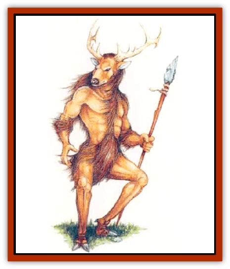

# Actaeon

| Statistic | **Actaeon** |
| --- | --- |
| **Activity Cycle:** | Day |
| **Alignment:** | Neutral |
| **Armor Class:** | 3 |
| **Climate/Terrain:** | Temperate forest |
| **Damage/Attack:** | 1d6+6 (spear)/1d6+6 (spear)/2d8 (antlers) |
| **Diet:** | Herbivore |
| **Frequency:** | Rare |
| **Hit Dice:** | 11 |
| **Intelligence:** | Very (11-12) |
| **Magic Resistance:** | Nil |
| **Morale:** | Champion (15) |
| **Movement:** | 15 |
| **No. Appearing:** | 1 |
| **No. of Attacks:** | 3 |
| **Organization:** | Solitary |
| **Size:** | L (9' tall) |
| **Special Attacks:** | Polymorph breath, summoning |
| **Special Defenses:** | Camouflage |
| **THAC0:** | 9 |
| **Treasure:** | P (B) |
| **XP Value:** | 4,000 |

A solitary being, the actaeon is a protector and hero among woodland creatures. Some Mystarans call it an <q>elk centaur</q> because, like a [[Centaur|centaur]], its 9-foot-tall body combines human and animal elements. The actaeon has the torso, arms, and facial features of a human, but the antlers and lower legs of an elk. Brown, elklike hide covers its entire body. Elk centaurs speak their own language and the sylvan woodland tongue. Some also speak Common.

**Combat:** In combat these creatures are formidable, boasting a number of special tricks and abilities. It is no wonder that other intelligent forest beings regard them with awe.

The actaeon can camouflage itself perfectly (as if invisible) in light or dense woods. When angered by the wanton slaying of woodland creatures (or similar vile acts), it springs out of hiding, usually with surprise (opponent suffer a -5 penalty to their surprise rolls).

This fearsome creature attacks with large spears made of wood and bone, and gores enemies with its antlers. Its incredible speed enables it to make two spear attacks per round. Given its massive strength and the great size of the weapons, each spear inflicts 1d6+6 points of damage.

A powerful magical breath weapon complements the actaeon's other capabilities. Once per day, it can breath out a warm, greenish mist, filling a 10x10x10-foot cube; anyone within it must make a saving throw vs. breath weapon or be *polymorphed* into a common forest creature, taking on the creature's intelligence and habits as well as its looks. (<q>Common</q> forest creatures include owls, squirrels, deer, boars, and the like.) This change is permanent unless countered by another *polymorph* spell, or by *dispel magic* cast at 12th level or higher. If be saving throw is successful, the transformation still occurs, but it lasts for only 24 hours. The breath weapon can be used once per day. Also once per day, the actaeon can *summon woodland creatures* to assist it; 1d6 creatures arrive in 1d4 turns. Choose from the list below or roll 1d6 to determine the creature type at random.

| 1d6 | Creature Summoned | 1d6 | Creature Summoned |
| --- | --- | --- | --- |
| 1 | boar | 4 | griffon |
| 2 | bear | 5 | lizard (chameleon) |
| 3 | centaur | 6 | treant |

As if the numerous aforementioned powers weren't enough, a few venerable actaeons are druids of up to the 8th level ability, though such individuals are quite rare.

**Habitat/Society:** Actaeons live alone except during the mating season, which occurs in the spring of every third year. The following autumn, a female gives birth to a single fawn. The fawn remains with her through the winter, learning the basics of survival: how to forage for bark and twigs, how to shape spears and other basic tools, and how to use sharpened sticks and bones to dig edible roots from the ground beneath the snow. Many fawns starve or freeze during their first winter, or fall prey to an attack. Survivors set out on their own come spring, each pursuing its own solutary existence.

Actaeons have an eye for treasure; they collect small hoards in secure, well-hidden locations, such as the hollow trunk of a fallen tree or beneath a rock. As intelligent creatures, they know others also value coins and jewels. Actaeons often trade their riches for tools and - if nature is harsh - for food if the dead of winter.

**Ecology:** Actaeons belong to the woodland community that includes centaurs, [[Dryad|dryads]], and similar creatures. Because actaeons are bold and rare, other forest folk consider them heroes. Actaeons sometimes work with druids to preserve the safety of the woods, especially to thwart a serious danger.

---
## Discovery & Documentation

**Source Publication:** Mystara Appendix (1994)
**Campaign Setting:** Mystara
**Author(s):** John Nephew, Teeuwynn Woodruff, John Terra, Skip Williams

### Other Creatures Found in This Source Book
   * [[Agarat|Agarat]]
   * [[Ash_Crawler|Ash Crawler]]
   * [[Baldandar|Baldandar]]
   * [[Bargda|Bargda]]
   * [[Bhut|Bhut]]
   * [[Bird_Mystara|Bird (Mystara)]]
   * [[Blackball|Blackball]]
   * [[Choker|Choker]]
   * [[Coltpixie|Coltpixie]]
   * [[Crone_of_Chaos|Crone of Chaos]]
   * [[Darkhood|Darkhood]]
   * [[Darkwing|Darkwing]]
   * [[Decapus|Decapus]]
   * [[Deep_Glaurant|Deep Glaurant]]
   * [[Diabolus|Diabolus]]
   * [[Dimensional_Warper|Dimensional Warper]]
   * [[Dragon_Mystara_Crystalline|Dragon (Mystara), Crystalline]]
   * [[Dragon_Mystara_Jade|Dragon (Mystara), Jade]]
   * [[Dragon_Mystara_Onyx|Dragon (Mystara), Onyx]]
   * [[Dragon_Mystara_Ruby|Dragon (Mystara), Ruby]]
   * [[Drake_Mystara|Drake (Mystara)]]
   * [[Dragonfly|Dragonfly]]
   * [[Dusanu|Dusanu]]
   * [[Elemental_of_Chaos_Air_Earth|Elemental of Chaos, Air/Earth]]
   * [[Elemental_of_Chaos_Fire_Water|Elemental of Chaos, Fire/Water]]
   * [[Elemental_of_Law_Air_Earth|Elemental of Law, Air/Earth]]
   * [[Elemental_of_Law_Fire_Water|Elemental of Law, Fire/Water]]
   * [[Familiar_Mystara|Familiar (Mystara)]]
   * [[Frost_Salamander|Frost Salamander]]
   * [[Fundamental_Air_Earth|Fundamental, Air/Earth]]
   * [[Fundamental_Fire_Water|Fundamental, Fire/Water]]
   * [[Gargantua_Mystara|Gargantua (Mystara)]]
   * [[Geonid|Geonid]]
   * [[Ghostly_Horde|Ghostly Horde]]
   * [[Giant_Athach|Giant, Athach]]
   * [[Giant_Hephaeston|Giant, Hephaeston]]
   * [[Golem_Drolem|Golem, Drolem]]
   * [[Golem_Mystara_I|Golem (Mystara) I]]
   * [[Golem_Mystara_II|Golem (Mystara) II]]
   * [[Golem_Mystara_III|Golem (Mystara) III]]
   * [[Gray_Philosopher|Gray Philosopher]]
   * [[Guardian_Warrior|Guardian Warrior]]
   * [[Gyerian|Gyerian]]
   * [[Herex|Herex]]
   * [[Hivebrood|Hivebrood]]
   * [[Horde|Horde]]
   * [[Hsiao|Hsiao]]
   * [[Huptzeen|Huptzeen]]
   * [[Hutaakan|Hutaakan]]
   * [[Imp_Mystara|Imp (Mystara)]]
   * [[Jellyfish_Giant_Mystara|Jellyfish, Giant (Mystara)]]
   * [[Kna|Kna]]
   * [[Kopru|Kopru]]
   * [[Lizard_Mystara|Lizard (Mystara)]]
   * [[Lizard-kin_Mystara|Lizard-kin (Mystara)]]
   * [[Lupin|Lupin]]
   * [[Lycanthrope_Werejaguar_Mystara|Lycanthrope, Werejaguar (Mystara)]]
   * [[Lycanthrope_Wereswine|Lycanthrope, Wereswine]]
   * [[Magen|Magen]]
   * [[Manikin|Manikin]]
   * [[Mek|Mek]]
   * [[Mujina|Mujina]]
   * [[Nagpa|Nagpa]]
   * [[Neh-thalggu|Neh-thalggu]]
   * [[Nightshade_Mystara|Nightshade (Mystara)]]
   * [[Nuckalavee|Nuckalavee]]
   * [[Pegataur|Pegataur]]
   * [[Phanaton|Phanaton]]
   * [[Plant_Dangerous_Mystara|Plant, Dangerous (Mystara)]]
   * [[Plasm|Plasm]]
   * [[Rakasta|Rakasta]]
   * [[Rock_Man|Rock Man]]
   * [[Sabreclaw|Sabreclaw]]
   * [[Sacrol|Sacrol]]
   * [[Scamille|Scamille]]
   * [[Shapeshifter|Shapeshifter]]
   * [[Shargugh|Shargugh]]
   * [[Shark-kin|Shark-kin]]
   * [[Sollux|Sollux]]
   * [[Spectral_Death|Spectral Death]]
   * [[Spectral_Hound|Spectral Hound]]
   * [[Spider-kin|Spider-kin]]
   * [[Spirit_Mystara|Spirit (Mystara)]]
   * [[Statue_Living|Statue, Living]]
   * [[Surtaki|Surtaki]]
   * [[Tabi|Tabi]]
   * [[Thoul|Thoul]]
   * [[Thunderhead|Thunderhead]]
   * [[Tiger_Ebon|Tiger, Ebon]]
   * [[Topi|Topi]]
   * [[Tortle|Tortle]]
   * [[Vampire_Velya|Vampire, Velya]]
   * [[White_Fang|White Fang]]
   * [[Worm_Mystara|Worm (Mystara)]]
   * [[Wyrd|Wyrd]]
   * [[Yowler|Yowler]]
   * [[Zombie_Lightning|Zombie, Lightning]]
