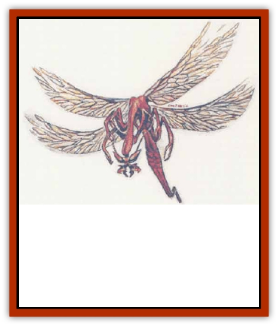

# Addazahr

| Statistic | **Addazahr** |
| --- | --- |
| **Activity Cycle:** | Day |
| **Alignment:** | Neutral |
| **Armor Class:** | 4 |
| **Climate/Terrain:** | Tropical, subtropical, and temperate/Desert, hills, plains |
| **Damage/Attack:** | 1 + disease |
| **Diet:** | Omnivore |
| **Frequency:** | Uncommon |
| **Hit Dice:** | 1 hp |
| **Intelligence:** | Animal (1) |
| **Magic Resistance:** | Nil |
| **Morale:** | Unsteady (6) |
| **Movement:** | 6, Fl 18 (B) |
| **No. Appearing:** | 6-60 |
| **No. of Attacks:** | 1 |
| **Organization:** | Swarm |
| **Size:** | T (2&rdquo; long) |
| **Special Attacks:** | Disease |
| **Special Defenses:** | Nil |
| **THAC0:** | 20 |
| **Treasure:** | Nil |
| **XP Value:** | 15 |

Addazahr, or *backbiters*, are small, slender, winged [[Insect_Giant|insects]] about two inches in length. They dwell in deserts, plains, and hills. Their pale amber color and extreme elongation make them resemble nothing so much as a piece of hay or straw. Addazahr wings are so fragile it is almost impossible to see them when the insects are in flight.

**Combat:** Addazahr do not engage in combat per se. They are nonaggressive, seeking only to gain sustenance in the form of blood from warm-blooded creatures.

Their bite causes only one point of damage, but it injects a small amount of their saliva into the bloodstream of their victims. This saliva works as a disease, causing soreness and swelling of the joints in humans and animals other than beasts of burden (a successful saving throw vs. paralyzation negates this effect).

Those animals which are primarily used as mounts or to bear burdens, such as [[Camel|camel]] and [[Horse|horses]], are affected more seriously, though usually not fatally. In such cases, the saliva attacks the muscles of the animal's back, causing weakness and severe pain. The animal so affected cannot carry burdens or be induced to move far.

The disease in either humans or animals can be cured by a *cure disease* spell. Otherwise, those affected return to normal in approximately two weeks. A few of the desert tribes claim to know of a nonmagical remedy which is effective within three days, but reports of this are unsubstantiated. Caravans attract the addazahr, and their depredations can cause loss of time while camels recover, loss of money due to late arrivals at market, or even loss of life in cases where the caravan becomes stranded far from a water source. Because of their physical forms and the effect their bite produces, this bane of merchants is sometimes jokingly referred to as the "straw that broke the camel's back".

Almost any sort of attack will kill addazahr. They are susceptible to both normal and magical cold or fire, and any hit upon them will destroy them. Water and other liquids do them no particular harm, unless they are completely immersed in the liquid and restrained from flying or crawling out of it, in which case they will drown like any other air-breathing creature.

**Habitat/Society:** Addazahr move about almost constantly, seeking out food. They are most commonly encountered in arid, seasonal grasslands in deserts. Though they are omnivores, they need to feed on the blood of warm-blooded creatures in order to reproduce. Females that have fed on blood enter a cycle and produce eggs within 72 hours. The eggs (which are too small to be easily seen by the unaided human or demihuman eye) are laid in whatever terrain the insects are currently passing through. They hatch in a month. If there are no plants or animals nearby upon which the young can feed when they hatch, they die. Even if they take in blood as their chief sustenance, the young insects cannot reproduce until they are three months old. These are the chief regulating factors of their existence, keeping the fast-breeding insects within reasonable bounds. They can live to be up to a year old.

Addazahr have no permanent lair and hoard no treasure.

**Ecology:** Addazahr are parasites. Their role is that of a scavenger and occasional accidental pollinator. They can feed on carrion, though they cannot use any blood gained thereby to reproduce, and they often break down small seed casings for food. Their wings, though fragile, act as collectors of pollen, and they may transport pollen from one plant to another.

If their eggs can be located, they can be gathered and carried without harm to them. When they hatch, they can be kept in glass or pottery jars so long as they have air and food.

---
## Discovery & Documentation

**Source Publication:** Monstrous Compendium, 1995 Annual, Volume 2 (1995)
**Campaign Setting:** Advanced Dungeons & Dragons 2nd Edition
**Author(s):** Jon Pickens

### Other Creatures Found in This Source Book
   * [[Aboleth_Savant|Aboleth, Savant]]
   * [[Amiq_Rasol|Amiq Rasol]]
   * [[Arch-Shadow|Arch-Shadow]]
   * [[Automaton_Scaladar|Automaton, Scaladar]]
   * [[Automaton_Trobriand's|Automaton, Trobriand's]]
   * [[Bat_Sporebat|Bat, Sporebat]]
   * [[Beetle_Dragon|Beetle, Dragon]]
   * [[Bi-nou|Bi-nou]]
   * [[Boggle|Boggle]]
   * [[Brownie_Dobie|Brownie, Dobie]]
   * [[Brownie_Quickling|Brownie, Quickling]]
   * [[Cat_Crypt|Cat, Crypt]]
   * [[Cat_Great_Cath_Shee|Cat, Great, Cath Shee]]
   * [[Centaur-kin_Dorvesh|Centaur-kin, Dorvesh]]
   * [[Centaur-kin_Gnoat|Centaur-kin, Gnoat]]
   * [[Centaur-kin_Ha'pony|Centaur-kin, Ha'pony]]
   * [[Centaur-kin_Zebranaur|Centaur-kin, Zebranaur]]
   * [[Chronolily|Chronolily]]
   * [[Curst|Curst]]
   * [[Darktentacles|Darktentacles]]
   * [[Dinosaur_Aquatic|Dinosaur, Aquatic]]
   * [[Dinosaur_II|Dinosaur II]]
   * [[Dinosaur_III|Dinosaur III]]
   * [[Doppelganger_Greater|Doppelganger, Greater]]
   * [[Dragon_Brine|Dragon, Brine]]
   * [[Dragon_Half-|Dragon, Half-]]
   * [[Dragon-kin_Sea_Wyrm|Dragon-kin, Sea Wyrm]]
   * [[Dwarf_Wild|Dwarf, Wild]]
   * [[Ekimmu|Ekimmu]]
   * [[Elemental_Nature|Elemental, Nature]]
   * [[Elf_Winged|Elf, Winged]]
   * [[Fish_Great_Glacier|Fish (Great Glacier)]]
   * [[Fish_Subterranean|Fish, Subterranean]]
   * [[Fish_Toril|Fish (Toril)]]
   * [[Flareater|Flareater]]
   * [[Flumph|Flumph]]
   * [[Froghemoth|Froghemoth]]
   * [[Ghost_Casurua|Ghost, Casurua]]
   * [[Ghost_Ker|Ghost, Ker]]
   * [[Ghul|Ghul]]
   * [[Ghul-Kin|Ghul-Kin]]
   * [[Giant_Half-giant|Giant, Half-giant]]
   * [[Golem_Burning_Man|Golem, Burning Man]]
   * [[Golem_Phantom_Flyer|Golem, Phantom Flyer]]
   * [[Gulguthhydra|Gulguthhydra]]
   * [[Hakeashar|Hakeashar]]
   * [[Horse_Moon-|Horse, Moon-]]
   * [[Human_Dragonslayer|Human, Dragonslayer]]
   * [[Human_Vistana|Human, Vistana]]
   * [[Jellyfish_Giant|Jellyfish, Giant]]
   * [[Kalin|Kalin]]
   * [[Kholiathra|Kholiathra]]
   * [[Laerti|Laerti]]
   * [[Leucrotta_Greater|Leucrotta, Greater]]
   * [[Lich_Suel|Lich, Suel]]
   * [[Lurker_Shadow|Lurker, Shadow]]
   * [[Lycanthrope_Werepanther|Lycanthrope, Werepanther]]
   * [[Lycanthrope_Wereshark|Lycanthrope, Wereshark]]
   * [[Mammal_Herd_II|Mammal, Herd II]]
   * [[Marl|Marl]]
   * [[Meenlock|Meenlock]]
   * [[Mimic_Greater|Mimic, Greater]]
   * [[Mold_II|Mold II]]
   * [[Mummy_Creature|Mummy, Creature]]
   * [[Nyth|Nyth]]
   * [[Ooze_Slime_Jelly_Ghaunadan|Ooze/Slime/Jelly, Ghaunadan]]
   * [[Palimpsest|Palimpsest]]
   * [[Peltast|Peltast]]
   * [[Plant_Dangerous_II|Plant, Dangerous II]]
   * [[Pleistocene_Animal|Pleistocene Animal]]
   * [[Pudding_Subterranean|Pudding, Subterranean]]
   * [[Raggamoffyn|Raggamoffyn]]
   * [[Snake_Serpent|Snake, Serpent]]
   * [[Snake_Serpent_Vine|Snake, Serpent Vine]]
   * [[Sphinx_Draco-|Sphinx, Draco-]]
   * [[Sprite_Seelie_Faerie|Sprite, Seelie Faerie]]
   * [[Sprite_Unseelie_Faerie|Sprite, Unseelie Faerie]]
   * [[Squealer|Squealer]]
   * [[Turtle_Giant|Turtle, Giant]]
   * [[Umpleby|Umpleby]]
   * [[Vizier's_Turban|Vizier's Turban]]
   * [[Wall_Walker|Wall Walker]]
   * [[Webbird|Webbird]]
   * [[Yak-Man|Yak-Man]]
   * [[Zorbo|Zorbo]]
