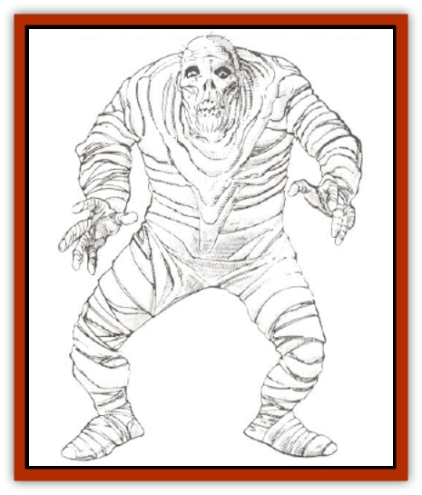

# Adherer

| Statistic | **Adherer** |
| --- | --- |
| **Activity Cycle:** | Any |
| **Alignment:** | Lawful evil |
| **Armor Class:** | 3 |
| **Climate/Terrain:** | Temperate/Forest |
| **Damage/Attack:** | 1-3 |
| **Diet:** | Carnivore |
| **Frequency:** | Rare |
| **Hit Dice:** | 4 |
| **Intelligence:** | Semi- (2-4) |
| **Magic Resistance:** | Special |
| **Morale:** | Steady (12) |
| **Movement:** | 9 |
| **No. Appearing:** | 1-4 |
| **No. of Attacks:** | 1 |
| **Organization:** | Pack |
| **Size:** | M (5-6' tall) |
| **Special Attacks:** | Adhesion |
| **Special Defenses:** | Adhesion |
| **THAC0:** | 17 |
| **Treasure:** | Nil |
| **XP Value:** | 650 |

At first glance the adherer seems like a [[Mummy|mummy]], with folds of off-white skin resembling filthy bandages. Adherers can be distinguished from mummies by the sour, mucilaginous smell that accompanies them. The smell comes from a resin-like secretion with adhesive properties that is constantly exuded through the pores of the adherer's skin.

**Combat:** The standard attack form of the adherer is to lie in wait for its victim, usually covering its sticky body with twigs and leaves in order to blend in with the surrounding environment. Due to the adherer's skill at concealing itself, its victims suffer a -4 to their surprise rolls. However, this reliance on surprise means that if it is spotted before it can leap onto its victim, it will flee 40%, of the time.

A concealed adherer will then leap out onto the closest target and attempt to attach itself by means of the adhesive resin which covers all portions of the adherer's body. Once attached, the adherer will punch, kick, and, if possible, suffocate its victim. If the adherer is being attacked by companions of its intended victim, it will attempt to use the victim as a living shield between itself and the attacker.

Due to the secretions from the adherer, all edged or blunt weapons will stick to its body, doing only half the normal damage. Piercing weapons do full damage but will require the next melee round to pull free. The adhesive is so strong it requires a strength of 22 to break free, but fire, boiling liquids, or the adherer's own body fluids can weaken the bond. Boiling liquids will reduce the effects of the resin for one combat round only, to the point at which a strength of 12 can break free. After one round, the resin returns to full strength once more.

The flammable nature of the resin in the adherer's body makes it particularly susceptible to fire attacks. It will take full damage from normal fire (no roll necessary). Any type of magical fire requires a saving throw vs. spells for the adherer: success means the adherer takes normal damage; failure means double damage.

Despite its mummy-like appearance, the adherer is not an undead creature, and therefore it cannot be turned by a priest or paladin. Adherers are immune to all first level spells and to normal missiles.

**Habitat/Society:** Adherers are territorial creatures that tend to live in shallow caves, either alone or in a small group. The pack does not have a leader; each creature acts on its own instincts.

Whether or not there are other adherers about, there is a good chance that the adherer will share its dwelling with at least one [[Spider|large spider]]. Adherers seem to be able to communicate telepathically with arachnids and will often cooperate with them to trap prey. Spider webs are particularly favored by adherers as part of their disguise. Adherers will never attack any type of spider.

The lair of an adherer is generally clean, since everything except stone sticks to the body. The creature can voluntarily release items attached to its body by secreting a solvent to the sticky resin. Adherers normally hide their treasures in a pile of rotting vegetation in or near their lair.

**Ecology:** Adherers do not breed like mammals or reptiles. Sages have suggested that the adherer simply splits into two creatures if there is enough prey in the area to support more than one. The normal lifespan of an adherer is 35 years.

All attempts to use the adherer's bodily secretions to make potions, adhesives, or any other item, have failed. The fluid loses its potency within 12 hours of the creature's death, and no magical or mundane scans has been found to prevent or even slow this deterioration.

---
## Discovery & Documentation

**Source Publication:** MC14 Fiend Folio Appendix (1992)
**Campaign Setting:** Fiends Folio
**Author(s):** Don Bingle, John Terra, Wes Nicholson, Tim Beach, Steve Hardinger, Kris Hardinger, Rob Nicholls, Greg Swedberg, Al Boyce, Vince Garcia, Norm Ritchie

### Other Creatures Found in This Source Book
   * [[Aballin|Aballin]]
   * [[Achaierai|Achaierai]]
   * [[Algoid|Algoid]]
   * [[Al-Mi'raj|Al-Mi'raj]]
   * [[Apparition|Apparition]]
   * [[Caterwaul|Caterwaul]]
   * [[Coffer_Corpse|Coffer Corpse]]
   * [[Crabman|Crabman]]
   * [[Dark_Creeper|Dark Creeper]]
   * [[Dark_Stalker|Dark Stalker]]
   * [[Darter|Darter]]
   * [[Denzelian|Denzelian]]
   * [[Dune_Stalker|Dune Stalker]]
   * [[Dwarf_Urdunnir|Dwarf, Urdunnir]]
   * [[Falcon_Fire|Falcon, Fire]]
   * [[Faux_Faerie|Faux Faerie]]
   * [[Flawder|Flawder]]
   * [[Fyrefly|Fyrefly]]
   * [[Gambado|Gambado]]
   * [[Garbug|Garbug]]
   * [[Giant_Fhoimorien|Giant, Fhoimorien]]
   * [[Gibberling|Gibberling]]
   * [[Gorbel|Gorbel]]
   * [[Grimlock|Grimlock]]
   * [[Hellcat|Hellcat]]
   * [[Ice_Lizard|Ice Lizard]]
   * [[Iron_Cobra|Iron Cobra]]
   * [[Khargra|Khargra]]
   * [[Mantari|Mantari]]
   * [[Penanggalan|Penanggalan]]
   * [[Pernicon|Pernicon]]
   * [[Phantom_Stalker|Phantom Stalker]]
   * [[Retriever|Retriever]]
   * [[Ruve|Ruve]]
   * [[Scathe|Scathe]]
   * [[Sheet_Ghoul_Sheet_Phantom|Sheet Ghoul/Sheet Phantom]]
   * [[Shocker|Shocker]]
   * [[Spanner|Spanner]]
   * [[Stwinger|Stwinger]]
   * [[Sussurus|Sussurus]]
   * [[Symbiotic_Jelly|Symbiotic Jelly]]
   * [[Terithran|Terithran]]
   * [[Thunder_Children|Thunder Children]]
   * [[Troll_Ice|Troll, Ice]]
   * [[Tween|Tween]]
   * [[Umpleby|Umpleby]]
   * [[Volt|Volt]]
   * [[Xill|Xill]]
   * [[Xvart|Xvart]]
   * [[Zygraat|Zygraat]]
