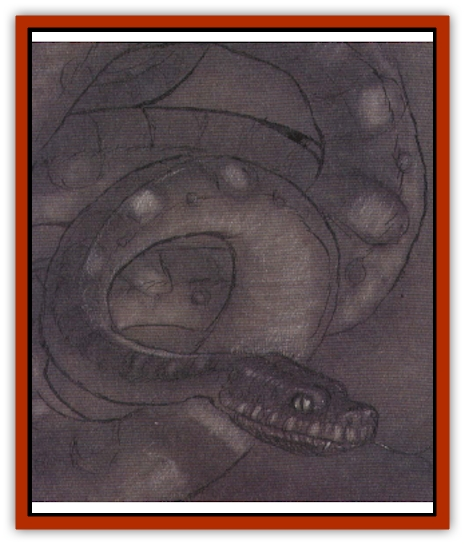

# Aeserpent

| Statistic | **Aeserpent** |
| --- | --- |
| **Activity Cycle:** | Night |
| **Alignment:** | Neutral |
| **Armor Class:** | 3 (-1 in darkness) |
| **Climate/Terrain:** | Beastlands |
| **Damage/Attack:** | 2d4+1 |
| **Diet:** | Carnivore |
| **Frequency:** | Very rare |
| **Hit Dice:** | 7 |
| **Intelligence:** | Low (5-7) |
| **Magic Resistance:** | Nil |
| **Morale:** | Steady (11-12) |
| **Movement:** | 18 |
| **No. Appearing:** | 1 (or mated pair; see <q>Habitat/Society</q>) |
| **No. of Attacks:** | 1 |
| **Organization:** | Solitary |
| **Size:** | L (20' long) |
| **Special Attacks:** | Venom, swallows whole |
| **Special Defenses:** | Invisible in darkness |
| **THAC0:** | 13 |
| **Treasure:** | Nil |
| **XP Value:** | 2,000 |

The aeserpent (also known as *darkstrike* or *deathstrike*) is a gigantic [[Snake|snake]] that can grow up to 20 feet long. Its smooth, scaly flesh is black as night, with a sheen that makes it appear wet - even slimy - although the hide is completely dry to the touch. In darkness, only its thin yellow eyes, and perhaps its fangs, can be seen - if that.

It is a common misconception that the aeserpent is somehow vampiric in nature. This is completely untrue: the snake is neither undead nor magical. The aeserpent is a natural beast with a unique venom and excellent darkness camouflage.

**Combat:** Night is the ally of the aeserpent. The creature is completely undetectable - and effectively invisible - in darkness, near darkness, or even deep shadow. Lying in an ambush, the aeserpent strikes with a +2 modifier to foes' surprise rolls as it attacks its prey with a venomous bite.

The venom of the darkstrike is such that the metabolism of a victim who misses his or her saving throw vs. poison is completely changed. The body of the poisoned foe begins to break down and consume its own blood, quickly draining the life from itself. The victim dies after 2d6 rounds of intense pain. Ther is a 5% chance per point of Intelligence that he realizes exactly what is happening to him. In such a case, the victim also realizes that consumig the blood of others will allow him to live a little longer, as his body now thrives on blood for its supply of oxygen, water, and nutrients. *Slow poison* and *neutralize poison* slows or stops the process, but does not heal the damage. When these spells are applied, the victim has only 1d12 hit points remaining. Curatice spells (*cure light wounds*, *cure serious wounds*) are required to restore hit points and heal the damage.

The aeserpent continues to attack a foe even after it has injected its poison. The further doses of poison have virtually no effect, but if a natural 19 or 20 is scored on the darkstrike's attack roll, the snake has swallowed its prey eeven though the victim is not yet dead. Such victims are treated as having been swallowed whole and can do nothing to free themselves unless they have a short (less than 2-foot-long) stabbing or slashing weapon drawn prior to being swallowed. Otherwise, swallowed victims must be saved by companiions outside the aeserpent. Those swallowed die twice as quickly as they would if merely poisoned. Victims are never swallowed whole on the creature's initial attack, as the darkstrike cannot digest unpoisoned victims.

Like all creatures of the Beastlands, darkstrikes are not subject to spells which affect animals, even *snake charm*.

**Habitat/Society:** The darkstrike lives primarily in the dark shadows of Karasuthra, bvt it also can be found in the gray mists of Brux. These snakes almost always hunt alone, but occasionally a mated pair uis encountered. Any pair so found is doubly dangerous, for the snakes act in concert, luring their prey into devious traps including natural pits, cul-de-sacs quicksand, landslides, and other phenomena. They are viciously protective of one another, gaining a +1 to attack and damage if acting to protect a mate.

These pairs produce a clutch of 1d8 eggs, caring for and protecting them as fervently as they do each other. Once the eggs hatch, however, the young are on their own.

**Ecology:** In a <q>normal</q> ecosystem, predators as efficient as the darkstrike would most likely clear vast areas of all potential pery very quickly. They need to consume a large amount of food each week to stay alive - their digestive systems work much faster than that of other snakes. The Beastlands, however, have a virtually limitless number of animals, and therefore an unending supply of food. Even other predators such as wolves or bears are potential prey for the aeserpent.

The great sage Tyranimoth D'skirn theorizes that the darkstrike actually originated on anothe plane, possibly even the Abyss or some other Lower Plane. What Tyranimoth overlooks is that the aeserpent is not inherently evil. Despite its voracious appetite, sinister appearance, and terrifying venom, it is simply a natural animal that fights and kills to survive. If the beast comes from another realm, that plane is likely the Prime Material. It is possible that the aeserpent, like most of the other residents of the Beastlands, was a creature found in the wilds of a prime world but was hunted to extinction there out of fear and hatred, leaving specimens only in the Beastlands. Another theory states that the aesperpent made its way to the Beastlands from some other place (wherever that was) and simply found the Beastlands better suited to its survival, leaving its original home forever.

---
## Discovery & Documentation

**Source Publication:** Planes of Conflict (1995)
**Campaign Setting:** Planescape
**Author(s):** Colin Mccomb, Dale Donovan

### Other Creatures Found in This Source Book
   * [[Asuras|Asuras]]
   * [[Buraq|Buraq]]
   * [[Delphon|Delphon]]
   * [[Diakk|Diakk]]
   * [[Ethyk|Ethyk]]
   * [[Gautiere|Gautiere]]
   * [[Linqua|Linqua]]
   * [[Ni'iath|Ni'iath]]
   * [[Phiuhl|Phiuhl]]
   * [[Quesar|Quesar]]
   * [[Slasrath|Slasrath]]
   * [[Warden_Beast|Warden Beast]]
   * [[Yugoloth_Greater_Baernaloth|Yugoloth, Greater, Baernaloth]]
