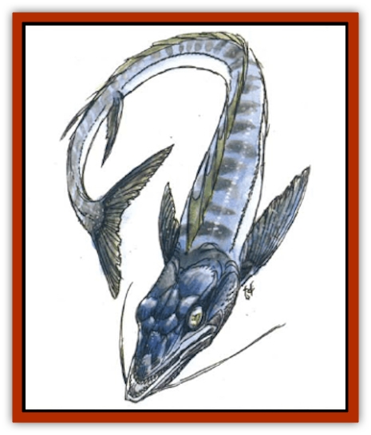

# Afanc

| Statistic | **Afanc** |
| --- | --- |
| **Activity Cycle:** | Any |
| **Alignment:** | Neutral (evil) |
| **Armor Class:** | 6 |
| **Climate/Terrain:** | Warm ocean waters |
| **Damage/Attack:** | 5d4 or 3d4/3d4 |
| **Diet:** | Carnivore |
| **Frequency:** | Very rare |
| **Hit Dice:** | 15 |
| **Intelligence:** | Low (5-7) |
| **Magic Resistance:** | Nil |
| **Morale:** | Elite (13) |
| **Movement:** | Sw 15 (see below) |
| **No. Appearing:** | 1 |
| **No. of Attacks:** | 1 or 2 |
| **Organization:** | Solitary |
| **Size:** | G (50' long) |
| **Special Attacks:** | Whirlpool, swallows whole |
| **Special Defenses:** | Nil |
| **THAC0:** | 5 |
| **Treasure:** | See below |
| **XP Value:** | 11,000 |

This huge [[Fish|fish]], known as *gawwar samakat* in Zakhara, is greatly feared for its ability to create whirlpools. The afanc's body is gray or blue-gray, and its scales blend very smoothly. This and its great size lead many to confuse the creature with a [[Whale|whale]] when it is first sighted. The afanc's vertical tail and its head, wide-mouthed with obvious gills, make it clear that the creature is a fish.

Afanc are somewhat intelligent, and some sailors tell of specimans that have learned to speak (and even sing) human tongues in a loud, gravelly voice. These afanc are said to use their voices to lead sailors into danger.

**Combat:** A afanc seldom hunts for prey, preferring to feed on those who would hunt it. It is usually encountered in shallow salt water, where it swims along leisurely at the surface of the ocean, waiting to be mistaken for a whale. When approached by a vessel between 30 and 60 feet in length, the afanc attacks by swimming rapidly around it in ever-closing circles, creating a whirlpool that pulls the craft into the depths. It begins circling its target at its normal movement rate, at a distance of 100 feet. At this time, it is near the surface of the water, but the partial cover of the water gives opponents firing missiles a -2 penalty to attack rolls, in addition to any range modifiers. Those foolish enough to enter melee with the afanc cause the creature to break off its attack on the ship and attempt to eat its attackers.

The afanc requires 1d4+4 rounds to create a whirlpool. Each round, it moves faster, closing to within 40 feet of the vessel. During each succeeding round, the ship spins faster and the afanc gains depth, increasing opponents' missile attack penalties by -2 per round, to a maximum penalty of -12. The great fish eventually reaches a movement rate of 30, its increasing speed and innate magic creating a whirlpool that draws the ship down into the water after a period equal to one round per 10 feet of ship's length. Since the attack is partially magical in nature, a *dispel magic* cast on the afanc, or some sort of magic resistance on the ship, decreases the rate of sinking by half (one round per 5 feet of ship's length).

Seagoing vessels more than 60 feet long are generally unmolested, but they may be rammed by the creature. Boats and rafts less than 30 feet long are almost always rammed in an attempt to capsize them. A vessel is considered AC 5, AC 3 if evading. If the afanc's attack roll is 4 or more greater than that needed to hit, the ship capsizes (an attack roll of 4 or more capsizes a regular vessel, while an attack roll of 6 or more capsizes one trying to evade). At the DM's discretion, extraordinary materials or magical aid can add to a ship's AC. When a ship is rammed, a successful saving throw vs. crushing blow must be rolled, or the ship sinks in 1d10 rounds. Most hulls are treated as thin wood for the saving throw, meaning a 13 or greater must be rolled to avoid sinking.

The afanc attacks those who try to escape a sinking ship, causing 3d4 damage with each front flipper and 5d4 damage with its bite. If the creature's attack roll on a bite is 4 or more greater than the roll needed to hit, it swallows victims of size large and smaller. A swallowed creature dies in six rounds and is completely digested in two hours.

Anyone trapped inside a gawwar samakat can attempt to cut an escape route. Although the interior is AC 8, each round the creature's digestive juices weaken the victim, causing a cumulative -1 penalty to the damage a victim can inflict.

**Habitat/Society:** Though native to salt water, a afanc enters the mouth of a large river to lay its eggs. The eggs are a delicacy to many creatures, including humans.

**Ecology:** The gawwar samakat is a dangerous predator with few natural enemies. Humans have many uses for its scales and bones, however, using them for weapons and decorations.

**Young Afanc**

  Young afanc (up to 15 feet long) may be encountered in rivers. They have 5 HD each and roam in packs of 3d6 individuals. A pack of six or more can form a whirlpool as an adult. Their flipper damage is 1d4 and their bite damage is 3d4.

---
## Discovery & Documentation

**Source Publication:** City of Delights (1993)
**Campaign Setting:** Al-Qadim (Forgotten Realms)
**Author(s):** tom Prusa, Tim Beach, Steve Kurtz

### Other Creatures Found in This Source Book
   * [[Al-Jahar|Al-Jahar]]
   * [[Bird_Talking|Bird, Talking]]
   * [[Cat_Winged|Cat, Winged]]
   * [[Crypt_Servant|Crypt Servant]]
   * [[Elemental_Vermin|Elemental Vermin]]
   * [[Genie_Tasked_Harim_Servant|Genie, Tasked, Harim Servant]]
   * [[Ogre_Zakhara|Ogre (Zakhara)]]
   * [[Opinicus|Opinicus]]
   * [[Parasite|Parasite]]
   * [[Pasari-Niml|Pasari-Niml]]
   * [[Sirine|Sirine]]
   * [[Tatalla|Tatalla]]
   * [[Tree_Singing|Tree, Singing]]
