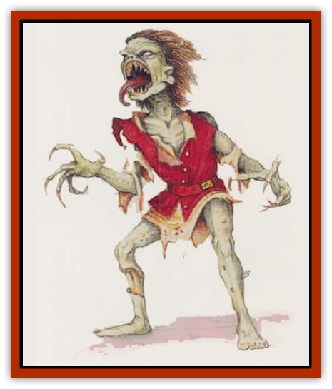

# Agarat

| Statistic | **Agarat** |
| --- | --- |
| **Activity Cycle:** | Night |
| **Alignment:** | Chaotic evil |
| **Armor Class:** | 4 |
| **Climate/Terrain:** | Any land |
| **Damage/Attack:** | 1d3 (claw)/1d3 (claw)/1d3 (bite) |
| **Diet:** | Scavenger |
| **Frequency:** | Very rare |
| **Hit Dice:** | 4+3 |
| **Intelligence:** | Low (7) |
| **Magic Resistance:** | Nil |
| **Morale:** | Fearless (20) |
| **Movement:** | 9 |
| **No. Appearing:** | 1d8 |
| **No. of Attacks:** | 3 |
| **Organization:** | Pack |
| **Size:** | M (5-7' tall) |
| **Special Attacks:** | Scream |
| **Special Defenses:** | See below |
| **THAC0:** | 15 |
| **Treasure:** | R (B,T) |
| **XP Value:** | 975 |

The agarat is a hideous undead creature that resembles a [[Ghoul|ghoul]] - recognizably humanoid, but gaunt and disfigured into a creature of darkness. Its tongue is long and rough, and well adapted to scouring flesh and marrow from bones. Its teeth are long and sharp, and its nails have lengthened and strengthened into claws. An agarat exudes a carrion stench like a [[Ghoul|ghast]], though the ghast's odor is stronger.

While it looks like a ghoul and smells like a ghast, an agarat's *sound* sets it apart. It emits a blood-curdling, energy-draining scream, which is in most powerful weapon in combat

**Combat:** This creature lacks the ghoul's fearsome ability to paralyze with its touch. However, the agarat's scream is even more powerful. The creature can scream once per turn. All within 20 feet of an agarat must make a successful saving throw vs. spell (adjusted for Wisdom), or suffer a temporary, one-level energy drain.

This effect is generally the same as that caused by other energy-draining undead, such as [[Vampire_General_Information|vampires]] and [[Spectre|spectres]], but it lasts only 1d4 turs. After that time has elapsed, surviving characters regain lost levels. The scream effects are cumulative; any creature temporarily drained of all life energy falls unconscious and cannot be awakened for 2d6 turns.

Like most undead, the agarat is immune to *sleep*, *charm*, and *hold* spells. Further, it can be hit solely by cold iron or magical wepons. An agarat is turned as a spectre.

Agarats often lead packs of ghouls in combat with mortals. While ghoulish claws make direct attacks on tender, living flesh, the agarats hang back and scream. The baleful influence of the agarats prevents the ghouls from being turned unless the result is sufficient to turn the agarats also. The ghouls flee first.

**Habitat/Society:** Like ghouls, agarats haunt the dark places of death - graveyards, mausoleums, charnel houses, and more gruesome sites, such as the secret burial grounds of massacres. There they feed on rotting corpses. Agarats favor crude strategies to overcome their victims, or to search for carrion on which to feed.

In wilderness areas or ruins, agarats are most often found amongst packs of ghouls (60% chance), with perhaps twice as many ghouls as agarats. Ghasts are sometimes in their company as well (20% chance for 1d4 ghasts).

In any pack, one agarat leads the others. The leader may be the oldest or the strongest - a creature that has cowed others into submission. Should this leader be slain or choose to flee, the others soon follow suit. Any ghouls in their company may not follow, however. Ghouls who stay behind occupy opponents who might otherwise pursue the agarats.

**Ecology:** Agarats sometimes serve as the henchmen for a more powerful undead creature such as a [[Lich|lich]] or vampire, which rewards its minions with a steady supply of corpses.

No one knows how these creatures came into being. Fortunately, encounters with agarats are extremely rare now, Histories and chronicles speak of times when many more were seen - close behind wars, disease, and famine. At such times, the graveyards were packed with corpses, the agarats' food.

**Greater Agarat**

  Very rarely encountered, the greater agarat is even more powerful than the common type. It boasts 8+6 Hit Dice, has an Armor Class of 0, and cannot be harmed by weapons of less than +2 enchantment. Its scream drains two levels, it has the paralyzation abilities of a ghast and all of its attacks inflict 1d6 points of damage. Its carrion stench gives those who fail a saving throw vs. poison a -2 penalty to their attack rolls. A greater agarat has a much higher intelligence rating than a common agarat (11 to 14). Rumors hold that somewhere exists at least one greater agarat with maximum Intelligence and the powers of a 5th-level wizard.

The greater agarat is turned as a <q>special</q> creature.

Any group of 8 agarats is 10% likely to be led by a greater agarat. In this case, the pack also includes 2d12 ghouls and possibly 2d4 ghasts (50% likely).

---
## Discovery & Documentation

**Source Publication:** Mystara Appendix (1994)
**Campaign Setting:** Mystara
**Author(s):** John Nephew, Teeuwynn Woodruff, John Terra, Skip Williams

### Other Creatures Found in This Source Book
   * [[Actaeon|Actaeon]]
   * [[Ash_Crawler|Ash Crawler]]
   * [[Baldandar|Baldandar]]
   * [[Bargda|Bargda]]
   * [[Bhut|Bhut]]
   * [[Bird_Mystara|Bird (Mystara)]]
   * [[Blackball|Blackball]]
   * [[Choker|Choker]]
   * [[Coltpixie|Coltpixie]]
   * [[Crone_of_Chaos|Crone of Chaos]]
   * [[Darkhood|Darkhood]]
   * [[Darkwing|Darkwing]]
   * [[Decapus|Decapus]]
   * [[Deep_Glaurant|Deep Glaurant]]
   * [[Diabolus|Diabolus]]
   * [[Dimensional_Warper|Dimensional Warper]]
   * [[Dragon_Mystara_Crystalline|Dragon (Mystara), Crystalline]]
   * [[Dragon_Mystara_Jade|Dragon (Mystara), Jade]]
   * [[Dragon_Mystara_Onyx|Dragon (Mystara), Onyx]]
   * [[Dragon_Mystara_Ruby|Dragon (Mystara), Ruby]]
   * [[Drake_Mystara|Drake (Mystara)]]
   * [[Dragonfly|Dragonfly]]
   * [[Dusanu|Dusanu]]
   * [[Elemental_of_Chaos_Air_Earth|Elemental of Chaos, Air/Earth]]
   * [[Elemental_of_Chaos_Fire_Water|Elemental of Chaos, Fire/Water]]
   * [[Elemental_of_Law_Air_Earth|Elemental of Law, Air/Earth]]
   * [[Elemental_of_Law_Fire_Water|Elemental of Law, Fire/Water]]
   * [[Familiar_Mystara|Familiar (Mystara)]]
   * [[Frost_Salamander|Frost Salamander]]
   * [[Fundamental_Air_Earth|Fundamental, Air/Earth]]
   * [[Fundamental_Fire_Water|Fundamental, Fire/Water]]
   * [[Gargantua_Mystara|Gargantua (Mystara)]]
   * [[Geonid|Geonid]]
   * [[Ghostly_Horde|Ghostly Horde]]
   * [[Giant_Athach|Giant, Athach]]
   * [[Giant_Hephaeston|Giant, Hephaeston]]
   * [[Golem_Drolem|Golem, Drolem]]
   * [[Golem_Mystara_I|Golem (Mystara) I]]
   * [[Golem_Mystara_II|Golem (Mystara) II]]
   * [[Golem_Mystara_III|Golem (Mystara) III]]
   * [[Gray_Philosopher|Gray Philosopher]]
   * [[Guardian_Warrior|Guardian Warrior]]
   * [[Gyerian|Gyerian]]
   * [[Herex|Herex]]
   * [[Hivebrood|Hivebrood]]
   * [[Horde|Horde]]
   * [[Hsiao|Hsiao]]
   * [[Huptzeen|Huptzeen]]
   * [[Hutaakan|Hutaakan]]
   * [[Imp_Mystara|Imp (Mystara)]]
   * [[Jellyfish_Giant_Mystara|Jellyfish, Giant (Mystara)]]
   * [[Kna|Kna]]
   * [[Kopru|Kopru]]
   * [[Lizard_Mystara|Lizard (Mystara)]]
   * [[Lizard-kin_Mystara|Lizard-kin (Mystara)]]
   * [[Lupin|Lupin]]
   * [[Lycanthrope_Werejaguar_Mystara|Lycanthrope, Werejaguar (Mystara)]]
   * [[Lycanthrope_Wereswine|Lycanthrope, Wereswine]]
   * [[Magen|Magen]]
   * [[Manikin|Manikin]]
   * [[Mek|Mek]]
   * [[Mujina|Mujina]]
   * [[Nagpa|Nagpa]]
   * [[Neh-thalggu|Neh-thalggu]]
   * [[Nightshade_Mystara|Nightshade (Mystara)]]
   * [[Nuckalavee|Nuckalavee]]
   * [[Pegataur|Pegataur]]
   * [[Phanaton|Phanaton]]
   * [[Plant_Dangerous_Mystara|Plant, Dangerous (Mystara)]]
   * [[Plasm|Plasm]]
   * [[Rakasta|Rakasta]]
   * [[Rock_Man|Rock Man]]
   * [[Sabreclaw|Sabreclaw]]
   * [[Sacrol|Sacrol]]
   * [[Scamille|Scamille]]
   * [[Shapeshifter|Shapeshifter]]
   * [[Shargugh|Shargugh]]
   * [[Shark-kin|Shark-kin]]
   * [[Sollux|Sollux]]
   * [[Spectral_Death|Spectral Death]]
   * [[Spectral_Hound|Spectral Hound]]
   * [[Spider-kin|Spider-kin]]
   * [[Spirit_Mystara|Spirit (Mystara)]]
   * [[Statue_Living|Statue, Living]]
   * [[Surtaki|Surtaki]]
   * [[Tabi|Tabi]]
   * [[Thoul|Thoul]]
   * [[Thunderhead|Thunderhead]]
   * [[Tiger_Ebon|Tiger, Ebon]]
   * [[Topi|Topi]]
   * [[Tortle|Tortle]]
   * [[Vampire_Velya|Vampire, Velya]]
   * [[White_Fang|White Fang]]
   * [[Worm_Mystara|Worm (Mystara)]]
   * [[Wyrd|Wyrd]]
   * [[Yowler|Yowler]]
   * [[Zombie_Lightning|Zombie, Lightning]]
