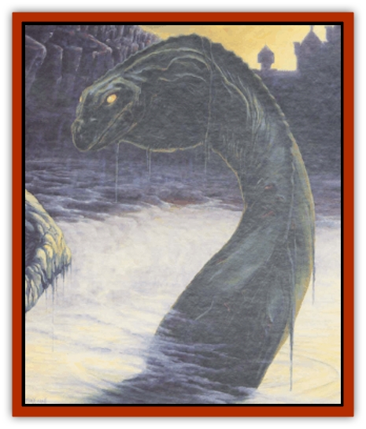

# Aggie

| Statistic | **Aggie** |
| --- | --- |
| **Activity Cycle:** | Any |
| **Alignment:** | Chaotic evil |
| **Armor Class:** | -3 |
| **Climate/Terrain:** | Special |
| **Damage/Attack:** | 3d8 |
| **Diet:** | Special |
| **Frequency:** | Unique |
| **Hit Dice:** | 13 |
| **Intelligence:** | Very (11-12) |
| **Magic Resistance:** | 20% |
| **Morale:** | Champion (16) |
| **Movement:** | Sw 12 |
| **No. Appearing:** | 1 |
| **No. of Attacks:** | 1 |
| **Organization:** | Solitary |
| **Size:** | G (100') |
| **Special Attacks:** | Breath weapon, spells |
| **Special Defenses:** | +1 or better weapon needed to hit, <i>fear</i> |
| **THAC0:** | 7 |
| **Treasure:** | B |
| **XP Value:** | 11,000 |

Aggie is a unique creature, found only in Forlorn. She is an ancient, gargantuan, [[Undead_Lake_Monster|undead water serpent]] with grayish-green skin and a huge mouth lined with needle-sharp teeth. Her scaly hide is reminiscent of the skin of a [[Zombie|zombie]], rotten-smelling and marked with rents and gaps through which pale white bones show. When swimming on the surface, she often appears to be a head followed by a series of rounded humps.

**Combat:** Aggie never leaves the lake, but she will attack any creature that comes close to its shore. She lures the curious and foolhardy into range by appearing briefly in the center of the lake, then disappearing under water, only to appear moments later within striking range of the shore. Despite her undead state, Aggie is extremely supple, and she can twist and curve her long body around, moving quickly through the water. She can coil her body underwater and strike like a [[Snake|snake]] up to 50 feet from the edge of the lake or up to 60 feet above the surface of the water.

Aggie bites for 3d8 points of damage. On any bite that inflicts 8 or more points, Aggie locks her jaws around the victim and pulls him or her down into her underwater lair. To break free, the victim must make a successful Strength check. Otherwise, Aggie holds the victim underwater until drowning results.

Aggie can exhale a highly toxic cloud of sickly yellow vapor, 40 feet long and 20 feet wide and high, three times per day, producing same effect as that of the 5th-level wizard spell *cloudkill*. Aggie's breath lingers in the air, moving slowly along with the breeze and sinking into depressions, for four rounds before dissipating.

Should the battle turn against Aggie, she can innately invoke the effects of the 4th-level wizard spell *fear* (three times per day). This affects all creatures within 100 feet who do not make a successful fear check.

Because Aggie is an undead creature, she may be turned (as a 10-HD creature). Due to Aggie's magical nature, a +1 or better weapon is required to hit her.

**Habitat/Society:** Aggie is a unique creature, yet there are some who speculate that there is more than one "serpent of the depths", saying they have sighted two separate sets of humps breaking the surface of the Lake of Red Tears at once. Some maintain that Aggie has a brood of little serpents, and that her attacks on any who approach the lake are the equivalent of a mother protecting her young. But it is unclear how an undead creature could give birth to young.

Aggie's watery lair is said to be filled with the treasures of those she has pulled down to their depths, but the lake has a depth of hundreds of feet, so it's unlikely that any of Aggie's treasure will ever be recovered. Even if items are, any armor or weapons in the hoard (unless magically protected) are likely to be rusted and useless.

**Ecology:** Because she is undead, Aggie has no natural life span. If killed, Aggie will not provide any useful products. Her hide is tough enough to use for (leather) armor or a shield, but it has an oppressive stench that will force a character trying to use it to make hourly saving throws vs. poison to avoid nausea (-1 penalty to attack rolls).

---
## Discovery & Documentation

**Source Publication:** Castles Forlorn (1993)
**Campaign Setting:** Ravenloft
**Author(s):** Lisa Smedman

### Other Creatures Found in This Source Book
   * [[Death's_Head_Tree|Death's Head Tree]]
   * [[Zombie_Wolf|Zombie Wolf]]
