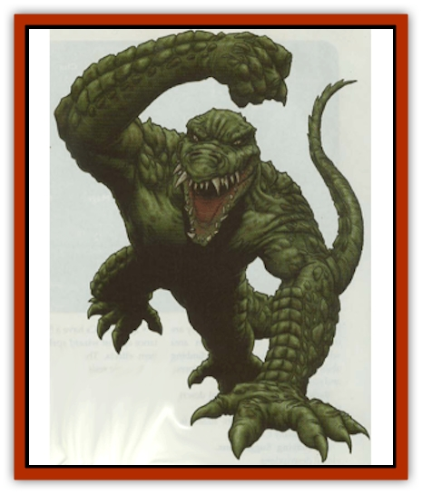

# Agrutha

| Statistic | **Agrutha** |
| --- | --- |
| **Activity Cycle:** | Any |
| **Alignment:** | Neutral |
| **Armor Class:** | 5 |
| **Climate/Terrain:** | Temperate swamp |
| **Damage/Attack:** | 1-4/1-4/1-6 or 1-10 |
| **Diet:** | Carnivore |
| **Frequency:** | Very rare |
| **Hit Dice:** | 4+3 |
| **Intelligence:** | Low (5-7) |
| **Magic Resistance:** | Nil |
| **Morale:** | Champion (15-16) |
| **Movement:** | 6, swim 12 |
| **No. Appearing:** | 1-8 |
| **No. of Attacks:** | 3 or 1 |
| **Organization:** | Tribal |
| **Size:** | M (7-8' tall) |
| **Special Attacks:** | Nil |
| **Special Defenses:** | Nil |
| **THAC0:** | 17 |
| **Treasure:** | D |
| **XP Value:** | 120 / Leader: 175 / Shaman: 175 |

Agrutha are huge, brutish versions of the normal [[Lizard_Man|lizard man]]. They have the snouts, powerful jaws, thick scales, and lashing tails of their animal ancestors, plus a pair of stubby legs and long, apelike arms. Agrutha ordinarily stand almost 8 feet tall and are hugely muscled. They wear no clothing and carry only what they need for the moment.

**Combat:** Agrutha prefer to attack by ambush. Like normal alligators on the hunt, they submerge themselves up to their eyes in muddy water and wait for a chance to spring. While doing this they can easily pass for logs or regular alligators to the casual eye. Though usually sluggish, agrutha are capable of short, sudden bursts of speed. Despite their size, they have a good chance of catching anybody by surprise who is not looking out for them. If enraged or unable to ambush, agrutha charge headlong into the midst of their enemies, bellowing the whole time.

Agrutha fight with their massive fists and a crushing bite. If attacked from behind or given enough room, they swing their tails around for 1-10 points of damage. Agrutha occasionally use weapons, preferably crude spears or clubs they made themselves, or else finer weapons taken from past opponents. Agrutha have a natural 18/76 Strength, which gives them a +2 attack bonus and a +4 damage bonus to weapon attacks.

A group of seven or more includes a tribal alpha leader with maximum hit points and 18/00 Strength. The leader usually (75% chance) has a weapon. If the tribe is large enough to have an alpha, there is a 25% chance that a shaman is in the group. Agrutha shamans are usually 1st or 2nd level and are never higher than 3rd unless they are player characters.

**Habitat/Society:** Agrutha live in the deepest marshes and swamps. They ordinarily associate in loose tribes, staking out a territory lake, riverbed, or similar place. The tribal alpha is the biggest and strongest agrutha in the area. Even if they are a part of a tribe, agrutha lend to hunt singly or in pairs. Females lay eggs once a year in 2-3 egg clusters. They dig a large hole out of the mud in a secluded spot and line it with reeds and branches, The females fiercely protect the eggs and young until they have grown enough to fend for themselves. They stay in the nest, letting the males hunt for them, and they gain a +2 attack and damage bonus while defending the nest.

Because they live in the same areas and have similar outlooks, agrutha are the most likely of all the sub-species to associate with common lizard folk. If the two peoples live close to each other, there is a good possibility the agrutha hunt and protect the territory along side their smaller cousins. Lizard kings and leaders enjoy using them as berserker shock troops.

**Ecology:** Agrutha eat the meat of whatever animal gets close enough to them while they are hunting, including humans. They will not, however, go out of their way to attack settlements unless they are goaded into doing so by other lizard folk. They typically subsist on deer, fish, bears, and whatever else they can gel their jaws on.

---
## Discovery & Documentation

**Source Publication:** Dragon268 (2000)
**Campaign Setting:** Dragon Magazine
**Author(s):** Michael Kuciak, Pete Venters

### Other Creatures Found in This Source Book
   * [[Crocodilian|Crocodilian]]
   * [[Geckonid|Geckonid]]
   * [[Varanid|Varanid]]
