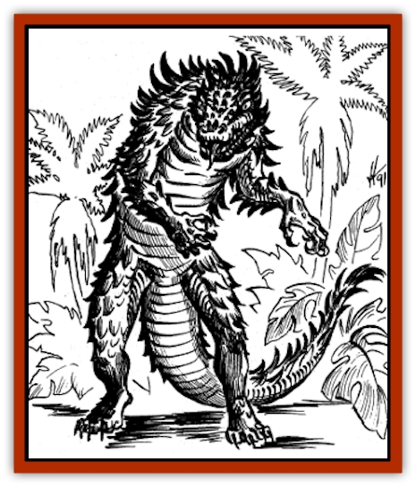

# Ahuizotl

| Statistic | **Ahuizotl** |
| --- | --- |
| **Activity Cycle:** | Any |
| **Alignment:** | Chaotic neutral |
| **Armor Class:** | 2 |
| **Climate/Terrain:** | Tropical and subtropical waters |
| **Damage/Attack:** | 1-6/1-6/3-18/2-20 |
| **Diet:** | Carnivore |
| **Frequency:** | Very rare |
| **Hit Dice:** | 10-12 |
| **Intelligence:** | Average (8-10) |
| **Magic Resistance:** | Nil |
| **Morale:** | Steady (12) |
| **Movement:** | 9, Sw 12 |
| **No. Appearing:** | 1 (2-5) |
| **No. of Attacks:** | 4 |
| **Organization:** | Solitary |
| **Size:** | H (18' long + 9' tail) |
| **Special Attacks:** | Breath weapon, rear claws for 2-5 (1d4 +1) each |
| **Special Defenses:** | Nil |
| **THAC0:** | 10 HD: 11 / 11-12 HD: 9 |
| **Treasure:** | I,U&times;10 |
| **XP Value:** | 10 HD: 9,000 / 11 HD: 10,000 / 12 HD: 11,000 |

Ahuitzotls are dangerous water beasts found in Maztica. They look something like alligators with long, feather-like blue-green scales. Their bodies are perched over comparatively long legs, rather than slung between them like an alligators. They have sharp teeth and long claws, and can breathe both water and air.

**Combat:** When attacked or when hunting, an ahuitzotl rushes into melee combat using its claws and teeth. It may also slap with its long tail for 2d10 damage. When fighting underwater, if an ahuitzotl hits with both front claws, it may follow up that attack with its rear claws for 1d4 +1 damage each. In addition, the ahuitzotl has a much-feared breath weapon which it may use three times per day.

If in danger (or simply on a rampage), an ahuitzotl will forego other attacks to spit a stream of water 15. long and 5. wide. It does 1d6 damage to anyone it hits. The water stream then becomes animate, with most of the abilities of a [[Elemental_Water_Kin_Water_Weird|water weird]]. The weird has 3+3 Hit Dice, AC 4, movement 12, and hit points equal to 1/3 of the ahuitzotl's (round up). It attacks as a 6-Hit Die monster (THAC0 15), and victims may be pulled into the water to drown (save vs. paralyzation each round or die). It attacks once per round and may affect only one victim at a time. It is directed mentally by the ahuitzotl.

This animated breath weapon can be slain by a *purify water* spell. Cold-based attacks slow the water weird, and fire-based attacks do half or no damage, depending on the creature's saving throw (made at the ahuitzotl's level). Although it takes only 1 point of damage from sharp weapons, the weird will not re-form if reduced to 0 hit points - in such an event, it becomes a large puddle of ordinary water. Slayers earn 420 xp for killing the breath-weird.

These weirds may not usurp control of water elementals. They stay animate for only 5d4 rounds, even if the ahuitzotl is slain before this time expires.

If the battle is going badly, the ahuitzotl may seek to escape while the weirds cover its retreat.

**Habitat/Society:** Ahuitzotls are able to breathe air but greatly prefer staying in water. They may make lairs in any body of water, although they prefer fresh water and will most often be found in a cetay (a water-filled sinkhole). An ahuitzotl that lives in a cetay will often menace local natives until they appease him by dumping treasure, art objects, and food (preferably living animals) into the cetay. If an ahuitzotl must raid natives several times before they get the message, it may acquire a taste for human flesh, demanding that as well. Fortunately, ahuitzotls seem to be dying out, and they demand regular sacrifice in only a few places.

Although normally solitary, a male and a female come together briefly to mate and raise young. The female lays 1d4 eggs about 2 weeks after mating, and they hatch in about 12 weeks. The parents jealously guard the eggs and young, often trying to build a small hoard for them. Predators, and parents irritated past endurance, usually account for the fact that rarely do more than one or two offspring reach maturity.

Newly hatched young have five hit dice and attack for 1d3/1d3/3d3/1d10. They achieve full growth in one year.

Ahuitzotl mates seldom stay together after their offspring reach the end of their first year. They tend to argue and fight terrible battles with one another.

**Ecology:** Ahuitzotls are one of the most feared aquatic predators, and they have few natural enemies. Alligators and [[Crocodile|crocodiles]], which often compete for the same territory, are seldom a match for an ahuitzotl's intelligence and strength.

Ahuitzotl treasure should be converted to Maztican values. When coins are indicated using the above treasure types, substitute coral buds.

Ahuitzotl scales may be fashioned into decorative armor that protects as scale mail.

---
## Discovery & Documentation

**Source Publication:** FMA1 Fires of Zatal (1991)
**Campaign Setting:** Maztica (Forgotten Realms)
**Author(s):** Jeff Grub and Tim Beach

### Other Creatures Found in This Source Book
   * [[Dragon_Maztica|Dragon (Maztica)]]
   * [[Tabaxi|Tabaxi]]
