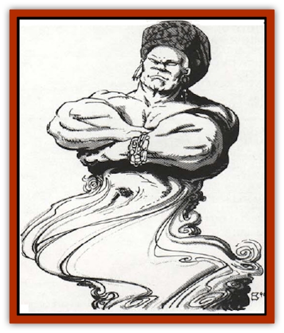

# Air Sentinel

| Statistic | **Air Sentinel** |
| --- | --- |
| **Activity Cycle:** | Any |
| **Alignment:** | Chaotic good |
| **Armor Class:** | 6 |
| **Climate/Terrain:** | Twin Paradises/Bytopia (Shurrock) |
| **Damage/Attack:** | 1-6/1-6 |
| **Diet:** | None (see below) |
| **Frequency:** | Uncommon |
| **Hit Dice:** | 5+1 |
| **Intelligence:** | High (13-14) |
| **Magic Resistance:** | Nil |
| **Morale:** | Steady (11-12) |
| **Movement:** | Fl 36 (A) |
| **No. Appearing:** | 2-8 |
| **No. of Attacks:** | 2 |
| **Organization:** | Family |
| **Size:** | M (6' tall) |
| **Special Attacks:** | Shocking hug |
| **Special Defenses:** | Missile deflection |
| **THAC0:** | 15 |
| **Treasure:** | Z |
| **XP Value:** | 975 |

Air sentinels are beneficial spirits that reside on the Twin Paradise (Bytopia) layer of Shurrock. They appear much like the [[Genie|djinn]] from the Elemental Plane of Air. From the waist up they are strong, baldheaded humans with distinct features. The dominant males usually sport a moustache and goatee. They adequate fond of jewelry, often wearing necklaces, arm bracers, earrings, etc. From the waist down, air sentinels look very much like a small tornado or twisting cone of wind. They are jovial beings and will usually project a friendly expression and demeanor.

**Combat:** By nature, air sentinels are nonviolent and loathe to enter combat. Unless something important is at stake, they will usually escape from battle with their impressive flying speed.

If forced into combat, however, air sentinels will attack by means of a small electrical charge that they release from their hands. In appearance, these charges seem much like miniature lightning bolts. An air sentinel can fire two charges per round at one or two opponents. Each charge does 1-6 points of damage per hit. Because the charge is primarily electricity, metal armor is ignored when determining the target's armor class.

Air sentinels can also use a hug attack in combat if the need is sufficiently pressing. The sentinel attacks by wrapping both of its strong arms around an opponent (requiring only one attack roll) and then releasing a strong electrical attack. If the hug hits, the electricity will do 3-18 points of damage. Any being so damaged must make a system shock roll. If the roll fails the being will fall unconscious for 1-8 melee rounds. Air sentinels will never kill anyone (even an evil being) who is unconscious. They would consider such an act barbaric.

Air sentinels also have a limited form of missile deflection. In any round, a sentinel can forfeit its attack and instead create a strong swirl of air around it. This air shield forces a -5 penalty on all missile attacks made against them. The air shield can be used three times per day and lasts for one round.

**Habitat/Society:** Air sentinels perform a vital duty on the layer of Shurrock. They act as protectors for weaker kings that have found their way to the more robust layer of the Twin Paradises. Shurrock is rocked with booming thunder squalls and hard rains. its weather and terrain are both hardy and challenging to any who go there. Many has been the time a mortal has traveled to Shurrock only to find himself in grave danger from the unexpected weather. Air sentinels police the layer for beings in danger. They will rescue the newcomers and carry them off to one of the many large and sheltered caves that exist on Shurrock.

The true origin of air sentinels is knowledge lost to the ages. They obviously bear an extremely close resemblance to djinn from the Elemental Plane of Air. Sages speculate that some deity or power from the Twin Paradises - having seen the need for some powerful being to protect the many visitors to Shurrock from its strong weather - made a pact with a group of djinn to travel to Shurrock and live there as guardians. Whatever deal was struck with those proud and noble air spirits is unknown, but surely it must have been a beneficial pact since the air sentinels have patrolled Shurrock for years uncounted.

**Ecology:** The air sentinels are constantly increasing their number by breeding prodigiously. They have a fiercely strong sense of family and honor, and in many ways resemble the djinn they most likely evolved from.

Due to their strength and agility - and, of course, to the generally good alignment of Shurrock - air sentinels have no natural enemies. They also appear to be, in a sense, immortal. Young sentinels will grow to an adult age and appear to get no older. But after a certain time (usually no more than 200 years) air sentinels will travel away, never to be seen or heard from again. Why this occurs and what happens to the air sentinels is unknown. Perhaps these proud, majestic beings simply pass into another state of being. Sages have no evidence one way or another.

---
## Discovery & Documentation

**Source Publication:** MC8 Outer Planes Appendix (1990)
**Campaign Setting:** Planescape
**Author(s):** Timothy B. Brown, Jamie LaFountain

### Other Creatures Found in This Source Book
   * [[Aasimon_Agathinon|Aasimon, Agathinon]]
   * [[Aasimon_Deva|Aasimon, Deva]]
   * [[Aasimon_Light|Aasimon, Light]]
   * [[Aasimon_General_Information|Aasimon, General Information]]
   * [[Aasimon_Planetar|Aasimon, Planetar]]
   * [[Aasimon_Solar|Aasimon, Solar]]
   * [[Animal_Lord|Animal Lord]]
   * [[Archon|Archon]]
   * [[Baatezu_Lesser_Abishai|Baatezu, Lesser, Abishai]]
   * [[Baatezu_Greater_Amnizu|Baatezu, Greater, Amnizu]]
   * [[Baatezu_Lesser_Barbazu|Baatezu, Lesser, Barbazu]]
   * [[Baatezu_Greater_Cornugon|Baatezu, Greater, Cornugon]]
   * [[Baatezu_Lesser_Erinyes|Baatezu, Lesser, Erinyes]]
   * [[Baatezu_General_Information|Baatezu, General Information]]
   * [[Baatezu_Greater_Gelugon|Baatezu, Greater, Gelugon]]
   * [[Baatezu_Lesser_Hamatula|Baatezu, Lesser, Hamatula]]
   * [[Baatezu_Lemure|Baatezu, Lemure]]
   * [[Baatezu_Least_Nupperibo|Baatezu, Least, Nupperibo]]
   * [[Baatezu_Lesser_Osyluth|Baatezu, Lesser, Osyluth]]
   * [[Baatezu_Greater_Pit_Fiend|Baatezu, Greater, Pit Fiend]]
   * [[Baatezu_Least_Spinagon|Baatezu, Least, Spinagon]]
   * [[Balaena|Balaena]]
   * [[Bariaur|Bariaur]]
   * [[Bebilith|Bebilith]]
   * [[Bodak|Bodak]]
   * [[Dog_Moon|Dog, Moon]]
   * [[Dragon_Adamantite|Dragon, Adamantite]]
   * [[Einheriar|Einheriar]]
   * [[Gehreleth|Gehreleth]]
   * [[Githyanki|Githyanki]]
   * [[Githzerai|Githzerai]]
   * [[Hordling|Hordling]]
   * [[Lammasu_Celestial|Lammasu, Celestial]]
   * [[Larva|Larva]]
   * [[Maelephant|Maelephant]]
   * [[Marut|Marut]]
   * [[Mediator|Mediator]]
   * [[Mortai|Mortai]]
   * [[Night_Hag|Night Hag]]
   * [[Nightmare|Nightmare]]
   * [[Noctral|Noctral]]
   * [[Per|Per]]
   * [[Phoenix|Phoenix]]
   * [[Slaad|Slaad]]
   * [[Tanar'ri_Greater_Babau|Tanar'ri, Greater, Babau]]
   * [[Tanar'ri_Greater_Chasme|Tanar'ri, Greater, Chasme]]
   * [[Tanar'ri_Greater_Nabassu|Tanar'ri, Greater, Nabassu]]
   * [[Tanar'ri_Least_Dretch|Tanar'ri, Least, Dretch]]
   * [[Tanar'ri_Least_Manes|Tanar'ri, Least, Manes]]
   * [[Tanar'ri_Least_Rutterkin|Tanar'ri, Least, Rutterkin]]
   * [[Tanar'ri_Lesser_Alu-Fiend|Tanar'ri, Lesser, Alu-Fiend]]
   * [[Tanar'ri_Lesser_Bar-Lgura|Tanar'ri, Lesser, Bar-Lgura]]
   * [[Tanar'ri_Lesser_Cambion|Tanar'ri, Lesser, Cambion]]
   * [[Tanar'ri_Lesser_Succubus|Tanar'ri, Lesser, Succubus]]
   * [[Tanar'ri_Guardian_Molydeus|Tanar'ri, Guardian, Molydeus]]
   * [[Tanar'ri_General_Information|Tanar'ri, General Information]]
   * [[Tanar'ri_True_Balor|Tanar'ri, True, Balor]]
   * [[Tanar'ri_True_Glabrezu|Tanar'ri, True, Glabrezu]]
   * [[Tanar'ri_True_Hezrou|Tanar'ri, True, Hezrou]]
   * [[Tanar'ri_True_Marilith|Tanar'ri, True, Marilith]]
   * [[Tanar'ri_True_Nalfeshnee|Tanar'ri, True, Nalfeshnee]]
   * [[Tanar'ri_True_Vrock|Tanar'ri, True, Vrock]]
   * [[Titan|Titan]]
   * [[Translator|Translator]]
   * [[T'uen-rin|T'uen-rin]]
   * [[Vaporighu|Vaporighu]]
   * [[Warden_Beast|Warden Beast]]
   * [[Yugoloth_Greater_Arcanaloth|Yugoloth, Greater, Arcanaloth]]
   * [[Yugoloth_Lesser_Dergoloth|Yugoloth, Lesser, Dergoloth]]
   * [[Yugoloth_Lesser_Hydroloth|Yugoloth, Lesser, Hydroloth]]
   * [[Yugoloth_General_Information|Yugoloth, General Information]]
   * [[Yugoloth_Lesser_Mezzoloth|Yugoloth, Lesser, Mezzoloth]]
   * [[Yugoloth_Greater_Nycaloth|Yugoloth, Greater, Nycaloth]]
   * [[Yugoloth_Lesser_Piscoloth|Yugoloth, Lesser, Piscoloth]]
   * [[Yugoloth_Greater_Ultroloth|Yugoloth, Greater, Ultroloth]]
   * [[Yugoloth_Lesser_Yagnoloth|Yugoloth, Lesser, Yagnoloth]]
   * [[Zoveri|Zoveri]]
