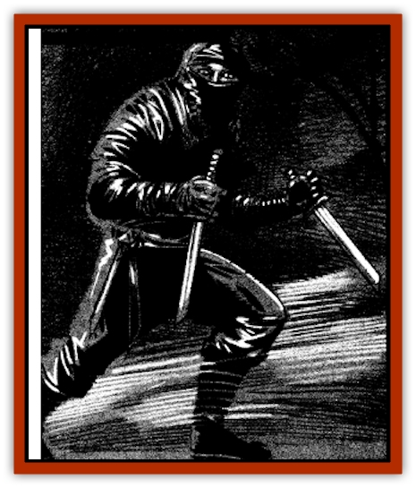

# Akikage

| Statistic | **Akikage** |
| --- | --- |
| **Activity Cycle:** | Night |
| **Alignment:** | Lawful evil |
| **Armor Class:** | 1 |
| **Climate/Terrain:** | Rokushima |
| **Damage/Attack:** | 1d6 (&times;4) |
| **Diet:** | None |
| **Frequency:** | Very rare |
| **Hit Dice:** | 6+3 |
| **Intelligence:** | High (13-14) |
| **Magic Resistance:** | Nil |
| **Morale:** | Fanatic (17-18) |
| **Movement:** | 12 |
| **No. Appearing:** | 1 |
| **No. of Attacks:** | 4 |
| **Organization:** | Solitary |
| **Size:** | M (6' tall) |
| **Special Attacks:** | Death blow |
| **Special Defenses:** | +2 or better weapon to hit; spell immunity |
| **THAC0:** | 13 |
| **Treasure:** | Nil |
| **XP Value:** | 3,000 |

The akikage (ah-ki-ka-gee), or shadow ninja, is the spirit of an oriental assassin who died while stalking an important victim. In life, the akikage was obsessed with duty and discipline. Now it cannot rest in its grave until it has successfully completed its final mission.

The akikage is an incorporeal spirit that is rarely visible. When seen, the creature is dressed all in black. It wears tight gloves and boots as well as a mask and hood that hide all traces of its former humanity. The akikage cannot speak but seems to understand the words of those around it regardless of the language in which they are spoken. Even a *speak with dead* spell will elicit no response from the spirit assassin.

**Combat:** The akikage is a stealthy and ruthless killer. Because it is incorporeal, the shadow ninja cannot manipulate objects as it did in life, but it can move unhindered through solid matter. It can become *invisible* at will. imposing a -4 penalty on opponents' attack rolls.

In battle, the akikage strikes with murderous ferocity. While it does not use weapons, its skill in unarmed combat allows it four attacks per round. Each blow that lands inflicts 1d6 points of damage due to the creature's essence of absolute cold.

The akikage's most devastating power is its ability to instantly slay a victim with its death blow. To do this, the akikage must become visible for one combat round. During this time, it channels all its supernatural power into one devastating strike (forfeiting its other three attacks). As the akikage drives its fist forward, its chilling power pierces the victim's body, inflicting 3d6 points of cold damage. Further, if the victim of this piercing blow fails a save vs. death magic, he dies immediately (regardless of hit points). A prompt autopsy on the corpse reveals that the victim's heart has been frozen solid.

The shadow ninja can only be struck with magical weapons of +2 or greater enchantment. It is immune to *sleep*, *fear*, *charm*, and *hold* spells and is unaffected by all poisons or diseases. All manner of mental or cold-based attacks have no effect upon the creature. Holy water inflicts 1d8 points of damage per vial splashed upon the shadow ninja. An akikage can be turned by a cleric as if it were a spectre or destroyed with a *raise dead* or *dispel evil* spell.

**Habitat/Society:** This grim spirit seeks no company save that of the person it is destined to destroy. If the akikage successfully completes the mission that it failed in life its spirit is released from its curse of undeath. At this point, the spectral menace dissipates and vanishes for good.

**Ecology:** As an undead creature, the akikage requires neither food nor rest. Because of its spectral nature, however, it cannot escape the notice of animals. Whether domesticated or wild, all the beasts of the world become jittery and nervous when a shadow ninja is within 50 feet.

**Ansasshia**

  Tales are told of ansasshia, akikage that are captured and forced to serve a living master. This enslavement usually occurs when an evil cleric uses his ability to command undead or someone casts a *control undead* spell. It is also possible to gain control of a shadow ninja by discovering who the intended victim of the spirit assassin is and killing him before the creature can strike. If this is done and a *control undead* spell is promptly cast upon the body of the akikage's target, the shadow ninja will become an ansasshia, doomed henceforth to obey the caster of the spell.

While under the influence of another. these assassins carry out their orders promptly and efficiently. While they might yearn to be free of their master's will, their devotion to duty and honor makes it impossible for them to disobey or betray him in any way.

---
## Discovery & Documentation

**Source Publication:** Ravenloft Appendix III (1991)
**Campaign Setting:** Ravenloft
**Author(s):** Kirk Botulla

### Other Creatures Found in This Source Book
   * [[Animator_Common|Animator, Common]]
   * [[Animator_Greater|Animator, Greater]]
   * [[Animator_Minor|Animator, Minor]]
   * [[Animator_General_Information|Animator, General Information]]
   * [[Bakhna_Rakhna|Bakhna Rakhna]]
   * [[Baobhan_Sith|Baobhan Sith]]
   * [[Beetle_Scarab|Beetle, Scarab]]
   * [[Boneless|Boneless]]
   * [[Boowray|Boowray]]
   * [[Bruja|Bruja]]
   * [[Carrionette|Carrionette]]
   * [[Carrion_Stalker|Carrion Stalker]]
   * [[Cat_Midnight|Cat, Midnight]]
   * [[Cat_Skeletal|Cat, Skeletal]]
   * [[Cloaker_Resplendent|Cloaker, Resplendent]]
   * [[Cloaker_Shadow|Cloaker, Shadow]]
   * [[Cloaker_Undead|Cloaker, Undead]]
   * [[Corpse_Candle|Corpse Candle]]
   * [[Death's_Head_Tree|Death's Head Tree]]
   * [[Doppelganger_Ravenloft|Doppelganger (Ravenloft)]]
   * [[Familiar_Pseudo-|Familiar, Pseudo-]]
   * [[Familiar_Undead|Familiar, Undead]]
   * [[Feathered_Serpent|Feathered Serpent]]
   * [[Fenhound|Fenhound]]
   * [[Figurine_Ceramic|Figurine, Ceramic]]
   * [[Figurine_Crystal|Figurine, Crystal]]
   * [[Figurine_Ivory|Figurine, Ivory]]
   * [[Figurine_Obsidian|Figurine, Obsidian]]
   * [[Figurine_Porcelain|Figurine, Porcelain]]
   * [[Figurine_General_Information|Figurine, General Information]]
   * [[Fleas_of_Madness|Fleas of Madness]]
   * [[Furies|Furies]]
   * [[Geist|Geist]]
   * [[Ghost_Animal|Ghost, Animal]]
   * [[Golem_Flesh_Ravenloft|Golem, Flesh (Ravenloft)]]
   * [[Golem_Mist_Ravenloft|Golem, Mist (Ravenloft)]]
   * [[Golem_Wax_Ravenloft|Golem, Wax (Ravenloft)]]
   * [[Gremishka|Gremishka]]
   * [[Hag_Spectral|Hag, Spectral]]
   * [[Head_Hunter|Head Hunter]]
   * [[Hearth_Fiend|Hearth Fiend]]
   * [[Hebi-No-Onna|Hebi-No-Onna]]
   * [[Hound_Phantom|Hound, Phantom]]
   * [[Hound_Skeletal|Hound, Skeletal]]
   * [[Imp_Wishing|Imp, Wishing]]
   * [[Ivy_Crawling|Ivy, Crawling]]
   * [[Jack_Frost|Jack Frost]]
   * [[Jolly_Roger|Jolly Roger]]
   * [[Kizoku|Kizoku]]
   * [[Lashweed|Lashweed]]
   * [[Leech_Magical|Leech, Magical]]
   * [[Leech_Psionic|Leech, Psionic]]
   * [[Lich_Defiler|Lich, Defiler]]
   * [[Lich_Drow|Lich, Drow]]
   * [[Lich_Elemental|Lich, Elemental]]
   * [[Lich_Psionic|Lich, Psionic]]
   * [[Living_Tattoo|Living Tattoo]]
   * [[Lycanthrope_Loup-garou|Lycanthrope, Loup-garou]]
   * [[Lycanthrope_Werejackal|Lycanthrope, Werejackal]]
   * [[Lycanthrope_Werejaguar_Ravenloft|Lycanthrope, Werejaguar (Ravenloft)]]
   * [[Lycanthrope_Wereleopard|Lycanthrope, Wereleopard]]
   * [[Lycanthrope_Wereray|Lycanthrope, Wereray]]
   * [[Mist_Ferryman|Mist Ferryman]]
   * [[Moor_Man|Moor Man]]
   * [[Obedient|Obedient]]
   * [[Odem|Odem]]
   * [[Paka|Paka]]
   * [[Plant_Blood_Rose|Plant, Blood Rose]]
   * [[Plant_Fearweed|Plant, Fearweed]]
   * [[Radiant_Spirit|Radiant Spirit]]
   * [[Recluse|Recluse]]
   * [[Remnant_Aquatic|Remnant, Aquatic]]
   * [[Rushlight|Rushlight]]
   * [[Sea_Spawn_Master|Sea Spawn, Master]]
   * [[Sea_Spawn_Minion|Sea Spawn, Minion]]
   * [[Shadow_Asp|Shadow Asp]]
   * [[Shattered_Brethren|Shattered Brethren]]
   * [[Skeleton_Archer|Skeleton, Archer]]
   * [[Skeleton_Insectoid|Skeleton, Insectoid]]
   * [[Skin_Thief|Skin Thief]]
   * [[Spirit_Psionic|Spirit, Psionic]]
   * [[Strahd_Skeleton|Strahd Skeleton]]
   * [[Strahd_Zombie|Strahd Zombie]]
   * [[Unicorn_Shadow|Unicorn, Shadow]]
   * [[Vampire_Drow|Vampire, Drow]]
   * [[Vampire_Nosferatu|Vampire, Nosferatu]]
   * [[Vampire_Oriental|Vampire, Oriental]]
   * [[Virus_General_Information|Virus, General Information]]
   * [[Virus_I|Virus I]]
   * [[Virus_II|Virus II]]
   * [[Virus_III|Virus III]]
   * [[Vorlog|Vorlog]]
   * [[Will_O'Dawn|Will O'Dawn]]
   * [[Will_O'Deep|Will O'Deep]]
   * [[Will_O'Mist|Will O'Mist]]
   * [[Will_O'Sea|Will O'Sea]]
   * [[Zombie_Cannibal|Zombie, Cannibal]]
   * [[Zombie_Desert|Zombie, Desert]]
   * [[Zombie_Wolf|Zombie Wolf]]
   * [[Zombie_Fog|Zombie Fog]]
