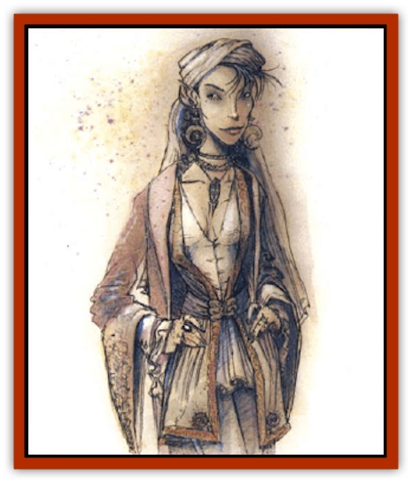

# Al-Jahar

| Statistic | **Al-Jahar** |
| --- | --- |
| **Activity Cycle:** | Any |
| **Alignment:** | Neutral evil |
| **Armor Class:** | 8 |
| **Climate/Terrain:** | Warm Urban Areas |
| **Damage/Attack:** | 1d6/1d6 |
| **Diet:** | Special |
| **Frequency:** | Very rare |
| **Hit Dice:** | 5 |
| **Intelligence:** | Very (11-12) |
| **Magic Resistance:** | 20% |
| **Morale:** | Unsteady (5-7) |
| **Movement:** | 12, Fl 12 (B) |
| **No. Appearing:** | 1 |
| **No. of Attacks:** | 2 |
| **Organization:** | Solitary |
| **Size:** | M (5-7' tall) |
| **Special Attacks:** | Spell use |
| **Special Defenses:** | Disguise |
| **THAC0:** | 15 |
| **Treasure:** | O,Q |
| **XP Value:** | 3,000 |

Al-jahar, also known as dazzles, usually appear as beautiful humanoids; their angelic beauty disguises a terrible secret, for the al-jahar are evil and manipulative. The creatures. true form, which provides their name, is that of genderless winged humanoids comprised of sparkling white motes and waves of almost invisible desert heat. Dazzles hide among the population of cities, generating and feeding upon base emotions of other intelligent creatures.

**Combat:** A dazzle is normally encountered in disguise, often appearing to be a beautiful human or elven woman. The creature can *alter self* at will, so other disguises are possible, including males or females of most man-sized bipedal races. Dazzles can also use *delude* and *non-detection* at will. Hakimas can always see through any dazzle's disguise, and [[Genie|genies]] and [[Gen|gen]] have a 50% chance of recognizing a dazzle. Dazzles seek to avoid hakimas and genies, and they never imitate either.

An al-jahar prefers to avoid direct combat, though it often encourages others to fight, for that generates the strong emotions on which it feeds. If emotions such as anger, greed, and lust are present, the dazzle just waits and absorbs them; if not, it generates them. Once per round, the dazzle can use one of the following spell-like abilities: *charm person*, *friends*, *hypnotism*, *taunt*, *confusion*, or *ventriloquism*. Each ability can be used up to three times per day. They are cast as if the dazzle is a 10th level wizard. Favored dazzle tactics include using friends to get someone to look in its eyes, then *hypnotism* to cause the victim to start a fight; using *alter self* to assume a friendly form, then *taunt* to start a fight; and using *ventriloquism* to make bystanders appear to toss *insults*.

If discovered, a dazzle attempts a fast escape, often assuming its real form so it can fly. If pressed, it can fight with its claws and is able to use one of the following abilities each round: *light* and *shocking grasp* each three times per day, and *blindness*, *rainbow pattern*, and *domination* each once per day. The latter three abilities can be used only in the creature's natural form. All are used as if the dazzle is a 10th level wizard. A dazzle is immune to light-generating and emotion-affecting spells and effects, except the sun-sparkle gaze of the [[Opinicus|opinicus]].

Victims are affected very little by a dazzle, at most feeling exhausted and emotionally drained after several hours in the creature's presence. If the dazzle is careful, it can prey on the same people for years without them ever realizing the truth.

**Habitat/Society:** Al-Jahar prefer to live in large cities, where they have plenty of prey and they can live for years without being discovered. Smaller towns usually recognize much more quickly that something is amiss, and drive the dazzles away.

A dazzle generally has a few standard guises, with a personality for each. Most appear to be normal, if beautiful, people, and many have friends. A dazzle often claims a territory, like a dockside tavern where fights are common and easy to incite. Other dazzles are not welcome in this territory, and may be attacked if they intrude.

Though usually found in a thriving metropolis, such as Huzuz, an al-Jahar may be sometimes encountered, alone and very hungry, in ruined cities as well. If a dazzle does not feed on strong emotions regularly, it weakens until able to use only its disguise abilities. When discovered in ruins, a dazzle adopts the guise of a lost traveler and tries to gain the confidence of its <q>rescuers</q>, so they will take it to a populated area. In the meantime, it feeds on their suspicion and other emotions to gain enough energy for manipulation and travel on its own. Dazzles have even been known to join adventuring parties for a short time, using their powers to protect themselves, aid the party in small ways, and feed off the party members. emotions.

The origins of these creatures is unsure. Many associate them with the Haunted Lands or the Ruined Kingdoms, claiming they were summoned from nether regions in lost rites. Dazzles do not seem to breed, and it is suspected that there is a limited number of them in existence.

**Ecology:** Because the dazzle's food supply is unusual, it has little effect on an ecology, though its hunting patterns are often disruptive to the society in which it lives.

A dazzle's blood is useful in making a *potion of delusion* and other mind-affecting magical items.

---
## Discovery & Documentation

**Source Publication:** City of Delights (1993)
**Campaign Setting:** Al-Qadim (Forgotten Realms)
**Author(s):** tom Prusa, Tim Beach, Steve Kurtz

### Other Creatures Found in This Source Book
   * [[Afanc|Afanc]]
   * [[Bird_Talking|Bird, Talking]]
   * [[Cat_Winged|Cat, Winged]]
   * [[Crypt_Servant|Crypt Servant]]
   * [[Elemental_Vermin|Elemental Vermin]]
   * [[Genie_Tasked_Harim_Servant|Genie, Tasked, Harim Servant]]
   * [[Ogre_Zakhara|Ogre (Zakhara)]]
   * [[Opinicus|Opinicus]]
   * [[Parasite|Parasite]]
   * [[Pasari-Niml|Pasari-Niml]]
   * [[Sirine|Sirine]]
   * [[Tatalla|Tatalla]]
   * [[Tree_Singing|Tree, Singing]]
