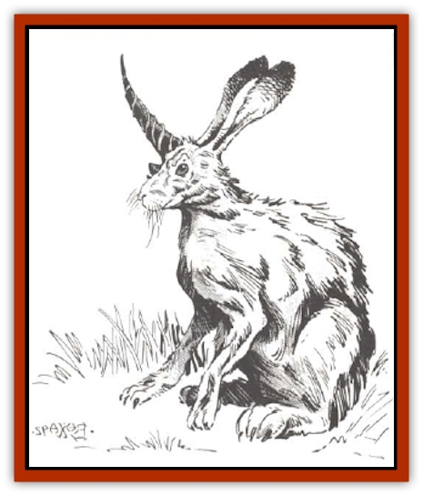

# Al-Mi'raj

| Statistic | **Al-Mi'raj** |
| --- | --- |
| **Activity Cycle:** | Day |
| **Alignment:** | Chaotic neutral |
| **Armor Class:** | 6 |
| **Climate/Terrain:** | Temperate forests, hills, and grasslands |
| **Damage/Attack:** | 1-4 |
| **Diet:** | Herbivore |
| **Frequency:** | Very rare |
| **Hit Dice:** | 1 |
| **Intelligence:** | Animal (1) |
| **Magic Resistance:** | 25% |
| **Morale:** | Fanatic (17-18) |
| **Movement:** | 18 |
| **No. Appearing:** | 2-20 |
| **No. of Attacks:** | 1 |
| **Organization:** | Herd |
| **Size:** | S (3' at shoulder) |
| **Special Attacks:** | Nil |
| **Special Defenses:** | Teleportation, immunity to poison |
| **THAC0:** | 19 |
| **Treasure:** | Nil |
| **XP Value:** | Normal: 65 / Psionic: 420 |

**Psionics Summary (Psionic Al-Mi'raj)**

| Level | Dis/Sci/Dev | Attack/Defense | Score | PSPs |
| --- | --- | --- | --- | --- |
| 3 | 1/2/3 | MT/M- | 10 | 250 |

**Psychokinesis -** *Sciences:* detonate, telekinesis; *Devotions:* control flames, control lights, control winds, levitation, molecular agitation.

Al-mi'raj are rather stupid creatures, but are potentially dangerous because of their unpredictable nature. They resemble large rabbits with long, soft fur. A single black horn, one to two feet long and spiraled like that of a [[Unicorn|unicorn]], protrudes from the forehead. Although most al-mi'raj have yellow fur, white, pink, and even light green specimens have been seen.

Though the origin of the al-mi'raj is unknown, they may be an example of a failed <q>science</q> project conducted by Krynnish [[Gnome|gnomes]], though the creatures are found on many worlds. They are often kept as pets by gnomes, and <q>al-mi'raj</q>, in an ancient gnomish dialect, means <q>experiment seventy-two</q>

**Combat:** Like normal rabbits, al-mi'rai are rather nervous creatures. Rather than hopping away when threatened, however, almi'raj become aggressive and vicious. They leap at the offending intruder, attempting to stab with their horns.

Al-mi'raj are also able to teleport short distances, giving them the nickname <q>blink bunnies</q>. They blink to and fro seemingly without pattern, attempting to avoid attack. The al-mi'raj appears about 3' from its opponent and immediately hops to the attatack. Al-mi'raj teleport on a roll of 4 or better on a 6-sided die. To determine where the creature appears, roll an 8-sided die: 1 = in front of opponent, 2 = left front, 3 = left, 4 = left rear, 5 = directly behind, 6 = right rear, 7 = right, 8 = right front. Because of a quirk in their breeding, a few adults, about 10%, have psionic abilities. If an al-mi'raj sits still instead of jumping to attack an opponent, it is sure to be psionically endowed. It will almost always use its powers in the following order: *control light* to cause the sky to darken, *control wind* to cause the wind to blow, *levitation* to rise into the air, and *molecular agitation* to cause items to hear and burn. Then it will use *telekinesis* to throw rocks, *control flame* to move fire about, and *detonation* to cause weapons and armor to explode. After it levitates, it uses *control winds* to fly about, its eyes glowing redly as it harasses its opponents. If attacked physically, it will try to *blink* away.

Al-mi'raj are immune to poison.

**Habitat/Society:** Al-mi'raj live fairly peaceful lives as long as they are left to themselves. They roam about pastures and woodlands, eating all manner of plants. Their lairs are usually above-ground nests composed of fur, grass, and twigs. Al-mi'raj of the same herd tend to build nests close together.

During the spring mating season, the males <q>joust</q> with their horns competing for the favors of the females. About two months after mating, the female gives birth to a litter of 2-12 cute, cuddly babies with nubs where their horns will later grow. It takes an al-mi'rai about a year to reach full growth.

Psionic al-mi'rai, sometimes known as <q>bunnies of the Abyss</q> develop their powers as adults. Except when the herd is attacked, they act in all respects like normal al-mi'raj.

**Ecology:** Because they breed rather quickly, al-mi'raj can become a problem in any area where there are few natural predators. They can decimate natural vegetation or destroy entire fields of crops. Their nesting areas can also become dangerously impassable. The conglomeration of twiggy nests makes movement difficult, and the large numbers of <q>blink bunnies</q> defending their young is a formidable obstacle.

The bodies of al-mi'rai are very useful: their fur is soft and warm, their meat is tasty, and their horns are useful in cures for poison. Some gnomish communities have a superstitious belief that an al-mi'raj's hind feet bring good luck, and although gnomes have stopped the practice of carrying them around, some homes are still decorated with al-mi'raj feet.

If captured when very young, al-mi'raj show a surprising aptitude for training except for the psionic variety, which have an unfortunate tendency to detonate the possessions of their trainers. The al-mi'raj's fearlessness can make them useful companions.

---
## Discovery & Documentation

**Source Publication:** MC14 Fiend Folio Appendix (1992)
**Campaign Setting:** Fiends Folio
**Author(s):** Don Bingle, John Terra, Wes Nicholson, Tim Beach, Steve Hardinger, Kris Hardinger, Rob Nicholls, Greg Swedberg, Al Boyce, Vince Garcia, Norm Ritchie

### Other Creatures Found in This Source Book
   * [[Aballin|Aballin]]
   * [[Achaierai|Achaierai]]
   * [[Adherer|Adherer]]
   * [[Algoid|Algoid]]
   * [[Apparition|Apparition]]
   * [[Caterwaul|Caterwaul]]
   * [[Coffer_Corpse|Coffer Corpse]]
   * [[Crabman|Crabman]]
   * [[Dark_Creeper|Dark Creeper]]
   * [[Dark_Stalker|Dark Stalker]]
   * [[Darter|Darter]]
   * [[Denzelian|Denzelian]]
   * [[Dune_Stalker|Dune Stalker]]
   * [[Dwarf_Urdunnir|Dwarf, Urdunnir]]
   * [[Falcon_Fire|Falcon, Fire]]
   * [[Faux_Faerie|Faux Faerie]]
   * [[Flawder|Flawder]]
   * [[Fyrefly|Fyrefly]]
   * [[Gambado|Gambado]]
   * [[Garbug|Garbug]]
   * [[Giant_Fhoimorien|Giant, Fhoimorien]]
   * [[Gibberling|Gibberling]]
   * [[Gorbel|Gorbel]]
   * [[Grimlock|Grimlock]]
   * [[Hellcat|Hellcat]]
   * [[Ice_Lizard|Ice Lizard]]
   * [[Iron_Cobra|Iron Cobra]]
   * [[Khargra|Khargra]]
   * [[Mantari|Mantari]]
   * [[Penanggalan|Penanggalan]]
   * [[Pernicon|Pernicon]]
   * [[Phantom_Stalker|Phantom Stalker]]
   * [[Retriever|Retriever]]
   * [[Ruve|Ruve]]
   * [[Scathe|Scathe]]
   * [[Sheet_Ghoul_Sheet_Phantom|Sheet Ghoul/Sheet Phantom]]
   * [[Shocker|Shocker]]
   * [[Spanner|Spanner]]
   * [[Stwinger|Stwinger]]
   * [[Sussurus|Sussurus]]
   * [[Symbiotic_Jelly|Symbiotic Jelly]]
   * [[Terithran|Terithran]]
   * [[Thunder_Children|Thunder Children]]
   * [[Troll_Ice|Troll, Ice]]
   * [[Tween|Tween]]
   * [[Umpleby|Umpleby]]
   * [[Volt|Volt]]
   * [[Xill|Xill]]
   * [[Xvart|Xvart]]
   * [[Zygraat|Zygraat]]
