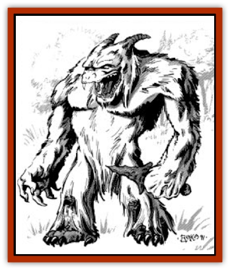

# Alaghi

| Statistic | **Alaghi** |
| --- | --- |
| **Activity Cycle:** | Any |
| **Alignment:** | Neutral |
| **Armor Class:** | 4 |
| **Climate/Terrain:** | Temperate/mountainous forests |
| **Damage/Attack:** | 2-12/2-12 or by weapon type (+5 Strength bonus) |
| **Diet:** | Omnivore |
| **Frequency:** | Very rare |
| **Hit Dice:** | 9 |
| **Intelligence:** | Low (5-7) |
| **Magic Resistance:** | Nil |
| **Morale:** | Steady (11-12) |
| **Movement:** | 12 |
| **No. Appearing:** | 2-5 |
| **No. of Attacks:** | 2 |
| **Organization:** | Family groups |
| **Size:** | L (6' tall with large girth) |
| **Special Attacks:** | Missile weapons |
| **Special Defenses:** | Stealth |
| **THAC0:** | 11 |
| **Treasure:** | I (no coins),Q |
| **XP Value:** | Adult: 2,000 / Young: 120 / Elder: 5,000 / Hermit: 6,000 /  |

Alaghi are forest-dwelling humanoids distantly related to [[Yeti|yeti]]. They are barrel-chested, with short, almost invisible necks, and wide, flat heads with sloping brows. Their shoulders are broad, and their arms are long and powerful. Their legs are short but thick, and their hands and feet are very large. An alaghi's entire body is covered with thick hair, usually blond, reddish brown, or charcoal gray. Most blond individuals have green eyes and fur tinged with green highlights. Adult alaghi stand about six feet tall and weigh about 330 pounds. They usually live for 75-85 years.

**Combat:** Alaghi tend to be shy and peaceful and kill only for food. They can *move silently* 80% of the time and can *hide in natural surroundings* 75% of the time. They are capable warriors, however, and fight with great cunning if attacked or panicked. An alaghi's huge, muscular fists can inflict 2d6 points of damage in combat. A typical alaghi hunter or warrior carries a stone knife or hand axe, and three or four wooden javelins that the creature can hurl with great force. An alaghi can attack with a weapon in one hand and make a second attack with its empty fist. If forced into combat, a group of alaghi scatters and hides. Thereafter, the individuals come out of hiding one at a time to hurl missiles or melee while their fellows circle to the rear, *moving silently*.

**Habitat/Society:** Most alaghi are semi-nomadic hunter-gatherers who travel as small families. They are usually encountered on the move (80%), but when encountered in an encampment (19%), a group of alaghi has 0-3 (1d4-1) youngsters with three Hit Dice and the same chance to hide and *move silently* as the adults. Their combat ability, however, is limited to normal pummeling or wrestling attacks (1d6/1d6 points of damage). Very rarely (15% of encamped groups), 15-20 alaghi lay permanent claim to a particularly bountiful area and settle down to live in crude huts or large cave complexes. Such communities are always led by an elder more than 100 years old who has 10 Hit Dice, high Intelligence, and the ability to cast priest spells. These spells are five first-level, five second-level, and two third-level spells each day from the spheres of all, plant, animal, healing, charm, divination, and combat.

Such communities are generally feared and mistrusted, for the individuals in them begin to show traits common to their relatives, the yeti. Although willing to trade pelts, game, and ores for manufactured goods, sedentary alaghi do not hesitate to slay and eat unwary traders or travelers in their midst.

Even more rare are the hermitic alaghi (1%). These hermits are adults at least 50 years old, with exceptional Intelligence and neutral good alignment. They are solitary vegetarians and philosophers with 11 Hit Dice and all the powers of an 11th-level druid. Though shy, they are curious and helpful, and they love riddles and games of strategy, such as chess, which they play mentally. A human or demihuman who can beat an alaghi hermit at chess is rare indeed.

All alaghi speak their own language of hisses, hoots, and grunts. Sedentary alaghi also speak Common and usually the language of any neutral or evil creatures living nearby. Alaghi hermits are loquacious if befriended and can speak with any woodland creature or animal and 2d4 other languages as well.

**Ecology:** Nomadic alaghi travel throughout most of the year, going wherever the game and wild plants provide the best living. In places where the winters are cold, these alaghi winter in natural caves or protected valleys. Nomadic alaghi do not necessarily live in harmony with nature, but they respect it and know how to use it without destroying it. Sedentary alaghi live much like primitive humans, but they tend to be greedy and are quite capable of depleting the resources around them to the point which their communities must resort to raiding to survive. Hermitic alaghi live in complete harmony with nature and are always on good terms with their woodland neighbors.

---
## Discovery & Documentation

**Source Publication:** MC11 Forgotten Realms Appendix II (1991)
**Campaign Setting:** Advanced Dungeons & Dragons 2nd Edition
**Author(s):** Tim Beach, Tim Brown, William W. Connors, Dale Donovan, Ed Greenwood, Jeff Grubb, Bruce Heard, Slade Henson, Rob King, Colin McComb, Roger E. Moore, Bruce Nesmith, Jon Pickens, Jean Rabe, Dori Watry, Skip Williams

### Other Creatures Found in This Source Book
   * [[Alguduir|Alguduir]]
   * [[Beguiler|Beguiler]]
   * [[Bird_Toril|Bird (Toril)]]
   * [[Cantobele|Cantobele]]
   * [[Carapace|Carapace]]
   * [[Cat_Toril|Cat (Toril)]]
   * [[Chitine|Chitine]]
   * [[Cildabrin|Cildabrin]]
   * [[Dimensional_Warper|Dimensional Warper]]
   * [[Dragon_Deep|Dragon, Deep]]
   * [[Fachan_Toril|Fachan (Toril)]]
   * [[Fael|Fael]]
   * [[Feyr|Feyr]]
   * [[Firetail|Firetail]]
   * [[Frost|Frost]]
   * [[Gaund|Gaund]]
   * [[Gloomwing|Gloomwing]]
   * [[Golden_Ammonite|Golden Ammonite]]
   * [[Golem_Lightning|Golem, Lightning]]
   * [[Hamadryad|Hamadryad]]
   * [[Harrier|Harrier]]
   * [[Harrla|Harrla]]
   * [[Haun|Haun]]
   * [[Haundar|Haundar]]
   * [[Hendar|Hendar]]
   * [[Inquisitor|Inquisitor]]
   * [[Lhiannan_Shee|Lhiannan Shee]]
   * [[Loxo|Loxo]]
   * [[Manni|Manni]]
   * [[Manscorpion|Manscorpion]]
   * [[Mara|Mara]]
   * [[Morin|Morin]]
   * [[Naga_Dark|Naga, Dark]]
   * [[Orpsu|Orpsu]]
   * [[Plant_Carnivorous_Black_Willow|Plant, Carnivorous, Black Willow]]
   * [[Plant_Carnivorous_Toril|Plant, Carnivorous (Toril)]]
   * [[Plant_Dangerous_I|Plant, Dangerous I]]
   * [[Ring-Worm|Ring-Worm]]
   * [[Rohch|Rohch]]
   * [[Sand_Cat|Sand Cat]]
   * [[Saurial|Saurial]]
   * [[Sha'az|Sha'az]]
   * [[Silver_Dog|Silver Dog]]
   * [[Simpathetic|Simpathetic]]
   * [[Skuz|Skuz]]
   * [[Spider_Monkey|Spider, Monkey]]
   * [[Tren|Tren]]
