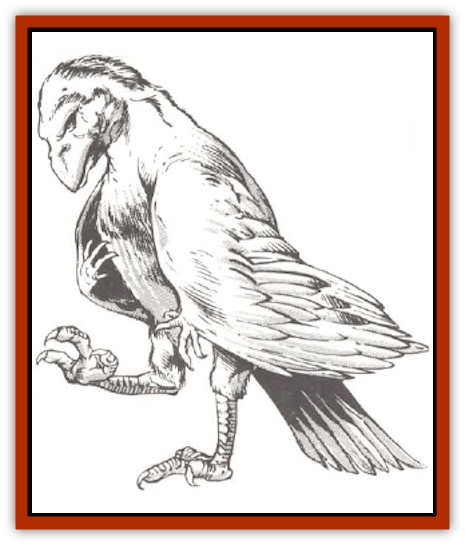

# Albari

| Statistic | **Albari** |
| --- | --- |
| **Activity Cycle:** | Any |
| **Alignment:** | Chaotic neutral |
| **Armor Class:** | 8 |
| **Climate/Terrain:** | Any |
| **Damage/Attack:** | 1-3/1-3 or 1-2/1-3 |
| **Diet:** | Omnivore |
| **Frequency:** | Very rare |
| **Hit Dice:** | 6 |
| **Intelligence:** | Exceptional (15-16) |
| **Magic Resistance:** | 75% |
| **Morale:** | Steady (11-12) |
| **Movement:** | 1, Fl 33 (B) |
| **No. Appearing:** | 1 |
| **No. of Attacks:** | 2 |
| **Organization:** | Solitary |
| **Size:** | S (3-4' tall) |
| **Special Attacks:** | See below |
| **Special Defenses:** | See below |
| **THAC0:** | 15 |
| **Treasure:** | Any or nil |
| **XP Value:** | 4,000 |

The albari are a race of magical, [[Bird|bird]]-like creatures that are equally at home in wildspace or the phlogiston. They are dedicated to the call of chaos and seem to exist for no other reason but to throw other beings' lives into unrest.

An albari possesses a long, almost-human face with a wide beak and slanted, beady eyes. No ears are visible, though an albari's hearing is very keen. The creature's face, like the rest of its body, is covered by short, oily feathers. These range in color from pure white to sooty gray, with the male's coloration tending toward the lighter shades. An albari's wings are impressive, and many specimens have been found with wingspans of up to nine feet. Small, clawed hands can be found on the wings, about halfway along their length. The creature uses these for simple manual tasks, like eating. For more complex activities, the albari uses its feet. Graced with a strong opposable digit, an albari's feet are much like human hands, with the main difference being the number and type of <q>fingers</q>. Three sharply taloned digits and one thickly clawed opposable thumb rest at the end of both the albari's long, jointed legs. All albari are practiced in balancing on one leg and using the other to manipulate objects.

They speak their own high-pitched, shrieking language, as well as various trade dialects and the languages of many spacefaring races.

**Combat:** Albari avoid physical combat whenever possible. If forced into a physical confrontation in the air, they attack with their two taloned feet, which cause 1d3 points of damage each. On the ground. they attack first with their beaks, inflicting 1-2 points of damage, then with one foot for 1d3 points.

Magic, specifically illusion, is the preferred weapon of the albari. All albari have the ability to become *invisible* at will. They can cast *change self*, *ventriloquism*, *blur*, and *misdirection*, each twice per day. They can cast *phantasmal killer*, *dream*, *hallucinatory terrain*, and *mislead*, each once per day. As any albari's motivation can change with alarming speed, it is difficult to state exactly how these spells will be employed. However, it's safe to assume that they will always attempt to confound their enemies with illusions before running away.

**Habitat/Society:** Though albari revel in chaos, there is often a method to their madness. An albari will decide upon a specific course of action - say, insuring that a ship gets hopelessly lost in the phlogiston - and stick to it for a short period of time. On average, this period is 1d6 days. At the end of that time, the creature might then change its mind or decide to continue. Albari usually do the former. They can be hard set upon ruining a ship one moment, then try everything in their power to save it the next.

They use their illusionary powers to sow chaos as much as possible. Often, an albari will use a *dream* spell upon the captain of a passing ship, simply to cause him to change course. They sometimes make short-term deals with other creatures in space, such as murderoids, agreeing to lure unwary ships to their doom. On the other hand, albari have also been known to lead ships to vast treasures for little or no reward. Their favorite trick, however, is to trail a ship until it gets into a combat situation, then fly to the opposing ship and reveal everything they know. Of course, the albari can lie in this situation. too.

Because albari need air to breathe, they often tag along inside a ship's air pocket in the phlogiston, remaining invisible, but casting an occasional spell to keep things lively aboard the vessel they've adopted. Albari frequently sneak aboard ships, too. Then they are often magically disguised as a halfling, [[Rock_Hopper|rock hopper]], or other small humanoid.

Causing trouble takes up most of the albari's time, though pairs occasionally get together to mate. Young albari spend a few weeds hidden in a haphazardly constructed nest before venturing out on the unsuspecting world. These nests can usually be found almost anywhere secretive, though, true to the albari's nature, nests have been found in the middle of busy ports.

**Ecology:**  The albari is hated by most intelligent races throughout the spheres. Some creatures, like the neogi, slay an albari on sight. Few economic uses have been discovered for the albari, however. Its meat is tough and foul-tasting. and its feathers are far too oily for ornamental use. On a few worlds, heavily treated albari-feather pillows are a status symbol, more for their rarity than their utility.

---
## Discovery & Documentation

**Source Publication:** MC7 Spelljammer Appendix I (1990)
**Campaign Setting:** Advanced Dungeons & Dragons 2nd Edition
**Author(s):** various

### Other Creatures Found in This Source Book
   * [[Aartuk|Aartuk]]
   * [[Ancient_Mariner|Ancient Mariner]]
   * [[Argos|Argos]]
   * [[Beholder_Abomination_Astereater|Beholder (Abomination), Astereater]]
   * [[Blazozoid|Blazozoid]]
   * [[Chattur|Chattur]]
   * [[Chevall|Chevall]]
   * [[Clockwork_Horror|Clockwork Horror]]
   * [[Colossus|Colossus]]
   * [[Delphinid|Delphinid]]
   * [[Dizantar|Dizantar]]
   * [[Dog|Dog]]
   * [[Dog_Bog_Hound|Dog, Bog Hound]]
   * [[Esthetic|Esthetic]]
   * [[Focoid|Focoid]]
   * [[Fractine|Fractine]]
   * [[Giant_Spacesea|Giant, Spacesea]]
   * [[Golem_Furnace|Golem, Furnace]]
   * [[Golem_Radiant|Golem, Radiant]]
   * [[Gravislayer|Gravislayer]]
   * [[Grommam|Grommam]]
   * [[Hadozee|Hadozee]]
   * [[Hamster_Giant_Space|Hamster, Giant Space]]
   * [[Jammer_Leech|Jammer Leech]]
   * [[Lakshu|Lakshu]]
   * [[Lumineaux|Lumineaux]]
   * [[Lutum|Lutum]]
   * [[Mimic_Space|Mimic, Space]]
   * [[Misi|Misi]]
   * [[Moon_Rogue|Moon, Rogue]]
   * [[Mortiss|Mortiss]]
   * [[Murderoid|Murderoid]]
   * [[Nay-Churr|Nay-Churr]]
   * [[Phlog-Crawler|Phlog-Crawler]]
   * [[Plasman|Plasman]]
   * [[Plasmoid_DeGleash|Plasmoid, DeGleash]]
   * [[Plasmoid_DelNoric|Plasmoid, DelNoric]]
   * [[Plasmoid_General_Information|Plasmoid, General Information]]
   * [[Plasmoid_Ontalak|Plasmoid, Ontalak]]
   * [[Puffer|Puffer]]
   * [[Q'nidar|Q'nidar]]
   * [[Rastipede|Rastipede]]
   * [[Reigar|Reigar]]
   * [[Rock_Hopper|Rock Hopper]]
   * [[Slinker|Slinker]]
   * [[Spider_Asteroid|Spider, Asteroid]]
   * [[Spiritjam|Spiritjam]]
   * [[Survivor|Survivor]]
   * [[Syllix|Syllix]]
   * [[Symbiont_Power|Symbiont, Power]]
   * [[Vine_Infinity|Vine, Infinity]]
   * [[Wiggle|Wiggle]]
   * [[Wizshade|Wizshade]]
   * [[Wryback|Wryback]]
   * [[Zard|Zard]]
   * [[Zodar|Zodar]]
