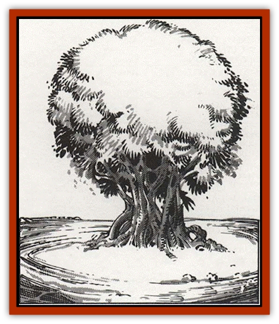

# Alchemy Plant

| Statistic | **Alchemy Plant** |
| --- | --- |
| **Activity Cycle:** | Any |
| **Alignment:** | Neutral |
| **Armor Class:** | See below |
| **Climate/Terrain:** | Any |
| **Damage/Attack:** | Nil |
| **Diet:** | Special |
| **Frequency:** | Very rare |
| **Hit Dice:** | 1 |
| **Intelligence:** | Semi- (2-4) |
| **Magic Resistance:** | Nil |
| **Morale:** | Nil |
| **Movement:** | 0 |
| **No. Appearing:** | 1 |
| **No. of Attacks:** | 0 |
| **Organization:** | Single Plant |
| **Size:** | S (1-3' tall) |
| **Special Attacks:** | Nil |
| **Special Defenses:** | See below |
| **THAC0:** | 0 |
| **Treasure:** | Nil |
| **XP Value:** | 25 |

An alchemy plant can change its essence into that of any inorganic matter that touches it. The plant can also convert one material into another, as explained below. Matter that was formerly alive, such as a wooden staff, cotton or wool clothing, or a corpse, also qualifies for transformation purposes. The plant is highly sought by alchemists.

The plant normally looks like an unremarkable bush with serrated green leaves. It grows anywhere, using its transmuting ability to thrive in exotic environments. The only distinguishing characteristic is the lack of other vegetation in a 1' radius around the plant.

**Combat:** The alchemy plant easily falls victim to a thoughtless swing of an adventurer's sword or the teeth of a hungry herbivore. However, it senses other live plants growing within 20'; when such plants take damage, the alchemy plant recognizes this and instinctively reacts to preserve itself by transforming into some nearby substance.

For this reason, the alchemy plants that survive best grow beside rocks. As a herbivore is about to chomp into the succulent brown stalks, the alchemy plant turns into a plant-shaped rock. The plant can also transform in the split-second after a weapon makes contact and before it cuts through the plant, resulting in a solid steel plant. The plant saves vs. crushing blow, using the column appropriate to the material it has duplicated. Of course, a weapon striking such a plant must also save! The transformation lasts so long as danger still threatens.

**Habitat/Society:** Alchemy plants grow wild, converting inorganic matter in the soil into food. They do not photosynthesize; thus, they do not require light. Alchemy plants take in carbon dioxide and exhale oxygen, providing an important service to spelljamming vessels.

The alchemy plant can transform substances into other substances. When two objects touch the plant, one is transformed into the other's substance. Roll randomly (an even chance) to determine the object transformed. Thus, to make. the plant create gold, touch the plant with a rock, then a piece of gold - and cross your fingers! An alchemy plant can convert one pound of matter per foot of plant height, to a maximum of three pounds. The transformations works only once per day.

Supposedly smart people have touched gold to an alchemy plant, watched the plant turn to gold, then pulled it out of the ground. The result is a dead green bush: The plant must stay alive to pip its own transformation intact, though this does not apply to other transformed matter.

A *charm plant* spell or a *potion of plant control* ensures precisely the transformation the caster desires. Attempts to convince the plant to effect a transformation using *speak with plants* seldom work. The plant cannot be bullied, as it has no concept of its own death or pain. Only a druid can hope to convince the plant to create a transformation; the druid must make an Intelligence check to succced.

Alchemy plants cannot duplicate magical energy. Thus, for instance, a candle of invocation touched against the alchemy plant creates only a small block of wax.

Every month, the alchemy plant has a 5% chance to produce a new seed. The seed is hurled by explosive force to a new spot 10d6 yards away from the parent. (An unfortunate character who intercepts the seed in its flight takes 1 hp damage.) The seed grows from seedling to maturity in two weeks.

**Ecology:** Alchemy plants are at the bottom of the food chain, giving nutrition to wandering herbivores. Beyond this, only sages, mages, and alchemists have any interest in the plant, since its performance is undependable. Still, the alchemy plant can be found on board human, [[Elf|elvish]], and [[Mind_Flayer|illithid]] ships, where it freshens the air and possibly provides needed substances.

---
## Discovery & Documentation

**Source Publication:** MC9 Spelljammer Appendix II (1991)
**Campaign Setting:** Planescape
**Author(s):** Scott Davis, Newton Ewell, John Terra

### Other Creatures Found in This Source Book
   * [[Allura|Allura]]
   * [[Aperusa|Aperusa]]
   * [[Autognome|Autognome]]
   * [[Bionoid|Bionoid]]
   * [[Bloodsac|Bloodsac]]
   * [[Buzzjewel|Buzzjewel]]
   * [[Constellate|Constellate]]
   * [[Contemplator|Contemplator]]
   * [[Dohwar|Dohwar]]
   * [[Dragon_Moon|Dragon, Moon]]
   * [[Dragon_Stellar|Dragon, Stellar]]
   * [[Dragon_Sun|Dragon, Sun]]
   * [[Dreamslayer|Dreamslayer]]
   * [[Dweomerborn|Dweomerborn]]
   * [[Fal|Fal]]
   * [[Feesu|Feesu]]
   * [[Fire_Bat|Fire Bat]]
   * [[Firebird|Firebird]]
   * [[Firelich|Firelich]]
   * [[Flowfiend|Flowfiend]]
   * [[Gadabout|Gadabout]]
   * [[Gammaroid|Gammaroid]]
   * [[Gonn|Gonn]]
   * [[Gossamer|Gossamer]]
   * [[Grav|Grav]]
   * [[Great_Dreamer|Great Dreamer]]
   * [[Greatswan|Greatswan]]
   * [[Grell_Colonial|Grell, Colonial]]
   * [[Gullion|Gullion]]
   * [[Insectare|Insectare]]
   * [[Lhee|Lhee]]
   * [[Mercurial_Slime|Mercurial Slime]]
   * [[Meteorspawn|Meteorspawn]]
   * [[Monitor|Monitor]]
   * [[Owl_Space|Owl, Space]]
   * [[Pristatic|Pristatic]]
   * [[Scro|Scro]]
   * [[Selkie_Star|Selkie, Star]]
   * [[Silatic|Silatic]]
   * [[Skullbird|Skullbird]]
   * [[Sleek|Sleek]]
   * [[Sluk|Sluk]]
   * [[Space_Swine|Space Swine]]
   * [[Sphinx_Astro-|Sphinx, Astro-]]
   * [[Spirit_Warrior|Spirit Warrior]]
   * [[Starfly_Plant|Starfly Plant]]
   * [[Stargazer|Stargazer]]
   * [[Undead_Stellar|Undead, Stellar]]
   * [[Witchlight_Marauder|Witchlight Marauder]]
   * [[Xixchil|Xixchil]]
   * [[Yitsan|Yitsan]]
   * [[Zurchin|Zurchin]]
