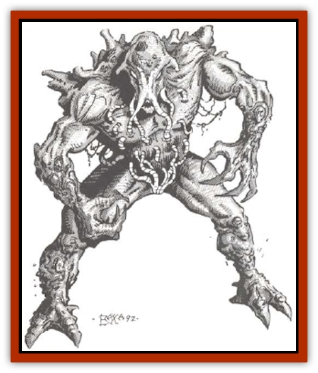

# Algoid

| Statistic | **Algoid** |
| --- | --- |
| **Activity Cycle:** | Any |
| **Alignment:** | Chaotic neutral |
| **Armor Class:** | 5 |
| **Climate/Terrain:** | Temperate swamp |
| **Damage/Attack:** | 1-10/1-10 |
| **Diet:** | Omnivore |
| **Frequency:** | Very rare |
| **Hit Dice:** | 5 |
| **Intelligence:** | Semi- (2-4) |
| **Magic Resistance:** | See below |
| **Morale:** | Steady (11) |
| **Movement:** | 6 |
| **No. Appearing:** | 1-6 |
| **No. of Attacks:** | 2 |
| **Organization:** | Pack |
| **Size:** | M (5-7' tall) |
| **Special Attacks:** | Stun |
| **Special Defenses:** | Immune to edged weapons of less than +2 bonus |
| **THAC0:** | 15 |
| **Treasure:** | D&times;½ |
| **XP Value:** | 420 |

Algoids appear to be primitive humanoids with green skin and coarse features, sometimes mistaken for [[Troll|trolls]] at first glance. They are, however, not animals at all, but colonies of intelligent algae that have developed mobility by organizing in this way.

The height of an algoid varies from 5 to 7 feet, depending on how many individual cells combine to form it. Similarly, its weight will vary from 115 to 250 pounds.

**Combat:** The algoid attacks with two large <q>fists</q> in a downward, pounding fashion. Each fist inflicts 1-10 points of damage. In addition, on a roll of 19 or 20, the algoid will inflict maximum (10 points) damage and stun its victim for 1-4 rounds. Edged and piercing weapons of lees than +2 magical bonus inflict no damage on an algoid. Those with +2 or better bonuses inflict half normal damage. Blunt weapons inflict normal damage, even if they are non-magical.

Algoids have an empathic link to willow, water-oak, cypress, and other water-loving trees. They can use this link to control 1 or 2 trees and make them attack a party. The trees have a movement of 3, and attack twice per round for 1-10 points of damage. The THAC0 of the trees depends on its size, but will never be less than 15. Fire and electrical attacks, whether magical or not, do no damage to an algoid.

*Lower water*, *part water*, and *destroy water* each inflict 1-6 points of damage per level of the caster (maximum 10d6). All other spells work normally on an algoid.

**Habitat/Society:** Algoids must live near water of some sort. It need not be running water, although slow-moving streams and rivers are preferred. Nor does the water need to be fresh. Some of the more successful colonies of almonds have been discovered in river deltas, taking the salt or fresh water equally well.

Algoids are possessed of a <q>hive</q> intelligence and societal structure. There is no hierarchy to algoid society. Algoids generally do not form their humanoid shape unless they feel threatened, or the colony wants to move. The humanoid shape is formed by joining with the nearest other cells until a mobile unit is formed. If a colony is large enough to form more than one <q>body</q> the cells will not always group together in the same way. Thus, one cell may be part of a 250-pound humanoid today, and part of a different 170-pound one tomorrow.

**Ecology:** Since it is a plant, the algoid relies on photosynthesis for its metabolism to function. Warm, brackish water is the preferred breeding ground for large colonies, but they can breed in colder water. Algoids cannot survive for more than a few days without natural light. As they suffer from light deprivation, their color changes from green to dark green to almost black. Dead algoids are completely black. This death is similar to the starvation of a mammal, and no creature of good alignment should do this to an algoid.

Priests and alchemists value the black algoids, as they can be powdered and used in the manufacture of salves and as an ingredient in the reduction of gold ore. Algoids killed in combat, and then left in darkness, do not turn black, but simply rot away in the same fashion as other vegetation.

**Purple Algoid**

  A much rarer variety of algoid, the purple algoid is found only in arctic climate, surviving directly from the ice and snow and limited sunlight. The creatures cannot control trees as their temperate cousins do, but can communicate with small seadwelling crustaceans. The algoid will often have the crustaceans lure unsuspecting fishing boats to their area, then attack by swimming under the vessel and pounding one or more holes in the hull. The algoid then allows the sea creatures to feast on the bodies while it devours the wooden parts of the vessel.

Purple algoids do not go black if starved of light. They turn a fluorescent blue instead. If powdered. this substance can be used to dye cloth.

---
## Discovery & Documentation

**Source Publication:** MC14 Fiend Folio Appendix (1992)
**Campaign Setting:** Fiends Folio
**Author(s):** Don Bingle, John Terra, Wes Nicholson, Tim Beach, Steve Hardinger, Kris Hardinger, Rob Nicholls, Greg Swedberg, Al Boyce, Vince Garcia, Norm Ritchie

### Other Creatures Found in This Source Book
   * [[Aballin|Aballin]]
   * [[Achaierai|Achaierai]]
   * [[Adherer|Adherer]]
   * [[Al-Mi'raj|Al-Mi'raj]]
   * [[Apparition|Apparition]]
   * [[Caterwaul|Caterwaul]]
   * [[Coffer_Corpse|Coffer Corpse]]
   * [[Crabman|Crabman]]
   * [[Dark_Creeper|Dark Creeper]]
   * [[Dark_Stalker|Dark Stalker]]
   * [[Darter|Darter]]
   * [[Denzelian|Denzelian]]
   * [[Dune_Stalker|Dune Stalker]]
   * [[Dwarf_Urdunnir|Dwarf, Urdunnir]]
   * [[Falcon_Fire|Falcon, Fire]]
   * [[Faux_Faerie|Faux Faerie]]
   * [[Flawder|Flawder]]
   * [[Fyrefly|Fyrefly]]
   * [[Gambado|Gambado]]
   * [[Garbug|Garbug]]
   * [[Giant_Fhoimorien|Giant, Fhoimorien]]
   * [[Gibberling|Gibberling]]
   * [[Gorbel|Gorbel]]
   * [[Grimlock|Grimlock]]
   * [[Hellcat|Hellcat]]
   * [[Ice_Lizard|Ice Lizard]]
   * [[Iron_Cobra|Iron Cobra]]
   * [[Khargra|Khargra]]
   * [[Mantari|Mantari]]
   * [[Penanggalan|Penanggalan]]
   * [[Pernicon|Pernicon]]
   * [[Phantom_Stalker|Phantom Stalker]]
   * [[Retriever|Retriever]]
   * [[Ruve|Ruve]]
   * [[Scathe|Scathe]]
   * [[Sheet_Ghoul_Sheet_Phantom|Sheet Ghoul/Sheet Phantom]]
   * [[Shocker|Shocker]]
   * [[Spanner|Spanner]]
   * [[Stwinger|Stwinger]]
   * [[Sussurus|Sussurus]]
   * [[Symbiotic_Jelly|Symbiotic Jelly]]
   * [[Terithran|Terithran]]
   * [[Thunder_Children|Thunder Children]]
   * [[Troll_Ice|Troll, Ice]]
   * [[Tween|Tween]]
   * [[Umpleby|Umpleby]]
   * [[Volt|Volt]]
   * [[Xill|Xill]]
   * [[Xvart|Xvart]]
   * [[Zygraat|Zygraat]]
