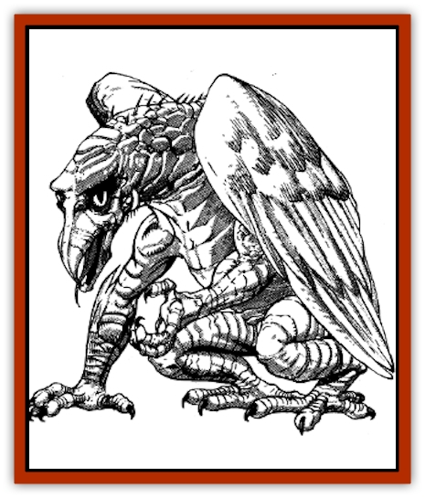

# Alguduir

| Statistic | **Adult** | **Young** |
| --- | --- | --- |
| **Activity Cycle:** | Day | Day |
| **Alignment:** | Neutral | Neutral |
| **Armor Class:** | 6 | 8 |
| **Climate/Terrain:** | Marshes | Marshes |
| **Damage/Attack:** | 1-6 (bill)/2-5 &times;2 (front claws)/2-4 &times;2 (rear claws) | 1-4 (bill)/1-2 &times;2 (front claws) |
| **Diet:** | Carnivore | Carnivore |
| **Frequency:** | Rare | Rare |
| **Hit Dice:** | 4+4 | 1+1 |
| **Intelligence:** | Low to average (5-10) | Low (5-7) |
| **Magic Resistance:** | 40% | 40% |
| **Morale:** | Elite (13-14) | Unreliable (2-4) |
| **Movement:** | 6, Fl 21 (B), Sw 14 | 4, Fl 16 (C), Sw 12 |
| **No. Appearing:** | 1-2 | 1-2 |
| **No. of Attacks:** | 5 | 3 |
| **Organization:** | Solitary | Family |
| **Size:** | M (7' long) | S (1-4' long) |
| **Special Attacks:** | Nil | Nil |
| **Special Defenses:** | Spell reflection | Spell reflection |
| **THAC0:** | 17 | 20 |
| **Treasure:** | Nil | Nil |
| **XP Value:** | 975 | 420 |

An alguduir's body is fat but sleek, covered with tough, durable oil-glistening scales. Its front feet have five black talons each; its rear feet have only four talons each. Its wings are usually a mottled white, brown, and gray. Its head and body are gray or green-gray, and are readily camouflaged by marsh plants. Its eyes are yellow or green. Its gills are located in the throat area behind and beneath the bill.

Its feathered [[Eagle|eagle]]-like wings are oily and can shed water rapidly. This allows the alguduir to swim to the surface, shake its wings out to full span, and fly away without pause. This oil is not flammable and an alguduir suffers no extra damage from firebased attacks. Its nickname comes from its scaled body that erroneously makes people believe it to be related to [[Dragon_General_Information|dragons]].

A capable swimmer, the alguduir can breathe underwater and dive with force and accuracy from the air to an underground target, gaining a +2 attack bonus. Alguduir snarl, grunt, or shriek, showing the full scope of emotion, but when hunting they are eerily silent.

**Combat:** A repeated marsh-[[Bird|bird]] call may be an alguduir signalling its position to its mate. This allows the two alguduirs to position an enemy in between the two. When this occurs, one attacks, driving the opponent to the other, opening the victim to flank and back attacks. They cannot speak, although they may understand a word or two, or even complete phrases of any language spoken by intelligent creatures within their hunting ground.

Alguduirs often battle creatures underwater. They commonly capture these aquatic animals in their rear claws, lifting them out of the water to suffocate them. They also like to drag down avian or surface-dwelling creatures and hold them underwater for several turns until the prey drowns. They employ their rear claws only when clinging to, or when wrapped around an opponent. Young alguduirs do not attack with their rear talons, since their decreased size makes the talons' usefulness in capturing prey minimal at best.

They possess a curious and effective ability to *reflect* or *turn* spells back at the caster. This natural phenomenon is presently inexplicable. The spell reflection is an unconscious act, and the alguduir cannot willfully negate the reflection deliberately, nor can it willfully exercise it. Even the carcasses of dead alguduir retain the ability for 4-16 turns.

When a spell is cast upon an alguduir, there is a 65% chance (-2% per level of the caster above 10th level, and -5% per level of the spell above level six) that it wholly reflects back upon the caster with full effects, and saving throws are applicable. If the caster is completely protected against such an occurrence, the spell reflects upon a randomly chosen unprotected creature within 10 feet of the caster. If unprotected prey is not within range, the reflected spell dissipates. Besides this powerful spell reflection ability, all spells cast at an alguduir have a 40% chance of not working at all because of its magic resistance. The creature's magical resistance should be determined only after the spell reflection fails.

**Habitat/Society:** Alguduir lair in the tangled, weedy clumps of solid ground found at the heart of their large marsh. They protect these small locations with their lives. At any sign of danger, the young *go to the ground* there while the parents stalk the intruders. If the adults are faced with trespassers that are too strong to defeat, the adults lead them from the nest, flying or diving to escape when the danger no longer threatens the lair. If the alguduirs deem the trespassers edible and easily killed, they hunt or attempt to ambush the prey, feeding the victims to their young. They always deposit the remains far from the lair to avoid calling attention to their safe haven.

**Ecology:** The alguduir, sometimes called the swamp dragon, is a rare carnivore that inhabits only large freshwater or saltwater marshes, where it feeds on fish, snakes, frogs, mussels that it smashes open on rocks, and other aquatic life. The alguduir even feasts upon the giant varieties if they are available. It usually hunts by flying low over the marsh plants. With its claws and bill it stabs at creatures in the reeds and boggy ground in the marsh and nearby areas.

---
## Discovery & Documentation

**Source Publication:** MC11 Forgotten Realms Appendix II (1991)
**Campaign Setting:** Advanced Dungeons & Dragons 2nd Edition
**Author(s):** Tim Beach, Tim Brown, William W. Connors, Dale Donovan, Ed Greenwood, Jeff Grubb, Bruce Heard, Slade Henson, Rob King, Colin McComb, Roger E. Moore, Bruce Nesmith, Jon Pickens, Jean Rabe, Dori Watry, Skip Williams

### Other Creatures Found in This Source Book
   * [[Alaghi|Alaghi]]
   * [[Beguiler|Beguiler]]
   * [[Bird_Toril|Bird (Toril)]]
   * [[Cantobele|Cantobele]]
   * [[Carapace|Carapace]]
   * [[Cat_Toril|Cat (Toril)]]
   * [[Chitine|Chitine]]
   * [[Cildabrin|Cildabrin]]
   * [[Dimensional_Warper|Dimensional Warper]]
   * [[Dragon_Deep|Dragon, Deep]]
   * [[Fachan_Toril|Fachan (Toril)]]
   * [[Fael|Fael]]
   * [[Feyr|Feyr]]
   * [[Firetail|Firetail]]
   * [[Frost|Frost]]
   * [[Gaund|Gaund]]
   * [[Gloomwing|Gloomwing]]
   * [[Golden_Ammonite|Golden Ammonite]]
   * [[Golem_Lightning|Golem, Lightning]]
   * [[Hamadryad|Hamadryad]]
   * [[Harrier|Harrier]]
   * [[Harrla|Harrla]]
   * [[Haun|Haun]]
   * [[Haundar|Haundar]]
   * [[Hendar|Hendar]]
   * [[Inquisitor|Inquisitor]]
   * [[Lhiannan_Shee|Lhiannan Shee]]
   * [[Loxo|Loxo]]
   * [[Manni|Manni]]
   * [[Manscorpion|Manscorpion]]
   * [[Mara|Mara]]
   * [[Morin|Morin]]
   * [[Naga_Dark|Naga, Dark]]
   * [[Orpsu|Orpsu]]
   * [[Plant_Carnivorous_Black_Willow|Plant, Carnivorous, Black Willow]]
   * [[Plant_Carnivorous_Toril|Plant, Carnivorous (Toril)]]
   * [[Plant_Dangerous_I|Plant, Dangerous I]]
   * [[Ring-Worm|Ring-Worm]]
   * [[Rohch|Rohch]]
   * [[Sand_Cat|Sand Cat]]
   * [[Saurial|Saurial]]
   * [[Sha'az|Sha'az]]
   * [[Silver_Dog|Silver Dog]]
   * [[Simpathetic|Simpathetic]]
   * [[Skuz|Skuz]]
   * [[Spider_Monkey|Spider, Monkey]]
   * [[Tren|Tren]]
