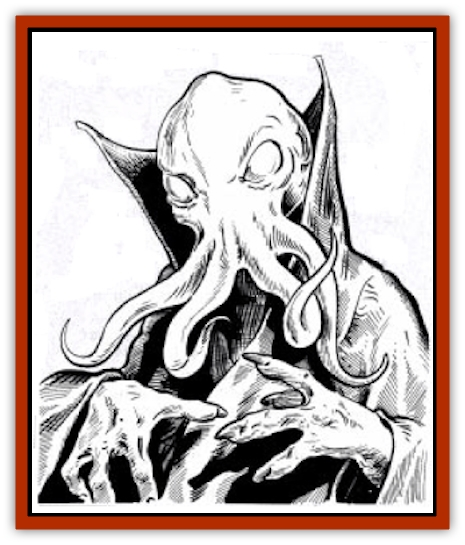

# Alhoon

| Statistic | **Alhoon** |
| --- | --- |
| **Activity Cycle:** | Any |
| **Alignment:** | Neutral evil |
| **Armor Class:** | 5 |
| **Climate/Terrain:** | Any |
| **Damage/Attack:** | 1d4 + Special |
| **Diet:** | Special |
| **Frequency:** | Very rare |
| **Hit Dice:** | 8+4 |
| **Intelligence:** | Genius (17-18) |
| **Magic Resistance:** | 90% |
| **Morale:** | Fanatic (17-18) |
| **Movement:** | 12 |
| **No. Appearing:** | 1-4 |
| **No. of Attacks:** | 4 |
| **Organization:** | Community or solitary |
| **Size:** | M (6' tall) |
| **Special Attacks:** | Mind blast, spell use |
| **Special Defenses:** | Nil |
| **THAC0:** | 11 |
| **Treasure:** | S,T,V&times;3,X, (V&times;6) |
| **XP Value:** | 9,000 |

**Psionics Summary**

| Level | Dis/Sci/Dev | Attack/Defense | Score | PSPs |
| --- | --- | --- | --- | --- |
| 9 | 4/5/14 | EW,II,MT/All | = Int | 250 + d100 |

**Psychokinesis -** *Sciences:* nil; *Devotions:* body control, levitation.

**Psychometabolism -** *Science:* body equilibrium; *Devotions:* nil.

**Psychoportation -** *Sciences:* probability travel, teleport; *Devotion:* astral projection.

**Telepathy -** *Sciences:* domination, mind link; *Devotions:* awe, contact, ego whip, ESP, post-hypnotic suggestion.

**Other Powers:** Various; two sciences, five devotions.

Alhoon (also called *illithiliches*) look like living [[Mind_Flayer|mind flayers]] (mauve-skinned, octopusheaded beings with four mouth-tentacles, and three-fingered hands). The only visible difference between illithid and illithilich is that an alhoon's skin is dry and often wrinkled, never glistening with slime.

**Combat:** Alhoon attack with four tentacles, as living mind flayers do. Once a tentacle hits, it does 1d4 points of damage per round automatically, as it bores on into the victim's body. Attacks on a tentacle (consider it AC 7) doing it 5 points or more of damage in a single round cause it to recoil, drawing out of the victim's body. It will then always strike at a new spot; an attack roll is required, and boring time to the victim's brain remains 1-4 rounds. Tentacles striking a victim elsewhere than its head do damage for 4 rounds and then withdraw; they are not long enough to reach the brain.

Illithiliches have the *mind blast* it had in life (cone 60 feet long, opening from 5 to 20 feet; save vs. wands or stunned 3d4 rounds) and psionic abilities common to all true mind flayers (the equivalent of a 7th-level psionicist - 4 disciplines, 5 sciences, and 14 devotions). Alhoon additionally attack with *mind thrust*, and individual abilities es are possessed as well (consult PHBR5 *The Complete Psionics Handbook*).

In addition to their tentacles and psionic abilities, illithiliches can cast spells as 9th level mages (spells: 4, 3, 3, 2, 1). Typically, they use a wide variety of spells seized from human mages, spellbooks found in tombs, and the like.and always avidly seek more, driven by their hunger for power. An alhoon can use a spell (as well as its tentacle attacks) in any round in which it does not use psionics.

Alhoon gain no special undead attacks (such as a human lich's *chill touch*), but do have <q>standard</q> undead immunities to *sleep*, *hold*, and *charm*-related magics. They cannot be turned or dispelled by priests, and are not harmed or impeded by holy water, cold iron, *protection from evil*, sunlight, or silver weapons - but are subject to spells specifically affecting undead.

**Habitat/Society:** Alhoon spurn illithid societies ruled by elder brains, and do not hesitate to take living mind flayers as thought controlled slaves (just as they took all other creatures as slaves, when alive - a process continued in lich state). They usually live alone in the surface world, often slaying a human wizard and taking over his remote tower, but in the Underdark cooperate for mutual survival, sharing spells and aid freely to overcome [[Elf_Drow|drow]], [[Dwarf_Duergar|duergar]], [[Cloaker|cloakers]], [[Aboleth|aboleth]], and living mind flayers alike. Alhoon are capable of diplomacy and of loyally adhering to alliances when they see an ultimate benefit - but they consider all other beings cattle, and promises to them merely empty conveniences. Alhoon regard true [[Lich|liches]] and [[Beholder_and_Beholder-kin_I|beholders]] as their greatest rivals, and accordingly destroy them whenever prudently possible.

**Ecology:** Alhoon have no need for sustenance, but their bodies adapt only imperfectly to lich state; many magical steps of most lichdom processes used by others fail on a strongly-magic resistant mind flayer body. Alhoon are plagued by ongoing skin wrinkling and tissue desiccation, which they counteract by bathing, or by drinking water, soup, alcohol, and other liquids. Nutrients need not be ingested, and poisons absorbed in this way will harm an alhoon (lowering its bit points no further than a minimum of 6 hp and not <q>killing</q> it). The illithilich state neutralizes most poisons (restoring all damage done by them) in 2d4 turns.

Illithiliches enjoy devouring brains just as they did in life, but do not need to do so. Sometimes (3 in 12 chance), devouring a brain gives an alhoon mental <q>glimpses</q> of 1d12 thoughts that the brain held, either at random, or (if the alhoon concentrates on a topic, such as magical items, written spells, or treasure locations), thoughts most closely related to a chosen topic.

Essence of alhoon brain is a general ingredient in spell-writing inks, and can be employed with great advantage in the crafting of any magical item concerned with effects of the minds of creatures.

---
## Discovery & Documentation

**Source Publication:** Menzoberranzan (1992)
**Campaign Setting:** Forgotten Realms
**Author(s):** Greenwood, Niles, and Salvatore

### Other Creatures Found in This Source Book
   * [[Cloaker_Lord|Cloaker Lord]]
   * [[Foulwing|Foulwing]]
   * [[Lizard_Subterranean_Toril|Lizard, Subterranean (Toril)]]
   * [[Riding_Lizard|Riding Lizard]]
   * [[Wingless_Wonder|Wingless Wonder]]
