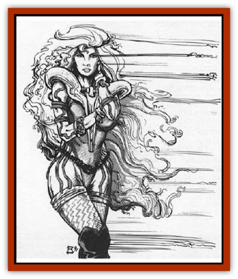

# Allura

| Statistic | **Allura** |
| --- | --- |
| **Activity Cycle:** | Any |
| **Alignment:** | Chaotic neutral |
| **Armor Class:** | 6 |
| **Climate/Terrain:** | Any |
| **Damage/Attack:** | 1d8 (weapon) |
| **Diet:** | Omnivore |
| **Frequency:** | Very rare |
| **Hit Dice:** | 6+1 |
| **Intelligence:** | Highly (14) |
| **Magic Resistance:** | 20% |
| **Morale:** | Elite (14) |
| **Movement:** | 9 |
| **No. Appearing:** | 1-6 |
| **No. of Attacks:** | 1 |
| **Organization:** | Group |
| **Size:** | M (5') |
| **Special Attacks:** | Spells |
| **Special Defenses:** | Spells |
| **THAC0:** | 15 |
| **Treasure:** | W |
| **XP Value:** | 975 |

The allura are a race of reptilian monsters who lure spacefaring men to their doom using innate magical abilities. They use their limited shapechanging power to disguise themselves as beautiful females of their victims' race. Spells or devices that pierce illusions cannot detect an allura's true form.

The allure most often resemble beautiful human women, always wearing ornate clothing and flashing exquisite jewelry.

**Combat:** Allura feed on the emotions created by tension, excitement, and fear. To gather these emotions, the allure can cast the following spells at 12th lcvcl once pcr day: *charm person*, *sleep*, *friends*, *suggestion*, *demand*, *clairaudience*, *clairvoyance*, *delude*, and *mass suggestion*.

The allure have another innate ability, *detect life*. This ability lets the allura automatically detect the presence of life within 500'.

When a spelljammer appears in their area, the allura quickly use *clairvoyance* to locate the spelljamming wizard and *demand* to lure him to them. Once they sight the ship, the allura pretend to be shipwreck survivors or escaped prisoners from a slave ship.

Once they board a ship, the allura quickly and invisibly take over key personnel with their spells. All members of the crew get the usual saving throws against each spell, but if one allura's spell doesn't work, the other allura are ready to cast theirs on the strong-willed crew members. If any can still resist, the allura have no compunction against fighting more conventionally, using all the offensive spells and weapons at their disposal.

Once they control most of the crew, the allure create illusions that evoke strong emotion, such as battles or the dangers of wildspace. One tale tells of allure who convinced a dragonship crew to attack a [[Neogi|neogi]] deathspider. Though the dragonship was destroyed, the allura fed well.

After two weeks, the captured survivors become listless and drained from the allura's emotional vampirism. Crew members in this condition have their Constitution, Strength and Intelligence scores temporarily halved. The allura magically incapacitate the now-useless crew and abandon the survivors on the nearest asteroid. The allura end up adrift on an empty ship, unable to spelljam, looking for new victims.

**Habitat/Society:** Groups of allura stay together for their entire lives. Legends of the spaceways say that they are immortal, always trying to create higher levels of danger for their crews, to garner stronger emotions to feed on, to find new experiences.

**Ecology:** If the allura don't feed on new emotions every four months, their appearance degenerates, revealing their true reptilian form. While in this state, they hide when a ship comes into their range and provoke their first victim into fighting a fellow crew member. Using these emotions to regenerate. they regain their beauty in 2d4 rounds.

---
## Discovery & Documentation

**Source Publication:** MC9 Spelljammer Appendix II (1991)
**Campaign Setting:** Planescape
**Author(s):** Scott Davis, Newton Ewell, John Terra

### Other Creatures Found in This Source Book
   * [[Alchemy_Plant|Alchemy Plant]]
   * [[Aperusa|Aperusa]]
   * [[Autognome|Autognome]]
   * [[Bionoid|Bionoid]]
   * [[Bloodsac|Bloodsac]]
   * [[Buzzjewel|Buzzjewel]]
   * [[Constellate|Constellate]]
   * [[Contemplator|Contemplator]]
   * [[Dohwar|Dohwar]]
   * [[Dragon_Moon|Dragon, Moon]]
   * [[Dragon_Stellar|Dragon, Stellar]]
   * [[Dragon_Sun|Dragon, Sun]]
   * [[Dreamslayer|Dreamslayer]]
   * [[Dweomerborn|Dweomerborn]]
   * [[Fal|Fal]]
   * [[Feesu|Feesu]]
   * [[Fire_Bat|Fire Bat]]
   * [[Firebird|Firebird]]
   * [[Firelich|Firelich]]
   * [[Flowfiend|Flowfiend]]
   * [[Gadabout|Gadabout]]
   * [[Gammaroid|Gammaroid]]
   * [[Gonn|Gonn]]
   * [[Gossamer|Gossamer]]
   * [[Grav|Grav]]
   * [[Great_Dreamer|Great Dreamer]]
   * [[Greatswan|Greatswan]]
   * [[Grell_Colonial|Grell, Colonial]]
   * [[Gullion|Gullion]]
   * [[Insectare|Insectare]]
   * [[Lhee|Lhee]]
   * [[Mercurial_Slime|Mercurial Slime]]
   * [[Meteorspawn|Meteorspawn]]
   * [[Monitor|Monitor]]
   * [[Owl_Space|Owl, Space]]
   * [[Pristatic|Pristatic]]
   * [[Scro|Scro]]
   * [[Selkie_Star|Selkie, Star]]
   * [[Silatic|Silatic]]
   * [[Skullbird|Skullbird]]
   * [[Sleek|Sleek]]
   * [[Sluk|Sluk]]
   * [[Space_Swine|Space Swine]]
   * [[Sphinx_Astro-|Sphinx, Astro-]]
   * [[Spirit_Warrior|Spirit Warrior]]
   * [[Starfly_Plant|Starfly Plant]]
   * [[Stargazer|Stargazer]]
   * [[Undead_Stellar|Undead, Stellar]]
   * [[Witchlight_Marauder|Witchlight Marauder]]
   * [[Xixchil|Xixchil]]
   * [[Yitsan|Yitsan]]
   * [[Zurchin|Zurchin]]
