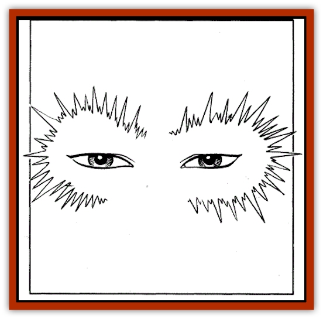

# Ambuchar Devayam - Tan Chin

| Statistic | **Ambuchar Devayam/Tan Chin** |
| --- | --- |
| **Activity Cycle:** | Any, prefers night |
| **Alignment:** | Lawful evil |
| **Armor Class:** | 0 |
| **Climate/Terrain:** | Any |
| **Damage/Attack:** | 1d10/gaze |
| **Diet:** | Omnivore |
| **Frequency:** | Unique |
| **Hit Dice:** | 12 (75 hp) |
| **Intelligence:** | Supra-genius (19) |
| **Magic Resistance:** | 40% |
| **Morale:** | Fearless (20) |
| **Movement:** | 12 |
| **No. Appearing:** | 1 |
| **No. of Attacks:** | 2 |
| **Organization:** | Solitary or city |
| **Size:** | M (6' Tall) |
| **Special Attacks:** | See below |
| **Special Defenses:** | See below |
| **THAC0:** | 9 |
| **Treasure:** | G |
| **XP Value:** | 20,00 |

Ambuchar Devayam is a unique form of undead, created through his own evil necromancy and fortified by the magic of the Imaskari. Through the centuries, one purpose has kept him alive: to conquer Shou Lung and return to the glory he once knew as its emperor, Tan Chin. To this end, he has used his supernatural powers to make himself the Raja of Solon. He intends to conquer Ra-Khati and use it as a staging area for his war against Shou Lung.

In his true form, Ambuchar resembles a pair of disembodied golden eyes. These eyes are all that is visible of the shadow which he projects onto the prime material plane from his true home in an unknown plane of darkness. However, Devayam often uses a permanent form of the possess spell from *Oriental Adventures* to project his spirit into some unfortunate subject's body. Such possessions can always be detected easily, however, for the victim's eyes glow with a harsh, golden gleam.

TThe Solonese raja Ambuchar Devayam and the Shou emperor Tan Chin are in fact the same man. In life, Tan Chin was a powerful necromancer who ruled his empire with an iron fist. After the wizard Shih led a revolt and drove the cruel emperor from his capital in Kuo Meilan, Tan Chin journeyed to the lands south of Solon, learning the secrets of the ancient Imaskari. Finally, he gave his life for unlife, conquered Solon, and became the raja Ambuchar Devayam

**Combat:** Although he fights as a 12 HD monster and inflicts only 1d10 points of damage, the side effects of being hit by the raja are deadly. Any creature hit by Ambuchar Devayam must immediately make two saves, the first one vs. paralyzation and the second one vs. spell. Those failing the first save are paralyzed with fright for 1d4 rounds (and are not required to make the second save). Those failing the second save flee in *fear* for 1d4 rounds.

In addition, any creature struck by the raja suffers a loss of one life (experience) level, and all scores (THAC0, hp, saving throws, etc.) are immediately adjusted. Also, any one creature in combat with the raja is subject to a gaze attack. Devayam rolls to hit the creature normally. If the attack is successful, the victim locks eyes with the raja's golden orbs, and must make a successful Constitution check or lose one point of Constitution (permanently). Beings reduced to zero Constitution points die.

Ambuchar Devayam/Tan Chin can be hit only by +1 or better magical weapons. He is immune to *charm*, *sleep*, *enfeeblement*, *polymorph*, and all cold-based, insanity, and death spells. He can only be *turned* by a cleric of level 15 or higher, and then only on a roll of 20. The raja is also spared the effects of the *Prism of Kushk*; if trapped by its effects, he simply destroys the body he is inhabiting at the time, then returns to his phylactery.

Ambuchar now uses Imaskari magic to store his life force upon the prime material plane in a phylactery inside the Ebony Temple (see Part III, Event 22). The only way to permanently destroy the raja is to collect the four Ebony Artifacts of the Imaskari from the various dimensions inside the Ebony Temple and throw them into the Bottomless Pit of Fire located there. Otherwise, the raja's crystal phylactery simply reforms 24 hours after being destroyed. (Throwing the four Ebony Artifacts into the Bottomless Pit of Fire severs the connection between the raja's dimension and the prime material plane.)

The raja can cast any spell he wishes from the necromancy school of magic. He has the innate power to animate and control any creature that was marked with the *Stamp of Tan Chin* when it died

The statistics and descriptions above apply to any body the raja inhabits, as well as his crystal phylactery.

**Habitat/Society:** He rules as an absolute dictator, killing those who displease him and granting life and power to those who do not. When in Solon, he spends most of his time either in the Star Houses contemplating the latest discoveries from the Imaskari excavations, or in the Ebony Temple, plotting his takeover of Shou Lung.

**Ecology:** To maintain his strength on the prime material plane, the raja needs to possess and drain one living creature per week.

---
## Discovery & Documentation

**Source Publication:** FRA3 Blood Charge (1990)
**Campaign Setting:** Forgotten Realms
**Author(s):** Troy Denning, Anne Brown, Paul Abrams

### Other Creatures Found in This Source Book
   * [[Sandiraksiva_The_Black_Courser|Sandiraksiva, The Black Courser]]
   * [[Dowagu|Dowagu]]
   * [[Gaumahavi_Greater_Purple_Dragon|Gaumahavi, Greater Purple Dragon]]
