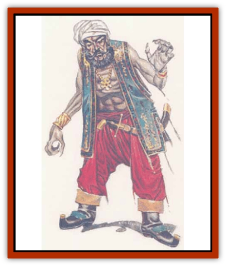

# Amiq Rasol

| Statistic | **Amiq Rasol** |
| --- | --- |
| **Activity Cycle:** | Any |
| **Alignment:** | Neutral evil or neutral |
| **Armor Class:** | 4 |
| **Climate/Terrain:** | Sea coast |
| **Damage/Attack:** | 1d4/1d4 (claws), 1d6 (bite) |
| **Diet:** | Special |
| **Frequency:** | Very rare |
| **Hit Dice:** | 9 |
| **Intelligence:** | High (13-14) |
| **Magic Resistance:** | Nil |
| **Morale:** | Elite (14) |
| **Movement:** | 18, Sw 9 |
| **No. Appearing:** | 1-10 |
| **No. of Attacks:** | 3 |
| **Organization:** | Solitary |
| **Size:** | M (5'-6') |
| **Special Attacks:** | Energy drain, charm |
| **Special Defenses:** | +2 or better weapon to hit, spell immunities. |
| **THAC0:** | 11 |
| **Treasure:** | Nil (C) |
| **XP Value:** | 7,000 |

Amiq Rasol, also called Deep Men or Dark Men, are undead corsairs who were lost at sea, murdered, or marooned. Corsairs who refused to acknowledge or turned away from the gods may also become amiq rasol. They haunt the coasts or islands nearest the site of their deaths and prey upon those mortals unlucky enough to stumble across them. Though usually solitary (e.g., a single marooned corsair), several may be found near the spot where some disaster befell their ship.

The amiq rasol look like normal corsairs except that their eyes have an eerie greenish glow in the dark and their nails and teeth are slightly elongated. Their skin is paler than it ought to be, and their clothing shows some signs of wear. Anyone seeing an amiq rasol with a hakima's special ability, through a *gem of seeing*, or while using a *true seeing* spell will see the creature's true appearance - a rotting corpse.

**Combat:** Amiq rasol attack with claws and teeth, causing 1d4 points of damage with each claw and biting for 1d6. The bite of the amiq rasol also causes the victim to lose one level of experience. As with other undead that use this attack form, the effect reduces the Hit Dice, class bonuses, and spell abilities of the victim. If the victim is drained of all levels, he or she dies but does not become an amiq rasol in turn. A victim may be *raised* or *resurrected* normally.

In addition to their other powers, amiq rasol are able to cast a powerful *charm* spell (save vs. spell at -2) which they use to entice mortals to them. They can use this ability three times a day. A very few of these creatures are simply neutral rather than neutral evil; these will use their *charm* spells to convince mortals to travel to the place of the creature's death, find its remains, and have the proper death rites performed upon them by a priest of 9th level or higher. If this rite is performed, the amiq rasol is freed from its undead existence and released to go on to its afterlife.

Amiq rasol can be turned as [[Vampire_General_Information|vampires]], except in the actual place of their death, where they cannot be turned at all. They are immune to *sleep*, *charm*, *hold*, and cold-based spells. They can be hit only by +2 or better weapons. Holy water does 2d4 points of damage per vial, but only against amiq rasol who are evil. A *raise dead* spell will slay an amiq rasol permanently, and a *resurrection* spell will restore the being to life. If slain with other magics or by weapons, it reconstitutes and forms another body within 24 hours.

**Habitat/Society:** Amiq rasol are found only near the site of their deaths. They are not tied to the exact spot, particularly if they died at sea, but are always found on islands or on the sea coast near the actual site. They feed off the energy they drain from mortals, and amiq rasol that do not feed for several years will fade away until they become [[Wraith|wraiths]]. Though they prefer the dark, since they have natural *infravision*, amiq rasol are just as capable of moving about and attacking by day. They are quite intelligent and may seek to pass themselves off as living beings in order to join a party of adventurers and assure themselves of continued feeding. Whenever the amiq rasol travels more than 100 miles from its place of death, however, it fades away and returns to the spot of its demise. They are partly creatures of the Negative Material Plane and must therefore maintain some contact with it through their habitat. They have no true society. Even those found together seem almost entirely self-absorbed and unconcerned about their fellow undead spirits.

**Ecology:** Amiq rasol have no proper niche and serve no useful purpose in nature. They provide no useful by-products. They do retain some of the equipment and treasure they had when living, and collect such from their victims. One tale tells of an amiq rasol who led a party to a cache of buried treasure in return for their collecting its bones and performing the proper final rites.

---
## Discovery & Documentation

**Source Publication:** Monstrous Compendium, 1995 Annual, Volume 2 (1995)
**Campaign Setting:** Advanced Dungeons & Dragons 2nd Edition
**Author(s):** Jon Pickens

### Other Creatures Found in This Source Book
   * [[Aboleth_Savant|Aboleth, Savant]]
   * [[Addazahr|Addazahr]]
   * [[Arch-Shadow|Arch-Shadow]]
   * [[Automaton_Scaladar|Automaton, Scaladar]]
   * [[Automaton_Trobriand's|Automaton, Trobriand's]]
   * [[Bat_Sporebat|Bat, Sporebat]]
   * [[Beetle_Dragon|Beetle, Dragon]]
   * [[Bi-nou|Bi-nou]]
   * [[Boggle|Boggle]]
   * [[Brownie_Dobie|Brownie, Dobie]]
   * [[Brownie_Quickling|Brownie, Quickling]]
   * [[Cat_Crypt|Cat, Crypt]]
   * [[Cat_Great_Cath_Shee|Cat, Great, Cath Shee]]
   * [[Centaur-kin_Dorvesh|Centaur-kin, Dorvesh]]
   * [[Centaur-kin_Gnoat|Centaur-kin, Gnoat]]
   * [[Centaur-kin_Ha'pony|Centaur-kin, Ha'pony]]
   * [[Centaur-kin_Zebranaur|Centaur-kin, Zebranaur]]
   * [[Chronolily|Chronolily]]
   * [[Curst|Curst]]
   * [[Darktentacles|Darktentacles]]
   * [[Dinosaur_Aquatic|Dinosaur, Aquatic]]
   * [[Dinosaur_II|Dinosaur II]]
   * [[Dinosaur_III|Dinosaur III]]
   * [[Doppelganger_Greater|Doppelganger, Greater]]
   * [[Dragon_Brine|Dragon, Brine]]
   * [[Dragon_Half-|Dragon, Half-]]
   * [[Dragon-kin_Sea_Wyrm|Dragon-kin, Sea Wyrm]]
   * [[Dwarf_Wild|Dwarf, Wild]]
   * [[Ekimmu|Ekimmu]]
   * [[Elemental_Nature|Elemental, Nature]]
   * [[Elf_Winged|Elf, Winged]]
   * [[Fish_Great_Glacier|Fish (Great Glacier)]]
   * [[Fish_Subterranean|Fish, Subterranean]]
   * [[Fish_Toril|Fish (Toril)]]
   * [[Flareater|Flareater]]
   * [[Flumph|Flumph]]
   * [[Froghemoth|Froghemoth]]
   * [[Ghost_Casurua|Ghost, Casurua]]
   * [[Ghost_Ker|Ghost, Ker]]
   * [[Ghul|Ghul]]
   * [[Ghul-Kin|Ghul-Kin]]
   * [[Giant_Half-giant|Giant, Half-giant]]
   * [[Golem_Burning_Man|Golem, Burning Man]]
   * [[Golem_Phantom_Flyer|Golem, Phantom Flyer]]
   * [[Gulguthhydra|Gulguthhydra]]
   * [[Hakeashar|Hakeashar]]
   * [[Horse_Moon-|Horse, Moon-]]
   * [[Human_Dragonslayer|Human, Dragonslayer]]
   * [[Human_Vistana|Human, Vistana]]
   * [[Jellyfish_Giant|Jellyfish, Giant]]
   * [[Kalin|Kalin]]
   * [[Kholiathra|Kholiathra]]
   * [[Laerti|Laerti]]
   * [[Leucrotta_Greater|Leucrotta, Greater]]
   * [[Lich_Suel|Lich, Suel]]
   * [[Lurker_Shadow|Lurker, Shadow]]
   * [[Lycanthrope_Werepanther|Lycanthrope, Werepanther]]
   * [[Lycanthrope_Wereshark|Lycanthrope, Wereshark]]
   * [[Mammal_Herd_II|Mammal, Herd II]]
   * [[Marl|Marl]]
   * [[Meenlock|Meenlock]]
   * [[Mimic_Greater|Mimic, Greater]]
   * [[Mold_II|Mold II]]
   * [[Mummy_Creature|Mummy, Creature]]
   * [[Nyth|Nyth]]
   * [[Ooze_Slime_Jelly_Ghaunadan|Ooze/Slime/Jelly, Ghaunadan]]
   * [[Palimpsest|Palimpsest]]
   * [[Peltast|Peltast]]
   * [[Plant_Dangerous_II|Plant, Dangerous II]]
   * [[Pleistocene_Animal|Pleistocene Animal]]
   * [[Pudding_Subterranean|Pudding, Subterranean]]
   * [[Raggamoffyn|Raggamoffyn]]
   * [[Snake_Serpent|Snake, Serpent]]
   * [[Snake_Serpent_Vine|Snake, Serpent Vine]]
   * [[Sphinx_Draco-|Sphinx, Draco-]]
   * [[Sprite_Seelie_Faerie|Sprite, Seelie Faerie]]
   * [[Sprite_Unseelie_Faerie|Sprite, Unseelie Faerie]]
   * [[Squealer|Squealer]]
   * [[Turtle_Giant|Turtle, Giant]]
   * [[Umpleby|Umpleby]]
   * [[Vizier's_Turban|Vizier's Turban]]
   * [[Wall_Walker|Wall Walker]]
   * [[Webbird|Webbird]]
   * [[Yak-Man|Yak-Man]]
   * [[Zorbo|Zorbo]]
