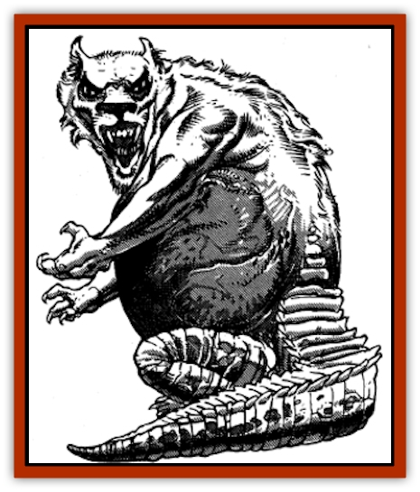
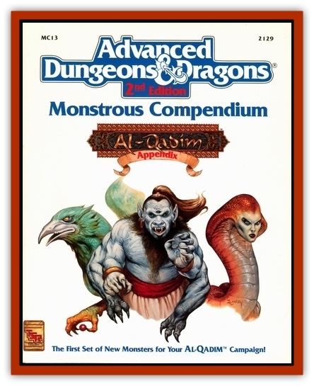

# Ammut

| Statistic | **Ammut** |
| --- | --- |
| **Activity Cycle:** | Night |
| **Alignment:** | Neutral evil |
| **Armor Class:** | 3 |
| **Climate/Terrain:** | Underground |
| **Damage/Attack:** | 2-16 or 1-8/1-8 |
| **Diet:** | Carnivore |
| **Frequency:** | Very rare |
| **Hit Dice:** | 6 |
| **Intelligence:** | Average (8-10) |
| **Magic Resistance:** | Nil |
| **Morale:** | Elite (14) |
| **Movement:** | 9, Sw 12, Br 3 |
| **No. Appearing:** | 1-12 |
| **No. of Attacks:** | 1 or 2 |
| **Organization:** | Clan |
| **Size:** | L (12' long) |
| **Special Attacks:** | Swallow whole, roar |
| **Special Defenses:** | Nil |
| **THAC0:** | 15 |
| **Treasure:** | A |
| **XP Value:** | 650 |

The legendary witness at the judging of the dead, the ammut consume the damned. An ammut resembles a cross between a crocodile, a lioness, and a hippopotamus in mannish form. They have the tail and scaly legs of the crocodile, the tubby belly and thick neck of a hippo, and the sleek arms and head of a humanoid lioness. They are fat, bloated animals, and they are completely oblivious to their surroundings when feeding on wicked souls.

**Combat:** The ammut can attack either with their vicious bite for 2d8 or with two sets of raking claws for 1d8 each. If they bite, their gaping jaws may be unhinged, allowing them to swallow smaller than man-sized creatures on a natural roll of 20. This process is slow and requires 1d4 rounds to complete. During this time, the creature being swallowed is slowly forced into the ammut's gullet with its jaws and hands. Creatures being swallowed may attack to inflict double damage at a -4 penalty to hit with small, thrusting weapons such as knives or daggers.

In addition to their physical attacks, ammut can roar deafeningly once per turn. All creatures within 20' must make a saving throw vs. poison or be deafened for 1d10 rounds. The ammut can undertake no other action during the round it roars.

Ammut are equally at home fighting on land or in water and suffer no penalties to attacks when underwater. Their acute senses of smell and hearing allow them to attack normally in the dark as well, but they must make a morale check and suffer a -2 attack roll penalty when exposed to sunlight or other bright light. A *continual light* spell is irritating to them, but will not force a morale check. However, they do attack at -1 to hit when in the spell's area of effect.

Ammut can see and attack creatures on the Ethereal Plane, usually [[Hama|hama]] and other spirits on their way to the afterlife. They can detect evil at will.

**Habitat/Society:** The ammut are a reclusive race and generally avoid all living creatures. They settle in caverns, fissures, and tunnels under desert oases and near underground rivers. In addition, they often congregate in or near evil cities and necropoli where the spirits they pursue are common. They are lazy and gluttonous creatures, always willing to gorge themselves. When not feeding, they often dig tunnels, underwater grottos, and passages into tombs and burial grounds.

Females are the hereditary rulers among the ammut, and their word is usually obeyed, if somewhat grudgingly. Rulership is as much a function of size and strength as wisdom and cunning; revolts and power struggles over rich feeding grounds are common, though they are kept hidden underground. Females generally force male ammut to do most of the burrowing for new hunting grounds and breeding sites, as they are too lazy to do it themselves.

The roaring of the ammut can be heard for miles underground, giving rise to legends of angry earth spirits and passageways to the land of the dead in human settlements near the ammut's lairs. The ammut roar when mating or when staking out territory as well as in combat, so their noises can be heard even under normal circumstances. They seem to enjoy their ability to make noise, and sometimes roar just for the joy of it. Few underground creatures hunt the ammut, as their flesh is oily and has the taint of decay about it.

The ammut have lived underground since ancient times and cannot stand the sun, though they do infrequently come to the surface by night.

**Ecology:** Ammut eat the spirits of the evil and the damned. The spirit form or hama of wicked people is always either a weak flier like a rooster or parrot or entirely unable to fly, like an emu or a bird with clipped feathers. Ammut can eat material creatures, but they gain no nourishment from them and tend to simply play with their kills, worrying at them and tossing them back and forth until some other underground scavenger manages to carry them off. However, they will kill evil men to provide themselves with food.

---
## Discovery & Documentation

**Source Publication:** MC13 Al-Qadim Appendix (1992)
**Campaign Setting:** Al-Qadim (Forgotten Realms)
**Author(s):** C. Terry Phillips

### Other Creatures Found in This Source Book
   * [[Ashira|Ashira]]
   * [[Asuras|Asuras]]
   * [[Black_Cloud_of_Vengeance|Black Cloud of Vengeance]]
   * [[Buraq|Buraq]]
   * [[Camel|Camel]]
   * [[Camel_of_the_Pearl|Camel of the Pearl]]
   * [[Centaur_Desert|Centaur, Desert]]
   * [[Copper_Automaton|Copper Automaton]]
   * [[Debbi|Debbi]]
   * [[Elephant_Bird|Elephant Bird]]
   * [[Gen|Gen]]
   * [[Genie_Noble_Dao|Genie, Noble Dao]]
   * [[Genie_Noble_Djinni|Genie, Noble Djinni]]
   * [[Genie_Noble_Efreeti|Genie, Noble Efreeti]]
   * [[Genie_Noble_Marid|Genie, Noble Marid]]
   * [[Genie_Tasked_Architect_Builder|Genie, Tasked, Architect/Builder]]
   * [[Genie_Tasked_Artist|Genie, Tasked, Artist]]
   * [[Genie_Tasked_Guardian|Genie, Tasked, Guardian]]
   * [[Genie_Tasked_Herdsman|Genie, Tasked, Herdsman]]
   * [[Genie_Tasked_Slayer|Genie, Tasked, Slayer]]
   * [[Genie_Tasked_Warmonger|Genie, Tasked, Warmonger]]
   * [[Genie_Tasked_Winemaker|Genie, Tasked, Winemaker]]
   * [[Ghost_Mount|Ghost Mount]]
   * [[Ghul|Ghul]]
   * [[Giant_Desert|Giant, Desert]]
   * [[Giant_Jungle|Giant, Jungle]]
   * [[Giant_Reef|Giant, Reef]]
   * [[Giant_Zakhara_General_Information|Giant (Zakhara), General Information]]
   * [[Hama|Hama]]
   * [[Heway|Heway]]
   * [[Living_Idol|Living Idol]]
   * [[Lycanthrope_Werehyena|Lycanthrope, Werehyena]]
   * [[Lycanthrope_Werelion|Lycanthrope, Werelion]]
   * [[Markeen|Markeen]]
   * [[Maskhi|Maskhi]]
   * [[Mason_Wasp_Giant|Mason Wasp, Giant]]
   * [[Nasnas|Nasnas]]
   * [[Pahari|Pahari]]
   * [[Rom|Rom]]
   * [[Sabu_Lord|Sabu Lord]]
   * [[Sakina|Sakina]]
   * [[Serpent_Lord|Serpent Lord]]
   * [[Serpent_Winged|Serpent, Winged]]
   * [[Silat|Silat]]
   * [[Simurgh|Simurgh]]
   * [[Stone_Maiden|Stone Maiden]]
   * [[Vishap|Vishap]]
   * [[Zaratan|Zaratan]]
   * [[Zin|Zin]]
