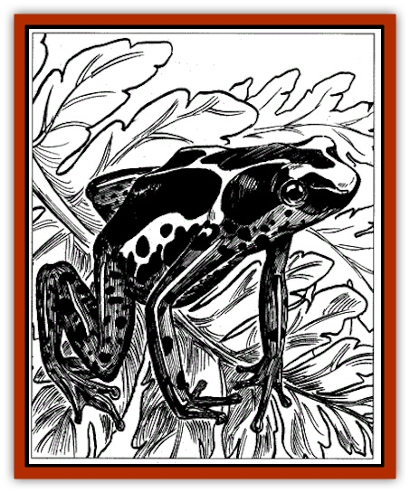

# Amphibian - Poisonous

| Statistic | **Frogs** | **Neotropical Toad** |
| --- | --- | --- |
| **Activity Cycle:** | Any | Any |
| **Alignment:** | Neutral | Neutral |
| **Armor Class:** | 8 | 8 |
| **Climate/Terrain:** | Tropical Forest | Temperate/Tropical Forests |
| **Damage/Attack:** | Nil | Nil |
| **Diet:** | Carnivore | Omnivore |
| **Frequency:** | Uncommon | Common |
| **Hit Dice:** | 1-1 (1-2 hps) | 1 |
| **Intelligence:** | Animal (1) | Animal (1) |
| **Magic Resistance:** | Nil | Nil |
| **Morale:** | Average (10) | Average (8) |
| **Movement:** | 3, hop 3 | 3, hop 3 |
| **No. Appearing:** | 1 | 1-2 |
| **No. of Attacks:** | 0 | 1 |
| **Organization:** | Solitary | Solitary |
| **Size:** | T (1-2&rdquo; long) | T-S (3-9&rdquo; long) |
| **Special Attacks:** | Poison | Poison |
| **Special Defenses:** | Nil | Nil |
| **THAC0:** | 20 | 20 |
| **Treasure:** | Nil | Nil |
| **XP Value:** | 65 | 120 |

## Poisonous Frogs (Physalaemus)

Though there are several sub-species of poisonous [[Frog|frogs]], all are brightly colored with vivid streaks of pink, yellow, green, red, or orange. The brilliant colors are usually a warning sign that the secretions of the frog are fatal. There is no known natural cure for this venom.

**Combat:** Frogs pass on their poison to others through touch, most likely someone steps on one with bare feet or picks one up because it looks "pretty". Its poison glands are found on either side of its head, and when the frog feels threatened it secretes a creamy substance from its skin.

Anyone touching a poisonous frog must make a saving throw vs. poison for every round they remain in contact with the creature. If there is an open wound in the general area there is a cumulative penalty of -2. The venom of poisonous frogs is both cardiotoxic and neurotoxic, containing a variety of chemicals that affect the nervous system in different ways. If a saving throw is successful, it means the poison was not absorbed into the victim's system that round.

Failing the poison save means the toxin has been absorbed into the bloodstream in some measure. If the poison was not introduced into an open wound (such as a cut on the hand or the tip of a dart), the victim suffers from nausea, vomiting, abdominal pain, and inflammation of the area. If introduced into the bloodstream the toxin causes instant paralysis, severe convulsions, and death in 1-4 rounds.

**Habitat/Society:** Poisonous frogs are only found in tropical environments where water is plentiful. Male frogs scent mark their territories in an effort to attract females, and "chirp" loudly when their territory is threatened by other frogs.

**Ecology:** Tadpoles are born in a pool of water inside a bromeliad plant. They then wiggle onto the back of their father, who carries them to deeper water, where they are left to fend for themselves. The venom of the poisonous frog can be extracted by roasting it over a fire, causing the poison to flow out of the glands as the skin contracts.

## Neotropical Toad (genus bufo)

Also known as the [[Toad_Giant|giant]] or aga toad, neotropical toads are characterized by horizontal pupils and enlarged poison glands located behind the eyes. They measure 6-8" long and can weigh up to 1 lb., while a marine sub-species can grow up to 9" and weigh 5 lbs.

**Combat:** Like poisonous frogs, neotropical toads secrete a venom when irritated or threatened. The venom of this toad is cardiotoxic, disrupting normal heart rhythms if ingested or introduced in the blood stream. If simply touched, the victim suffers from stinging, burning, and numbness in the exposed area for 1-6 hours. If this is a hand, nothing can be held for that period of time due to irritation.

A poisoned victim must make a saving throw for each round of contact with the toad, with a -2 penalty if the poison is introduced into an open wound, swallowed, or delivered via an envenomed weapon. If this saving throw is failed, the victim suffers from tightness in the chest, convulsions, salivation, and seizures, followed by death in 1-4 minutes. A successful save indicates only irritation as outlined above.

**Habitat/Society:** Neotropical toads can be found in most temperate environments from deserts to jungles. They live in areas where insects, the toads' only source of food, are plentiful.

**Ecology:** The neotropical toad can be helpful to farmers, feeding on crop-destroying insects. When mating there is fierce competition for females, who may have to contend with up to 12 suitors at one time.

---
## Discovery & Documentation

**Source Publication:** Dragon237 (1996)
**Campaign Setting:** Dragon Magazine
**Author(s):**
