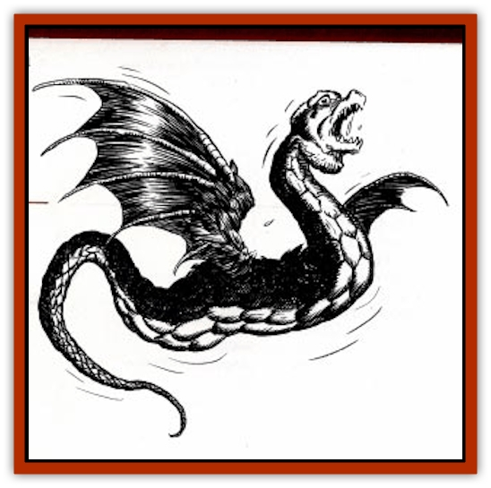

# Amphitere

| Statistic | **Amphitere** |
| --- | --- |
| **Activity Cycle:** | Day |
| **Alignment:** | Neutral |
| **Armor Class:** | 5 |
| **Climate/Terrain:** | Any temperate or tropical land |
| **Damage/Attack:** | 14 or 1-4/1-6 |
| **Diet:** | Carnivore |
| **Frequency:** | Rare |
| **Hit Dice:** | 5 |
| **Intelligence:** | Animal (1) |
| **Magic Resistance:** | Nil |
| **Morale:** | Unsteady (7) |
| **Movement:** | 15, Fly 25 (B) |
| **No. Appearing:** | 1-4 |
| **No. of Attacks:** | 1 or 2 |
| **Organization:** | solitary |
| **Size:** | L (12' long) |
| **Special Attacks:** | Constriction, poison |
| **Special Defenses:** | None |
| **THAC0:** | 15 |
| **Treasure:** | E |
| **XP Value:** | 975 |

The amphitere is a long, winged serpent thicker than a boa constrictor. Its scales are heavy and noticeable, while its eyes are surprisingly large, and all the more noticeable due to the wattled rings around them. The wings, on the other hand, are quite small in proportion to the rest of the creature, suggesting that it relies on an innate magical power to become airborne. It has two tongues, one a normal forked snake tongue, the other ending in a poisonous tip like the head of an arrow. Some amphiteres also have an arrowhead-shaped stinger at the end of the tail. The amphitere's color varies around the world, generally resembling that of the local snakes. The wings are either membranous or feathered.

**Combat:** The amphitere can attack with either a bite or a thrust of the pointed tongue. Both attacks inflict 1-4 hp damage. In addition, victims struck with the venomous tongue must save vs. poison (Type E). Those amphiteres who have a tail spike can lash out for another 1-6 hp damage; both mouth and tail attacks can be used simultaneously Finally, the amphitere can attack as an ordinary constrictor snake, inflicting 1-3 hp damage per round. Note that the amphitere cannot bite while constricting. The flying snake has only to make a successful attack to coil around the victim initially; afterward, each attack is an automatic hit until the victim is freed. Aside from simply killing the amphitere, a victim may unwind the creature’s coils with a successful Open Doors roll at a -1 penalty.

**Habitat/Society:** Amphiteres are solitary coming together briefly in the mating season. The female raises the young alone, driving them out of the lair when they are old enough to take care of themselves (in about 6 weeks). Thus, any young amphiteres the PCs find in a lair are unable to help their mother defend against intruders.

**Ecology:** Amphiteres are predators, though cowardly ones, typically picking off lone wayfarers, sentries, and stray animals from a herd. Children are their favored human prey, as adults are simply too big to be swallowed whole. Despite their poison, amphiteres have natural enemies in plenty who are willing to make an initial strike in an attempt to kill the amphitere before it can fight back. [[Griffon|Griffons]], [[Hippogriff|hippogriffs]], and giant birds of prey are frequent foes, and if an amphitere nest is built too low to the ground, wild pigs will raid it.

Although generally rare, amphiteres may undergo a periodic population explosion during a good season when prey is plentiful. When game is scarce, the weaker youngsters tend to starve to death, with what food there is going solely to the stronger hatchlings. When there is food for everyone, the population doubles, meaning starvation in the future unless something is done. The solution is usually a mass migration, in which many of the creatures fly off en masse to new territories, after which they scatter far and wide, resuming their solitary lifestyle. Although amphiteres are unwelcome neighbors, attacking a massed swarm (which can contain up to 200 individuals) is an extraordinarily bad idea for anyone not plentifully equipped with heavy-damage versions of spells such as *fireball*. Still, because it is quicker to tackle them all together than to hunt down each individual once they scatter, few local rulers can resist the temptation.

---
## Discovery & Documentation

**Source Publication:** Dragon248 (1998)
**Campaign Setting:** Dragon Magazine
**Author(s):** Gregory W. Detwiler, Terry Dykstra

### Other Creatures Found in This Source Book
   * [[Cetus_Lesser|Cetus, Lesser]]
   * [[Dragonet|Dragonet]]
   * [[Dragon_Orange_Sodium|Dragon, Orange (Sodium)]]
   * [[Dragon_Purple_Energy|Dragon, Purple (Energy)]]
   * [[Dragon_Yellow_Salt|Dragon, Yellow (Salt)]]
   * [[Gargouille|Gargouille]]
   * [[Hai_Riyo|Hai Riyo]]
   * [[Peluda|Peluda]]
   * [[Sirrush|Sirrush]]
   * [[Vore_Lekiniskiy_Master_Fire_Worm|Vore Lekiniskiy, Master Fire Worm]]
