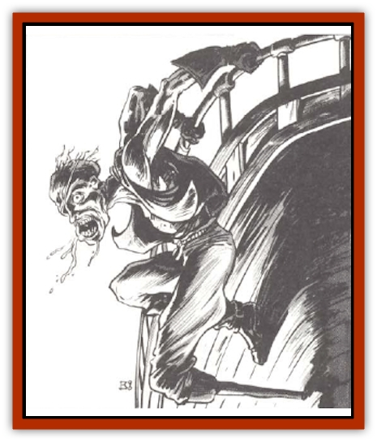

# Ancient Mariner

| Statistic | **Ancient Mariner** |
| --- | --- |
| **Activity Cycle:** | Any |
| **Alignment:** | Chaotic evil |
| **Armor Class:** | 4 |
| **Climate/Terrain:** | Phlogiston |
| **Damage/Attack:** | 1-6 |
| **Diet:** | None |
| **Frequency:** | Very rare |
| **Hit Dice:** | 5+3 |
| **Intelligence:** | Very (11-12) |
| **Magic Resistance:** | Nil |
| **Morale:** | Elite (14) |
| **Movement:** | 9 |
| **No. Appearing:** | 1-6 |
| **No. of Attacks:** | 1 |
| **Organization:** | Crew |
| **Size:** | M (5' tall) |
| **Special Attacks:** | Energy drain |
| **Special Defenses:** | See below |
| **THAC0:** | 15 |
| **Treasure:** | H |
| **XP Value:** | 2,000 / Captain: 3,000 / Mariner shadow: 650 |

An ancient mariner is the undead spirit of a member of a long-lost evil race that once sailed the phlogiston seas.

A true ancient mariner is basically humanoid in appearance. Its neck is a little too long and its torso is somewhat compressed compared to those of a human. The eyes and jaw bulge out from the face. Its voice is quavery, as if being heard from a great distance.

An ancient mariner is partially transparent. It is seen wearing the bright, garish clothing normally associated with pirates and buccaneers. It appears as it did on the day it died, causing each to be unique. This may mean an eye patch. scars. or even a wooden peg leg. While the mariner might carry a weapon of virtually any type, this is also ghostly and cannot cause damage.

**Combat:** The chill touch of the ancient mariner inflicts 1d6 points of cold damage and causes the victim to lose one level. As with other undead that use this attack form, this effect reduces the Hit Dice, class bonuses, spell abilities, etc.

They can be turned as wights by priests. Like most undead, ancient mariners are immune to *sleep*, *charm*, *hold*, and cold-based spells. They are immune to any type of mind control spell as well. They can be hit only by magical weapons.

Any creature killed by the energy drain of an ancient mariner becomes an mariner shadow with most of the abilities of a normal [[Shadow|shadow]]. The newly formed undead obeys the ancient mariner completely. (Beings killed by these shadows are merely dead, and do not become shadows or any other form of undead.) A mariner shadow retains its former appearance, though it is now partially transparent. The power of the ancient mariner is such that all of the victim's equipment stays with it, becoming ghostly as well, unable to touch or be touched by living hands. The equipment cannot be used by the mariner shadow.

**Habitat/Society:** Ancient mariners are found only in phlogiston. They will not enter a crystal sphere under any circumstances. It is thought that they need the phlogiston to power their ghost ships.

If more than one ancient mariner is encountered, one of them is the recognized leader and called <q<captain</q> by its crew. This leader has 6+3 Hit Dice and is turned as a wraith. Ancient mariners are always encountered with a crew of 1d20 mariner shadows, culled from any mixture of spacefaring races. Some large ships have been known to have larger crews of mariner shadows. lf the captain is turned, he orders the entire ship to break off combat and flee.

The greatest power of the ancient mariner captain is to make any object become as insubstantial as the mariner itself. This power requires the captain to <q>touch</q> the object and concentrate for a turn. Once the object is changed, any ancient mariner or mariner shadow can handle it. In this way the treasure hoards of ancient mariners are increased.

A captain can do this to a spelljamming ship as well, which conversion takes a full day of concentration. They prefer human ships, such as galleons, hammerships, and caravels. Part of the ancient mariner's undead energy is given to the ship, which makes the vessel insubstantial, partially transparent, and fuels it. It moves as if powered by a 5th-level spellcaster. The ship becomes immune to all physical or magical attacks, It has no physical substance, passing right through other objects. It holds no air. The ghostly deck hands appear to walk normally upon it. even swarming up the rigging occasionally. A captain can maintain only one ship at a time in this fashion, although he can release a ship from his sway and convert another.

If the ancient mariners on a ship are all killed, the mariner shadows vanish instantly, becoming truly dead. The ghost ship becomes solid and can be boarded and searched. There is a 50% chance that the spelljamming helm is still usable. If only the captain is killed, the ancient mariner with the highest hit points becomes the new captain.

**Ecology:** Unlike most undead, ancient mariners do not sem to be tied to a place or a person. They can roam freely, at least in phlogiston, and trade ships at will.

The original race of the ancient mariners must be long extinct, since they look like no race in the known crystal spheres.

---
## Discovery & Documentation

**Source Publication:** MC7 Spelljammer Appendix I (1990)
**Campaign Setting:** Advanced Dungeons & Dragons 2nd Edition
**Author(s):** various

### Other Creatures Found in This Source Book
   * [[Aartuk|Aartuk]]
   * [[Albari|Albari]]
   * [[Argos|Argos]]
   * [[Beholder_Abomination_Astereater|Beholder (Abomination), Astereater]]
   * [[Blazozoid|Blazozoid]]
   * [[Chattur|Chattur]]
   * [[Chevall|Chevall]]
   * [[Clockwork_Horror|Clockwork Horror]]
   * [[Colossus|Colossus]]
   * [[Delphinid|Delphinid]]
   * [[Dizantar|Dizantar]]
   * [[Dog|Dog]]
   * [[Dog_Bog_Hound|Dog, Bog Hound]]
   * [[Esthetic|Esthetic]]
   * [[Focoid|Focoid]]
   * [[Fractine|Fractine]]
   * [[Giant_Spacesea|Giant, Spacesea]]
   * [[Golem_Furnace|Golem, Furnace]]
   * [[Golem_Radiant|Golem, Radiant]]
   * [[Gravislayer|Gravislayer]]
   * [[Grommam|Grommam]]
   * [[Hadozee|Hadozee]]
   * [[Hamster_Giant_Space|Hamster, Giant Space]]
   * [[Jammer_Leech|Jammer Leech]]
   * [[Lakshu|Lakshu]]
   * [[Lumineaux|Lumineaux]]
   * [[Lutum|Lutum]]
   * [[Mimic_Space|Mimic, Space]]
   * [[Misi|Misi]]
   * [[Moon_Rogue|Moon, Rogue]]
   * [[Mortiss|Mortiss]]
   * [[Murderoid|Murderoid]]
   * [[Nay-Churr|Nay-Churr]]
   * [[Phlog-Crawler|Phlog-Crawler]]
   * [[Plasman|Plasman]]
   * [[Plasmoid_DeGleash|Plasmoid, DeGleash]]
   * [[Plasmoid_DelNoric|Plasmoid, DelNoric]]
   * [[Plasmoid_General_Information|Plasmoid, General Information]]
   * [[Plasmoid_Ontalak|Plasmoid, Ontalak]]
   * [[Puffer|Puffer]]
   * [[Q'nidar|Q'nidar]]
   * [[Rastipede|Rastipede]]
   * [[Reigar|Reigar]]
   * [[Rock_Hopper|Rock Hopper]]
   * [[Slinker|Slinker]]
   * [[Spider_Asteroid|Spider, Asteroid]]
   * [[Spiritjam|Spiritjam]]
   * [[Survivor|Survivor]]
   * [[Syllix|Syllix]]
   * [[Symbiont_Power|Symbiont, Power]]
   * [[Vine_Infinity|Vine, Infinity]]
   * [[Wiggle|Wiggle]]
   * [[Wizshade|Wizshade]]
   * [[Wryback|Wryback]]
   * [[Zard|Zard]]
   * [[Zodar|Zodar]]
