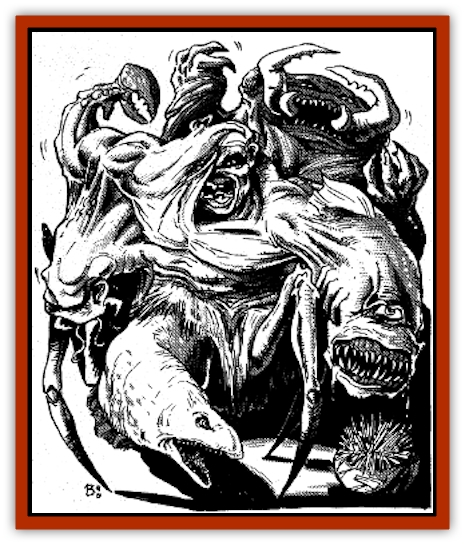

# Andeloid

| Statistic | **Andeloid** |
| --- | --- |
| **Activity Cycle:** | Any (any; never sleeps) |
| **Alignment:** | Neutral (as per dominant host) |
| **Armor Class:** | 10 (AC of individual hosts) |
| **Climate/Terrain:** | Any (as per hosts) |
| **Damage/Attack:** | Special (as per hosts) |
| **Diet:** | Parasite (as per hosts) |
| **Frequency:** | Very rare |
| **Hit Dice:** | 2-24 (plus sum of hosts' Hit Dice) |
| **Intelligence:** | Animal - 1  (variable; as per hosts) |
| **Magic Resistance:** | 20% |
| **Morale:** | Fearless - 20 (Fanatic - 18) |
| **Movement:** | 1 (see text) |
| **No. Appearing:** | 1 |
| **No. of Attacks:** | 1 (as per hosts) |
| **Organization:** | Solitary |
| **Size:** | Spore T; ooze S (variable) |
| **Special Attacks:** | Controls victims (as per hosts) |
| **Special Defenses:** | Immune to weapons, cold, and most spells; saving-throw bonuses (as per hosts) |
| **THAC0:** | 19 or better (as per hosts' THAC0s +1) |
| **Treasure:** | Nil (as carried by hosts) |
| **XP Value:** | As per andeloid's Hit Dice with Hit Dice modifiers as appropriate (plus the XP value of each of the hosts); spores have no XP |

Initial statistics are for an active "ooze" (an andeloid without hosts); values in parentheses are for a composite (an andeloid with hosts).

 

The andeloid is a [[Ooze_Slime_Jelly_I|slime]]like creature that forms a symbiotic link between its victims ("hosts"), joining their flesh together to form a single creature. In all the crystal spheres, few creatures are as bizarre or horrifying as these andeloid composites, chimerical meldings of individual beings.

An andeloid may be encountered in its inert state as a round crystalline spore about the size of a fist (3" across). This spore has a shimmering, shifting color and waxy texture, often being mistaken for an unusual gem (AC 0, hp 4). A spore becomes active, assuming a flat, oozelike shape 2' in diameter, once it has been exposed to at least one point of damage from heat or flame, or once it is left within 5' of a live potential host for 2d6 rounds. A spore takes no damage from fire, though an active andeloid is not so immune (see "Combat").

An andeloid without hosts is nearly mindless and has only one driving purpose - to take over a host. However, an andeloid composite is a group personality based on its component parts, directed by the most intelligent being in the composite and modified by the strongest attitudes of the other hosts and by the needs of the andeloid itself to survive and grow. A composite of several intelligent beings acts as if governed by a committee.

**Combat:** An active andeloid without a host moves slowly and lies in wait for a potential host. Anyone touched by the ooze must make a save vs. poison to avoid infestation (unconscious vfctims awaken if the save succeeds). A conscious victim can repel or kill the andeloid with flame or with a few spells noted later (they are immune to all other spells). Once the andeloid succeeds in infesting a victim, it bonds with the host's psyche and cannot be driven off, though it can be slain by spells or fire. A host taken over by an andeloid appears to have been covered with a ½"-thick translucent slime; useful tools and weapons are retained, as is clothing (though the latter becomes soaked).

When a victim is added to a composite, a limb or body part of the host is stuck as if by glue to another host. Within a month, the flesh of the two creatures merges, and the united creature (a composite) cannot be separated normally into component hosts. If the andeloid is slain before a host merges with the composite, the victim may make a System Shock roll once per round to pull free. Creatures that have been fully melded into a composite will die once the andeloid binding them dies; their bodies cannot be separated again except by using a *wish* or *heal,* but they may be raised normally.

An andeloid composite combines many benefits of its hosts. The number of Hit Dice and hit points of a composite equals the total of those of the andeloid and its hosts (Hit Dice are used in calculating saving throws only, not THAC0 scores). Any damage suffered is subtracted from that total and is shared by all hosts of the composite. (Note that though an andeloid is immune to many things, this is not necessarily true of its hosts.) Special immunities, resistances, and defenses of any one host are shared by all other hosts. A composite gains +4 on saves vs. poison. All of the hosts are simultaneously slain once the hit-point total of the andeloid and its hosts reaches zero. However, the andeloid itself is not slain if not attacked by fire or spells; it is instead rendered dormant for 2d8 turns, after which it re-forms into a 2 Hit Dice ooze again and must hunt for new hosts.

A composite retains its hosts' attack forms. If a host can make several attacks, it makes one less than normal if that limb has melded to the composite, A host attacks with a +1 bonus to its normal THAC0. Damage done is as normally done by each host. Special attacks must be directed by the host that possesses that ability, but these are lost if the body part with those abilities is melded with another creature in the composite. Conversely, weaknesses of component hosts are shared by the entire composite, though a natural ability or defense may cancel a weakness.

The following spells have special effects on the andeloid, in addition to any beneficial effects to hosts: *cure disease* causes 3d6 points of damage to the andeloid; *neutralize poison* causes 1d6 points of damage to the andeloid; *regeneration* causes 2d10 points of damage to the andeloid and forces it to save vs. death magic or become dormant for 2d8 turns; *restoration* causes 3d6 points of damage and forces the andeloid to save vs. death magic or be destroyed. In this way hosts may be rescued from a composite.

Composites cannot fly or swim. Their land movement rates equal those of their slowest moving hosts.

An andeloid's overriding purpose is to survive and grow. An intelligent composite always attempts to capture powerful beings, if it can do so safely, in order to add them to the composite. The size of a composite is limited by the andeloid's Hit Dice. Young andeloids have only 2 Hit Dice, but gain 1 Hit Dice per three months of growth to a maximum of 24 Hit Dice. The total of all hosts' Hit Dice and levels cannot exceed that of the andeloid binding them. If a composite tries to "collect" a victim that has too many Hit Dice to be controlled, all attempts to turn that being into a host will fail.

In an effort to improve the composite, the andeloid may decide to absorb an entire host as food to provide space for an addition. This requires the decision of the controlling ego, and a period of time equal to one weel per Hit Die of the host (see "Ecology")- This intentional absorption results in the melding of the absorbed personality's ego, altering the dominant ego accordingly.

**Habitat/Society:** Generally, intelligent races do not tolerate andeloids, which are sought out and destroyed as quickly as possible to prevent infestation. However, chaotic species may accept a single composite that has reached its current size limits. Some chaotic-evil and insane races may view melding with an andeloid as tantamount to becoming a hero of legend.

Since andeloids are driven by their dominant personalities, they can be either good or evil in nature. However, because of the loathing felt for andeloids by many races, there is a greater tendency for them to be savage monsters instead of benign, helpful colonies. Due to this lack of acceptance, composites tend to inhabit remote regions or follow nomadic lives traveling wildspace (if one host of a composite has spelljamming powers) and crystal spheres, staying in no place for long. Any treasure found is converted to easily carried items or cached on remote asteroids or moons.

**Ecology:** As long as its hosts are able to feed, the andeloid draws sustenance from its hosts' feeding. An andeloid may survive without food for a week, converting its hosts' stores of fat into energy to provide its hosts's needs. After a week of such deprivation, the parasite must begin to convert its hosts' Hit Dice into food at the rate of 1 Hit Dice per week, starting with the Hit Dice of its weakest host. As the Hit Dice are absorbed, the body of the host losing the Hit Dice is absorbed and eliminated from the composite.

After the andeloid is forced to consume all of its available hosts' Hit Dice, it becomes dormant a week later, forming spores that can survive for cons without air or sustenance. As many such spores are created as the andeloid itself has Hit Dice.

Andeloids do not reproduce other than by creating spores. An andeloid newly created from a spore has no memories of any previous existence.

---
## Discovery & Documentation

**Source Publication:** Dragon159 (1990)
**Campaign Setting:** Dragon Magazine
**Author(s):** 

### Other Creatures Found in This Source Book
   * [[Infernite|Infernite]]
