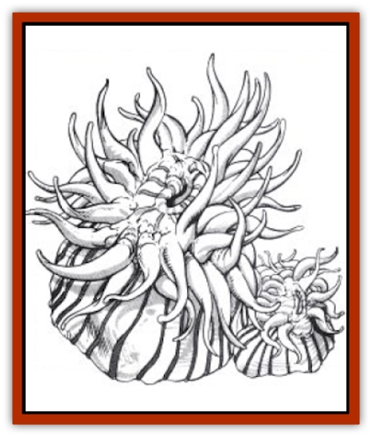

# Anemone - Giant Sea

| Statistic | **Dragon Variety** | **Lance Variety** |
| --- | --- | --- |
| **Activity Cycle:** | Any | Any |
| **Alignment:** | Neutral | Neutral |
| **Armor Class:** | 6 (body)/8 (tentacle) | 2 |
| **Climate/Terrain:** | Ocean depths, tropical coasts | Tropical, subtropical, / and temperate/Salt water |
| **Damage/Attack:** | 1d3 | See below |
| **Diet:** | Carnivore | Carnivore |
| **Frequency:** | Rare | Very rare |
| **Hit Dice:** | 7 | 16 |
| **Intelligence:** | Non- (0) | Animal (1) |
| **Magic Resistance:** | Nil | Nil |
| **Morale:** | Fearless (19-20) | Steady (11) |
| **Movement:** | Sw 1 | ¼ |
| **No. Appearing:** | 1 | 3-18 |
| **No. of Attacks:** | 10 tentacles per creature | See below |
| **Organization:** | Solitary | School |
| **Size:** | L (8' diameter) | L (10' diameter trunk) |
| **Special Attacks:** | Paralysis, swallow whole | See below |
| **Special Defenses:** | Nil | See below |
| **THAC0:** | 13 | 5 |
| **Treasure:** | Nil | See below |
| **XP Value:** | 1,000 | 12,000 |

## Lance Variety

The anemone (lance variety) is a mobile, plant-like creature A voracious carnivore, it is a threat to all denizens of the sea.

The anemone has a thick, cylindrical trunk that is ten feet in diameter and about eight feet tall. The trunk is usually bright purple, but can also be blue red, pink, or any combination of these colors. The bottom of the trunk is covered with small suckers, while the top contains a toothless mouth surrounded by ten translucent tentacles, each 10-15 feet in length.

**Combat:** The anemone attacks with whip-like lashes of its tentacles. It makes 1d3 attacks per round, each attack consists of 1d10 tentacle strikes. A victim struck by a tentacle suffers 1d4 points of damage and also must roll a saving throw vs. paralysis. A victim succeeding on the saving roll is immune to all paralyzing and poison effects of that particular anemone. If the saving throw is unsuccessful, the victim suffers an additional 1d6 points of poison damage and becomes paralyzed for the next 3d6 rounds. During this time, the victim is unable to attack or take any other actions. Should the effects of the paralysis wear off, the anemone will attack him again; if it hits the victim can again attempt a saving throw to avoid the poison and the paralysis.

The anemone uses its tentacles to drag a paralyzed victim to its mouth, a process that takes one round to complete. it requires at least two tentacles to drag a victim; the anemone can use any free tentacles to continue attacks on other opponents. The mouth leads directly to the anemone's trunk cavity. When a victim is inside the cavity, the mouth seals shut. Tiny valves at the base of the trunk expel all of the water within the cavitv (this takes eight rounds). When the cavity is empty, it begins to refill with acidic juices secreted from glands in the base. The cavity fills with acidic juices at the rate of one foot per turn until the entire cavity is filled. Beginning on the first round of secretion, victims trapped in the cavity suffer 1d4 points of damage (no saving throw). Digestion is completed when the victim is reduced to -12 or fewer hit points, after which *resurrection* is impossible.

Because of the confined space, victims trapped in the cavity can use only short, sharp weapons to hack themselves free. Maximum normal damage is 1 point per round plus magical and Strength bonuses. Rescue must usually come from outside. If the anemone suffers a loss of 50% of its hit points, and all of the damage is directed at its trunk the victim can be freed. Thrusting and stabbing weapons have a 20% chance of striking the victim trapped in the trunk. If a trapped character is freed, charactcrs on the outside have a chance of suffering damage from the acidic juice, assuming they are within ten feet of the anemone. The percentage chance of receiving damage is equal to 5% for each foot of juice in the anemone when the victim inside is freed. Characters affected by the juice suffer 1d4 points of damage. (For instance, if the cavity was filled with four feet of acidic juice when the victim inside was freed, all characters within ten feet of the anemone have a 20% chance of suffering 1d4 points of damage from the juice.)

Each tentacle can suffer only 5 points of damage before it is severed, assuming that the attacker is directing his attacks to the same area in order to chop it off. An anemone regenerates at the rate of 1 point per turn, and it always repairs its tentacles first. If the anemone suffers 30 or more points of damage in a single round, it withdraws all of its tentacles inside its body for 1d10 rounds and spews acidic juices in a ten-foot radius. Those within ten feet of the anemone when it spews juice have a 90% chance of suffering 1d4 points of damage; this check must be made for each round the character is exposed to the acid. When the anemone releases its tentacles, it stops spewing (for instance, if the anemone withdraws its tentacles for six rounds, it also spews juice for six rounds).

**Habitat/Society:** Anemones wander the ocean floor. They move slowly and with great effort, generally preferring to remain stationary for long periods by attaching to a rock or other solid surface. They usually travel in schools of three or more.

Anemones are asexual, reproducing via buds which break off and grow into new anemones. Indigestible treasure items can sometimes be found beneath their trunks.

**Ecology:** Anemones eat all species of marine life. Anemones relish humanoids, especially elves and small humans. Although most sea creatures give anemones wide berth, manta rays and small sucker fish are sometimes seen swimming among a school of anemones, as these creatures are immune to the effects of their tentacles.

## Dragon Variety

The giant sea anamone (dragon variety) is a larger and far more dangerous version of its smaller relative (the normal sea anemone, not the lance variety described above). Although it lives at a variety or ocean depths, it is encountered singly below 50 feet. The anemone has a stout central body about 8 feet in diameter, crowned with a gaping maw about 6 feet in diameter. Surrounding the maw are many stinging tentacles, about 100 in most species. These floating, waving tentacles can snare prey within 30 feet of the body. Giant sea anemones are often very colorful, being a riot of red, green, pink, blue, or a combination of colors.

**Combat:** The gentle drifting motion of the sea anemone's tentacles belies how swiftly they can react to seize and draw in any prey that so much as brushes against them. A successful hit by a tentacle pierces the victim with hundreds of small, barbed, hook-like needles that collectively inflict 1d3 points of damage on the initial strike (only). The anemone will attempt to attach at least three tentacles to the prey, making up to three attacks per round against creatures in reach of its tentacles.

The round after the first tentacle hits, the prey is injected with a paralytic poison. A saving throw vs. poison negates the paralytic effect for one round, check each round until free or a saving throw is failed. Once affected, each round the prey loses 1 point of movement, Dexterity, and Strength. When at least one of these is reduced to 0, the prey is paralyzed for 2d4 turns. (Creatures unrated for Strength and Dexterity use the movement rating.) Having more than one tentacle attached does not accelerate the paralysis, but the poison advances as long as a single tentacle is attached. A *neutralize poison* spell can negate all poison in the prey's system, but does not prevent new poison from being administered.

A trapped prey can attempt to escape at round. Each tentacle's hold can be broken the beginning of each round. Each tentacle's hold can be broken by a successful saving throw vs. petrification; check for each tentacle. A prey that escapes all tentacles is free to act normally, subject to the effects of the paralytic poison already in its system. A tentacle can be severed by 6 points of slashing damage. Severed tentacles do not count against the giant anemone's hit points.

Once the prey has been seized by three tentacles, the anemone attempts to swallow it whole. This requires a successful attack roll. The anemone's internal organs grind up the prey at a rate equal to the prey's base armor class (physical armor) per round; a victim in plate armor +3 would take no damage. Inedible prey, or an object too large for the anemone's mouth (6-feet diameter) will be held until paralyzed, then released to drift on the currents or fall to the sea bottom, where it will be picked apart by other scavengers. If the maw is full, other prey is held for later.

The anemone is slain when its central body is reduced to 0 hit points or less. All tentacles regrow at the rate of one foot per day.

**Habitat/Society:** Though they may look like plants, giant sea anemones are animals, if very basic ones. While giant sea anemones are often encountered as stationary hazards, but they can, in fact, slowly move to new locations that promise a better food supply.

Most species of giant sea anemone, when seriously threatened, can pull their tentacles all the way back into their central bodies. An anemone might be easily mistaken for a large rock when its tentacles are withdrawn.

The giant sea anemone produces by budding. The young anemone grows out of the base of the parent. When sufficiently grown, it breaks off and moves to its own feeding ground.

**Ecology:** Some fish are immune to the poison of the giant sea anemone. Two types are common. The first type consists of 1- to 2-foot long, brightly colored fish that escapes predators by hiding among the tentacles; the anemone does not attack them at all. Unwary predators who venture too close to the anemone are trapped, however, and the small fish feed on the scraps left by the anemone. The second type of fish is a predator, such as a barracuda, that attacks the tentacles and feeds on them. These fish are either immune to the anemone's poison or have thicker hides than most other fish to defeat the barbed needles of the tentacles. They attack the tentacles in swift darting forays.

Giant sea anemones are sometimes kept as guard creatures by underwater races, who feed them enough to keep them from leaving, while leaving them hungry enough to attack intruders.

---
## Discovery & Documentation

**Source Publication:** MC4 Dragonlance Appendix (w/binder #2) (1989)
**Campaign Setting:** Dragonlance
**Author(s):** Rick Swan

### Other Creatures Found in This Source Book
   * [[Bear_Ice|Bear, Ice]]
   * [[Beast_Undead|Beast, Undead]]
   * [[Bird_Krynn|Bird (Krynn)]]
   * [[Disir|Disir]]
   * [[Draconian_Aurak|Draconian, Aurak]]
   * [[Draconian_Baaz|Draconian, Baaz]]
   * [[Draconian_Bozak|Draconian, Bozak]]
   * [[Draconian_Kapak|Draconian, Kapak]]
   * [[Draconian_General_Information|Draconian, General Information]]
   * [[Draconian_Sivak|Draconian, Sivak]]
   * [[Draconian_Proto-_Traag|Draconian, Proto-, Traag]]
   * [[Dragon_Amphi|Dragon, Amphi]]
   * [[Dragon_Astral|Dragon, Astral]]
   * [[Dragon_Kodragon|Dragon, Kodragon]]
   * [[Dragon_Krynn_Othlorx_General_Information|Dragon (Krynn), Othlorx, General Information]]
   * [[Dragon_Krynn_General_Information|Dragon (Krynn), General Information]]
   * [[Dragon_Sea|Dragon, Sea]]
   * [[Dreamshadow|Dreamshadow]]
   * [[Dreamwraith|Dreamwraith]]
   * [[Dwarf_Daergar|Dwarf, Daergar]]
   * [[Dwarf_Hill_Neidar|Dwarf, Hill, Neidar]]
   * [[Dwarf_Mountain_Hylar|Dwarf, Mountain, Hylar]]
   * [[Dwarf_Theiwar|Dwarf, Theiwar]]
   * [[Dwarf_Zakhar|Dwarf, Zakhar]]
   * [[Elf_Half-|Elf, Half-]]
   * [[Elf_High_Qualinesti|Elf, High, Qualinesti]]
   * [[Elf_High_Silvanesti|Elf, High, Silvanesti]]
   * [[Elf_Sea_Dargonesti|Elf, Sea, Dargonesti]]
   * [[Elf_Sea_Dimernesti|Elf, Sea, Dimernesti]]
   * [[Elf_Wild_Kagonesti|Elf, Wild, Kagonesti]]
   * [[Eyewing|Eyewing]]
   * [[Fetch|Fetch]]
   * [[Fire_Minion|Fire Minion]]
   * [[Fireshadow|Fireshadow]]
   * [[Gnome_Tinker|Gnome, Tinker]]
   * [[Gurik_Cha'ahl|Gurik Cha'ahl]]
   * [[Haunt_Knight|Haunt, Knight]]
   * [[Horax|Horax]]
   * [[Human_Krynn|Human (Krynn)]]
   * [[Imp_Blood_Sea|Imp, Blood Sea]]
   * [[Kalothagh|Kalothagh]]
   * [[Kani_Doll|Kani Doll]]
   * [[Kender|Kender]]
   * [[Kyrie|Kyrie]]
   * [[Lizard_Man_Krynn|Lizard Man (Krynn)]]
   * [[Minotaur_Krynn|Minotaur, Krynn]]
   * [[Ogre_High|Ogre, High]]
   * [[Ogre_Krynn|Ogre (Krynn)]]
   * [[Phaethon|Phaethon]]
   * [[Saqualaminoi|Saqualaminoi]]
   * [[Shadowperson|Shadowperson]]
   * [[Shimmerweed|Shimmerweed]]
   * [[Skrit|Skrit]]
   * [[Spectral_Minion|Spectral Minion]]
   * [[Spider_Krynn|Spider (Krynn)]]
   * [[Stag|Stag]]
   * [[Tayling|Tayling]]
   * [[Thanoi|Thanoi]]
   * [[Tylor|Tylor]]
   * [[Wichtlin|Wichtlin]]
   * [[Wyndlass|Wyndlass]]
   * [[Yaggol|Yaggol]]
