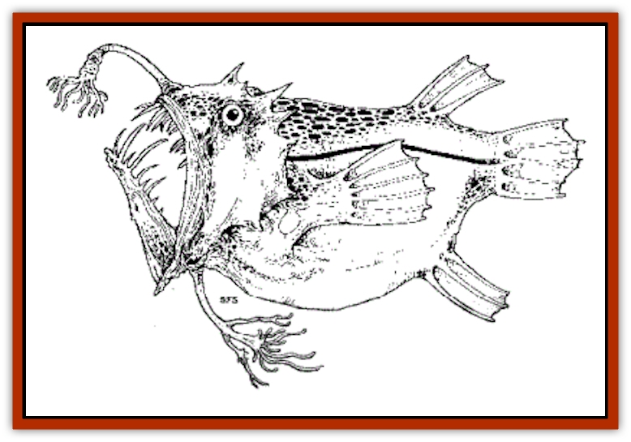

# Angler Fish

| Statistic | **Angler Fish** |
| --- | --- |
| **Activity Cycle:** | Any |
| **Alignment:** | Lawful neutral |
| **Armor Class:** | Sw 12 |
| **Climate/Terrain:** | Ocean depths |
| **Damage/Attack:** | Swallow whole |
| **Diet:** | Carnivore |
| **Frequency:** | Uncommon |
| **Hit Dice:** | 13 |
| **Intelligence:** | Animal (1) |
| **Magic Resistance:** | -19% |
| **Morale:** |  |
| **Movement:** | 8 |
| **No. Appearing:** | 8 |
| **No. of Attacks:** | 2d8 or (some species only) 1d4 |
| **Organization:** | Solitary |
| **Size:** | 1400 |
| **Special Attacks:** | Nil |
| **Special Defenses:** | Nil |
| **THAC0:** | 1 |
| **Treasure:** | 4 |
| **XP Value:** |  |

The angler fish is, as its name implies, a fish that hunts by means of a natural "fishing line," sometimes even with a hook (not in the real-world creatures).

These bloated-looking things are clumsy swimmers, relying on their lures to cause prey to come to them. Surface-dwellers have an illicium (the "fishing line", actually the modified first ray of the dorsal fin) that looks like a worm or similar creature; with deep-sea anglers, the illicium is luminous. Some anglers don't have an illicium, relying instead on a luminous growth protruding from the roof or palate of the mouth. Imaginative DMs in a fantasy world full of human and demihuman adventurers can modify these growths to resemble from mounds of sunken treasure to a beautiful mermaid, both lying in a "cavern" chock full of "stalactites" and "stalages." Most anglers are no bigger than a man's fist, though one surface-dwelling type is large enough to swallow ducks and geese and does so.

**Combat:** Combat for the angler fish generally consists of decoying the victim close enough to be attacked, with the teeth getting in one good bite (2d8 hp damage) and then simply holding the victim close enough to be attacked, with the teeth getting in one good bite (2d8 hp damage) and then simply holding the victim in place to be digested (1d8 hp damage per round). Some anglers actually have one or more hooks at the end of the illicium. In real life, they just look like hooks, without doing anything useful, but in a fantasy ocean, they can be used to grapple a victim (1d4 hp damage) and draw him down to the mouth. Because of the angler fish's poor AC, it is relatively easy for stabbing weapons to penetrate it (and do as much damage to the victim as to his attacker). The fish's teeth curve even think about letting go, no matter how much those guys with tridents and daggers may make it wish it could. Swallowing prey is the ultimate act of commitment.

**Habitat/Society:** Oddly enough, in most species of angler fish, only the females do the hunting. The male, who is only a fraction of the female's size, clings lampreylike to her body, living off her as a parasite. Actually, this is a rather logical thing to do; because of the darkness of the ocean depths and the fact that angler fish are few and far between, this system ensures that every fish will always have a mate on hand when breeding season comes around. What happens to the young is not known.

**Ecology:** The angler fish is the same generic type of predator that all hunters of the deep are. Its flesh is edible, though not a gourmet's delight by human standards.

---
## Discovery & Documentation

**Source Publication:** Dragon235 (1996)
**Campaign Setting:** Dragon Magazine
**Author(s):** 

### Other Creatures Found in This Source Book
   * [[Death_Minnow|Death Minnow]]
   * [[Fish_Deep_Ocean|Fish, Deep Ocean]]
   * [[Gulper|Gulper]]
   * [[Hide|Hide]]
   * [[Octopus_Octo-Jelly|Octopus, Octo-Jelly]]
