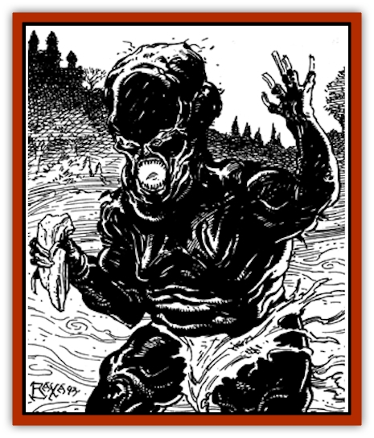
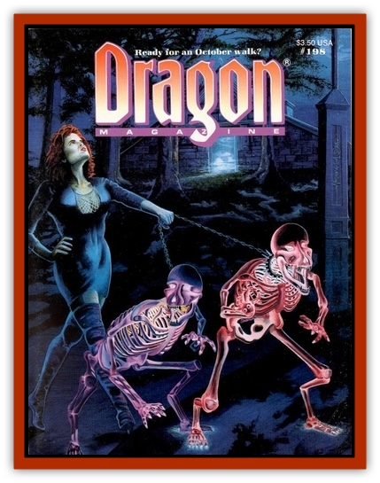

# Angreden

| Statistic | **Angreden** |
| --- | --- |
| **Activity Cycle:** | Night |
| **Alignment:** | Any evil |
| **Armor Class:** | 5 |
| **Climate/Terrain:** | Any, especially subarctic and subterranean |
| **Damage/Attack:** | 1d6+2 |
| **Diet:** | None |
| **Frequency:** | Rare |
| **Hit Dice:** | 4+4 |
| **Intelligence:** | Average (8-10) |
| **Magic Resistance:** | Nil |
| **Morale:** | Fearless (20) |
| **Movement:** | 12 |
| **No. Appearing:** | 1 or 2-16 |
| **No. of Attacks:** | 1 |
| **Organization:** | Solitary or small bands |
| **Size:** | M (5-7') |
| **Special Attacks:** | Enfeeblement, fear |
| **Special Defenses:** | Immunity to some spells |
| **THAC0:** | 14 |
| **Treasure:** | B |
| **XP Value:** | 1,400 |

An angreden, based on Middle-English form, would mean "the state or condition of anger" or "filled with anger". An angreden is the walking corpse of an individual who died under a curse, or who was so filled with hatred and anger in life that he refused to lie still in his grave. An angreden has a blackened, bloated body with a huge, oversized head.

**Combat:** An angreden is considered to have 18 Strength, so it gets a +1 to attack and +2 to damage in combat, which has already calculated into its statistics. Its touch acts like an *enfeeblement* spell. Victims of a successful hit must make a save vs. spells or temporarily lose 25% of their Strength scores (fractions rounded down). The gaze of an angreden acts as a *fear* spell. An angreden's attacks are unsophisticated, being physical attacks with a club or hand-held rock.

An angreden is immune to *sleep,* *charm,* *hold,* cold, poison, paralyzation, and death magic. A *raise dead* spell destroys it. A cleric has the same chance to turn an angreden as he does a wight.

**Habitat/Society:** An angreden has trouble getting along with everyone, even after death. It is often solitary but may sometimes band with others for protection. Such bands are a snarling, quarrelsome lot.

An angreden may be lawful, neutral, or chaotic, but will always be evil. It exists only to vent its insensate rage at the world. It delights in harm for its own sake and, when not killing, will try to smash everything in sight.

**Note**

  Strictly as a plot suggestion, DMs may wish to give an angreden the power to *curse* before being destroyed. Such a *curse* acts as a prophetic utterance, unless it is lifted with a *remove curse* spell. For example, an angreden might tell a character: "Horses will die under you" and that character would be unable to ride a horse until the curse was lifted. If an angreden is given a curse, the XP Value becomes 2,000 instead of 1,400.

---
## Discovery & Documentation

**Source Publication:** Dragon198 (1993)
**Campaign Setting:** Dragon Magazine
**Author(s):** 

### Other Creatures Found in This Source Book
   * [[Ghoul_Goop|Ghoul, Goop]]
   * [[Ka|Ka]]
   * [[Vartha|Vartha]]
   * [[Wight_King-|Wight, King-]]
   * [[Wraith-King|Wraith-King]]
