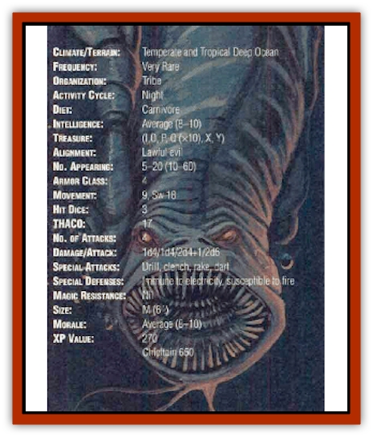

# Anguiliian

| Statistic | **Anguiliian** |
| --- | --- |
| **Activity Cycle:** | Night |
| **Alignment:** | Lawful evil |
| **Armor Class:** | 4 |
| **Climate/Terrain:** | Temperate and Tropical Deep Ocean |
| **Damage/Attack:** | 1d4/1d4/2d4+1/2d6 |
| **Diet:** | Carnivore |
| **Frequency:** | Very rare |
| **Hit Dice:** | 3 |
| **Intelligence:** | Average (8-10) |
| **Magic Resistance:** | Nil |
| **Morale:** | Average (8-10) |
| **Movement:** | 9, Sw 18 |
| **No. Appearing:** | 5-20 (10-60) |
| **No. of Attacks:** | 4 |
| **Organization:** | Tribe |
| **Size:** | M (6') |
| **Special Attacks:** | Drill, clench, rake, dart |
| **Special Defenses:** | Immune to electricity, susceptible to fire |
| **THAC0:** | 17 |
| **Treasure:** | (I,O,P,Q&times;10,X,Y) |
| **XP Value:** | 270 / Chieftain: 650 |

Anguiliians (AN-gwill-ee-anz) resemble a cross between a human and an [[Eel|eel]]. They have sinuous bodies about 6 feet long, the upper section of which bears two fleshy appendages tipped with bony pincers. The anguiliians use these appendages as arms (the pincers can cut, crush, and grasp almost any living oyect) and forward fins.

Two short legs - ending in wide, six-toed feet - sprout from the creatures' flanks about two-thirds of the way down their bodies. Beyond their legs, anguiliian bodies possess flat tails fringed top and bottom with fins.

In addition, the creatures have reptilian eyes and jawless, circular mouths lined with row upon row of teeth. Anguiliian snouts arr blunt, and they possess a pair of wide fins on the sides of their heads which resemble spiny ears.

An anphian's scaly body has a muddy brown hue with dots or speckles of black and tan.

Anguiliians communicate through clicks, thumps and whistles, just like [[Sahuagin|sahuagin]]. In fact, the creatures speak a dialect of the sahuagin tongue. Their chieftains usually know the common tongue of surface dwellers (which they speak tolerably well) and the racial tongues of one or two other land or marine races.

**Combat:** Anguiliians make swift attacks aimed at overwhelming the opposition. In addition, they possess senses as acute as those of their sahuagin cousins. When fighting surface dwellers underwater, anguiliians gain a +2 bonus to their surprise rolls and impose a -2 penalty to their opponents' surprise rolls.

Once an hour, anguiliians can dart through the water at a rate of 30 for five minutes. They can use this burst of speed all at once, or in shorter bursts. However, once they have used their extra speed for five minutes, they must wait a full hour before doing so again.

In open water, anguiliians often form a loose sphere around their enemy: a few anguiliians swim overheard, a few more attack from the front, rear, and flanks, and the majority strike from below.

Anguiliians attack with their mouths, pincers, and tails. Their tails deliver a pile-driver punch, while their pincers slice and crush. On a successful bite, an anpihian attaches itself to its opponent unless the opponent wears metal armor or has a natural Armor Class of 0 or better. Once attached, the anguiliian automatically drills into the opponent for bite damage each round. (Anguiliians have been known to drill their way into large creatures - such as [[Whale|whales]] - and literally eat them from the inside out). Victims of an anguiliian bite can dislodge the creature only by killing it, or tearing it away with a successful bend bars roll.

While attached, an anguiliian automatically rakes its opponent with its feet each round for an additional 2d4 points of damage. In addition, all attacks with its pincers and tail gain a +2 attack bonus.

If unable to attach its mouth, an anguiliian can grasp its opponent with its pincers. If both pincers hit during the same round, the creature traps the opponent, automatically inflicting raking and pincer damage reach round and gaining a +2 attack bonus with its tail and bite.

Anguiliians are completely immune to all forms of electrical attack. However, all fire attacks inflict an extra 2 points per die of damage. Furthermore, the anguiliian suffers a -2 saving throw penalty vs. fire attacks. Anguiliians cannot abide bright light or fresh water. When exposed to either, they must make a morale check or withdraw.

During their rare forays ashore, anguiliians typically carry several stonetipped javelins, which they clench in their pincers.

**Habitat/Society:** Anguiliians live in the sunless depths of the ocean. They typically dwell at depths between 1,800 and 2,400 feet, rising near the surface only at night to hunt. Some anguiliiam even venture to the surface on moonless nights. However, the creatures limit such forays to brief raids on lonely islands or attacks on passing ships.

The anguiliian's social structure is a patriarchal hierarchy based on an elder chieftain (who has 5 Hit Dice). Anguiliian leaders are subject to challenge - just as sahuagin leaders. Unlike sahuagin, however, anguiliians do not have a rigid nobility system or a priesthood.

Anguiliians form free-swimming tribes that cruise the ocean depths. The entire tribe remains mobile, with the females carrying their eggs along as they swim. Most anguiliian encounters will involve 5d4 adult males acting as scouts or hunters for the main group. There is a 40% chance that an anguiliian tribe has 3d4 [[Eel|marine eels]] as guards.

**Ecology:** Anguiliians consume any flesh - including carrion, slain opponents, and their own dead. They regularly hunt [[Squid_Giant|giant squid]], whales, and a variety of fish. Anguiliian meat is foully pungent, and not even the voracious sahuagin care to eat it. [[Shark|Sharks]], [[Squid_Giant|kraken]], and other monsters of the deep aren't so picky, and often prey upon anguiliians before the anguiliians can prey upon them.

---
## Discovery & Documentation

**Source Publication:** The Sea Devils (1997)
**Campaign Setting:** Advanced Dungeons & Dragons 2nd Edition
**Author(s):** Skip Williams

### Other Creatures Found in This Source Book
   * [[Nawidnehr|Nawidnehr]]
