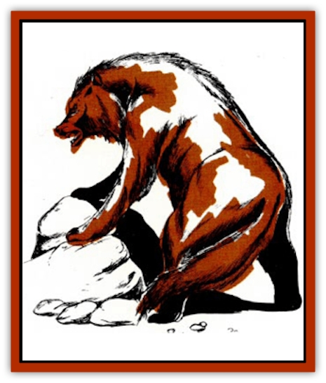
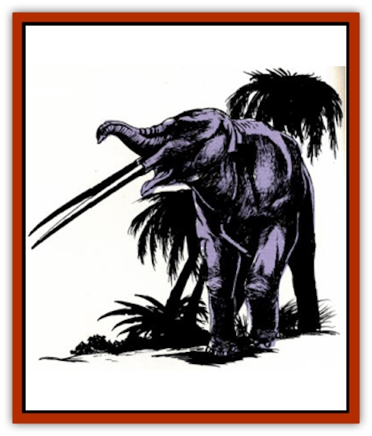
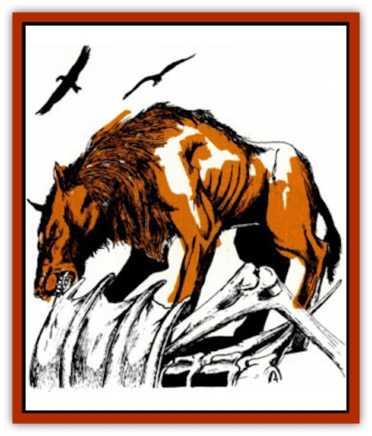

# Animal - Cenozoic

| Statistic | **Agriotherium** | **Amphicyon** | **Anancus** | **Andrewsarchus** | **Camel, Giant** | **Hippopotamus, giant** | **Megalania** | **Metridiochoerus** | **Pelorovis** | **Sarkastodon** |
| --- | --- | --- | --- | --- | --- | --- | --- | --- | --- | --- |
| **Activity Cycle:** | Day | Day | Day | Day | Day | Special | Night | Family group | Special |  |
| **Alignment:** | Neutral | Neutral | Neutral | Neutral | Neutral | Neutral | Neutral | Neutral | Neutral | Neutral |
| **Armor Class:** | 6 | 6 | 6 | 6 | 6 | 4 | 0 | 6 | 6/3 | 6 |
| **Climate/Terrain:** | Savannah | Temperate plains | Temperate forest | Temperate plains | Temperate plains | Tropical lakes and rivers | Savannah | Tropical forests | Savannah | Temperate plains |
| **Damage/Attack:** | 1-10/1-10/1-10 | 2-8/2-8/1-8 | 3-18/3-18/2-12/2-12 | 3-18 | 1-6 or 2-8/2-8 | 5-20 or 4-16 | 1 | 2-12/2-12 | 1-10/1-10 | 1-12/1-12/1-12 |
| **Diet:** | Omnivore | Omnivore | Herbivore | Carnivore | Herbivore | Special | Special | Omnivore | Special | Special |
| **Frequency:** | Uncommon | Uncommon | Common | Rare | Common | Rare | Rare | Mythical | Common | Uncommon |
| **Hit Dice:** | 8 | 7+7 | 10+5 | 9+9 | 7 | 10+5 | 15 | 5 | 6 | 9 |
| **Intelligence:** | Animal (1) | Animal (1) | Animal (1) | Animal (1) | Animal (1) | Non- (0) | Non- (0) | Animal (1) | Non- (0) | Non- (0) |
| **Magic Resistance:** | Nil | Nil | Nil | Nil | Nil | Nil | Nil | Nil | Nil | Nil |
| **Morale:** | Average (8-10) | Average (8-10) | Unsteady (5-7) | Steady (11-12) | Unreliable (3) | Unsteady (7) | Average (8-10) | Average (8-10) | Steady (12) | Elite (14) |
| **Movement:** | 15 | 15 | 15 | 15 | 15 | 6; Sw 12 | 5 | 15 | 15 | 12 |
| **No. Appearing:** | 1-2 | 1-2 | 2-20 | 1-2 | 1-20 | 1-4 | 1-4 | 1-10 | 4-40 | 1-2 |
| **No. of Attacks:** | 3 | 3 | 4 | 1 | 1 or 2 | 1 | 13 | 2 | 2 | 3 |
| **Organization:** | Solitary | Solitary | Herd | Solitary | Herd | Family group | Solitary | Clan | Herd | Solitary |
| **Size:** | L (10' high) | M (6½' long) | L (10' high) | L (13' long) | L (11' tall) | L (12' long) | G (26' long) | M (3½' high at shoulder, 5' long) | M (6' high at shoulder) | L (10' long) |
| **Special Attacks:** | Hug | Nil | Nil | Nil | Nil | Surprise | 2-16 or 2-5 | Nil | Charge | Nil |
| **Special Defenses:** | Nil | Nil | Nil | Nil | Nil | Nil | Nil | Nil | Nil | Nil |
| **THAC0:** | 13 | 13 | 9 | 11 | 13 | 9 | 7 | 15 | 15 | 11 |
| **Treasure:** | Nil | Nil | Nil | Nil | Nil | Nil | Nil | Nil | Nil | Nil |
| **XP Value:** | 2,000 | 650 | 2,000 | 1,400 | 420 | Male: 2,000 / Female: 1,400 | 650 | 175 | 420 | 2,000 |

The years between the extinction of the [[Dinosaur_I|dinosaurs]] and the rise of human civilization are called the Cenozoic era, or the Age of [[Mammal|Mammals]]. As the reptiles vanished, mammals expanded rapidly to occupy the vacant niches in the ecology. Cattle, antelope, and [[Horse|horses]] replaced the herbivorous duckbills, sauropods, and horned dinosaurs. [[Bear|Bears]], cats, and [[Dog|dogs]] preyed on the new herbivores, since the carnivorous dinosaurs had died out. [[Whale|Whales]], seals, and [[Dolphin|dolphins]] took to the seas to replace the [[Dinosaur_Aquatic|mosasaurs]] and [[Dinosaur_Aquatic|plesiosaurs]]. Only in the air did the mammals lose out, as [[Bird|birds]] largely replaced the pterosaurs.

The mammals' greatest asset is their flexibility. In time, they went far beyond the reptiles' capabilities and entered new environments, such as the high mountains and polar regions. Compared to dinosaurs and related creatures, mammals developed a variety of new forms very quickly.

The Cenozoic era was also the age of mammalian giants. Almost every family of land mammals existing today had giant relatives in the past. There were huge versions of bears, [[Cat_Great|lions]], [[Wolf|wolves]], [[Hyena|hyenas]], kangaroos, [[Mammal_Small|beavers]], apes, horses, [[Mammal_Herd_II|hippos]], [[Mammal_Herd_II|rhinos]], tapirs, deer, swine, and even dormice. After the last Ice Age, these giants vanished suddenly and in huge numbers. The cause of this mass extinction is just as mysterious as that of the dinosaurs earlier, but the result was not as devastating; mammals are still on top today.

This article supplements an earlier one, "Into the Age of Mammals" (Dragon issue #137), with descriptions of ancient animals that can be used in AD&D games. The creatures from both articles can be used in a prehistoric campaign, time-traveling adventures, or the normal campaign world. Additional statistics for prehistoric mammals and birds appear under [[Boar|Boar]], [[Cat_Great|Cats, Great]], [[Elephant|Elephant]], [[Hyena|Hyena]], [[Pleistocene_Animal|Pleistocene Animal]], and [[Wolf|Wolf]].

Scientific names can be clumsy to pronounce or might sound too modern for use in AD&D games. Alternate names have been given to each creature herein, as laymen in fantasy worlds might name them due to their appearance.

The Cenozoic era began 65 million years ago. It is divided into seven periods or epochs. From earliest to latest, they are: Paleocene, Eocene, Oligocene, Miocene, Pliocene, Pleistocene, and Holocene (Recent). The Pleistocene is noted for its Ice Age and the rise of early man.

It is not totally farfetched to include Cenozoic creatures in a medieval world. Some of these creatures survived into the historical world, where we barely missed seeing them. The moas, a species of giant flightless birds, survived in New Zealand until the late 1700s. Another giant, the elephant bird, may have lived into the 1600s on Madagascar. Sivatherium (see "Into the Age of Mammals") died out in the Middle East at the beginning of civilization. The giant hippopotamus died out in Egypt at the beginning of that culture. Cuvieronius, a spiral-tusked mastodont that was the last of the American elephants, vanished around A.D. 400 in Argentina. The huge cave lion, the largest feline ever, died out in the Balkans around 100 B.C. The dire wolf, cave bear, ground sloth, and Irish deer all survived the end of the Ice Age, but died out soon thereafter, some only a few thousand years ago.

## Agriotherium (Savannah Bear)

Although bears do not now live in Africa, Agriotherium roamed the southern African plains of the Pleistocene. Paleontologists are not sure how it got there; no other bear fossils have been found elsewhere south of the Sahara. Agriotherium was a huge, primitive bear, slightly smaller than the cave bear, with a doglike head.

**Combat:** Like other bears, Agriotherium strikes with two paws and a bite. If either paw hits with an 18 or better, it also hugs for 3-18 hp damage. It fights for 2-5 rounds at 0 to -10 hp, but dies instantly from greater damage.

**Habitat/Society:** All bears are solitary, pairing briefly only to mate. The mother raises the cubs alone. Agriotherium does not hibernate, due to its warm climate. Being at the top of the food chain and having no natural enemies, this bear can bring down large game that is sick or wounded, but it usually feeds on plants and small animals.

## Amphicyon (Bear Dog)

Amphicyon giganteus was the largest of an early group of carnivores. It looked like a bear with a wolfish muzzle and canine tail.

**Combat:** Amphicyon is much like a bear in combat, striking with two paws and a bite (but no hug).

**Habitat/Society:** The bear dog is solitary and lives much like a grizzly bear. It feeds heavily on roots, wild fruit, and small animals. Unlike bears, however, it regularly attacks larger game, striking from ambush. Its prey includes the [[Pleistocene_Animal|titanothere]] and hornless rhinoceros. Amphicyon is at the top of the food chain, having no natural enemies.

## Anancus (Pike-tusked Elephant)

Anancus was an elephant adapted to woodland life. It had small ears, a small trunk, and two tremendously long (10') and straight tusks, almost as long as the animals body, that extended straight out in front of its mouth. Each tusk is worth 200-800 gp.

**Combat:** Anancus attacks with two tusks and both front legs. However, an opponent can be attacked by one tusk or both legs, not both tusks and legs at once.

**Habitat/Society:** Anancus is adapted to temperate forests, much as modern elephants roam open tropical forests. It feeds on tree and shrub foliage. Adults have no natural enemies except disease and tree blight (which destroys its habitat). The young may fall prey to large predators.

## Andrewsarchus (Giant Long-jawed Hyena)

Andrewsarchus was the largest known carnivorous land mammal. Unrelated to any modern or past carnivore, it was more closely related to the animals it fed upon than anything else. Andrewsarchus looked vaguely like a hyena but had a huge skull nearly 3? long. Its tail appeared feline.

**Combat:** Andrewsarchus can attack with its strong jaws, but prefers to feed on carrion.

**Habitat/Society:** Large carnivores are usually solitary, and Andrewsarchus is no exception, pairing only once a year to mate. It is mainly a scavenger but can attack large game, including Coryphodon and Uintatherium (see "Into the Age of Mammals" for details), as well as hornless rhinos and tapirs. This beast is at the top of the food chain, having no enemies.

## Bears

Bears are successful carnivores of Pleistocene to Recent times. Several are described [[Bear|here]], but there is one glaring error. The cave bear was the largest bear ever, while the polar bear is much smaller. Thus, the statistics for the cave bear and the polar bear should be switched. The Kodiak brown bear is roughly equal to the polar bear, averaging slightly larger. The black bear statistics are fine as is and can also represent several species of tropical bears. The short-faced bear (see "Into the Age of Mammals") is an odd-looking relative from the Ice Age.

## Camel, giant

The giant [[Camel|camel]] looked much like modern species, except that it did not have a fatty hump. It was a grazer on Pleistocene plains, standing taller than the mastodons around it. If domesticated, the giant camel can carry up to 800 lbs. at full speed or 1,600 lbs. at half speed.

**Combat:** The giant camel attacks with a bite or two hooves, but cannot use both in one round.

**Habitat/Society:** Giant camels live in herds on temperate prairies, with habits similar to other herd animals. They tend to flee predators who come too close, but otherwise ignore them. As large herbivores, giant camels occupy a middle niche in the food chain. The young are taken by many carnivores, but only large carnivores can bring down an adult.

## Elephant, dwarf

While giant versions of many mammals lived in the Cenozoic, this elephant went the opposite route. Inhabiting only isolated wooded islands in the Mediterranean and Java, the dwarf elephant looked much like any other elephant, just smaller.

**Combat:** The dwarf elephant uses only its tusks in combat, as it is too small to use its feet or trunk.

**Habitat/Society:** Dwarf elephants live in herds and browse on tree and shrub foliage. In spite of their size, they are used to being the largest creatures on their isolated islands, and no large predators bother them. When confronted by men and other larger creatures, they prefer to run. If sold, the tusks are worth 10-100 gp each. This elephant is the ancestor of the [[Mammal_Minimal|minimal elephants]].

## Eucladoceros

This giant forest deer is equal to the [[Stag|giant stag]]. However, Eucladoceros has a huge antler array with numerous tines; its antler damage is 3-18 hp damage.

## Hippopotamus, giant

This massive animal is the direct ancestor of the behemoth but has two differences, detailed below.

**Combat:** First, the giant hippo has smaller tusks than the behemoth, doing only 5-20 hp damage (4-16 for females). Second, the giant hippo has eyes that stick up above the skull like periscopes. Thus, it can hide its entire body below the water, with only its eyes above the surface. This gives it a -2 modifier to surprise rolls against swimmers and boats.

**Habitat/Society:** When a group is encountered, it will typically be one male (bull) and 1-3 females (cows). Only the young are subject to attack, and only by the largest predators.

## Marsupials

Pouched mammals are primitive and relatively unsuccessful, usually being confined to isolated lands (except for the opossum). Before modern placental mammals took over the world, marsupials developed into a variety of forms, some very similar to other mammals, such as lions, bears, wolves, tapirs, and even sabertooth cats. Unique marsupials included 10'-tall kangaroos and rhino-sized wombats. The DM can create a Pleistocene version of Australia with these creatures and perhaps a human aboriginal culture. Whatever the final result, this land will be an odd and unique place.

## Megalania (Giant Plains Lizard)

Megalania was not a mammal, but a giant lizard that hunted on the Pleistocene plains of Australia. It looked much like modern monitor lizards and the Komodo dragon, having long, serrated teeth.

**Combat:** The giant plains lizard attacks with its bite. Like other giant lizards, the bite does double damage on an attack roll of 20. Anyone behind the lizard can be attacked by a slash of its tail, doing 2-5 hp damage and being knocked down if a dexterity check on 4d6 is failed.

**Habitat/Society:** Megalania is a solitary hunter, inactive at night and during the hottest hours of the day. It ambushes its prey from concealing grass and shrubs. As with most reptiles, the young are left to fend for themselves, receiving no care from the parents. The giant plains lizard is at the top of the food chain, having no natural enemies.

## Metridiochoerus (Giant Warthog)

Metridiochoerus was a giant warthog and a contemporary of the earliest humans. It had the same squat body and long head as the modern species. Its tusks were long and sharp.

**Combat:** The giant warthog fights with slashes from its two sets of tusks. Females are equal to males. This swine fights for 1-3 rounds at 0 to -8 hp, but greater damage kills it instantly. (Those who do not think pigs are dangerous should rent the video Razorback.)

**Habitat/Society:** Giant warthogs live in family groups. If more than one is encountered, the largest is the male, while the others are females (50%) and young (50%). Normally rooters and browsers, warthogs also eat carrion and small animals. Giant warthogs are in the middle of the food chain. The young fall prey to many predators, while lions can take the adults.

## Pelorovis (Long-horned Buffalo)

This was a close relative of the modern African buffalo and looked much like it. However, Pelorovis had huge horns, curving out to the sides and down to form a half circle. The total horn span could reach 12'.

**Combat:** Pelorovis fights with its massive horns. If it can charge at least 40', it inflicts 5-20 hp damage, automatically knocking down any human-sized opponent, and tramples for an additional 2-5 hp damage.

**Habitat/Society:** Pelorovis lives in large herds like other African herbivores. It roams the open woodland scrub, not the jungle or bare plains. The females are smaller, equal to normal buffalo. Only lions can bring down an adult. Females and young fall to hyenas, leopards, and [[Crocodile|crocodiles]].

## Sarkastodon (Long-tailed Bear)

This carnivore was the largest of the creodonts, an early order of carnivores that included [[Hyena|Hyaenodon]]. Sarkastodon looked much like a bear with a long tail; it was larger than even the cave bear.

**Combat:** Sarkastodon fights with its paws and a bite.

**Habitat/Society:** Sarkastodon is a solitary predator, living much like a bear. Its prey includes titanotheres and rhinoceroses, but it also feeds on roots, wild fruit, and rodents. Sarkastodon is at the top of the food chain, having no natural enemies.

---
## Discovery & Documentation

**Source Publication:** Dragon167 (1991)
**Campaign Setting:** Dragon Magazine
**Author(s):** David Howery, Gregg Chamberlain, 

### Other Creatures Found in This Source Book
   * [[Bladderwort_Giant|Bladderwort, Giant]]
   * [[Bloodflower|Bloodflower]]
   * [[Butterwort_Giant|Butterwort, Giant]]
   * [[Clubthorn|Clubthorn]]
   * [[Helborn|Helborn]]
   * [[Rainbow_Plant_Giant|Rainbow Plant, Giant]]
   * [[Sword_Grass|Sword Grass]]
   * [[Waterwheel_Plant_Giant|Waterwheel Plant, Giant]]
