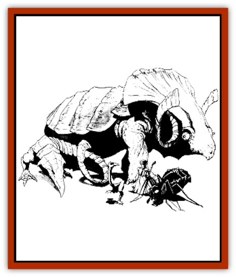

# Animal - Domestic - Athas - I

| Statistic | **Erdlu** | **Inix** | **Kank** | **Mekillot** |
| --- | --- | --- | --- | --- |
| **Activity Cycle:** | Day | Day | Any | Day |
| **Alignment:** | Neutral | Neutral | Neutral | Neutral |
| **Armor Class:** | 7 | 6 | 5 | 7 (9) |
| **Climate/Terrain:** | Tablelands/Hinterlands | Tablelands/Hinterlands | Tablelands/Hinterlands | Tablelands/Hinterlands |
| **Damage/Attack:** | 1d6/1d4 | 1d6/1d8 | 1d6 | 1d8 |
| **Diet:** | Omnivore | Herbivore | Omnivore | Omnivore |
| **Frequency:** | Common | Uncommon | Common | Rare |
| **Hit Dice:** | 3 | 6 | 2 | 11 |
| **Intelligence:** | Animal (1) | Animal (1) | Animal (1) | Animal (1) |
| **Magic Resistance:** | Nil | Nil | Nil | Nil |
| **Morale:** | Average (10) | Steady (12) | Elite (14) | Steady (12) |
| **Movement:** | 12 | 15 | 15 | 9 |
| **No. Appearing:** | 50-500 (5d10&times;10) | 1 or 2 | 50-500 (5d10&times;10) | 1 or 2 |
| **No. of Attacks:** | 2 | 2 | 1 | 1 |
| **Organization:** | Flock | Solitary | Hive | Solitary |
| **Size:** | M (7' tall) | H (16'long) | L (8' long) | G (30' long) |
| **Special Attacks:** | Nil | Crush | Poison | Swallow, crush |
| **Special Defenses:** | Speed | Nil | Nil | Nil |
| **THAC0:** | 17 | 15 | 19 | 9 |
| **Treasure:** | Nil | Nil | Nil | Nil |
| **XP Value:** | 65 | 650 | 35 | 6,000 |

There are numerous domesticated animals on Athas. Some of the most common ones, at least in the Hinter and Tablelands, are described here.

## Erdlu

Erdlus are large flightless, featherless [[Bird|birds]] covered with flaky scales that range in color from pale gray to deep red. An erdlu can weigh as much as 200 pounds and grow to a height of 7 feet. Its massive, round body has a pair of useless wings that fold in at its sides. A snakelike neck rises to a small round head with a huge, wedge-shaped beak. A pair of powerful, lanky legs extend down from the body and end in four-toed, razor-clawed feet.

Erdlus make ideal herd animals because of their temperaments and ability to survive on a variety of foods. They can eat many forms of tough vegetation, as well as snakes, reptiles, and insects. The eggs that erdlus provide are an excellent source of nutrition. A diet of erdlu eggs can keep a human or demihuman alive for months at a time, for the eggs are packed with a variety of nutrients and essential vitamins. If an erdlu egg is eaten raw, it is a substitute for one gallon of water. However, this substitution isn't perfect and can only be used successfully for no more than one week. The meat of an erdlu also makes an excellent meal.

In groups, erdlus instinctively flock together for protection. If threatened, these creatures usually flee. For short distances of no more than half a mile, erdlus can race along at great speeds (movement rate 18). Their normal walking pace is much slower (movement rate 12). When escape isn't possible, the flock turns and fights as a group. They strike first with sharp beaks (inflicting 1d6 points of damage) then rake with one of their claws (causing 1d4 points of damage).

The hard scales of an erdlu's wings can be fashioned into shields or even armor (with an AC of 6), its beak can be used to make fine spearheads, and its claws can be crafted into daggers or tools.

## Inix

An inix is a large [[Lizard|lizard]] that falls between kanks and mekillots for sheer size. It weighs about two tons and grows to lengths of 16 feet. The inix's back is protected by a thick shell, while flexible scales cover its underside.

Inixes make spirited mounts. They move at a steady pace for as much as a full day and night without needing rest (movement rate 15), and can reach speeds equivalent to a kank (movement rate 18) for short distances (one mile). They can carry as much as 750 pounds of passengers and cargo. lnix riders often travel in howdahs, small boxlike carriages strapped to the lizard's back. The major drawback to the inix is that it needs large amounts of vegetation and must forage every few hours to maintain its strength. If an inix doesn't get enough to eat, it becomes nearly impossible to control. For this reason, these lizards aren't used on trips where forage land is scarce.

An inix can attack with its tail, slapping for 1d6 points of damage, and deliver a powerful bite (1d8 points of damage) in a single round. On a natural roll of 20 when making a biting attack, the inix grasps any human-sized or smaller target. This target receives an additional 1d20 points of crushing damage.

lnix shells make very good armor (AC 5), while the flexible scales of an inix's underside can be woven into a fine leather mesh (AC 7).

## Kank

Kanks are large docile [[Insect_Giant|insects]] often used as mounts by the people of the Tablelands. A black exoskeleton of chitin covers their segmented bodies. The three body sections are the head, thorax, and abdomen. They weigh as much as 400 pounds, grow to heights of 4 feet at the back, and as long as 8 feet from head to abdomen. Around their mouths they have multijointed pincers that they can use to carry objects, feed themselves, or fight. Six lanky legs descend from their thoraxes. Each ends in a single flexible claw that allows them to grip the surfaces they walk upon.

Kanks are often used as caravan mounts. They can travel a full day at their top speed, carrying a 200-pound passenger and 200 pounds of cargo. Kanks make decent herd animals, but usually only elves employ them as such. As kanks can digest almost any sort of organic matter, they can thrive in most terrain types. In addition, these creatures require little special attention. A kank hive instinctively organizes itself into *food producers*, *soldiers*, and *brood queens*.

Food producing kanks secrete melon-sized globules of green honey. These are stored in their abdomens and used to feed the hive's young. (When other sources of food are scarce, this honey is also used to feed the rest of the hive.) Humans and demihumans can live exclusively on this nectar for up to three weeks before their bodies begin demanding other sources of nutrition, such as meats and vegetables. The sweet taste of the nectar is the only thing that attracts herders to these creatures, and domesticated kanks produce more globules than those living in the wild.

When the brood queens prepares to lay eggs, the hive digs into an area of extensive vegetation. Each queen can lay 20 to 50 eggs. While the hive waits for the eggs to hatch (it won't move from the spot until they do), the soldier kanks ferociously defend the area from all predators. Herders must wait as well or abandon the hive.

A kank's pincers cause 1d6 points of damage. In addition, a target hit by the pincers must save versus poison or be paralyzed in 2d12 rounds. The effects of the poison wear off after 2d6 hours. Note that only soldier kanks produce poison. Food producing kanks can fight if necessary, but brood queens never join in a battle-even to defend themselves or their young.

While the globules of honey produced by kanks are sweet and good tasting, only the most desperate carrion eater will consume kank flesh. When a kank dies, its body produces chemicals that drench the meat with a foul-smelling odor that can make even the hungriest giant sick.

Kank chitin can be fashioned into armor (AC 5), though its brittle nature makes it susceptible to shattering. Every time the armor is hit, there's a 20% chance it will shatter and be rendered useless.

## Mekillot

Mekillots are mighty lizards weighing up to six tons. They have huge, mound-shaped bodies growing to lengths of 30 feet. A thick shell covers the back and head of a mekillot, providing protection from the sun and good defense (AC 7) against attacks. Its underside has a softer shell that's more vulnerable to damage (AC 9).

Mekillots have savage dispositions, but their size and great strength make them excellent caravan beasts. A hitched pair of mekillots can pull a wagon weighing up to 20 tons at a slow, plodding pace. Caravan leaders must be prepared for their unpredictable natures, however. As they can never be truly tamed, the stubborn creatures have been known to turn off the road and go wandering for no apparent reason-still drawing their loaded wagons. Mekillots are also noted for eating their handlers and other members of a caravan team. Psionicist handlers are best equipped to deal with these difficult beasts.

In combat, a mekillot's long tongue strikes with amazing speed and power (inflicting 1d8 points of damage). On a natural roll of 20, the tongue grasps the target it hit and pulls it toward the mekillot's gaping maw. The target must save versus paralyzation or be swallowed whole. Swallowed beings are nearly helpless. They can't use any attack forms except for psionics, and after 2d6 hours they are consumed by the beast's digestive juices.

Mekillots have a second special attack form, but it's used as a purely defensive reaction. When something crawls beneath a mekillot, the creature instinctively drops to its belly to protect its softer undershell. The weight of the mekillot causes crushing damage (2d12 points), but the beast may also sustain injury depending on what it falls upon.

---
## Discovery & Documentation

**Source Publication:** Dark Sun Campaign Setting (original) (1991)
**Campaign Setting:** Dark Sun
**Author(s):** Timothy B. Brown, Troy Denning, William W. Connors, J. Robert King, Brom and Tom Baxa,

### Other Creatures Found in This Source Book
   * [[Belgoi|Belgoi]]
   * [[Braxat|Braxat]]
   * [[Dragon_of_Tyr|Dragon of Tyr]]
   * [[Dune_Freak|Dune Freak]]
   * [[Gaj|Gaj]]
   * [[Giant_Athach|Giant, Athach]]
   * [[Gith|Gith]]
   * [[Jozhal|Jozhal]]
   * [[Kluzd|Kluzd]]
   * [[Silk_Wyrm|Silk Wyrm]]
   * [[Tembo|Tembo]]
   * [[Wezer|Wezer]]
