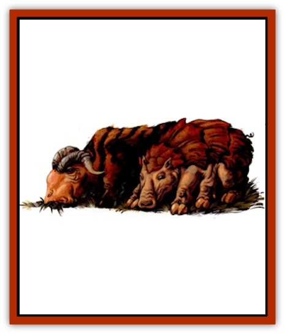
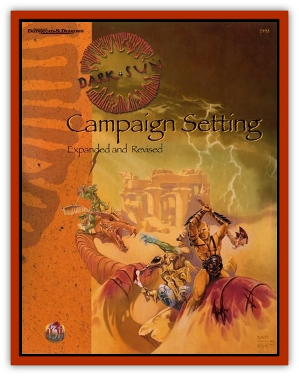

# Animal - Domestic - Athas - II

| Statistic | **Aprig** | **Carru** | **Mulworm** | **Sygra** |
| --- | --- | --- | --- | --- |
| **Activity Cycle:** | Day | Day | Any | Day |
| **Alignment:** | Neutral | Neutral | Neutral | Neutral |
| **Armor Class:** | 4 | 7 | 10 | 7 |
| **Climate/Terrain:** | Verdant belt | Verdant belt | Verdant belt | Verdant belt |
| **Damage/Attack:** | 1d4 | 1d6/1d6 | N/A | 1d3/1d3/2d4 (male only) |
| **Diet:** | Herbivore | Herbivore | Leaves | Omnivore |
| **Frequency:** | Common | Common | Uncommon | Common |
| **Hit Dice:** | 1-1 | 3+3 | 1 point | 1 |
| **Intelligence:** | Animal (1) | Animal (1) | Non- (0) | Animal (1) |
| **Magic Resistance:** | Nil | Nil | Nil | Nil |
| **Morale:** | Average (10) | Average (9) | N/A | Average (9) |
| **Movement:** | 9 | 12 | 3, Fl 12 (D) | 12 |
| **No. Appearing:** | 2-20 (2d10) | 5-50 (5d10) | 1d10&times;1,000 | 1-20 (1d20) |
| **No. of Attacks:** | 1 | 2 | Nil | Male: 3 / Female: 2 |
| **Organization:** | Herd | Herd | Solitary | Flock |
| **Size:** | S (2-3') | L (10' long) | T (8&rdquo;) | S (3-4') |
| **Special Attacks:** | Nil | Toss, trample | Poison | Gore |
| **Special Defenses:** | Nil | Nil | Nil | Nil |
| **THAC0:** | 20 | 17 | N/A | 20 |
| **Treasure:** | Nil | Nil | Nil | Nil |
| **XP Value:** | 15 | 175 | 35/7 | Male: 65 / Female: 35 |

## Aprig

These small piglike creatures have hard shells that provide them with protection from the elements and predators. Aprigs vary in color from gray to reddish brown. They have round faces and flat snouts that are good for snuffling through piles of vegetation. They have keen senses of smell and hearing, but are very short-sighted.

**Combat:** Aprigs prefer to flee, but if forced to fight they attempt to bite an opponent and then run away. Aprigs' teeth are not sharp and inflict only 1-4 (1d4) points of damage. The bite wound can become infected if not properly cleaned. If the wound is not cleaned, there is a 5% chance per day of infection setting in. An infected wound causes the creature affected to become incapacitated for 1-4 (1d4) days while the infection heals. When they fight, aprigs rush into battle squealing loudly.

**Habitat/Society:** Aprigs need little care and can eat almost any form plant life, even scraps. A herd consists of one boar (the leader), several sows, and some young. Once a young boar matures the owner must sell one of the boars or they will fight to the death for the right to mate with the sows. Aprig sows mate twice a year, producing as many as 10 young per litter. Aprigs communicate by a series of grunts and squeals that are limited to signals of danger, food, and pleasure.

**Ecology:** As a domesticated farm animal, aprigs are near the bottom of the food chain. They provide a succulent meat with a faint nutty flavor. Sows can be milked but the milk is not good quality. The shells of aprigs can be used as bowls for carrying water or grain, or to make rudimentary greaves, but cannot be worked in any way.

Full-grown aprigs are worth about 50 cp live or 20 cp as a carcass. The shell is worth as much as 10 cp if it is undamaged.

## Carru

Carru resemble Brahman cattle because of the large humps immediately behind their heads. These humps are fluid storage sacs, but dont inflate and deflate. Carru are a drab gray color and have a soft hide. Their heads are covered with a tougher hide to protect the skull. Carru have two brown eyes set in the front of their heads for good forward vision. They have poor peripheral vision and a poor sense of smell. On adult males, two horns curve out from the forehead and sweep forward to in front of the eyes. Females have much shorter horns that project straight forward from the skull.

**Combat:** The carru adult male defends the herd from attack using its horns to slash at opponents. Each horn inflicts 1-6 (1d6) points of damage. If both horns strike, the carru has skewered its opponent and can toss it through the air in any direction for an extra l-8 (1d8) points of damage. If the opponent lands near the females, it can be trampled by them for 1-4 (1d4) points of damage per carru that tramples successfully. Young carru inflict only l-2 points of damage by trampling.

**Habitat/Society:** Carru are herd animals. Each herd consists of one or more adult males, at least three adult females per adult male, and several young. The largest male is the leader of the herd. Carru are domesticated creatures, not used to the wild. Carru may be used as beasts of burden, dragging ploughs or turning water wheels on the farm. They tend to stay close to the farmhouse and graze on whatever they can find. They can eat grains if grass is scarce, but this is expensive and seldom cost-effective. Carru females bear only one calf a year and suckle it for the first few weeks of its life. Suckling calves have no attack capability.

**Ecology:** Carru are at the low end of the animal food chain. Each adult male produces 250 pounds of edible meat. Females produce 200 pounds of meat, but they are rarely butchered as they are valued for their milk production. Each adult female can produce as much as three gallons of milk each day. The milk keeps for only a few days, but it is thick and creamy and can sustain life on its own.

Carru hide takes dye very well and can be used to make clothing. furniture coverings, or tents. The tougher hide around the head of the carru can be stretched over a shield or buckler to strengthen it, or it can be used to make the flexible parts of a suit of leather armor.

The fluid sac behind the carru's head contains 3-9 (1d6+21 pints of tepid water. The water tastes flat but can keep a thirsty animal or adventurer alive. The sac itself can be used to make a waterskin, but the fabric rots when it comes into contact with alcohol, so wineskins are not possible.

Adult male carru are worth as much as 1 gp on the open market for a healthy animal. Females are rarely sold live, but can bring as much as 3 gp if they are sold. Carru carcasses fetch half the price of live males.

## Mulworm

The Athasian mulworm is an off-white colored caterpillar with no eyes. It has two feelers in the front of its head that are used as sensors. Its mouth makes up the rest of its bullet-shaped head. The body is segmented, tapering to a point at the rear. Adult mulworms are about 8 inches long and as much as 1 inch thick.

**Combat:** The mulworm has no attack. It lives only to become a butterfly. However, the mulworm secretes a poisonous fluid as it moves. This fluid sprays out of any worm whose skin is broken. Adventurers who crush, pierce, or slash the mulworm must make a successful Dexterity check with a -4 penalty to avoid being splashed with the poison. If a character fails the check, they must successfully save vs. poison. A character who fails suffers 15 points of damage and develops a rash that lasts for 1-4 (1d4) days (treat the splashed poison as Class A). If the character's Dexterity check is successful, he will have a reduced resistance to the poison for the next 1-4 (1d4) hours. He also suffers a -4 penalty to his saving throw against the mulworm poison during that time.

If the poison is ingested or enters through an open wound, treat the poison as a class J poison. If the character fails the save vs. poison, he dies an excruciating death in 1d4 rounds unless immediately treated with a neutralize poison spell. Characters whose saving throw is successful receive 20 points of damage and have a -4 penalty to save vs. mulworm poison for 1-4 (d4) hours.

Leather or better armor protects the areas of the body it covers. The poison does not adhere well to weapons or armor and is useless within minutes after being applied.

Only fire can destroy the worm and its poison. Mulworms in the butterfly stage have no combat capability at all.

**Habitat/Society:** Athasian mulworms are content to live in berry trees and at leaves. They can be farmed as long as the caterpillar stage is not disturbed. The poison they secrete is food to the tree, enabling new leaf growth at an accelerated rate. In this manner, the mulworms ensure food for future generations of their voracious species.

In the caterpillar stage, mulworms live only to eat. They do not mate, nor do they have any real sense of other creatures Mulworms are immune to their own secretions.

Mulworms in the butterfly stage mate shortly after emerging from their cocoon and then die within a day.

**Ecology:** The Athasian mulworm lives for 10 days as a caterpillar in huge numbers - whatever the local tree population can sustain. It then pupates for 12 days before emerging into the sun for a brief life as a butterfly. In the pupal stage, the cocoon can be carefully unwound to obtain a very fine, strong thread. It is possible to place the pupae in a container of soft material to allow it to complete its life cycle, or the silk farmer may simply dispose of the pupae and leave some cocoons on the tree to ensure a new generation of worms. The pupal stage has no poison in it.

The worm has no natural enemies, but any creature, even a drake, that eats one will probably die in agony.

## Sygra

Sygra are cloven-hooved quadrupeds with short, hairy coats and sensitive noses. They can be any mixture of black, brown, and white. Their heads sport two horns and resemble that of a horse with horns. Males have larger horns than females. They have beady black eyes set behind and above the nose, which give them good peripheral vision.

**Combat:** The sygra is a vicious fighter, attacking with its hooves and horns as well as a bite attack. Each hoof can strike independently. The horn attack is used only by the males. If the sygra hits with its horns by 4 or more above the required attack roll, it has gored its opponent and inflicts an additional 2-8 (2d4) points of damage more than the l-4 caused by the horns.

**Habitat/Society:** Sygra are wild animals that have been semi-domesticated by some farmers. If well fed (they eat almost anything) and not mistreated, a flock will stay around a farm rather than trying to find their own food. Flocks that live on or around a farm are not truly domesticated.

A flock is about one-quarter adult males, one-half adult females, and one-quarter young. Wild flocks run away from any bipedal creatures. Offers of food might overcome their initial inclination to flee, but might also frighten the flock more. Several of the males keep watch through the night for predators. Sygra are very light sleepers and have excellent hearing, so they are hard to surprise.

**Ecology:** Sygra are toward the bottom of the food chain. Their meat is palatable and their milk quite tasty. They also eat most things, including offal, making them excellent disposal units. Sygra skins are durable and make good clothing or they can be made into low grade leather. Sygra carcasses bring 1 cp per three pounds of meat, plus as much as 5 cp for the hide.

Although sygra are omnivorous, they prefer vegetable matter or offal to fresh meat. They do not kill for food and do not eat an opponent they have killed unless they are very hungry.

---
## Discovery & Documentation

**Source Publication:** Dark Sun Campaign Setting (revised) (1991)
**Campaign Setting:** Dark Sun
**Author(s):** Bill Slavicsek

### Other Creatures Found in This Source Book
   * [[Animal_Domestic_Athas_I|Animal, Domestic (Athas) I]]
   * [[Dregoth|Dregoth]]
   * [[Giant_Athas|Giant (Athas)]]
