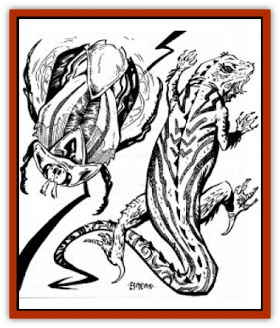
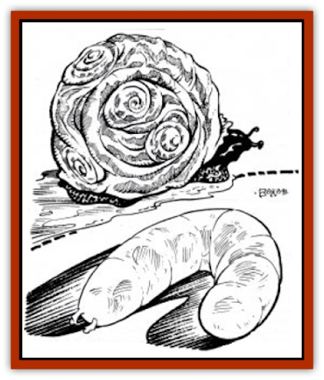

# Animal - Household - Athas

| Statistic | **Critic** | **Hurrum** | **Ock'n** | **Renk** |
| --- | --- | --- | --- | --- |
| **Activity Cycle:** | Night | Any | Any | Any |
| **Alignment:** | Neutral | Neutral evil | Neutral | Neutral |
| **Armor Class:** | 5 | 8 | 8 | 10 |
| **Climate/Terrain:** | Any | Any | Any | Any |
| **Damage/Attack:** | 1 | 1 | Nil | Nil |
| **Diet:** | Carnivore | Omnivore | Scavenger | Scavenger |
| **Frequency:** | Uncommon | Common | Common | Common |
| **Hit Dice:** | 1+1 | 1-1 | ½ | ¼ |
| **Intelligence:** | Animal (1) | Semi (2) | Non- (0) | Non- (0) |
| **Magic Resistance:** | Nil | Nil | Nil | Nil |
| **Morale:** | Unreliable (3) | Average (9) | None | None |
| **Movement:** | 12 | 6 (12) | 1/10 | 1/10 |
| **No. Appearing:** | 1 | 1 | 1-10 | 1 |
| **No. of Attacks:** | 1 | 1 | 0 | 0 |
| **Organization:** | Solitary | Solitary | Solitary | Solitary |
| **Size:** | T (17&rdquo;) | T (1') | T (½&rdquo;) | T (2&rdquo;) |
| **Special Attacks:** | Nil | Nil | Nil | Nil |
| **Special Defenses:** | See below | Nil | Nil | Nil |
| **THAC0:** | 19 | 20 | 20 | 20 |
| **Treasure:** | See below | See below | See below | See below |
| **XP Value:** | 35 | 15 | 7 | 7 |

Often small creatures are kept or allowed to live in Athasian households in exchange for some form of comfort or service the creature provides. These <q>pets</q> are considered neither cute nor cuddly as no such creature may be found anywhere on Athas.

## Hurrum

These brightly-colored beetles are highly prized for the pleasant humming sounds they produce. Better trading houses have at least one.

The hurrum have a brightly-colored, opalescent, chitinous shell that varies from cobalt-blue to copper-green. Convex and oval in shape, the shell protects four pair of small, vestigial wings. With a smallish head, stubby antennae, and four very short legs, the beetle appears comical.

Hurrum beat their wings rapidly back and forth, gently striking the underside of their carapace which creates the vibration and noise for which these creatures are best known. The sound is also used as a simple form of communication between hurrum beetles.

**Combat:** Few creatures in the insect kingdom attract prey (or earn a living) the way the hurrum beetle does. The beetle produces a pleasing humming sound by continuously fluttering its vestigial wings. The wings beat in rapid succession between the soft body of the beetle and its hard, chitinous shell. The rising and falling rhythm has a soothing, almost hypnotic effect. To ignore this effect, a successful Wisdom ability check must be made. Failure means that the individual merely finds the sound soothing, but it in no way effects his or her free will.

The beetles' staple diet is small, flying insects which are drawn to the vibration produced by the beetles' wings. The vibration also makes prey docile and easy to overcome.

**Habitat/Society:** A solitary creature, the hurrum only seeks others to mate. If more than one beetle is placed in the same area, an audible change in humming can be heard. If the beetles are of opposite sexes they will produce a harmonic sound after a few minutes. This is believed to be a type of mating ritual. If the beetles are of the same sex, the sound will be atonal and unpleasant.

Exposure to direct sunlight for over an hour will kill hurrum. As they attempt to cool themselves in the hot Athasian sun by beating their wings, the sound they produce will become higher in pitch until they die.

**Ecology:** This flightless beetle produces soothing humming noises (although few would call it music) which change in pitch and frequency throughout the day. Frequently, the bright, opalescent shell of the hurrum beetle changes color with the speed of its humming. The humming is a by-product of the creature's attempt to cool itself by rapidly beating its small, vestigial wings. A real pleasure is letting the beetle crawl across one's bare skin where the slight vibration of the shell and the humming are coupled with a very slight breeze. Halflings find hurrum extremely pleasing (though when hungry, halflings find them delicious).

## Critic

**Psionics Summary**

| Level | Dis/Sci/Dev | Attack/Defense | Score | PSPs |
| --- | --- | --- | --- | --- |
| 2 | 1/1/3 | -/M- | 10 | 25 |

**Clairsentience -** *Science:* precognition; *Devotions:* danger sense, poison sense, spirit sense.

Multi-colored, spiny-backed lizards, critics are frequently reluctant house guests in Athas. They are innately psionic and tune themselves to their feeders.

Some say critics are the prettiest lizards on Athas. Often mottled in brightly-colored hues, they change color each year when they molt. Critics average 12" to 17" in length and weigh from 2½ to 5 pounds.

Critics use rudimentary body language to communicate with others of their species. Communication via magical or other means is possible; however, the creature often reacts/answers in a paranoid or anxious manner.

**Combat:** The bite of the critic is inconsequential since it can only inflict a single point of damage. The value of the creature comes from its psionic abilities. Critics sense trouble. When they abruptly scurry for cover, so do most owners.

**Habitat/Society:** Critics are feral even when born in captivity and cannot truly be domesticated. Very stealthily, the lizard-like creature preys on insects and small rodents. Critics attune themselves to a single location and will tolerate a small group of people if fed on a regular basis. .Attuning. means the lizard will look after the area and alert all nearby if any danger is perceived. Critics have a nasty independent streak and will not send warning signals if they have been abused or mistreated.

**Ecology:** Critics are considered to be good luck in a household or storage area. They are lazy and prefer to be fed rather than hunt on their own. Generally young critics are captured and brought to a residence. They must be allowed to adjust to their new surroundings at their own pace. Within a week, the feeder/owner will know if the creature has decided to adopt the location or has run away. The critic will remain in a constant state of alarm if caged or chained.

## Renk

This small gastropod has developed a symbiotic relationship with humanoid creatures in the desert. A harmless, tasteless slug, it stores water and is sometimes consumed raw on long desert trips.

Varied in color, renk have a 2-3. elongated, tapered body. A sucker mouth can be found below a short pair of antennae used to detect vibration.

**Combat:** These harmless slugs have no true attack. Renk live on certain benevolent creatures or individuals, gaining nourishment from licking the salt, sweat, and dead skin from the bodies. If a renk is attached to a person involved in melee combat, there is a cumulative 10% chance per round that the renk will be accidently hit and killed.

**Habitat/Society:** Renk mate in stagnant water or rotting grain. They produce a dozen or so offspring that mature in 3-4 weeks. They are otherwise solitary creatures. Renk have small, abdominal suction pods that they use for locomotion and to attach to food sources. They prefer to stay shielded from direct sunlight. Exposure to direct sunlight for more than 1d4 turns causes the renk to shrivel and die.

**Ecology:** Renk are often taken on long trips. Consumed alive, renk contain more water than seems possible. Renk store moisture in an extra stomach that ruptures when they are eaten raw. An average renk holds ½ cup of water; therefore, an active man would need to eat 32 raw renks a day to replace fluids needed for one day in the desert. Concern should be taken when purchasing renk. Occasionally a leech or other harmful creature will be added to a group of renk and sold to an unsuspecting buyer.

## Ock'n

Ock'n appear as small, spiral-shelled snails. When they move, they leave a slime trail composed of an amber-like liquid that has many household uses.

Nautiloid in shape, this small snail seldom reaches 1" in length. Ock'n shells are almost always light in hue, but vary in color and striping. All ock'n sensory organs are located on the forward protruding head. The head holds a very small pair of light sensors affixed to independent eye stalks. A slit mouth is also located on the head.

Ock'n communicate to other gastropods via a complex system of eye stalk movements. The eye stalks are always in a slow, constant motion as the creature conveys only the most simple of concepts.

**Combat:** These harmless snails have no attack form whatsoever.

**Habitat/Society:** Ock'n live in loose colonies, always in oddnumbered groups. Should an even number be confined in a small area, one will die or be killed by the others. Only the ock'n knows why this phenomenon occurs. The ock'n breathes via osmosis through exposed skin.

**Ecology:** Unpalatable as food, ock'n shells make interesting jewelry. The gastropod spends each day in search of food and moisture, leaving behind a valuable slime trail. The glossy, ochre-colored slime is composed of an amber-like resin. When the resin dries, it becomes hard as stone (saves as stone also), but has only a quarter of normal stone's weight. The snail's highly-prized slime/resin is used in numerous ways. Coating weapons, waterproofing materials, and sealing perishables or the dead are just a few of its uses. Ock'n snails only produce a single fluid dram (1/8 fluid ounce) of this material each day.

---
## Discovery & Documentation

**Source Publication:** MC12 Dark Sun Appendix I - Terrors of the Desert (1991)
**Campaign Setting:** Dark Sun
**Author(s):** Tom Prusa, Louis J. Prosperi, Walter M. Baas

### Other Creatures Found in This Source Book
   * [[Animal_Herd_Athas|Animal, Herd (Athas)]]
   * [[Antloid_Desert|Antloid, Desert]]
   * [[Banshee_Dwarf|Banshee, Dwarf]]
   * [[Beetle_Agony|Beetle, Agony]]
   * [[Bog_Wader|Bog Wader]]
   * [[Brambleweed|Brambleweed]]
   * [[B'rohg|B'rohg]]
   * [[Burnflower|Burnflower]]
   * [[Cat_Psionic|Cat, Psionic]]
   * [[Cha'thrang|Cha'thrang]]
   * [[Cistern_Fiend|Cistern Fiend]]
   * [[Clam_Giant|Clam, Giant]]
   * [[Cloud_Ray|Cloud Ray]]
   * [[Drake_Athas_Air|Drake (Athas), Air]]
   * [[Drake_Athas_Earth|Drake (Athas), Earth]]
   * [[Drake_Athas_Fire|Drake (Athas), Fire]]
   * [[Drake_Athas_Water|Drake (Athas), Water]]
   * [[Dune_Runner|Dune Runner]]
   * [[Dune_Trapper|Dune Trapper]]
   * [[Elemental_Athas_Greater_Air|Elemental (Athas), Greater, Air]]
   * [[Elemental_Athas_Greater_Earth|Elemental (Athas), Greater, Earth]]
   * [[Elemental_Athas_Greater_Fire|Elemental (Athas), Greater, Fire]]
   * [[Elemental_Athas_Greater_Water|Elemental (Athas), Greater, Water]]
   * [[Elemental_Athas_Lesser_Air_Earth|Elemental (Athas), Lesser, Air/Earth]]
   * [[Elemental_Athas_Lesser_Fire_Water|Elemental (Athas), Lesser, Fire/Water]]
   * [[Elemental_Athas_General_Information|Elemental (Athas), General Information]]
   * [[Erdland|Erdland]]
   * [[Esperweed|Esperweed]]
   * [[Flailer|Flailer]]
   * [[Floater|Floater]]
   * [[Giant_Athas|Giant (Athas)]]
   * [[Golem_Athas_I|Golem (Athas) I]]
   * [[Golem_Athas_II|Golem (Athas) II]]
   * [[Golem_Athas_III|Golem (Athas) III]]
   * [[Golem_Athas_General_Information|Golem (Athas), General Information]]
   * [[Halfling_Renegade|Halfling, Renegade]]
   * [[Hej-kin|Hej-kin]]
   * [[Id_Fiend|Id Fiend]]
   * [[Insect_Swarm_Athas|Insect Swarm (Athas)]]
   * [[Kank_Wild|Kank, Wild]]
   * [[Kirre|Kirre]]
   * [[Megapede|Megapede]]
   * [[Mul_Wild|Mul, Wild]]
   * [[Nightmare_Beast|Nightmare Beast]]
   * [[Plant_Carnivorous_Athas|Plant, Carnivorous (Athas)]]
   * [[Pterran|Pterran]]
   * [[Pterrax|Pterrax]]
   * [[Pulp_Bee|Pulp Bee]]
   * [[Pyreen|Pyreen]]
   * [[Rasclinn|Rasclinn]]
   * [[Razorwing|Razorwing]]
   * [[Roc_Athas|Roc (Athas)]]
   * [[Sand_Bride|Sand Bride]]
   * [[Sand_Cactus|Sand Cactus]]
   * [[Sand_Vortex|Sand Vortex]]
   * [[Scrab|Scrab]]
   * [[Silt_Horror|Silt Horror]]
   * [[Silt_Runner|Silt Runner]]
   * [[Sink_Worm|Sink Worm]]
   * [[Sloth_Athas|Sloth (Athas)]]
   * [[So-ut|So-ut]]
   * [[Spider_Cactus|Spider Cactus]]
   * [[Spider_Crystal|Spider, Crystal]]
   * [[Spirit_of_the_Land|Spirit of the Land]]
   * [[T'Chowb|T'Chowb]]
   * [[Thrax|Thrax]]
   * [[Tohr-kreen_I|Tohr-kreen I]]
   * [[Villichi|Villichi]]
   * [[Zhackal|Zhackal]]
   * [[Zombie_Plant|Zombie Plant]]
